### 三市合同訓練―三年前の教訓から学ぶこと―

皆様ご無沙汰しております。三度目の更新となりました武末です。暑い夏の日差しに負け、クーラーという技術進歩の恩恵にすがっているこの頃です。

さて、今回は町田市、相模原市、大和市の三市合同で行われる **大和・町田・相模原合同水難訓練**に参加させて頂きました。

### # 参加隊員の強い意志と連帯感

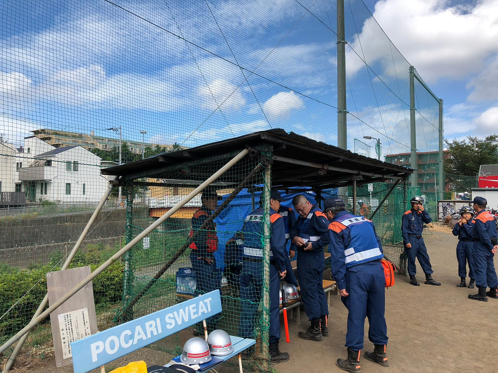

市の職員の方に送って頂き、到着したのは境川。

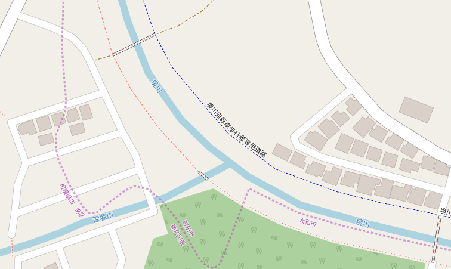

[OpenStreetMap
OpenStreetMap is a map of the world, created by people like you and free to use under an open license.www.openstreetmap.org](https://www.openstreetmap.org/#map=18/35.52082/139.45412)

すでに多くの隊員の方が到着しており、機材の準備や今後の段取りの打ち合わせを行っていました。こんなにも多くの消防隊の方を目にする機会はそうそう無いのでかなり緊張していましたが、通りすがる度に丁寧に挨拶頂けたり、ポカリスエットの差し入れを頂いたりと素晴らしいおもてなしを頂けました。

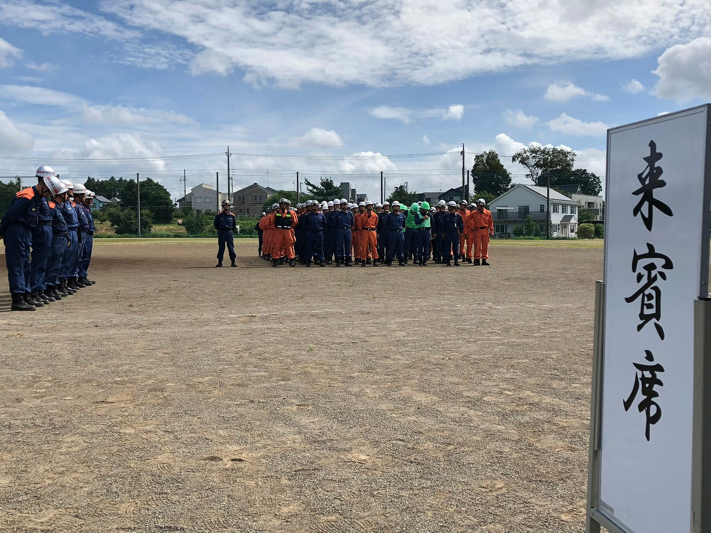

開会式も終わり、早速各隊の救助訓練が開始されます。今回は訓練の様子をドローンで撮影し、後ほどの確認に使われるようです。

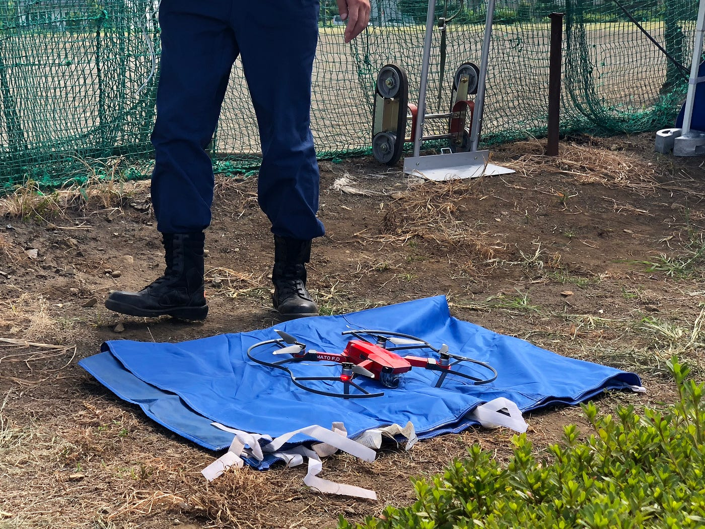

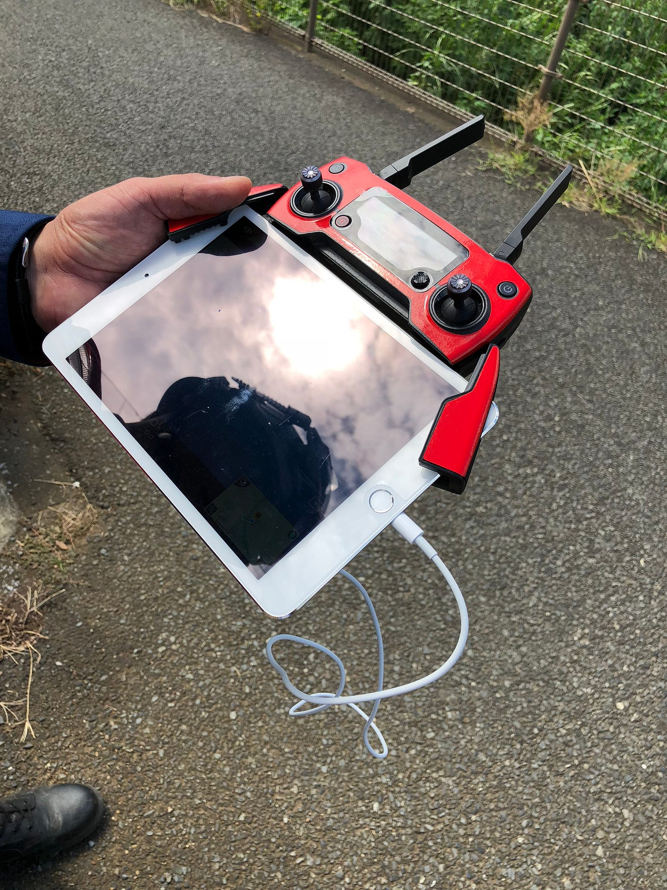

iPadに接続するタイプのドローン。Mavicには対象の自動追尾撮影機能がありますので、普段はそれを使っているのではないでしょうか。このタイプは30分飛行型なので一回一回訓練が終わり次第戻し、バッテリーを交換していたのではと思います。橋の近くにはモニタールームが設置され、ドローンの映像が確認できるようになっていました。

### # 訓練開始

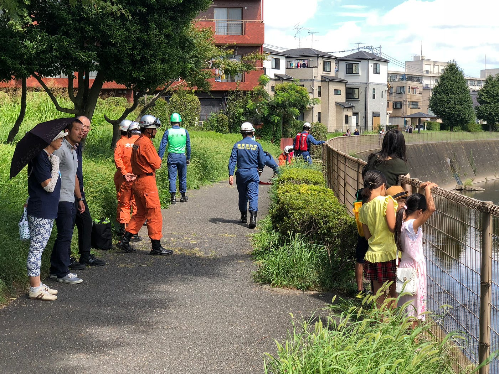

今回の訓練は三市合同。台風による低気圧成長により川が増水し、男性三人が流されているとの通報を受け、各局が協力して救助する想定。

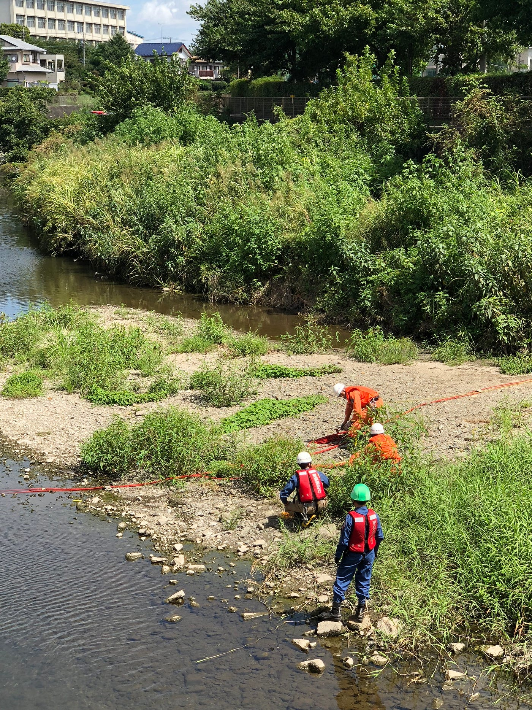

一人目の発見者は意識が鮮明なため、ジップラインと呼ばれる紐を張った後、紐に捕まってもらいます。その後救助隊が中州まで引き上げ、左岸側の陸地まで滑車で引き上げる、というスタイルです。アクション一つ一つ確認を入れながら丁寧な救助を行っており、安心感が漂います。

大まかな救助方法はこの通りなのですが、意識がない方、流れに完全に身を取られている方の救助の際には網などが使用されます。

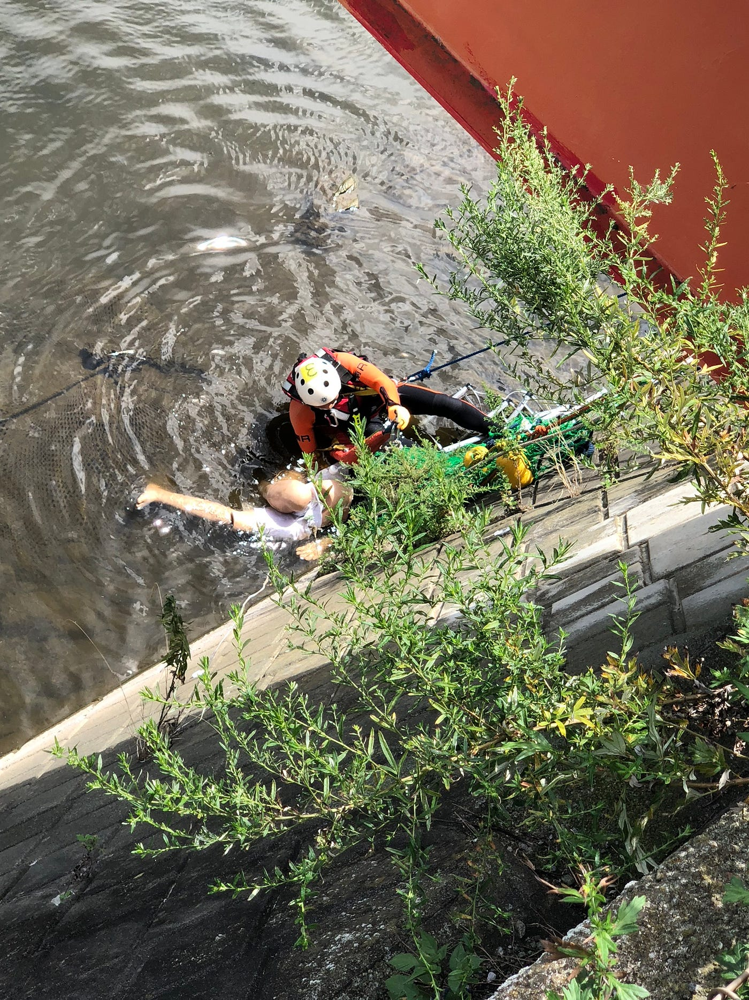

二回目の救助訓練では橋の上からの救助を想定。意識のない生存者を網でキャッチし、上部に引き上げるためのベルトを装着します。

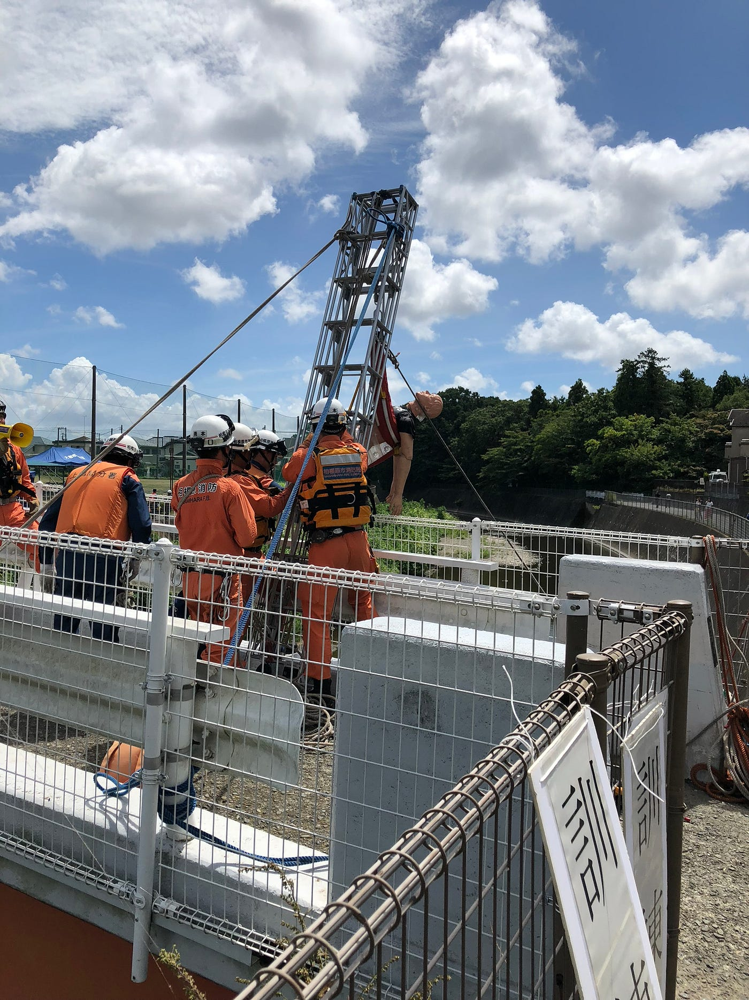

そして橋の上からはしごによって吊し上げ、救助を行います。指示役の方のかけ声と共に救助人形が引き上げられるチームワークには頼りがいを感じます。

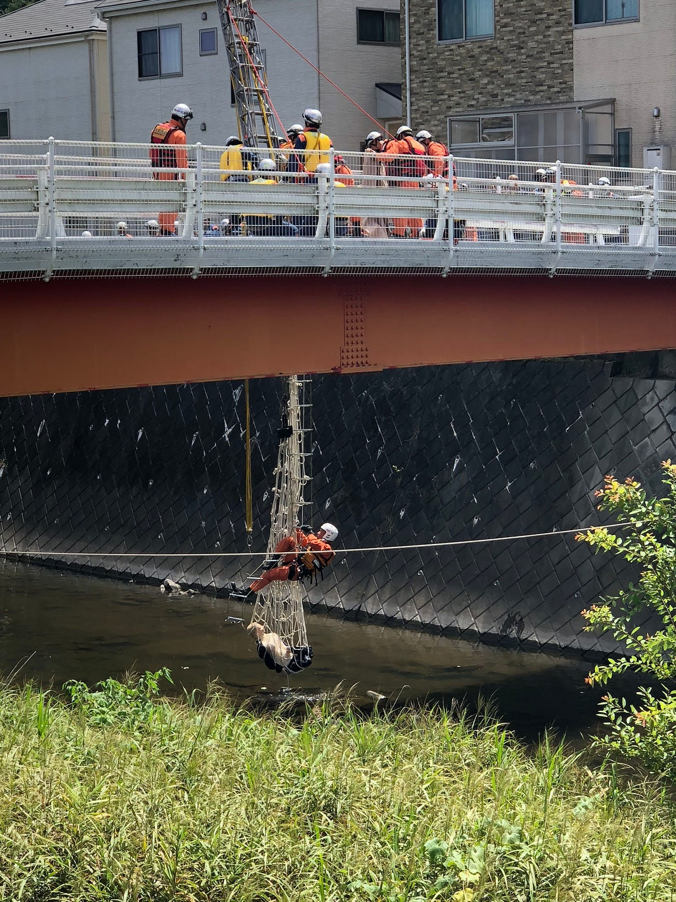

最後の男性は意識もなく、完全に流されてしまっているので網でキャッチした後、そのままはしごで橋の上に引き上げる救助。紐の張り方から撤去までが一番スムーズかつ素早く行われ、その手際に圧倒されました。

### # 閉会式。そして忘れてはならないこと。

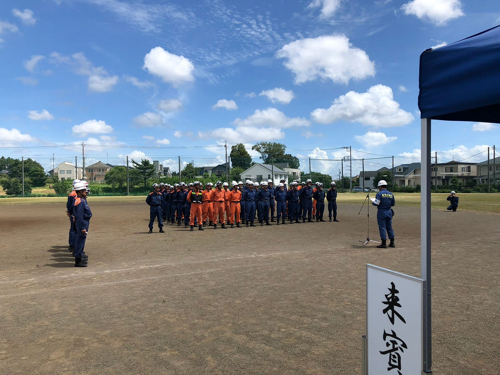

> 「本訓練は、2015年の水難事故をきっかけに始まりました」

[２０～３０代の男性、川に流されたか 横浜：朝日新聞デジタル
２８日午前７時４０分ごろ、横浜市泉区下飯田町付近の境川で人が流されている、と１１０番通報があった。神奈川県警藤沢北署によると、流されたのは２０～３０代の男性とみられる。県警が捜索している。…www.asahi.com](https://www.asahi.com/articles/ASK9X35ZVK9XULOB002.html)

閉会式はこの言葉から始まりました。台風20号による急激な川の増水。それは今まで予想してきた降水量の範囲を大きく上回るものでした。このような悲惨な事故も、時間が経つにつれ風化していってしまいます。そして、また人が油断したときに襲いかかってくるのが天災というものではないでしょうか。

「どうかこの事故のことを次の世代に伝えていって欲しい。なぜこの訓練を実施するのかという気持ちを常に持って欲しい」

そう締めくくり、閉会式は終了しました。私はこの川についてあまり知識は無く、三年前の事故についても知りませんでした。三年前の台風についてもこの神奈川に住んでいたのだからニュースや自分の体験からも何か知り得ていたはずです。しかし、思い出してみても何も覚えていない。しかし、ネットで過去の記事を調べてみると歴史的にも大きな被害だったと記載されています。私はぞっとしました。記憶という物がいかにいい加減であり、主体的に意識しない限り保持するのが難しいということ。自然災害という大きな脅威に対し、どのように向き合う必要があるのか。そのことについて考え直すいい機会となりました。

最後になりますが、訓練に参加させてくださった三市の消防局隊員の皆様、案内してくださった市の職員の皆様。本当にありがとうございました。
