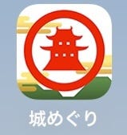
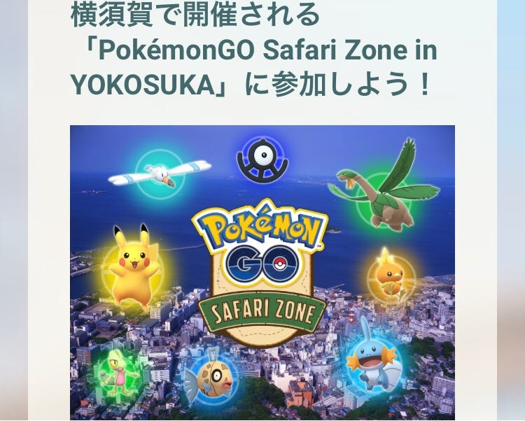
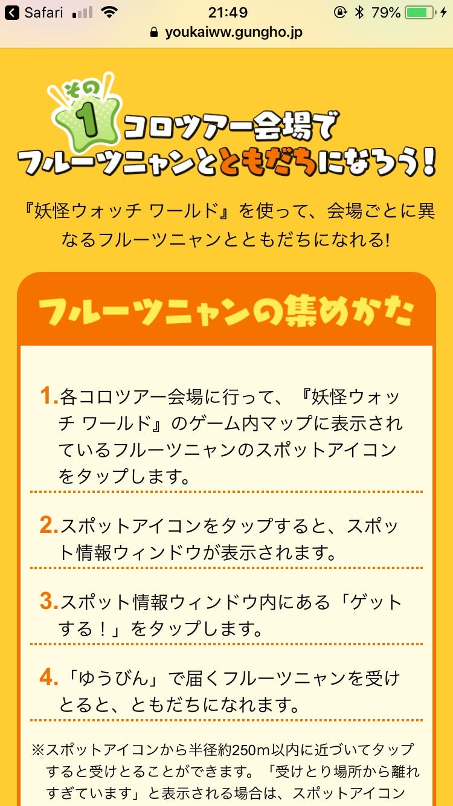

### 位置情報ゲームと卒論

卒論のテーマを位置情報ゲームにしようと思っていましたが、同じようなゲームばかりでゲームに対する関心がなくなってきました。

何を書こうか思い浮かばないので、とりあえず過去に書かれた論文を見てみることにしました。

「位置情報ゲーム 論文」で検索すると、観光に関連づけられたものがヒットします。

観光を意識して作られた位置情報ゲームはいくつかあります。例えば、以下の4つのゲームが挙げられます。

これらは実際にある場所への誘致を意識して作られています。佐賀HUNTERは佐賀城下を、ゆのこれは全国の温泉地を、レキコネは日本全国の歴史遺産を、城巡りは日本全国の城をユーザーに訪れさせるような工夫がされています。

観光を意識して作られたわけではないけれど、自治体との協力を経て観光に活用された位置情報ゲームもあります。

PokémonGO、Ingressがその例です。

観光ではありませんが、妖怪ウォッチワールドも特定の地へ赴かせるようなイベントを開催していました。

しかし、これらの集客力がどれほどのものなのかを集計したものはまだ見つかっていません。

今回検索してみて、位置情報ゲームとくれば観光という式ができあがっているように感じられました。

次の更新では、いくつか読んでみた論文の中から気になったものを紹介します。
