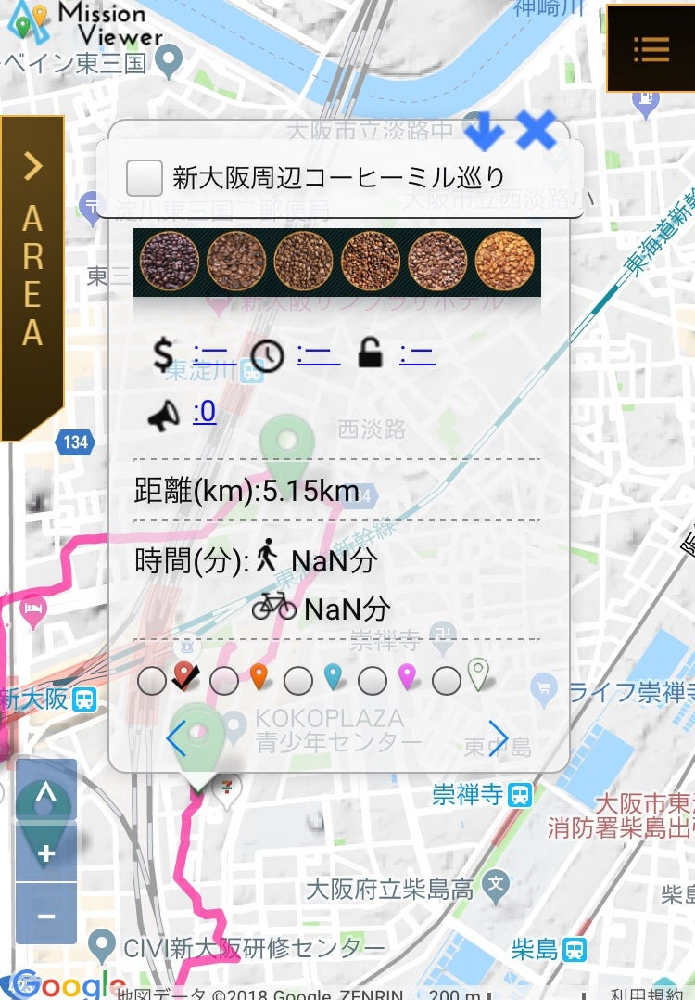

### 位置情報ゲームを活用した観光周遊

> 大阪府の連鎖ミッション

今回はこの論文を拝読しました。

ざっくりと概要を紹介していきます。

この論文では、観光地や観光関連施設周遊への活用を狙った位置情報ゲームについて取り上げています。

私が抜粋する箇所は以下の項目です。

- 観光周遊をゲーム仕立てにするメリット

- 観光周遊に適したゲームジャンル

- 参加者にどのように自己主導感を感じさせるか

では、それぞれを見ていきます。

1. 観光周遊をゲーム仕立てにするメリット

・観光資源に付加価値を与えることで、訪問価値を高めることができる。

・通常の観光より長時間滞在させることで、より多くの消費行動を誘発することができる。

・通常の観光では気づかれにくい魅力的な観光資源を参加者に体験させることができる。

2. 観光周遊に適したゲームジャンル

・学習

・アドベンチャー

・RPG

・テーブルゲーム

・恋愛シュミレーション

・育成シュミレーション

逆に、観光周遊に適していないゲームジャンルとしては以下の4つをあげています。

・アクション

・シューティング

・音楽

・レース

これらは、騒音やながら歩きによる事故を危惧して適していないと判断されています。

3. 参加者にどのように自己主導感を感じさせるか

・訪問先に自由度を与える

・オンボーディング

・スコア/順位の可視化

・ミッション/ゴールの提示

・バッヂ/レベル

・競争

・ソーシャル

・やり込み要素

・逆転要素

この論文では、これらを与えることで参加者に自己主導感を感じさせることができるとしています。

オンボーディング以下の項目はゲーミフィケーションと呼ばれるものです。

この動機付けのひとつとして、ゲームコンテンツを参加者によって作成・投稿させることも挙げられています。

#### まとめ

私は、観光周遊をゲーム仕立てにするメリットの中で「通常の観光では気づかれにくい魅力的な観光資源を参加者に体験させることができる」という点に重要性を感じました。

実際、IngressやPokémonGOをしていたからこそ見つけられたものがあります。それはその土地に纏わる話であったり、モニュメントに関する付加情報であったり、その場所へ向かうまでの景色であったり。

そして参加者がそれをSNSで発信すれば、参加者の周りの人々へも影響を与えることができます。もしかしたら自ら足を運ぶことがあるかもしれません。

適したゲームジャンルについては、過度に画面に集中しないものであれば適性はあるように感じました。

テーブルゲームや恋愛シュミレーションに果たして適性があるのか疑問でしたが、論文中の例を見て納得しました。

論文中にある例の中に、いくつかアプリ検索をしても出てこないものがありました。気になるものもあったのですが、何故出てこないのでしょうか……

参加者の動機付けとして、自己主導感を持たせることが大切だというのはその通りで、あまり強制されるとやりにくいということも事実です。しかし、自由度が高すぎるのも難点ではないかと思いました。

自由度が高いとモチベーションの維持が難しいのです。

モチベーションの維持に関してはやり込み要素を増やすことで解消ができるかもしれませんが、どうやってそこまでゲームの世界観にのめり込ませるかもキーになります。

ゲームへの関心が薄れてしまっている今、なんでそこまでゲームにのめり込めるんだろう、わざわざゲームにしなくてもいいのでは、このゲームのどこにそんなに魅力があるのだろう、などなど否定的な感想ばかりが浮かびます。

とりあえず来週からはまたぼちぼち位置情報ゲームをプレイしつつ、レビューをしていこうかと思います。
