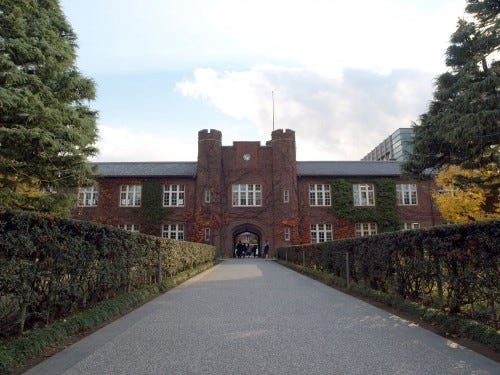
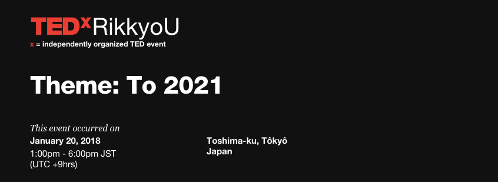

### 他TEDx紹介第６弾！

（自分にとってではありますが）いい話と悪い話をしましょう。

いい話は、
最近自分たちのTEDxAoyamaGakuinUの活動がいよいよ本格化し、私も含め危機感を持って活動をし始めたので毎週毎週話し合うことがたくさん、ミーティングを重ねています。
その分自分たちのイベントをいよいよやるんだ、という昨年からの目標が着実に進んできている実感を持ち始めることができました。
、、、というのがいい話。

一方悪い話は、
その分自分たちのことに必死すぎてあまり他大学へ勉強に行くことや、他団体との交流を持つ機会が少なくなっていること、
つまり私の場合このブログに毎週書くネタがどんどん消費されていくということ、、、
困る！！

個人的な話は置いておいて、
今回も他団体の紹介をさせていただきます。

今回ご紹介させてもらうのはTEDxRikkyoUさんです。

TEDxRikkyoUさんは立教大学の学生のみなさんを中心に去年立ち上がった団体で、私たち青山学院大学や明治大学も同じMARCHの中の一つの大学ということで、深く交流させていただいております。

以前紹介させていただいたTEDxMeijiUniversityさんのスピーカーコンテストでもご一緒させていただき、また昨年のオーガナイザーの方には個人的にライセンスを獲得する際のアドバイスなどもしてもらいました。

第一回目のイベントが2018年1月20日に開催されたイベント。
テーマは「To 2021」

オリンピックやパラリンピックが開催予定の2020を2021年の通過点と考え、その先に繋がるようなアイディアを立教大学の普段から発信して行くという意味が込められているそうです。

あまりこのようなさらに先をいくアイディアを、というような意味をテーマにするTEDxは少ないように感じます。
というのも、私たちが自分たちのテーマを考える時に他団体のテーマを色々調べたのですが、その時に出てきたテーマはもっと抽象的かつ概念的な一言で表すことのできる単語、といったイメージが多かったからです。

何よりすごいと思うのはそのイベント開催までのスピードとその安定性です。
TEDxだけというよりイベント全体的な課題だと思うのが２点普段から考えることがあるのですが、
一点目が、私たちがライセンスをなかなか取れず昨年から準備をしているようにイベント自体を開催させることの難しさ、
二点目が、イベントを開催させてもその継続性を持たせることの難しさです。

TEDxRikkyoUさんに関しては昨年立ち上げ、2018年のイベントは成功させ、そして今年の開催予定という安定性もしっかり作り上げています。

見習い勉強させていただく部分がとても多いです。

[https://www.tedxrikkyou.com/](https://www.tedxrikkyou.com/)

サイトを拝見すると、まだギリギリではありますが、登壇者を募集しているみたいですね。

[https://www.youtube.com/watch?v=c9XeSslRsms](https://www.youtube.com/watch?v=c9XeSslRsms)

昨年のイベントの様子はこちら。

2019年のイベントこそ私は行きたい、、、！！

密かな願望を晒して終わり。
