### 初めての水難訓練見学in境川

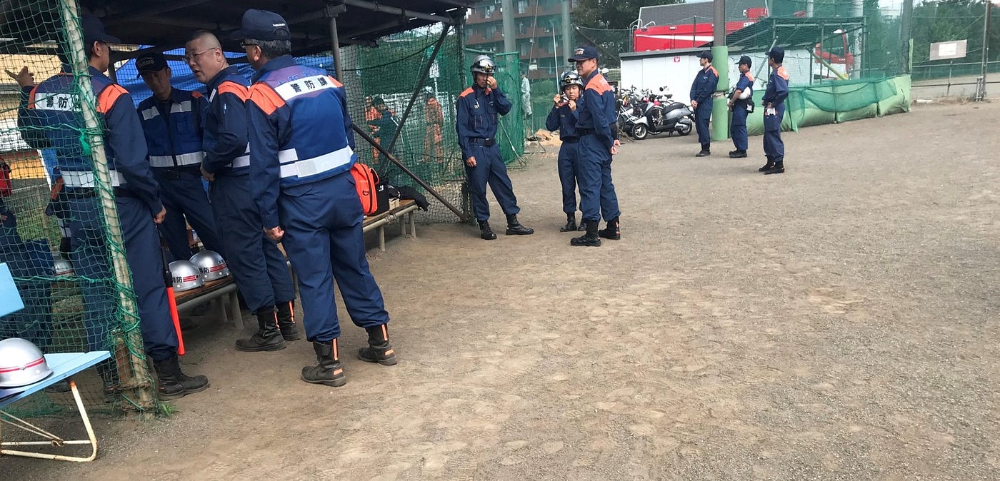

今回は境川で行われる大和・町田・相模原の3地域合同で行われる水難訓練の見学に行ってきました！

この手のイベントは学生時代の避難訓練ぐらいしか経験がないので楽しみです。

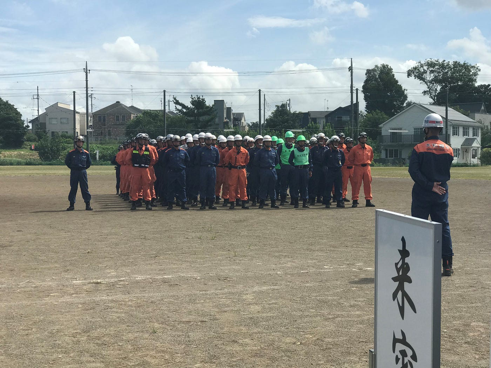

まずは始まりのあいさつと紹介です。午前中とはいえ気温が高いこともあってか簡素のものでした。その後休憩が入り、本格的に訓練が始まります。

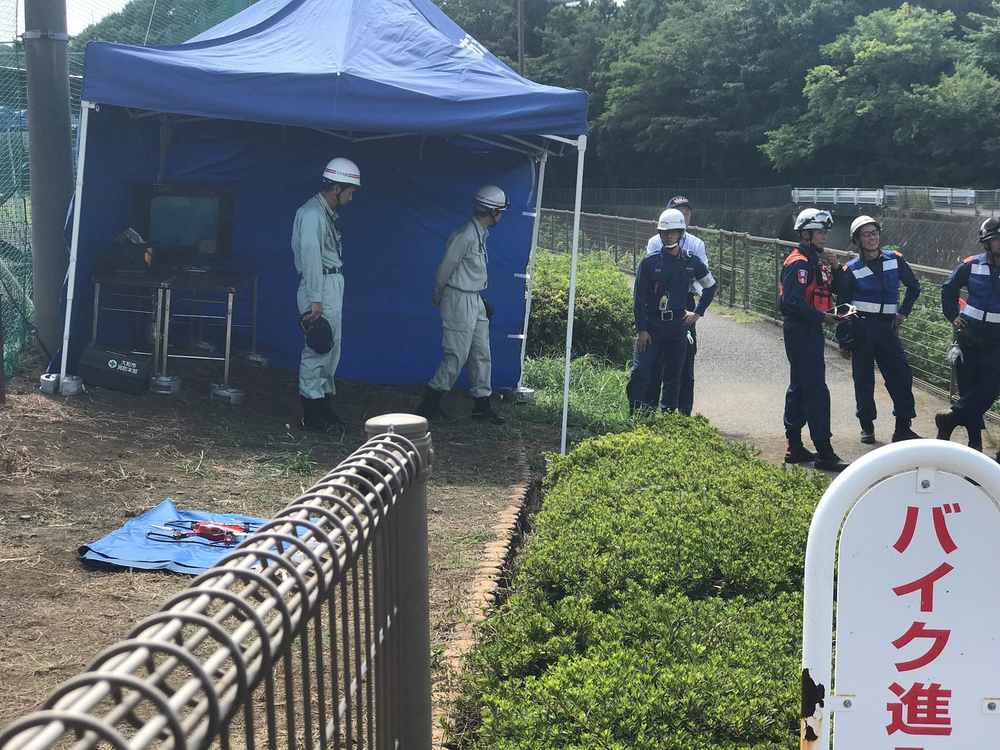

画像の奥に写っているのは今回の水難訓練の様子を撮影したドローンの映像を映すモニターです。今回の訓練ではただ単に訓練をするだけではなく、その様子をドローン撮影しようという試みがあるのです！ドローンは災害時での現場把握の面などでも注目を集めています。

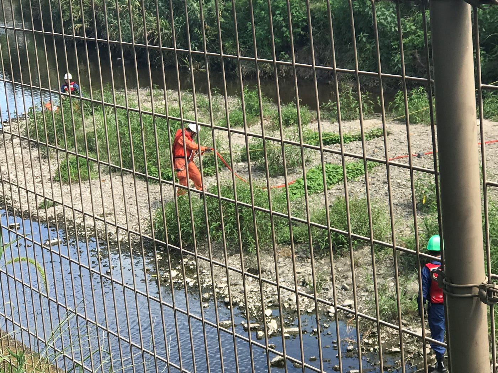

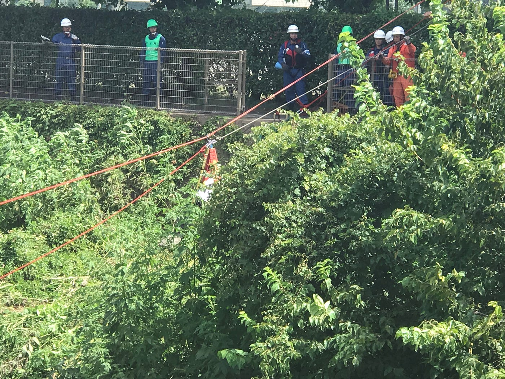

まずはじめの訓練を行うのは町田です。画像のジップラインといわれるオレンジのロープを川の両端で固定し、被害にあった人を救助しています。このロープをはる作業だけでもかなり時間がかかっています。15から20分ほどでしょうか。今回使ったのは人形ですが実際の人間は重さや関節の稼働などの点でより時間がかかるであろうなと思いました。

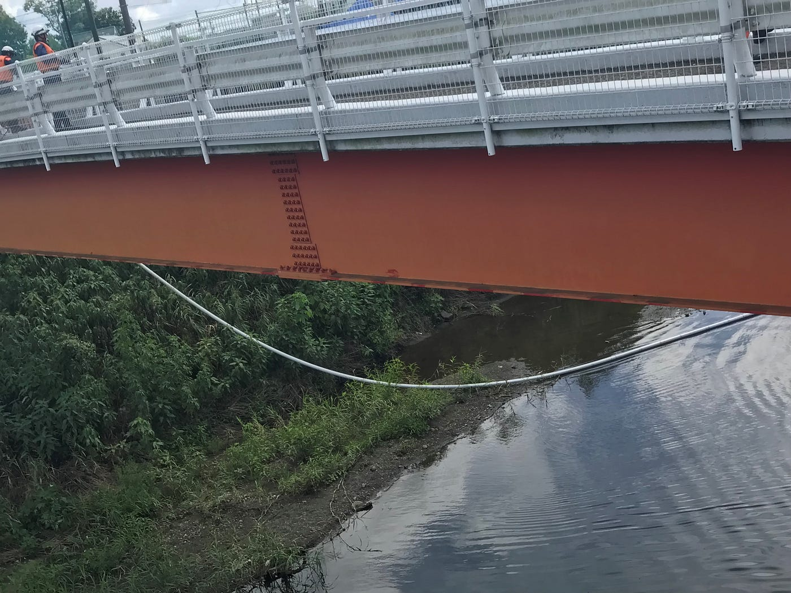

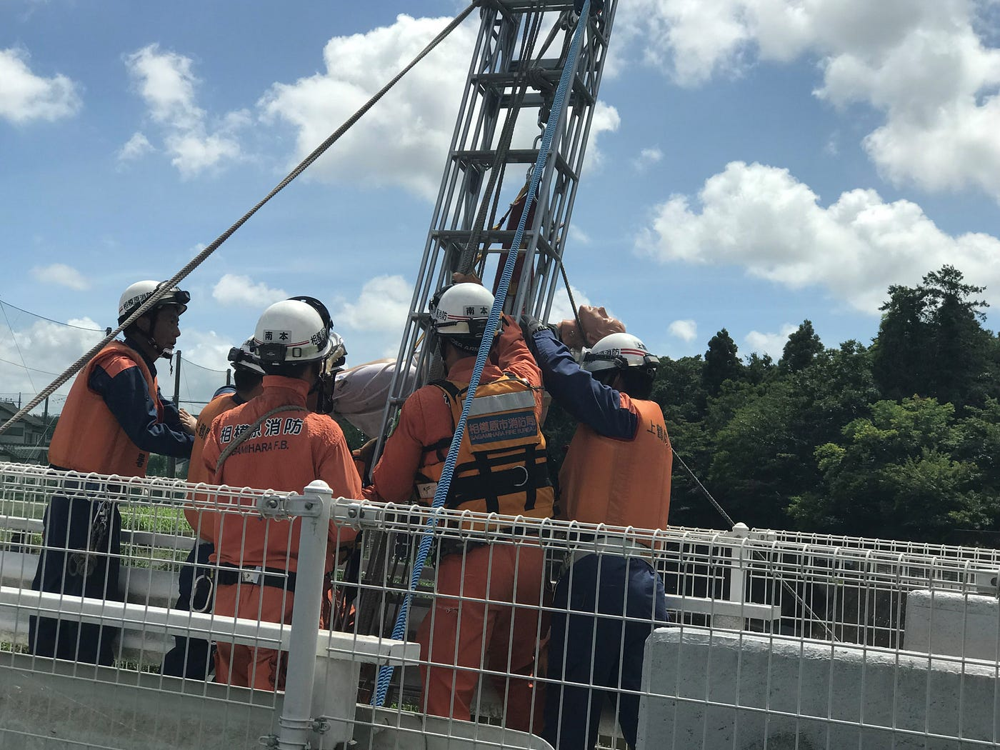

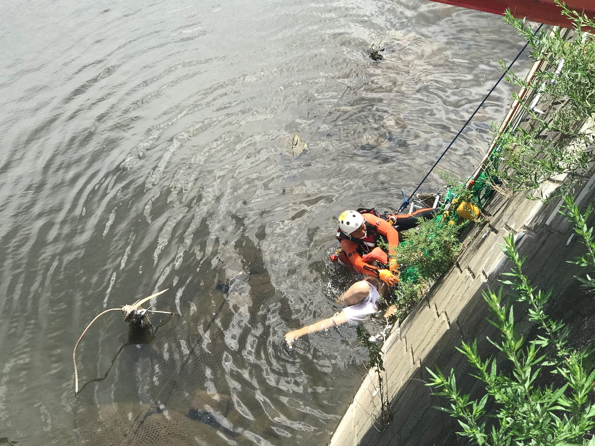

2つめは相模原です。ここではジップラインの代わりに消防車のホースに空気を入れたものと網を使っての引き上げ訓練でした。ここでは救助対象は意識を失っている設定でした。

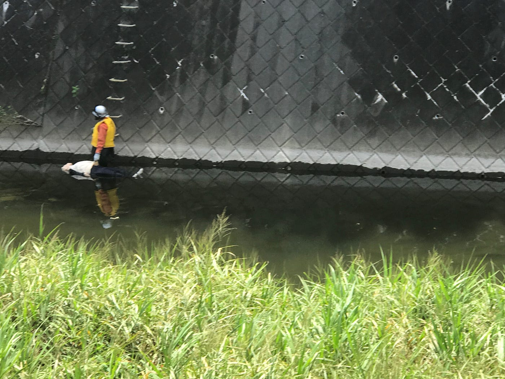

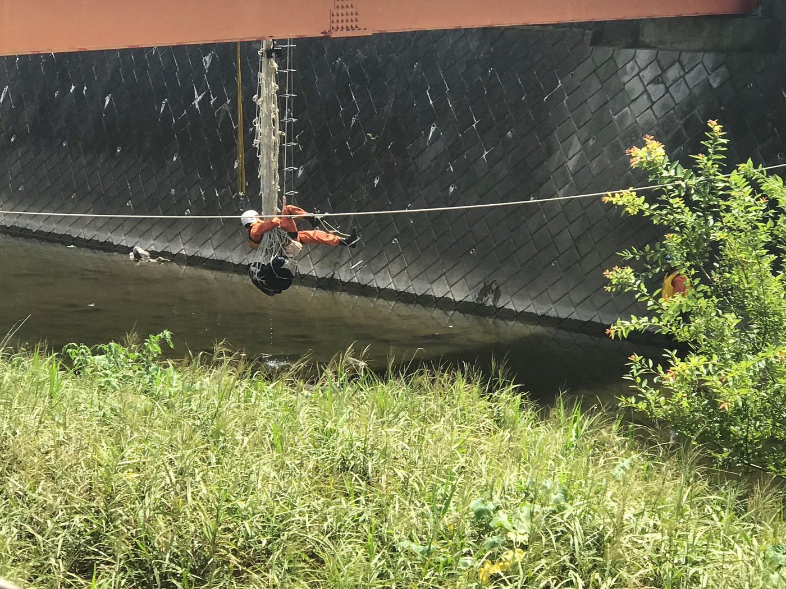

最後は大和です。こちらはロープと網を使った救出法です。

3つの訓練を見てて思ったのですが実際の水害時はあらゆる面で訓練時より救助隊員にかかる負担が大きく人一人助けるだけで想像を超える苦労があるだろうと感じました。それを軽減するためにもドローンのような技術を取り入れるのは必要な事であると思いました。

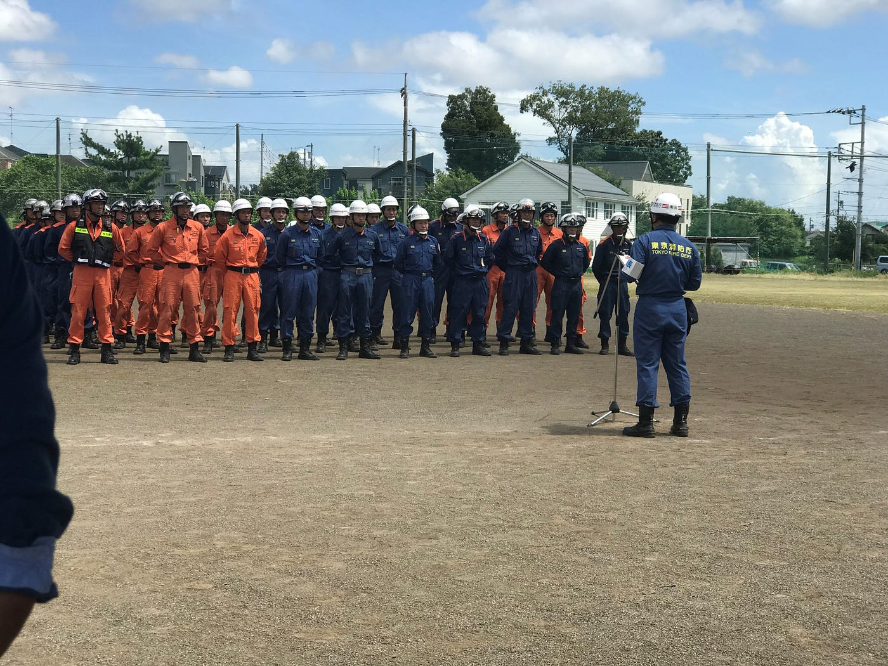

終わりのあいさつもはじまりのように簡素なものでした。

今回の合同訓練小規模なものではありましたが救助の手順の確認という点ではよいものであったと思います。見ている側としても救助の大変さや手間が伝わるものであったと思います。

[水難訓練 境川 - 恭一朗 北野's 12.7 mi run
恭一朗 北. ran 12.7 mi on Aug 20, 2018.www.strava.com](https://www.strava.com/activities/1786510378)
