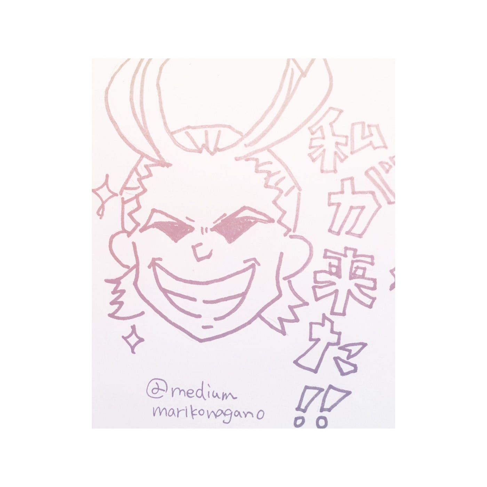

### 新しく学んでみる。

今日は私が最近始めた学びについて書いてみようと思います。(雑談ご勘弁下さい…)

もともとモノを作ったり、書いたり、描いたり、が好きなので、大学進学の際も、気持ち的には専門学校で学びたい気持ちが大きかったです。

ー今年は、

自分のやりたい事〜〜とか考え直す機会が非常に多くて、大学四年間で学んだ事を活かす…といっても、なんだかしっくりこないというか、腑に落ちない感じがしていました。

結局、

イラストは描けないし、

デザインも出来ないし、

服も作れないし。

そこで。

主体的な学び始めてみます。

今月からシナリオライター研修です。

向いてるか向いてないか分からないけど、

有り難いことに無償で研修を受ける権利を頂けたので、ちょこっと頑張ってみようと思います。

ーー卒論全く関係ない記事になってしまった…。

……いや、卒論制作に際して、

優位に役立つ基礎スキルを身につけるぞ！っていう一種の決意表明みたいなものです。ね！

ーーーーーーーーー

気付いたら画像がなかったので、

１０秒で描ける僕らのヒーロー オールマイトです。

…笑。

#僕のヒーローアカデミア

みんな違って、みんな良い個性を持ってるんだよ。というストーリーは、

将来を考える大人と子どもの境目にいる私に、

勇気とか元気とかたっくさんくれます。

