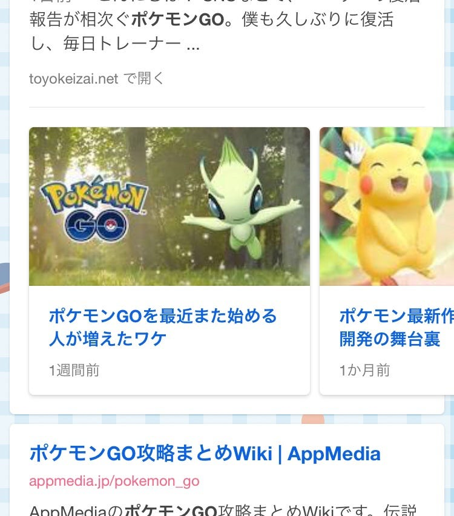

### ポケモンGO再ブーム到来！？

先週はレビューを……といっていましたが、先日面白い記事を見かけたのでこちらを紹介していきます！

‪ https://mainichi.jp/articles/20180831/gnw/00m/040/000000c‬

ポケモンGOに再ブームが来ているようです。

そういえばバイト先先輩がポケモンにハマっているなーとか、淵野辺シニア層の間でポケモンのライングループができているなんて話を耳にしたなーとか、イベントやってるなーとか、思うところはありましたが、この記事を読んでみてびっくりしました。

なんと、課金額は世界で1億400万ドルと前年比174%増。

アクティブユーザーも2016年のピーク時以来最大を記録しているそうで、「downloaded over 800 million times」という驚きの数字が公式サイトで発表されています。

最近では、マクドナルドやタリーズ、ジョイフルなどとタイアップして「スペシャル・ウィークエンド」というイベントを開催していましたが、その参加券を求めて店舗には長蛇の列ができました。

8/29〜9/2の「ポケモンGOサファリゾーンin横須賀」の参加券にも応募が殺到し、ヤフーオークションで高額転売もされていたみたいです。

なんという人気っぷり。

この記事では、ポケモンGOが再ブームしている5つの理由を挙げていました。

まとめると以下のことを言っていました。

1. 根気強く続ける大人ユーザーを確保したこと

1. ポケモンの種類が増えてコレクションする楽しみが増えたこと

1. レイドバトル導入で、より強いポケモンをゲットして育成するというRPG要素が加わったこと

1. 月に1度のコミュニティ・デイ開催

1. フレンド&交換機能の実装

この他にも、デイリー・タスクという機能を増やしたことで、飽きずに遊べるようになったことも挙げていました。

これらの理由をみてみて、今後のレビューにも活かせることがありそうだなと思いました。

特に、デイリー・タスクはユーザーに対してわかりやすく目標を提示しています。なんとなく始めた人がなんとなくデイリー・タスクをこなすために地味に続けているなんてこともありそうですよね。

私も飽き気味でしたが、久しぶりに開いてデイリー・タスクやセレビィゲットのタスクを見ると「あ、やらなきゃ」って気分になりました。

身近にユーザーが多いこともやめられない理由のひとつになり得ると思います。

よく友達からレイドバトルに行こうと誘われたり、バイト先の先輩にフレンドになろうと言われたりすると離れた心が少しずつ戻ってきました。

最後らへんは私情になりましたが、今度こそ来週からはまたレビューに戻ろうと思います。
