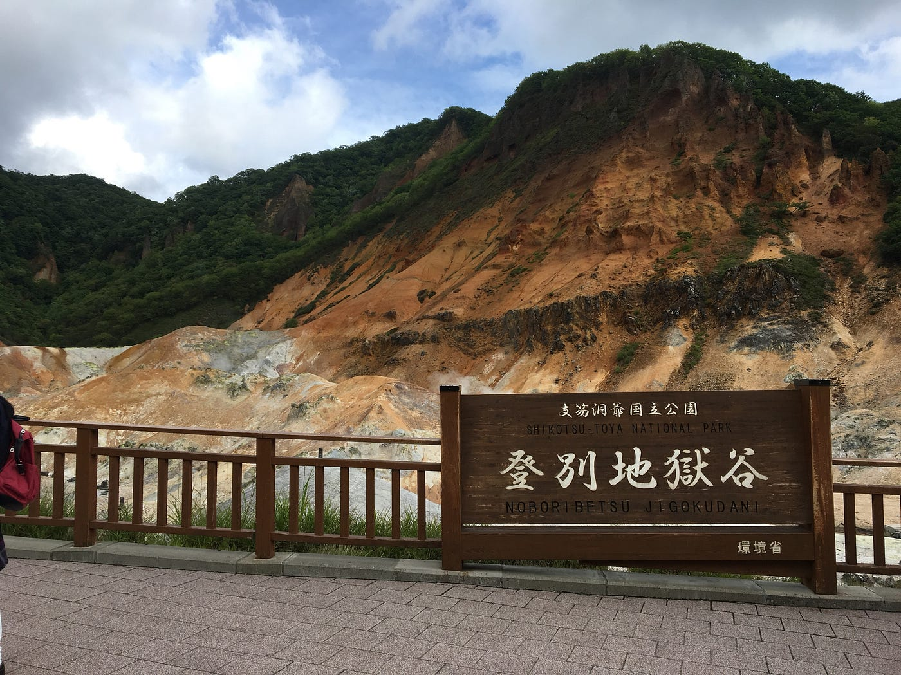
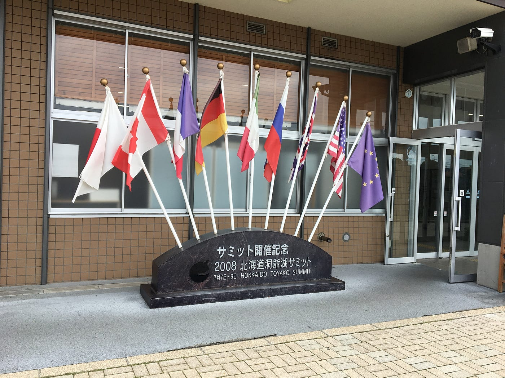
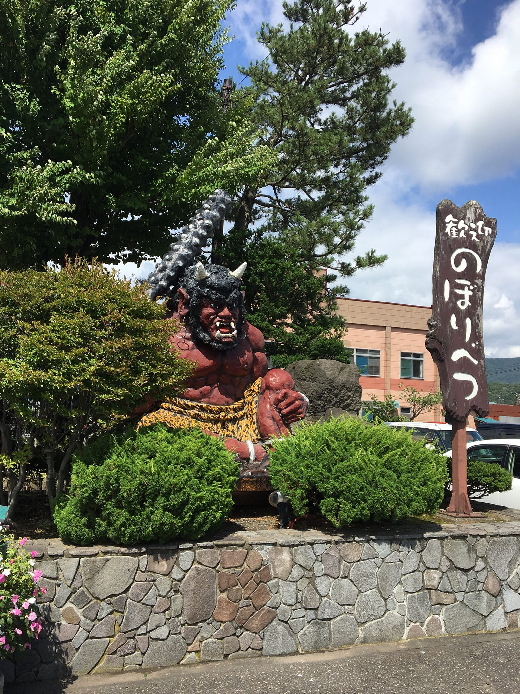
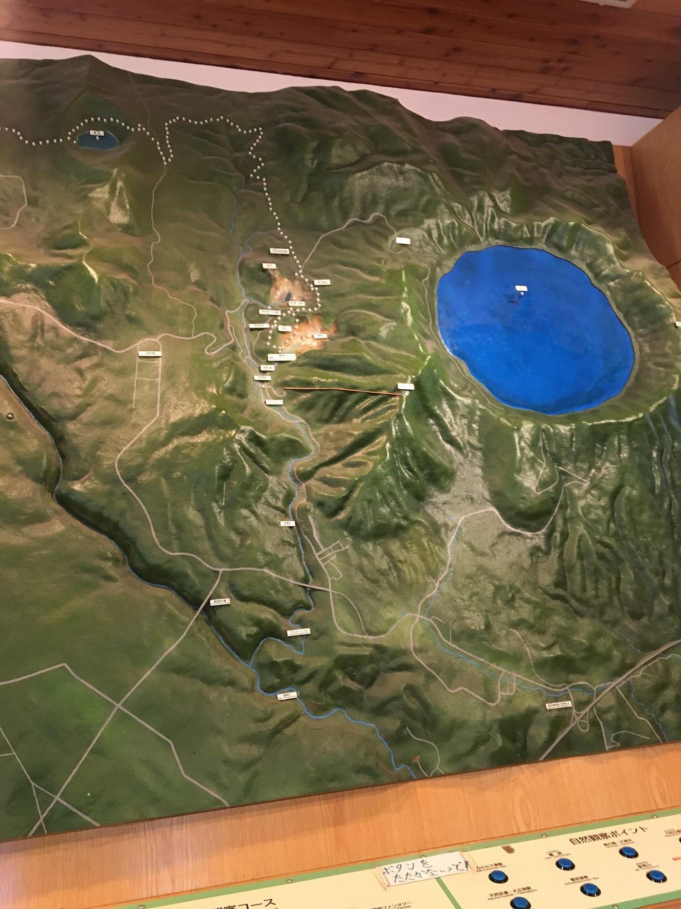
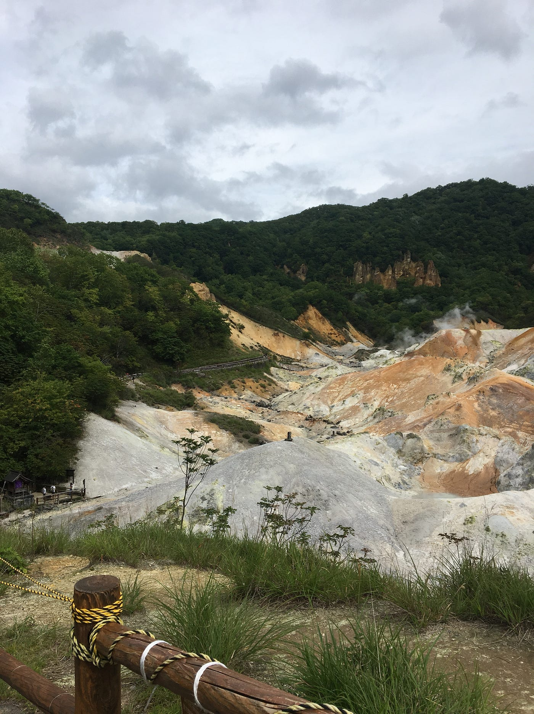
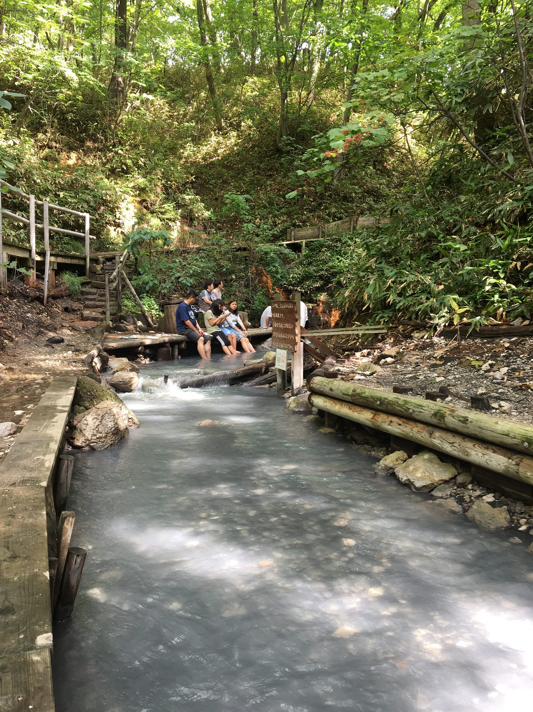
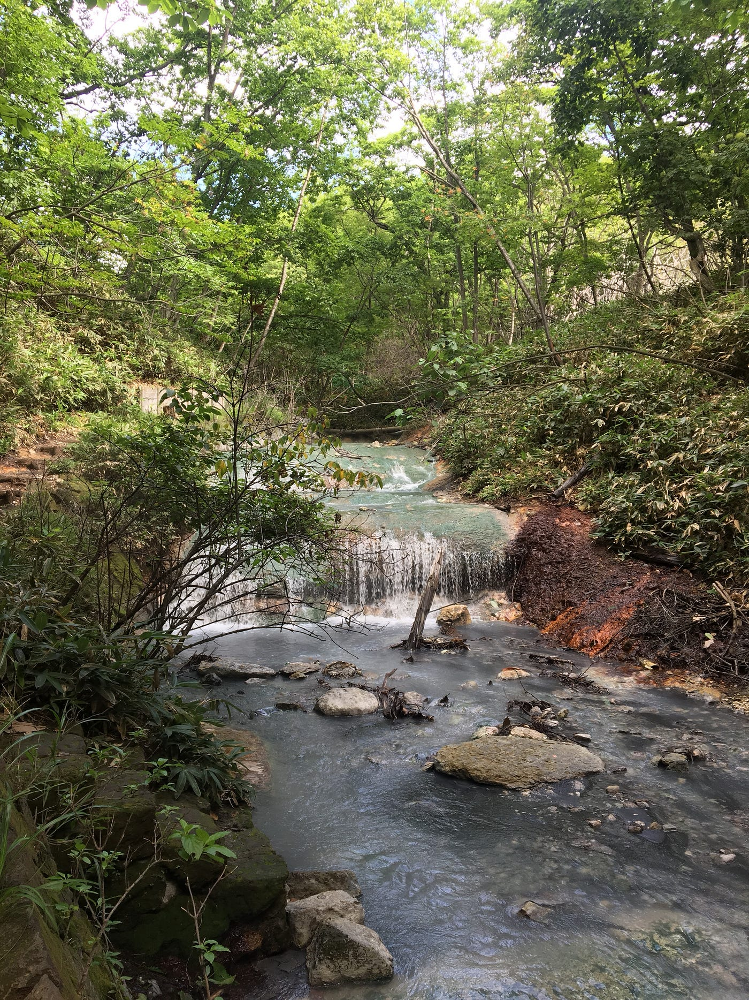
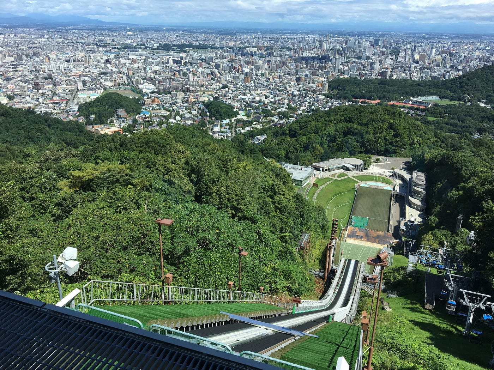

### 北の大地で足が震えるほどの自然のエモさを知る

今週のブログはTEDxをおやすみして、北海道旅行のお話をします。

8月30日〜9月1日まで北海道に旅行に行ってきました。

北海道といえば、小樽札幌富良野函館！といったところを思い浮かべていたのですが、今回の旅は洞爺と登別に行ってきました。

洞爺と言えば洞爺湖サミットが2008年に行われたことで有名ですね。

それ以外にも洞爺、登別は共に温泉で有名な土地です。
どちらも活火山の影響で天然自然泉が湧き出ています。

特に洞爺温泉は有珠山（うすざん）の活動で誕生したとしっかり誕生がわかっている温泉ののかでも珍しいものだそうです。
また支笏洞爺国立公園（しこつとうや）の中心にある洞爺湖は約１１万年前の火山活動で誕生した北海道で３番目に大きなカルデラ湖だそうです。

四季を通して透き通った綺麗な湖と島が見えるそうなのですが、、、
あいにくの雨模様で透き通った湖は見えませんでした。

なので写真はなし！

登別は温泉、特に地獄谷が有名です。
地獄谷というだけあり、登別につくとすぐに鬼や閻魔大王がお出迎えしてくれました。

登別温泉は世界でも珍しい９種類の泉質が源泉温度40℃〜90℃で湧き出ているため、『温泉のデパート』と呼ばれるそうです。
古くから薬としても使われるほどの療養効果、健康効果が大きく、川の色が変わるほど豊富に温泉が湧き出しています。
こちらも火山活動の影響でできた温泉なので、近くにはクッタラ湖というカルデラ湖がありました。
（残念ながらロープウェイ故障中で見れませんでした、、、）

この地獄谷、近くに寄ってみるとものすごい硫黄の匂いと至る所から上がる湯気でちょっと怖い、、、

ただこの豊富な温泉源のおかげで自然足湯を体験することができました。

名前の通り自然に流れる温泉が森の中にあり、そこに足をつけるというもの。

自然の中に流れる温泉なので、まあ歩く。
登山かな？と思うくらいには高低差の激しい道を歩きました。
おかげで題名の通り足は疲労で震えましたが、
代わりにとても気持ちいい足湯に浸かることができ、
また自然そのままの景色の中に温泉によって川底のいろが変わる不思議な景色を綺麗に写真に収めることができました。

[北海道 登別 地獄谷散策 - Kato Yuka's 2.6 mi walk
Kato Y. completed 2.6 mi on Aug 31, 2018.www.strava.com](https://www.strava.com/activities/1809002358)

最後に札幌の景色と札幌冬季オリンピックで使われたスキーのジャンプ台の上からの景色を晒して終わり！

参照
（[http://www.laketoya.com/knowledge/](http://www.laketoya.com/knowledge/)）
（[http://noboribetsu-spa.jp/see_activitie/noboribetsu_jigokudani/](http://noboribetsu-spa.jp/see_activitie/noboribetsu_jigokudani/)）
