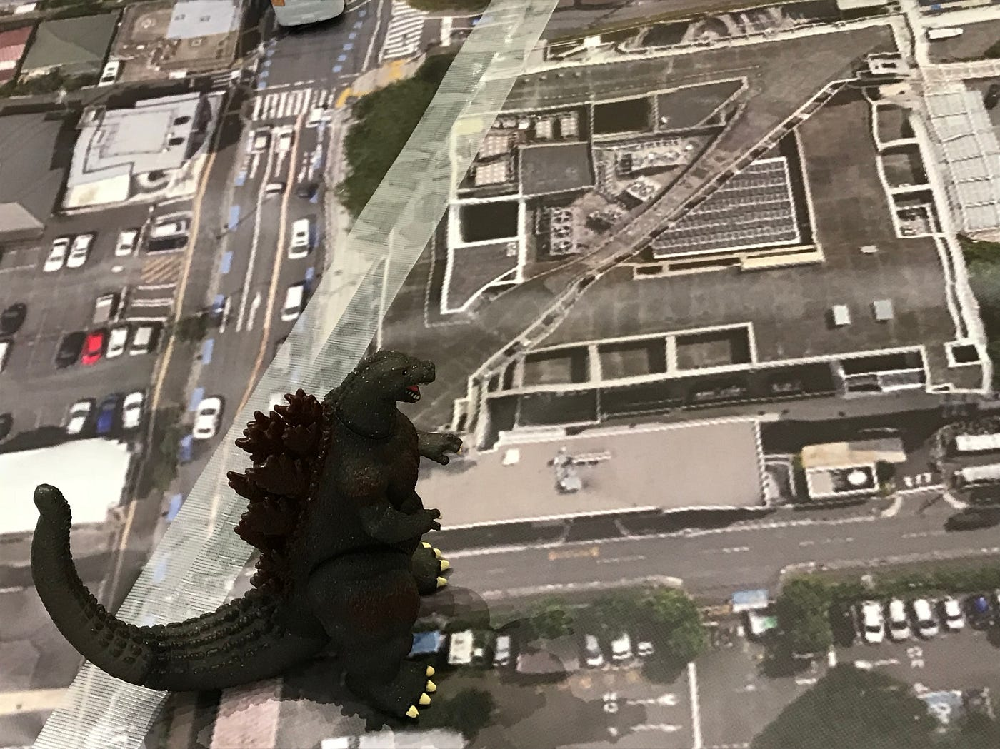
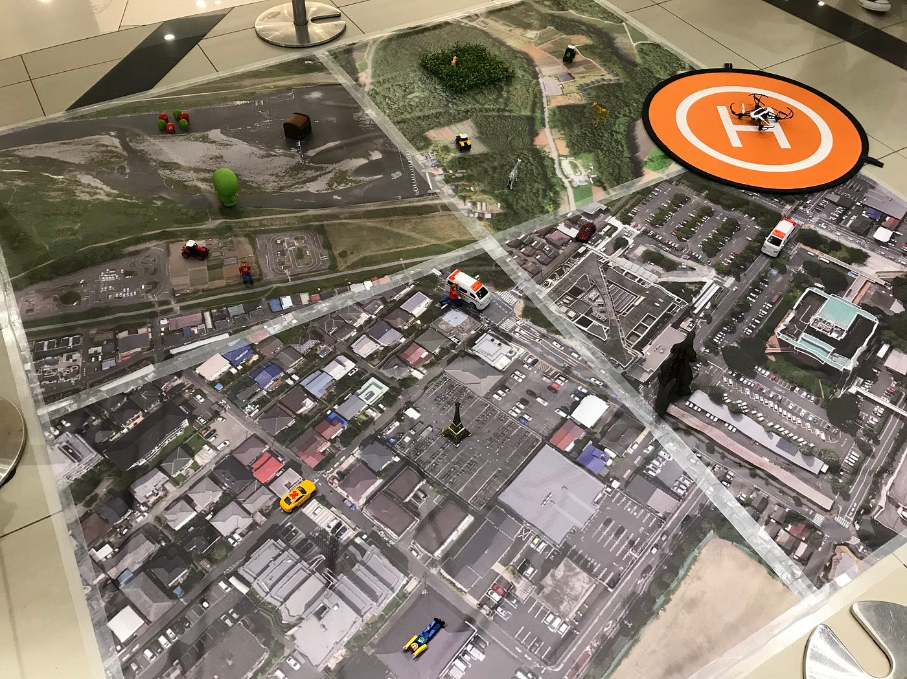
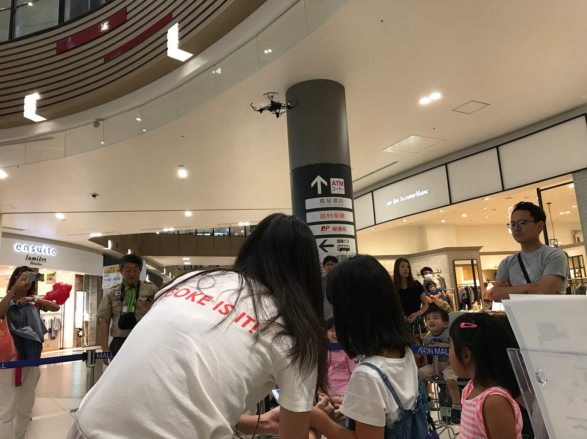

### ドローン体験会で絶対に事故を起こさない方法 その2

#### ドローンに初心者の私達VSドローンに興味津々の子供達

9/1–9/2にイオンモール幕張で行われたドローンワークショップに参加してきた、3年の大津です。今回のこのブログでは、今後イオンモールのワークショップを控えている3年生へのマニュアルになるような内容を書きつつ、私は、日中のドローンの動かし方や教えている点で感じたことを中心に書いていこうと思います。

### ドローンの動かし方

今回のイオンでのイベントでは、この地図の上にドローンを飛ばし、測量や空中撮影というものは、こういったふうに行われているのだという疑似体験を行ってもらう内容でした。オレンジのヘリポートから、この地図内からはみ出ない程度で操縦してもらったり、ドローンを回転させてみたり…。また後半の方では、ドローンにアームを取り付け、アームで物を運ぶというミッションもやってもらったりというふうに、いろんな遊び方を体験していただけたと思います。2日目は、古橋先生が不在で、安全面の配慮のため、ドローンに1.5m程度のテグスをつけての操縦です。そのために、ドローンを回転することは出来ませんでした。

### ドローンを操縦するのは…。

今回のイオンモールのイベントで、主にドローンを操縦してくれたのは、小さな子供達でした。ドローンに興味津々の子供達は、イオンモールオープンと同時に長蛇の列を作ってくれました‼︎ しかも、2日間で、休憩時間以外、列が途切れることはありませんでした‼︎(ありがたいです‼︎) しかし、そんな子供達は、ドローンの操縦はわからない子がほとんどです。そして、教える私達も操縦に関しては、ほぼ初心者のようなものです。なので最初の方は、混乱の連続でした。教えるのも大変、ドローンが敷地外からはみ出ないように確認するのも大変、もし言う事を聞いてくれなかったら、無理やりコントロールを取り上げるのも大変、、、。後半の方では、このような作業もようやく慣れましたが、子供相手に1日目は本当に疲れたという感情が半分を占めました。しかし、2日目には、いろいろ気を利かせながら教えることはできたと思います。また、親御さんや大人の方にも、体験していただき、いろんな方にドローンの魅力が更に伝わったのではないかと感じた2日間でした。

### まとめ

子供達だけでなく親御さんや大人の方にも楽しんでいただけたこのイベントで、１つだけ大きな声で言えるのは、子供達に物事を教えるのは大変‼︎ です…。自分の頭の中では、ドローンの飛ばし方を分かっていても、子供達に理解してもらえないシーンがたまにありました。簡単な説明をしているつもりでも、十分に出来ていなかったのです。ドローンほぼ初心者の私にとっては、子供達に十分な説明で教えることも愚か、ドローンに興味のある大人の方にも、「このドローンはどれくらい飛ぶの⁇」や、「カメラはどこについてるの⁇」 などさまざまな質問に対する回答にすばやく答えたり出来ず、いろんな葛藤が自分の中で生まれたので、次ある機会に備えて、満足のいく知識をつけたいです。
