### ドローン体験会で絶対に事故を起こさない方法 その１

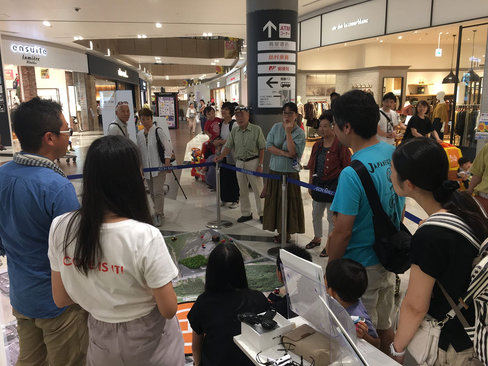

こんにちは、3年の福王です。僕は、9月1日・2日にイオンモール幕張新都心で開催されたドローンワークショップに参加してきました。両日ともに多くの方々に参加していただき、教え甲斐のある時間でした。

体験会では小さな子供が参加するので、細心の注意を払っていても、危険な場面に遭遇しやすいです。なので、如何に危険を排除するかを今回の体験を基にシリーズ化していきます。このページでは、イベント会場に着いてから体験会が始まるまでの準備の流れについて説明します。

準備の流れは大きく分けると、

**機材充電**・**受付設営・飛行エリア設営・テグス(古橋先生不在時) **です。

### 機材充電

会場に着いて最初に行うのが機材の充電です。体験会で使用する機材は全て緑色の箱入っているので、ドローンの**コントローラー**・**バッテリー**、**Iphone**を充電してください。ドローンのバッテリーは数が多いので、充電してあるものを赤い箱(3枚目の写真)に入れて、充電をしてあるものとしてないものを区別してください。また、体験会中は使用していない機材は**常に充電する**ようにしてください。

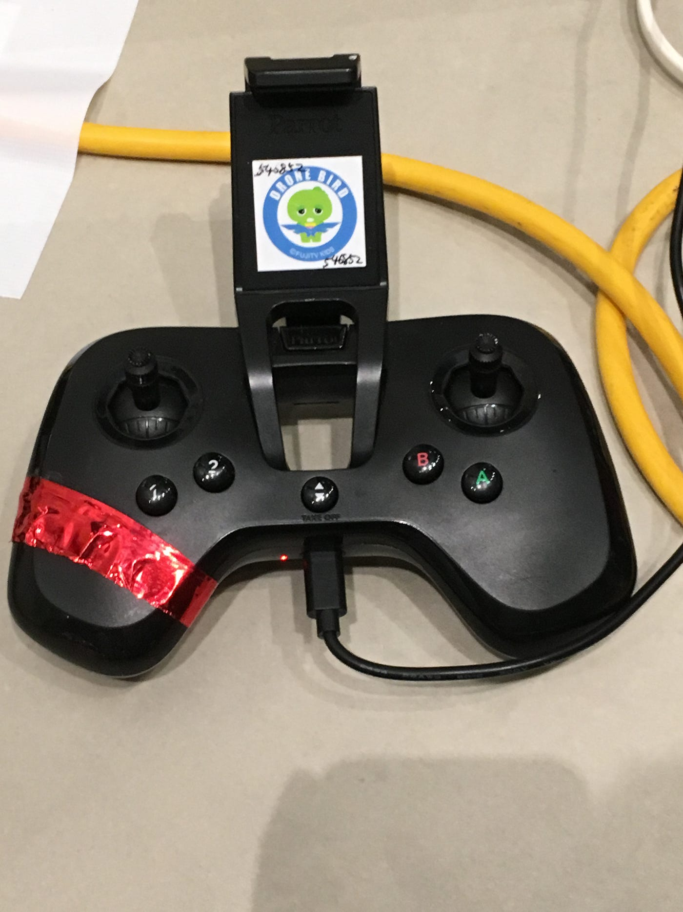

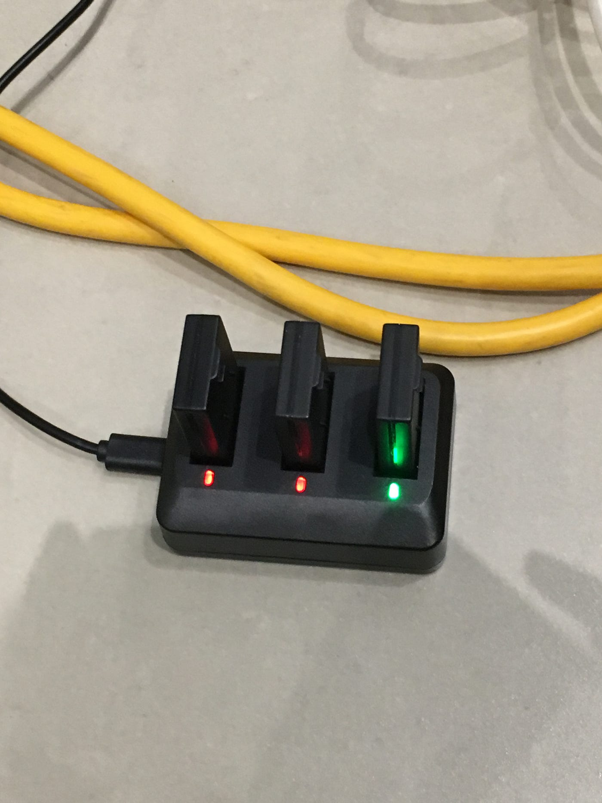

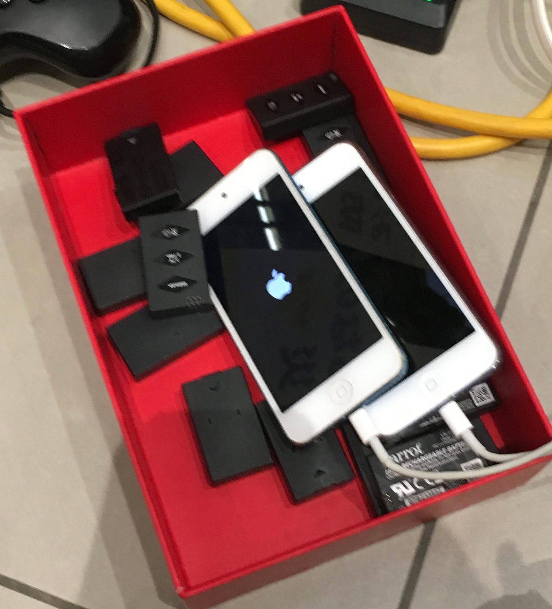

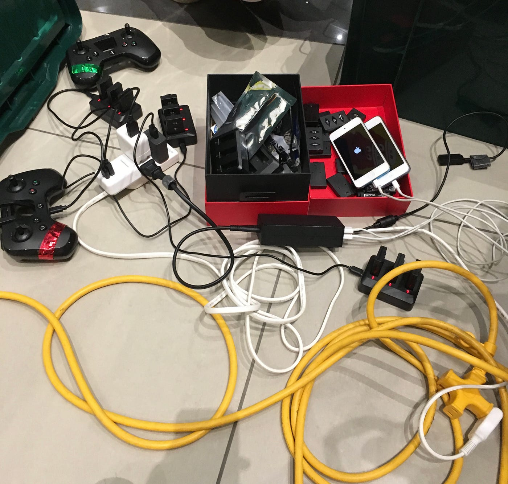

### **受付設営**

受付の設営は、受付エリアに**ドローン本体とコントローラーを1セット**、**ドローンのパッケージ**、**DRONE BIRDの広告**を展示してください。ドローン本体とコントローラーが1セットの理由は、全3セットあるうちの1セットは体験会に、1セットは予備機として必要だからです。

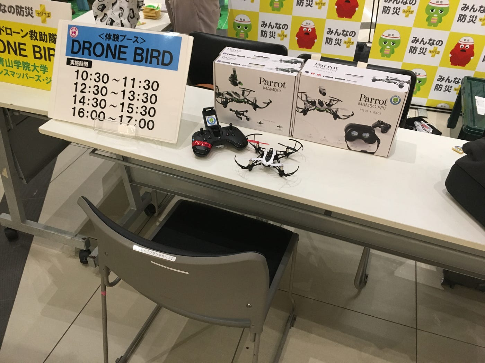

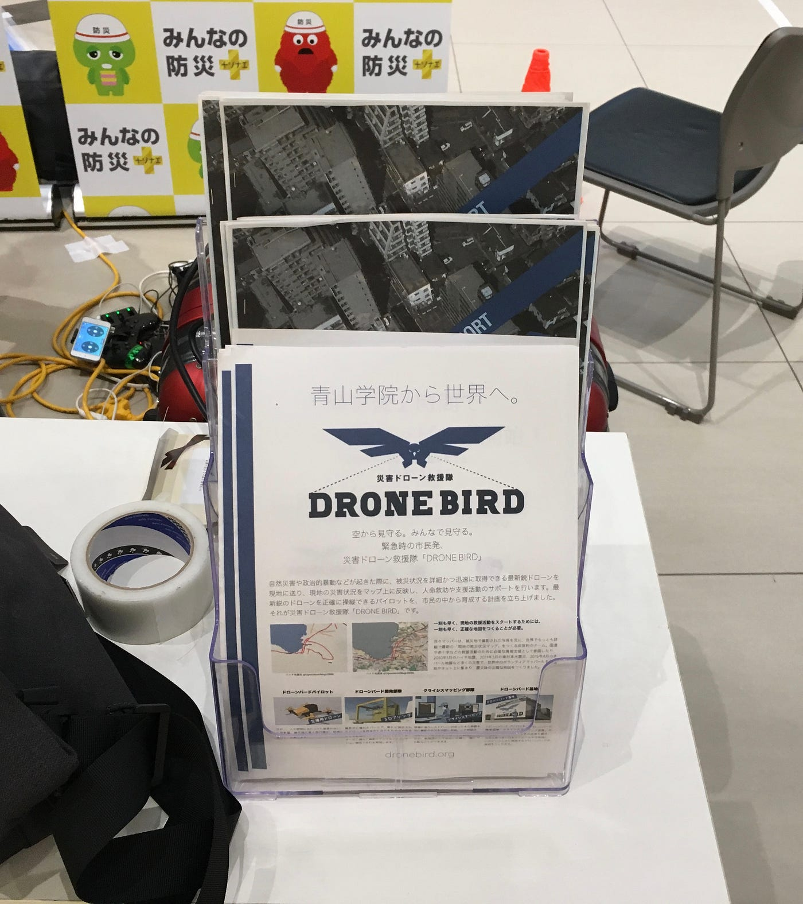

### **飛行エリア設営**

会場には、予め航空写真(1枚目の写真)が貼り付けてあるので、その上に**おもちゃ**を並べて、手前に**ヘリパッド**を置いてください。また、ドローンで物運びをする場合、**茶色のカゴ**と**ガチャピンのおもちゃ**を使って目標地点(2枚目の写真)を設置してください。

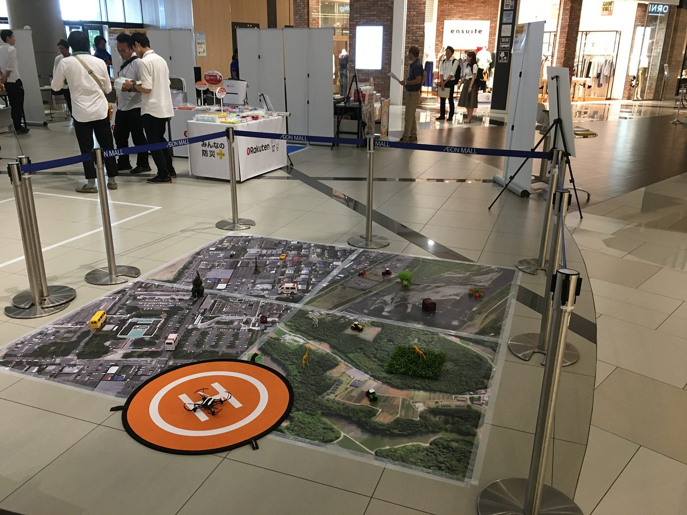

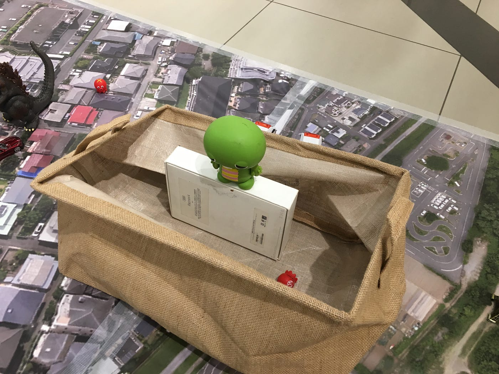

### **テグス(古橋先生不在時)**

古橋先生が不在の場合、安全管理の兼ね合いでドローン本体にテグスを付ける必要があります。緑色の箱の中にテグスが入っているので取り出して、**約1.5m**くらいの長さに切断してください。その後、**ドローン本体の裏側の後方部**(1枚目の写真)にテグスを結び、剥がれないように**ガムテープで補強**してください。テグスの結び先は**ペットボトル**(2枚目の写真)で、ペットボトルに**水**と**絵の具**を入れて、見栄えの良い重りにしてください。ペットボトルにもテグスを結んだら、再度剥がれないように**ガムテープで補強**してください。最後に、予備のドローンにもテグスを結んでおいてください。

テグスを結んでいる時に、テグスが絡まるので、ドローンを回転させないでください。また体験会中、ドローン本体にテグスが絡まって解けない場合は、カッターでドローン本体からテグスを切断してください。そして、すぐに予備機で対応してください。

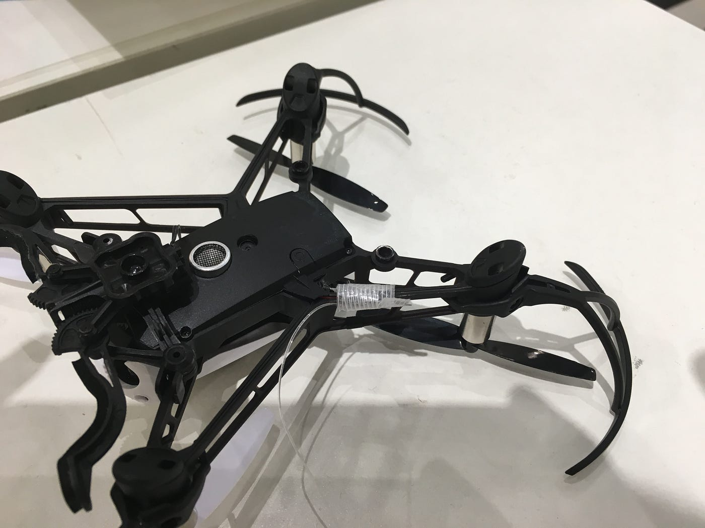

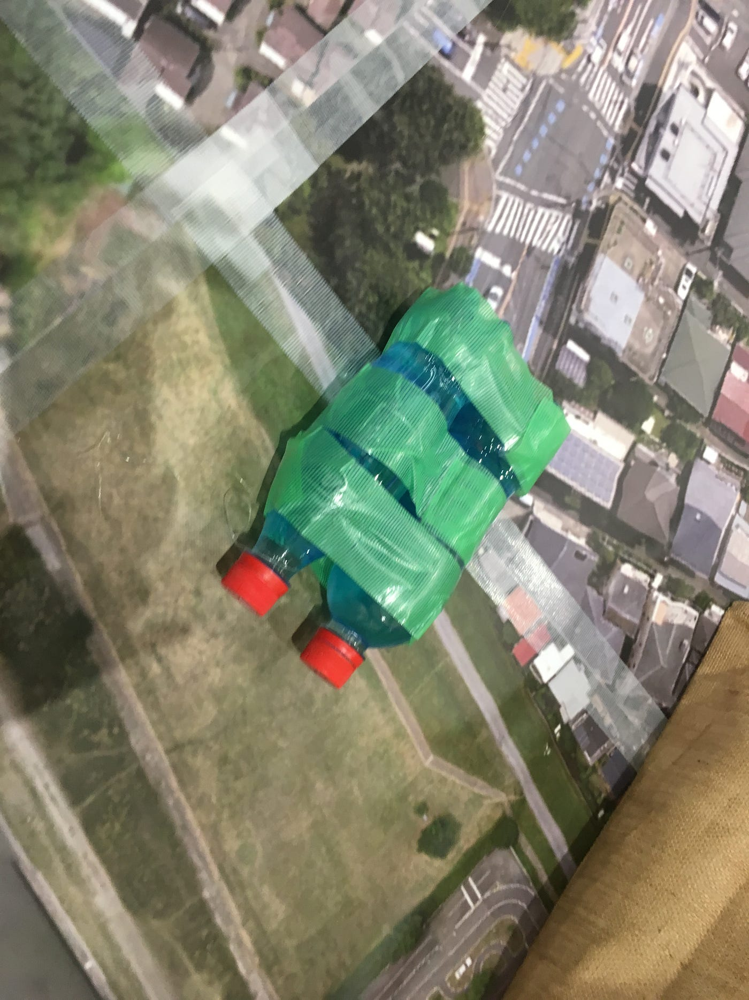

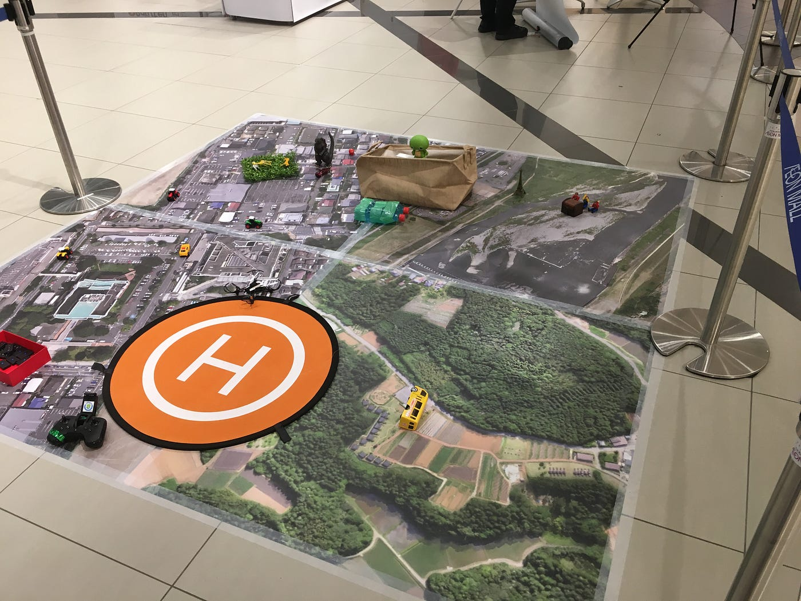

### **最後に**

今回のワークショップで一番感じたのは、備えあれば憂いなしです。2日目にテグスの調整が上手くいかず、調整するのに5分ほど掛かってしまいました。5分待つのは大人にとっては大したことではありませんが、今回のメインターゲットである子供達にとってはとても長い時間です。待っている子供たちの姿を見るのは辛いです。自分たちの準備が完璧なら、こうした事態にも、もう少し上手く対応できたのではと思います。故に、準備を完璧にして、参加者はもちろんのこと、自分たちも憂いのない楽しいドローンワークショップにしていきましょう!!
