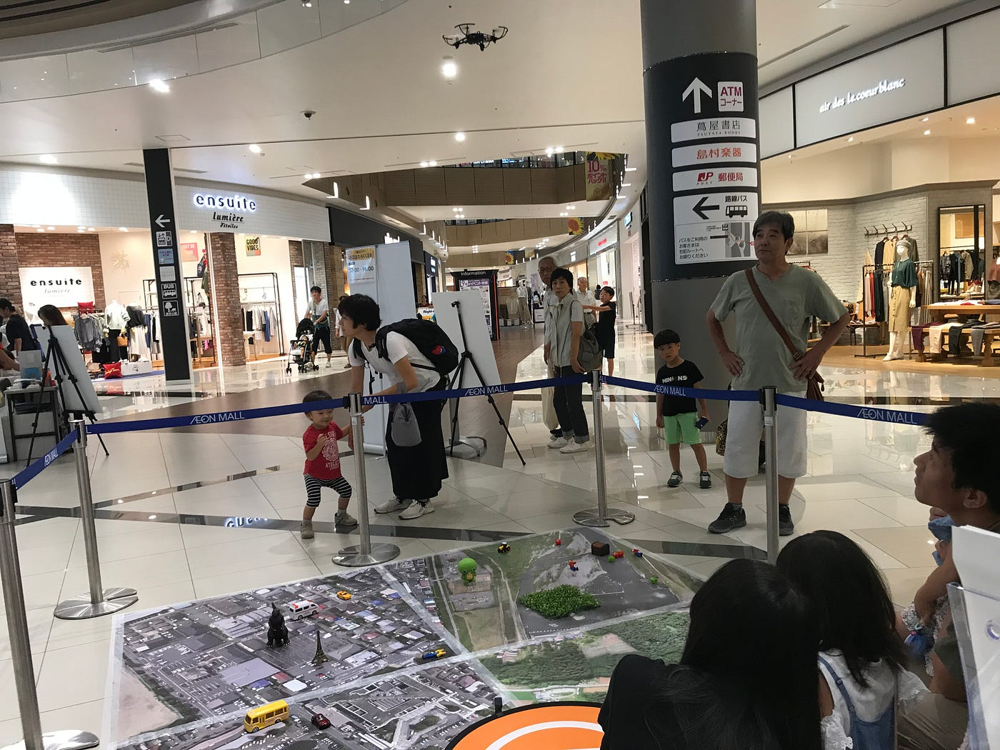
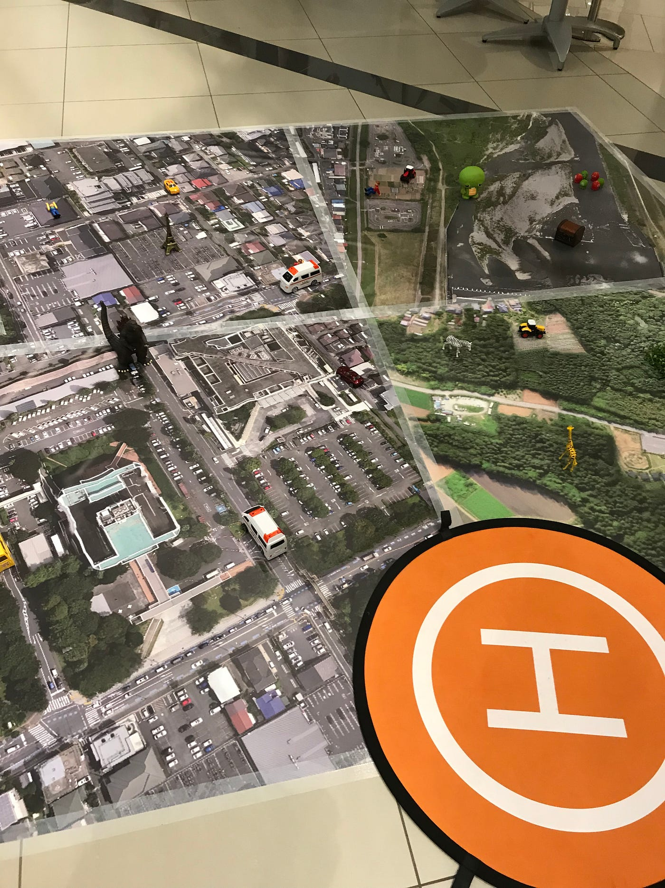

### ドローン体験会で絶対に事故を起こさない方法 その３

### 〜子供達をうまく扱おう！！〜

私のブログでは、ドローンの操作方法ではなく、子供達をどのように安全に楽しませられることができるのかを書いていこうと思います。

子供達は様々な子がいるため、一人一人にあった教え方をしなければなりません...子供によって少し違いはありますが、

1-4歳はまだまだこどもです、手も小さくうまくコントローラーを持つこと、レバーを動かすことはほとんどの子ができないため、学生か親御さんにコントローラー持ってもらうと良いです。ドローンを見ながらコントローラーを使うことはできず、そして一瞬だけボタンを押す、操縦することは難しいので、無理だなと思ったら、学生がレバーを持ち、その上に手を乗せてもらえば操縦した気になります笑

5歳くらいからは自分でやりたがる子が特に男の子で多く、説明を聞かずに勝手に押そうとする子や一人で全部やりたがるので一番注意が必要な年代かなと思います。そういう子は回転をさせてあげるとめちゃくちゃ喜ぶのでそれで満足させましょう！でも調子に乗って何回も回転させる子もいるので大体の回数を決めると良いと思います。そしていつでもコントローラーを奪える準備をしてください！テグスをつけていない時は特に柵の周りに見張りがいると良いと思います。

小学校中学年からは力加減や微調整がうまくできるようになるので上手にできる子が多いです。でももちろん隣でいつでもコントローラーを奪えるようにしていてください。

最後の着陸でうまく操縦できないなと思ったら、ヘリパッドの上までは学生が移動させて、高度を下げたり、ストップのボタンを押させるだけにするのも良い方法でした。

このヘリパッドをはじめの方は手前の方に置いていましたが、離陸、着陸の際に子供とすごく接近してしまうため、少しマップの内側に置くと離れて安全かなと思いました！そしてドローンが離陸したらまず上に飛ばして子供の高さより上に上げることが大切です。

回転させるときよりも、荷物を運ぶ操縦の方が細かい調整が必要で時間がかかりました。時間がかかり過ぎないようにたまに学生で近くまで操縦してあげたりすると良いと思います。

子供をうまくその気にさせて(笑)楽しませてあげてください〜！

おわり
