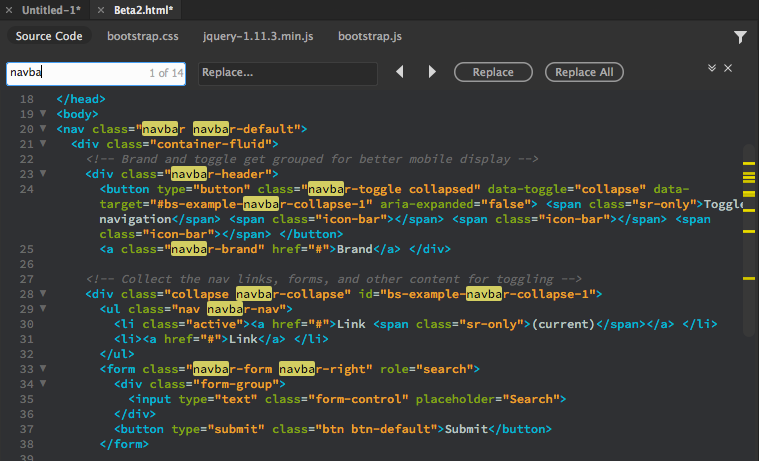

### How to コーディング & Webサイト作成【Dreamweaver の HTML編集 編】

夏も終わる…その前に記録しておくことは記録する！！！

安藤です。何週もご無沙汰してしまいました…申し訳ないです。とにかく夏休みらしくない夏休みを過ごしました。学生最後の夏なのに旅行はどこにも行けずひたすら就活と撮影を繰り返す苦悩の日々でした…笑

まあ夏らしい写真は結構撮れたので良しとしますか。

すでに『今週の一枚』ではなくなっていますが、ここから4つほど一気にブログアップします。

こちらの写真は8月中旬に流行スポットの座間ひまわり畑に訪れた際の写真です。ひまわりも撮りましたがあえて田んぼでの一枚。自宅から車で行けば近いのに、電車で行くと座間は遠い…

モデルさんはカナダ留学中の高校生！夏休みなので一時帰国。半年くらい前からコンタクト取っててやっとお会いできた人でした。

さて、今回は前回ご紹介したDreamweaverを使った作業、【HTMLの編集】の仕方をメモしておきます。私はまだ自分のラップトップにこのソフトを入れていないので文章のみの説明となってしまいますが、ご了承ください…

まずはこの作業をするのに便利なショートカットを紹介。

_**Ctrl ＋ S ⇒ 保存_**

＊（アスタリスク）が表示されていると編集後未保存であるということなので、なるべくこまめに保存を行うほうが良いでしょう。

_**Ctrl ＋ Z ⇒ 一つ戻す_**

_**Ctrl ＋ Shift ＋ Z ⇒ 戻したのを取り消す_**

Abobeならほぼ共通のショートカットなので覚えて損はないはず。

もう一つ、

_**F5 ⇒ ブラウザ内の更新_**

サイト作成中に実際のサイトにきちんと反映されているかチェックしながら、コードを組んでいくと思いますが、ブラウザの更新を行わないと反映されないので、確認の度に更新します。

### # HTML編集をしてみよう

WEBデザをする際のソースは**2種類**！今私が理解しているのは、

- HTML : ページに表示させたいものを決める。大まかな土台となるもの。

- CSS : 装飾やマージンなどの情報を入れる。土台をもとに細部を決められる。

ということでしょうか。

最初にサイト名、ネット上でタブに反映される名称をつけます。

〈title〉と表記した後ろに名称を入れます。

_**▼: 開始タグ_**

_**/: 終了タグ_**

この2つは例えば【見出し】【画像貼り】【リンク貼り】の度に分けて使います。

### ①表示する文章を入れよう

まず▼（開始タグ）をつけて、

_**〈body〉○○○○○〈body〉_**のように文を入れます。

そして / で終了。

『h1』 : Heading（タイトル）1（フォントサイズの1番大きいもの）の意味。6まであるのでサイズはまたいじってみよう。

ul と li タグ : 箇条書きのリスト用。点1個のような役割を持つ。通常この2つはセットで使用。

### ②画像ファイルを挿入しよう

ファイルから画像を選択し挿入。画像のタグは_**〈img○○○○○〉_**で表示されるはず。

すると、src=属性としてwidthやheightを自動書き込みされます。

画像タグには囲いをつけるのが一般的です。

- imgタグをドラッグ

↓

- Ctrl ＋ T ⇒ タグで囲む

↓

- コードヒントを表示

↓

- Enter ✕2

↓

- 選択で囲うと、〈 〉○○○〈 〉となる

### ③ナビゲーションにリンクを貼ろう

次にナビゲーション（メニュー選択ボタン、ここでは文や画像ファイルのこと）にリンクを貼ります。

ここでは画像ファイルにリンクを貼る例で説明します。

〈img○○○〉のみドラッグ ＞ プロパティ ＞ リンク ＞ とびたいURL貼る ＞ Enter

〈a○○○…〉タグが表示されたら、それがリンク用のタグとなります。

hrefという表示はURLのことです。

### ④コードが見やすいようにまとめておこう

divタグを使って、種類に分けてまとめていきます。特定の意味は無い作業らしいのですが、既にコードでごちゃごちゃしていると思うので後のCSS編集のためにもまとめておくと良いでしょう。

画像やリンク作業コードなどの最初と最後に〈div〉を入れます。

そのdivには名前をつけておきます。

プロパティ ＞ Div ID ＞ mainとかsubとか名前を挿入

こうすることでdiv中にID属性が追加されます。

— — — — — — — — — — — — — — — — — — — — — — — — — — — — — —

ここまでがざっとHTMLの編集の基本的なコードです。

私も書いているだけではよく思い出せません…苦笑

ソフトをダウンロードできたら、またこのブログを改訂しておきます！

CSS編集編で続きます…

安藤
