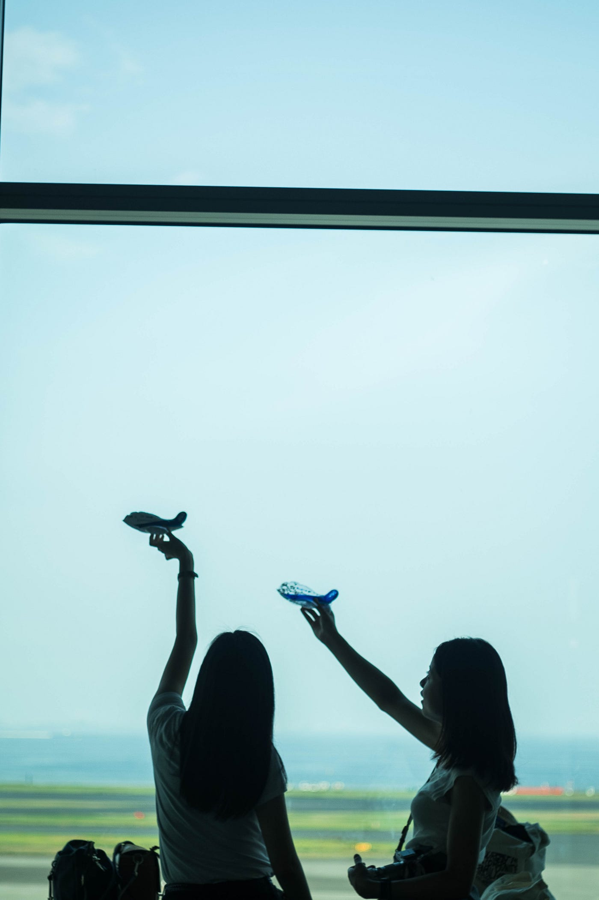
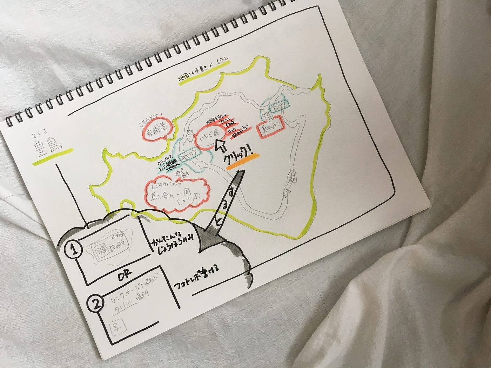

### アウトプット！ホームページの設計図

卒制テーマ進捗状況 #11

就活も終盤。就活って受験とかとは違うし、道はいくらでもあるし、みんなに従うのもつまらないと思うし。あまり焦ると自分を追い詰め過ぎてしまう質なので、逃避をしているというわけではなくて、鬱になりすぎないようにしています。いろんな夢や可能性があるしね。現3年生も（これを見てくれている人は少ないと思うけども）『就活』というより日本社会にどんな企業があるんだ、どんな変な社会人が面白いことやってお金つくってるんだ？と思いながら知っていくと楽しいと思います！今のうちからインターンをしたほうがいい、とは私はあまり強く思いませんが、会社に目を向けるのはいいことかな、と。日本国内だけでも小さくても面白い会社たくさんありますので。

就活かなり長くしてますが、もしこれで決まらなくても後から後悔することはないんじゃないかなぁと思ってます。でも、決めたい笑

旅がしたすぎる、ということでこちらの写真。うちの学部の4年生2人。わかる人にはわかると思います笑

羽田空港で撮影会しました。世界一綺麗な空港といわれる羽田空港をこんなふうに一日歩き回ったのは初めてで新鮮でした。雨の日に1人で来るの良いかもな。

### # サイト起こしデザイン

前回に引き続き、豊島の例。

本番で地図はこのように手書きスキャンかペンタブを購入してイラレでの作成。

リンクを貼りたいので、貼る部分に関してはそれぞれ分割

レイヤーとして、

- 島や公道

- エリア

- スポット名＆スポットイラスト

で分けて作成します。

豊島の場合、島や公道のみのイラストを土台として、

①黄緑部分に点在するスポットアイコン

②4つエリアアイコン

①をクリックすればスポットの写真やレポートを作成したリンクページに飛ぶ。②をクリックすれば、そのエリアごとの詳細マップ、スポットアイコンの表示、そのアイコンからまたフォトレポートに飛ぶようにリンク貼り。

というように設計。

手書きでスキャンは色の濃度が調節しづらい恐れがあるため、ペンタブを使ってイラレで作成する方が効率が良いと考えます。

そろそろイラストの練習やIllustratorの使い方の学習にも入らないとと思います。そして、コンセプトを決め、どこの取材をしていくのかも決めなくては…。課題は山積み。今回はここまで。

安藤
