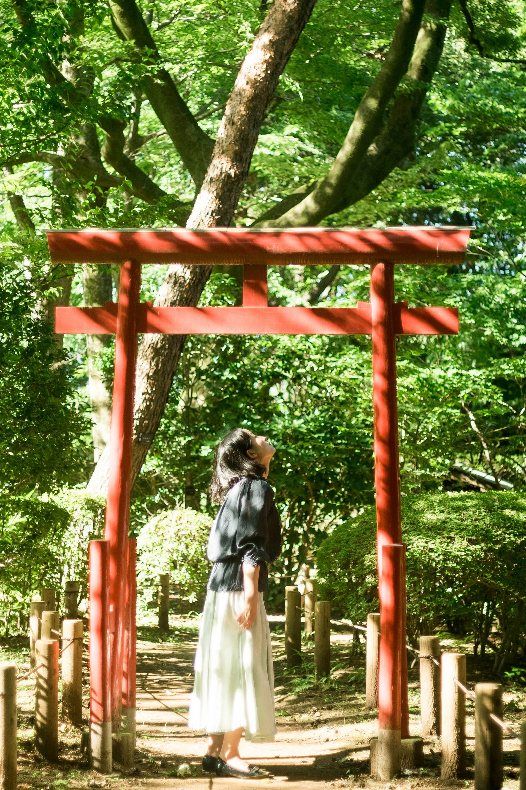
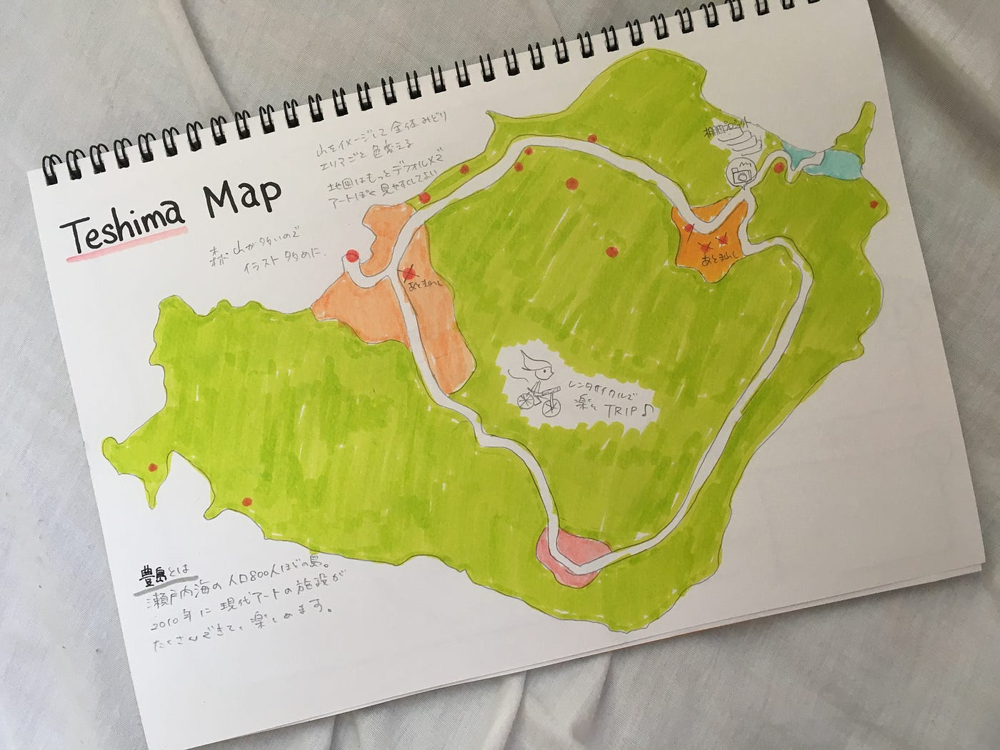

### 現代アートの小国【豊島】に行きたくなる地図づくりにTRY！

卒制テーマ進捗状況 #10

就活でなかなか旅にも出られず、夏祭りも行けなかったので地図作りの材料が集められませんでした。

### 夏祭りくらい行きたかったんですけども！！！！

まあ私の時間の使い方が悪かったんでしょうね。そして日本社会のせいもありますよ笑

ちょっとブラックな始まりになってしまいましたが、終わったことを言ってもどうにも卒制は進まないので今までで行ったことのあるエリアの地図作りにちょこっと入ってみたので報告。

おっと、その前に

木漏れ日は写真を撮ることを意識する前から好きでした。アートですよ。自然がつくりだすものは人間はつくれない。利用・活用はできますけどね。

にしてもカメラの調子がおかしい。オールドレンズとの互換性が良くない…。

どうしたものか…それでは本題に入りましょう。

### # ラフ画『豊島マップ』

去年の今頃、母と2人で青春18きっぷ旅をしました。九州に飛んで、

長崎 → 別府（大分）→ 八幡浜（愛媛）→ 松山 → 今治

→ 高松（香川）→ 豊島→ 姫路（兵庫）→ 名古屋（愛知）

と旅しました。こういう旅はもっと定期的にやりたい。今年か卒業までにもやりたい…

その途中で半日訪れた**豊島。**

島おこしとして、美術館やアート空間の家屋が島中点在している面白い島。瀬戸内にはこのような島がまだまだあるようです。（ここに関しては次回のブログで紹介予定）

全ての施設で入館料や体験料などが発生します。島のためなら、とは思いますね。

島は一日でまわりきれます。観光客はたくさん見ましたが、地元の人の姿はあまり見なかったのが印象的です。観光地となってしまった島の住人の居心地はどうなのだろう…。少女や外国人観光客とつたない英語で頑張っていたおばあちゃん、そのほかは…？

観光業や地方創生って本当に困難な領域だと思いますね。

観光地としての豊島。その地図作りをしてみました。

写真スポットや店や施設が集まっているエリアは限定されているので、はじめは1個ずつスポットを置こうと思ったのですが、マップ（上）のように中心エリアを4つにし、他黄緑色のエリアのスポットだけは1つずつ置くことにしてみました。

ちなみに黄緑にしたのは、山をイメージしたから。島の形はもっとデフォルメでデザインっぽく仕上げてもいいと思いました。

黄緑色部分（森林エリア）が多い島なので、レンタサイクルや瀬戸内レモン、オリーブ、美術館のイラストなど入れると賑やかさも増すかと！

後は配色が問題。イラストを入れてそれに色をつけるとなると、ごちゃごちゃする恐れがある。4エリアの色は必須だから黄緑を抜いてイラストを派手にするのは有り。

今回は地図の大枠について検討しました。次回は、作成した地図をどのようにサイトとして転換させるか、その設計図を書いてみます。

安藤
