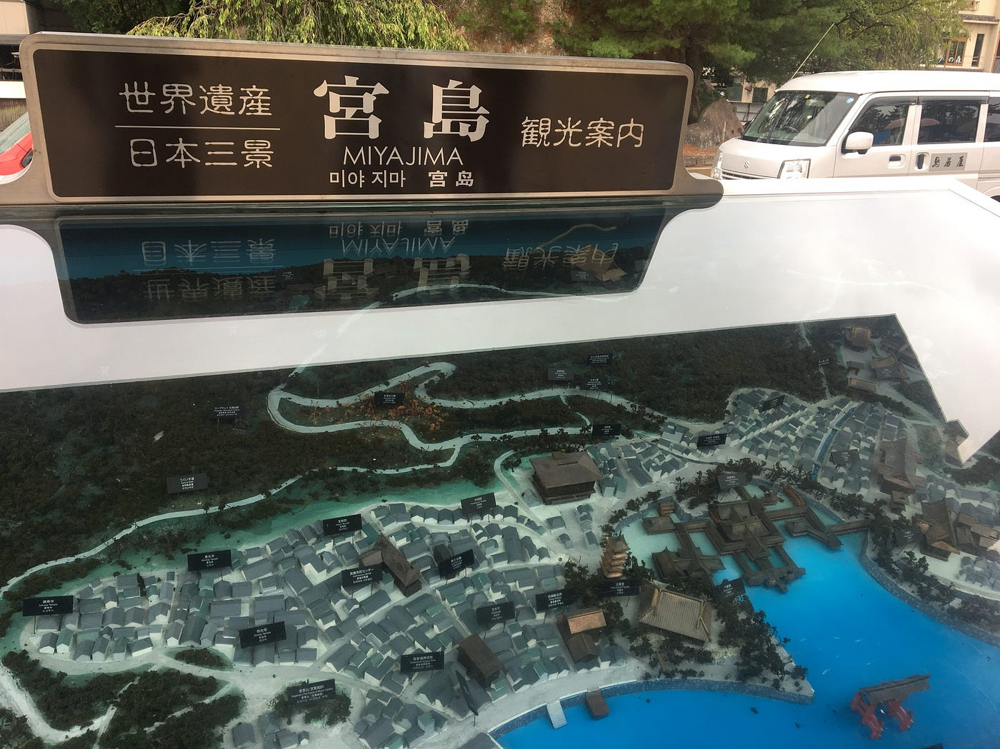
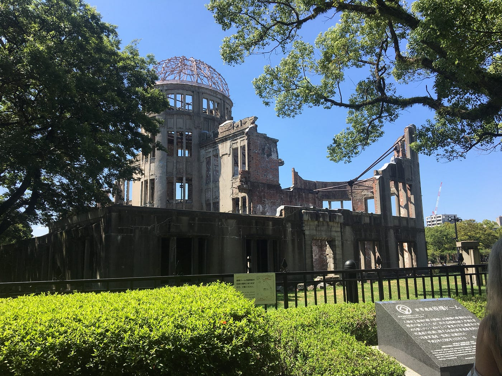
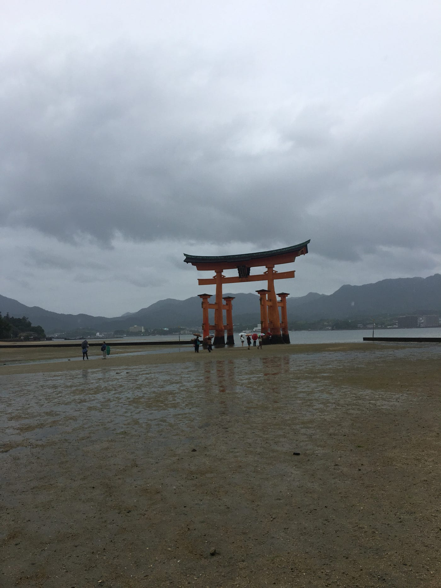
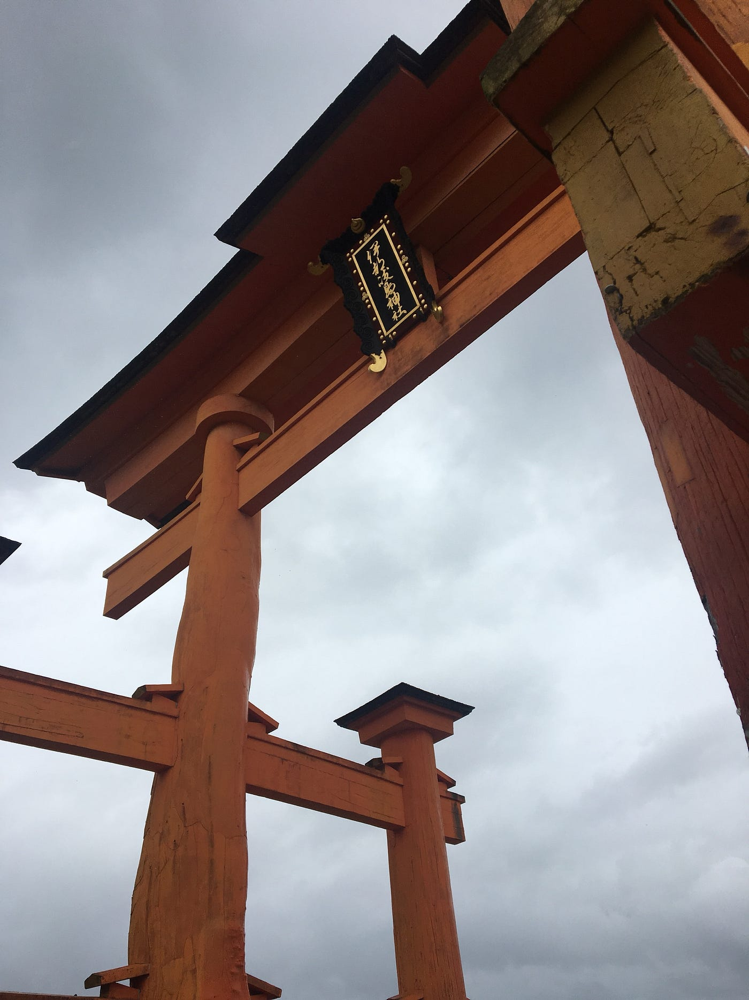
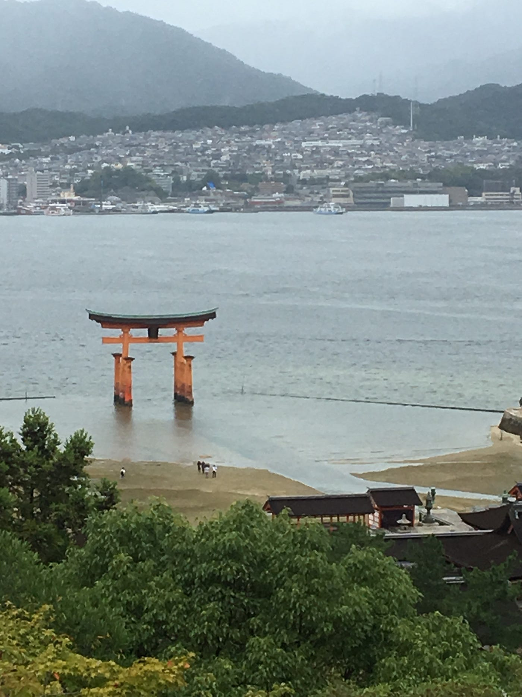
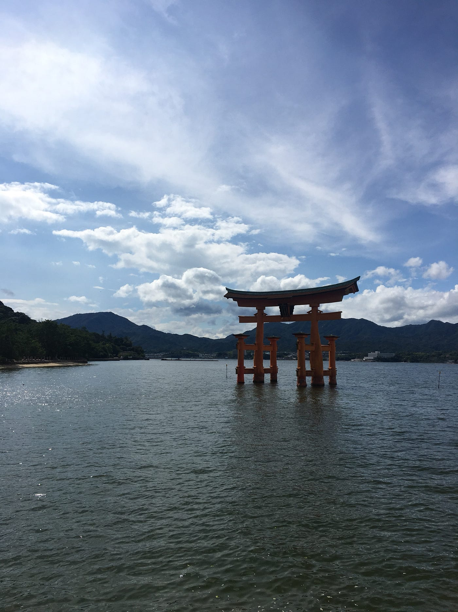

### 自由研究してる気分になった島

先週に引続き、TEDxはおやすみしてまた行ってきた広島の話をしたいと思います。

二泊三日で広島へ旅行してきた中で、今回は広島市内、また宮島と尾道に行ってきました。

広島市内で見学した原爆ドーム、平和記念公園、またその中にある資料館は不思議な気分になりました。
私は世界遺産が好きで、趣味で世界遺産検定を取っているぶん多少勉強はしていたのですが、世界遺産て勉強するほど行ってみたいという想いは強くなるんですけど一方でミーハーになりがちと言いますか、自分とは違う世界のもの見ている気分になるのです。
しかし実際に広島でこの建物や資料館を見学しその場に立ってみると、妙に実感がわくと言いますか、自分がもし1945年にこのようにここに立っていたら、全然違う環境だったと想像せざるを得なくなるのです。
不思議な気分というのは、この原爆ドーム（元は「広島県物産陳列館」）のように実際に起きた出来事が今は歴史として残っていて、自分たちはその歴史を勉強すればするほど歴史や世界遺産は実際に過去にあったものという感覚は遠のく、という当たり前のようにあるプロセスを改めて実感させられるという気分です。
自分の体は普段意識しないけどどこかに痛みを感じた時に「足」が痛い、と思うようになる、という感覚に似てる、不思議。

戦争をしてた事実を体感できる場所だったので色々感慨深く思う部分もありました。
また平和記念資料館を見学していて、広島に原爆が落とされたことや広島がいかに当時戦争の特需で栄えていたかということを記述するのはもちろん、第二次世界大戦のきっかけとして日本が最初に真珠湾を攻撃したことなどもしっかり書かれていてすごいなと感じた。
私だったらそれだけのことをされたら日本の攻撃に関しては書かないで、見学者たちに自分たちの被害だけを訴えてしまいそうだと思ったので、、、。

広島に実際に行けたことで、ニュースで日々言われている少し遠い世界のことだと思っていた北朝鮮の核ミサイルのニュースや、国境なき医師団のSNSで見る他国の戦争による被害の様子が少し身近なものに感じられました。

広島市内は小学生の日記帳のようになりましたが、
宮島では小学生の自由研究を行なっているような気持ちになりました。

宮島は島全体が世界遺産であり、中でも見所は厳島神社と大鳥居ですね。
こちら実際に潮の満ち引きで見える景色が違うという情報は知っていたのですが、実際体験して見るとすごい！

朝の10時頃に大鳥居や神社内を見学していると、このように潮がすっかり引いていて、鳥居の真下まで歩いていくことができました。

しかし少し弥山の方まで歩いている間にどんどん水位は増し、気付いた時にはこのように先ほどまで自分たちが歩いていたところにはすでに海が！！

宮島の散策の軌跡はこちら

[https://www.strava.com/activities/1817926157](https://www.strava.com/activities/1817926157)

そして午後２時頃になるとこの通り、すっかり神社も鳥居も海に浮いているような風景になりました。

すごい、自然てすごい！と興奮し、気になったので、そもそも潮の満ち引きってなんで起きるのか調べてみました。

そもそもこの潮の満ち引き現象は「潮汐（ちょうせき）」と呼ばれ、地球に関しては月の引力の影響で引き起こされているそうです。
月って引力あるんだ。
この引力と、地球が月と地球の共通の重心の周りを回転することで生じる遠心力を合わせた「起潮力」出そう。
月の引力と、地球の遠心力が反対方向に働く時に海が引っ張られて水位が上がる、反対に月と地球が垂直上にある時は水位が下がる。
この引力が、月だけでなく太陽の引力の影響も起きるので、潮の種類が変わるそう。

ちなみにこの日、９月４日は
「長潮」満潮は2:48と16:44、干潮は9:38と22:51でした。

そしてこの潮の満ち引きは様々な自然の影響を受けているので、日によって潮の水位なども違うみたい。

最後に
これ多分理科の授業で習いましたね。
いや生でみれてよかった自然ってすごい！

参考資料
[https://www.science-kido.com/single-post/tide/](https://www.science-kido.com/single-post/tide/)
[http://www.miyajima.or.jp/sp/sio.html?act=cnf](http://www.miyajima.or.jp/sp/sio.html?act=cnf)
