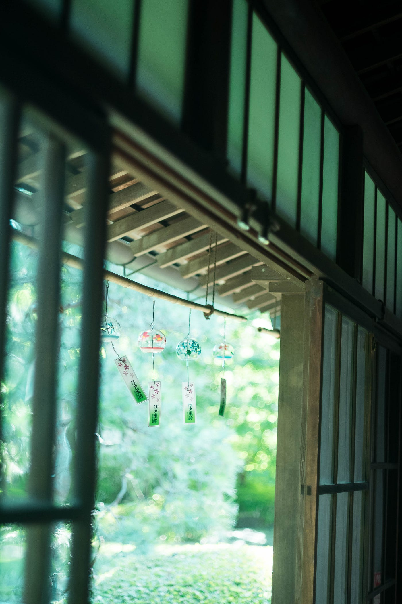
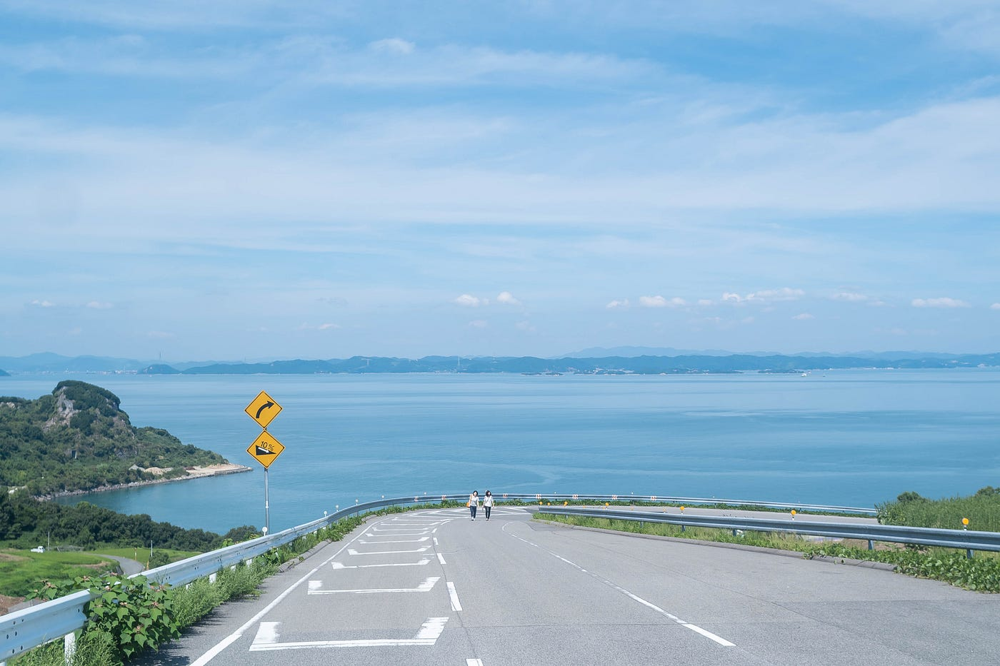

### 冒険の地図が作れそうな観光スポットは？

卒制テーマ進捗状況 #12

夏が終わる…もう9月入ったなら余韻とかいいので、さっと涼しくなって秋が始まってほしいです。季節の変わり目の妙に切ない気持ち要らない！と変な感じで。

私は普段の撮影ではFUJIFILMのX-A2というミラーレス機とNikonのフィルムカメラを使っているのですが、海撮影で水に少し浸かっちゃったり落としちゃったりしたからか調子が悪いです。修理の見積もり相談に行ったら、FUJIFILMの方はもう既に廃盤機だから修理部品があるかわからないと言われたり、古いカメラはデジタルより修理が高くつくと言われたり、貧乏に優しくない○○バシカメラさんでした…いや向こうのせいではない。

お金が貯まるまで、当分だましだまし使うしかない！！

### # 日常の中にお邪魔するのが非日常、旅の良さ

旅っていいですよね。私は去年までは月1ペースでどこかしらに旅行していました。大半が名古屋。理由、距離的にも金銭的にも行きやすいから。

さて、卒制のコンセプトをそろそろ絞っていかないといけません。

今の候補は、

- 下町＆商店街

- 関東エリアの島

- 瀬戸内海の島

- 路面電車途中下車

など、案があります。

## 下町＆商店街の場合

例えば都内の商店街と限定し、谷中銀座や戸越銀座や…たくさんあるためもっと限定する必要がありますね。そしてその周辺の店取材となると、アポ取りだけでも手間と時間がかかりまくりそう…。マップとしてはまとまりがあって、イラストの入れ方次第では楽しいものになりそう。

## 島の場合

島ならば移動範囲も少なく、店もそれほど多くない。それに加えて、フォトジェニックなスポット情報も加えられそう。関東エリアの島であれば取材数は少なすぎる。かといって瀬戸内の島となると、旅行費も滞在費もかかる。まず、遠征となるとスケジュール調整が困難。しっかり取材をする日数も必要になる。

## 路面電車途中下車の場合

近場であれば荒川線、江ノ島電鉄、そして地方の路面電車の取材が必要。となると島の方が取材はしやすい…？

やはりここは、島巡りか…？でも卒制の期限に間に合うか不安。

でも瀬戸内の島なら既に私の中では何個も候補があります。

### # 島旅マップ

ここはインスタ界では有名な豊島内の坂。森から一気に開けて海が一望できます。こういうフォトスポットを緯度経度込で紹介できたらいいのですが…

さて、まだ島取材をすると決まったわけではありませんが、今のところ把握している島候補をメモ。

- 豊島

- 小豆島

- 大久野島

- 直島

- 淡路島

- 男木島

ここまでは有名どころ。

- 犬島

- 女木島

- 下浦刈島

- 生口島

- 本島

- 粟島

- 大三島

かなりたくさんありそう。なるべくあまり知られていない島を巡る方がいいかもしれないと思いました。既に観光地として成功しているところは地図が作られているだろうし、サイトとして紹介する価値も低くなるかもしれないから。

また、取材範囲が広いコンセプトで行うのであれば、店の取材はやめ、フォトスポットのみの紹介や歴史にまつわる場所の説明をするのでも十分だと思います。

まだまだ検討は続きますが、そろそろ動き出さなければと思います。

安藤
