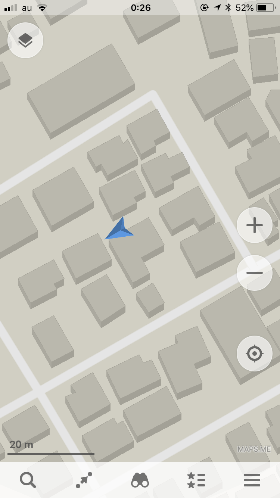
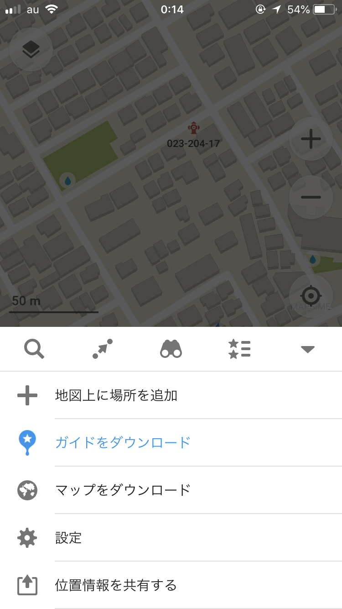
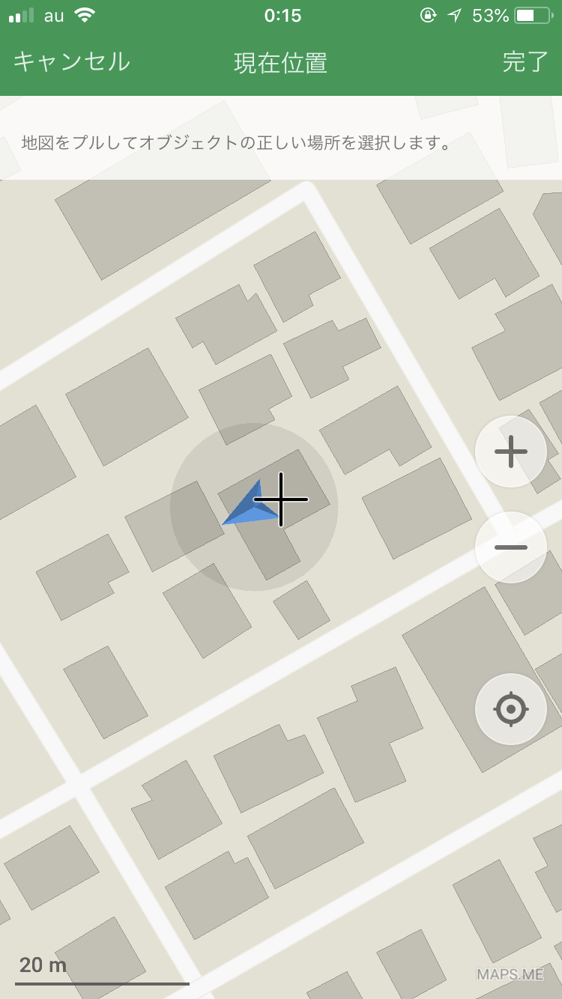

### maps.meというツール

「maps.me」とはスマートフォン用の地図の観覧用アプリ。背景地図はOpenStreetMapを使用していて、事前に特定のエリアの背景地図をオンライン時にダウンロードしておけば、オフラインでも現在位置を表示し、地図として活用することができる。

そもそもiPhoneなどのスマホには、オフライン環境とか関係なくGPS衛星の電波は受信できるわけだが、その説明は以下省略。笑

そんな便利な地図アプリ、maps.meはあまり知られていないが実は背景地図である**OpenStreetMapを編集する機能**もついている。

では具体的にどんなことができるのか。
やはり、スマホ用のアプリだから編集できるものとしては、POIデータと言われる、点(ポイント)としての情報にかぎる。

地図上にある建物を選択し、その建物が何なのかというタグ付けと、建物の名前や住所、詳細なデータを加えることができる。

つまりは、線(ライン)や面(エリア、ポリゴン)の編集はできないのである。本来はmaps.meは地図観覧用にできているため、さすがにそこまでは編集機能に特化していないみたいだ。

それではmaps.meの編集機能の紹介をする。

とまあ、こんな感じでとっても簡単なので、ぜひmaps.meの編集機能を使いこなして、海外旅行するときとか事前にこれから行くところの背景地図をいじちゃったりしてみてね〜。スマホ一つで完結するので便利よ。

すごい関係ないけど、↑この写真は去年のネパールで開催された「State of the Map Asia」という国際カンフェレンスに行った時にお会いした、maps.meのCEO、社長さん！この時はね〜LINEの使い方を教えてあげてた。笑 ヨーロッパではLINEはあまり普及してないから知らないよね普通。

以上、今回はmaps.meの紹介。

[OSMの編集ツール、もくじ
OpenStreetMapのエディタ、つまり編集ツールについて語る。
PC用のツールとスマホ用のツールの大きく分けて２パターンある。
みんなは何を使ったことがある？medium.com](https://medium.com/furuhashilab/osm%E3%81%AE%E7%B7%A8%E9%9B%86%E3%83%84%E3%83%BC%E3%83%AB-%E3%82%82%E3%81%8F%E3%81%98-b47d3410fe4f)

次回はこのもくじにのっとり、Pushpinの紹介！と言いたいけどPushpinは開発者側がメンテナンスをやめてしまい、今のiOSに対応していないためひらけない。ゆえにMapillaryの紹介する。

それではまた来週〜。
