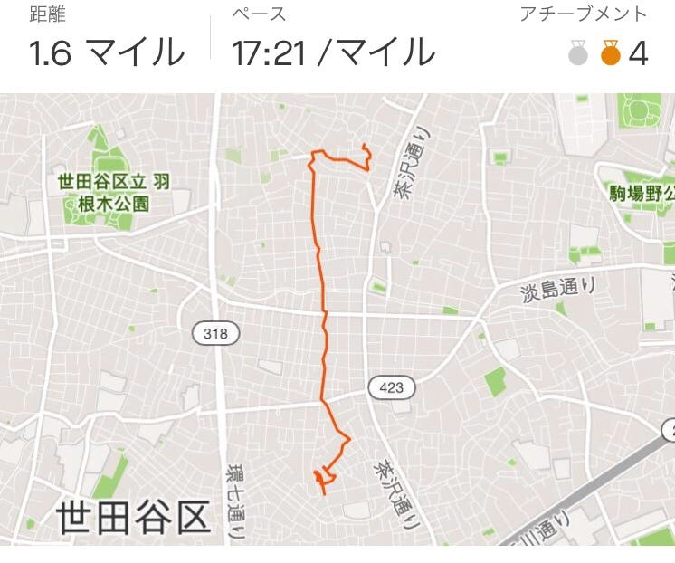
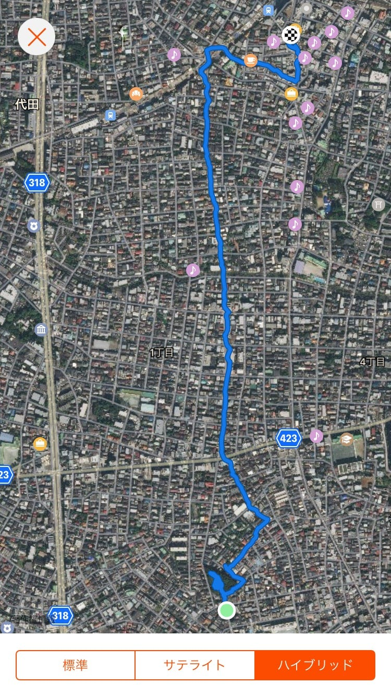
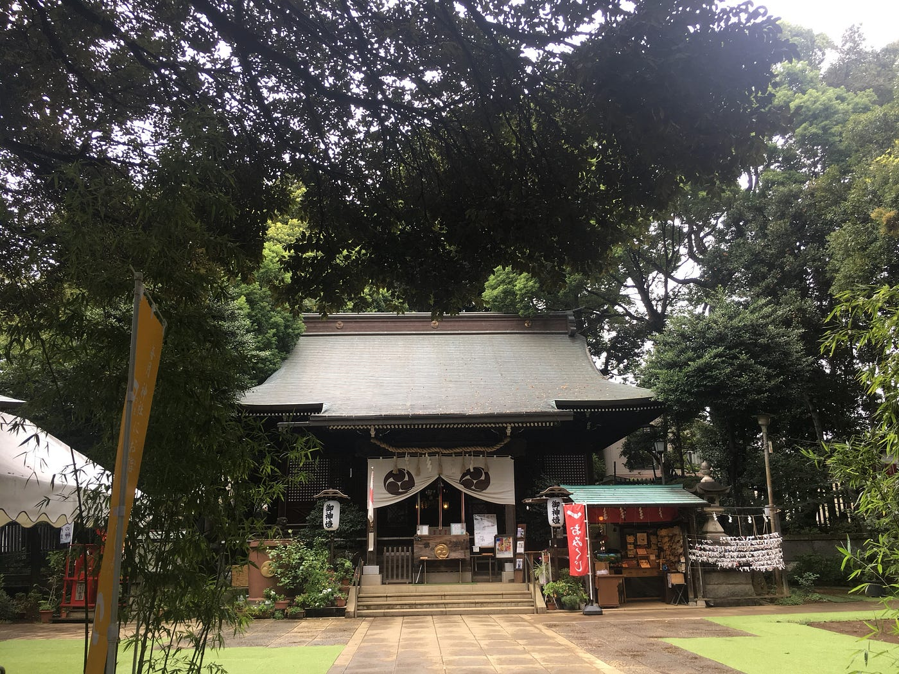
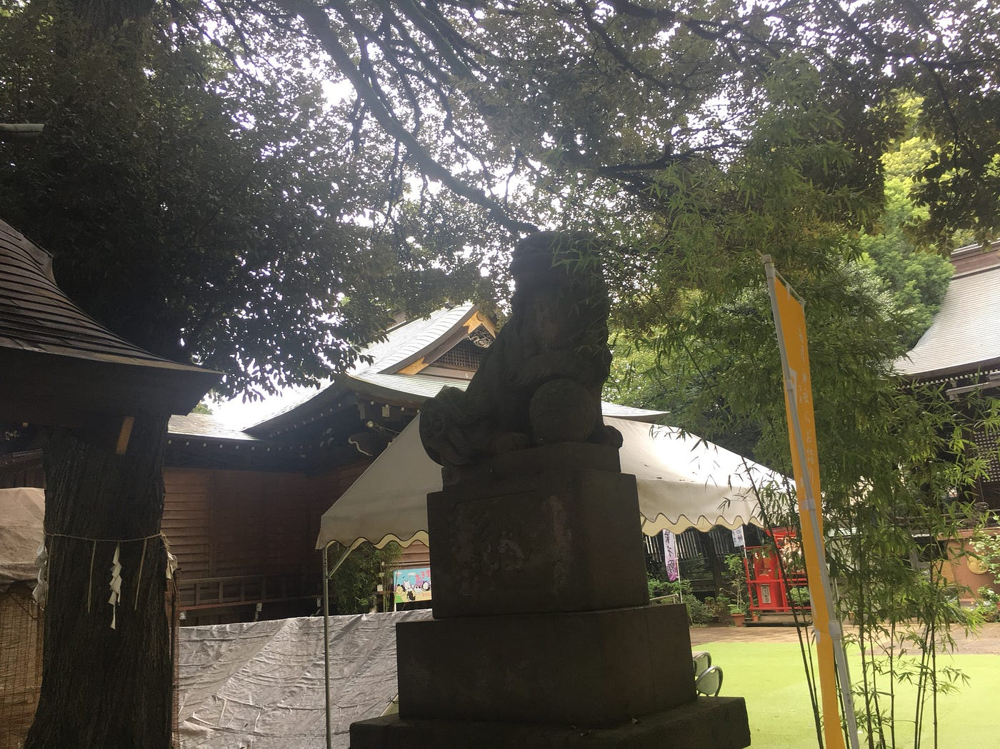
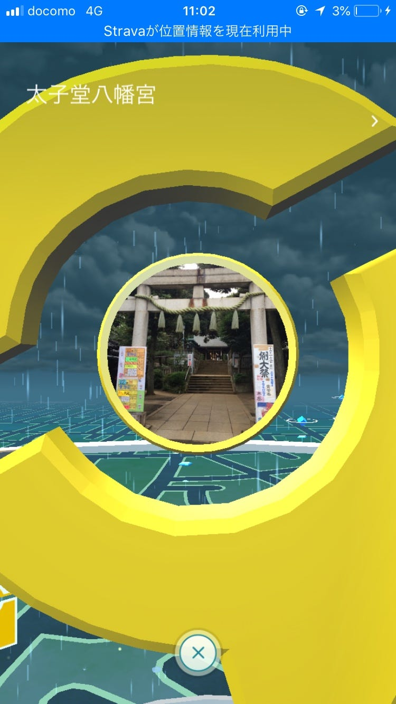

### **三軒茶屋〜下北沢まで歩いた話。**

先日、三軒茶屋から下北沢まで歩いてみました。

ストラバ記録🔽

時間にしておよそ４０分。

三軒茶屋から下北沢までは坂道(上り坂)が多く、

とっても大変でした…。

三軒茶屋は、昔、交通の要所であり、

旅人の休憩地として茶屋や酒屋が並び、栄えていたそうです。

三軒茶屋の名前の由来としては、

しがらき・角屋・田中屋という3軒の茶屋があったこと。

この茶屋が町のシンボルだったのでしょうか。気になります。

ーーーーーー

ウォーキングの途中では、

うさぎや鳥がいるお寺を通りかかって、お参りが出来たり、ポケモンGOを開いたり。

太子堂八幡宮。

ここはジムでしたー！(色違いのギャラドスがいた。)

普段は歩くことのない道を歩いて、いろいろな発見がありました。

近々、途中下車の旅とか路線バスの旅とかやってみたいので、誰か付き合ってくださーい！！笑
