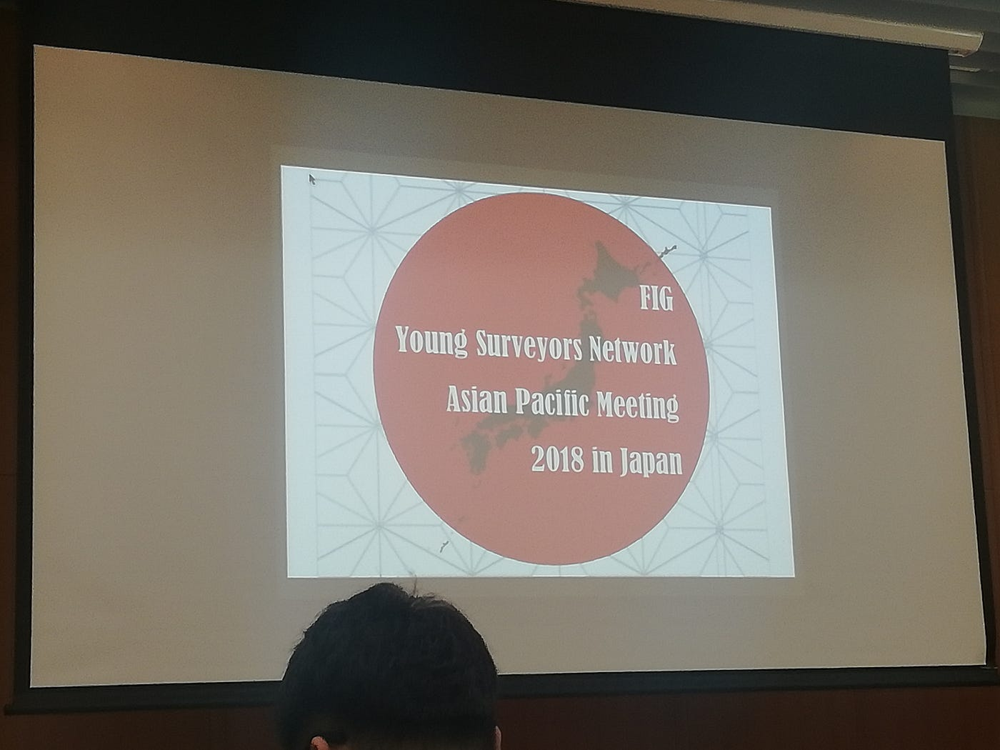
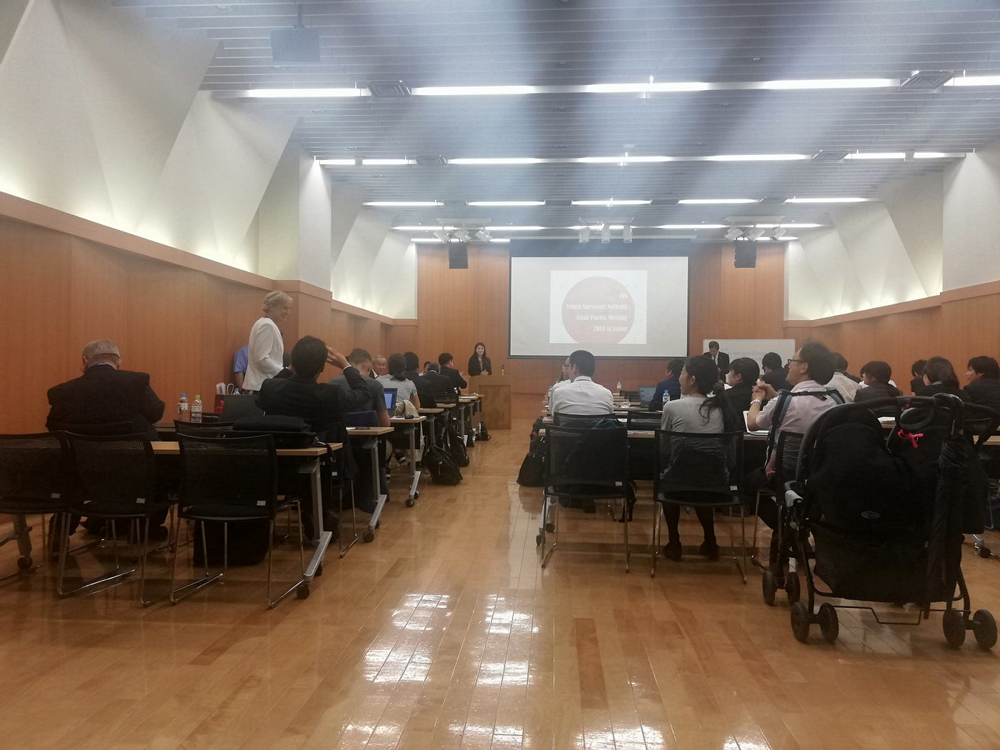
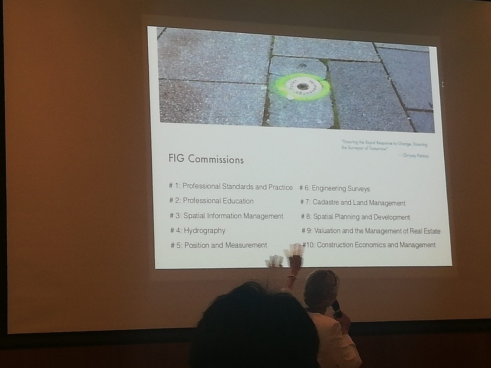
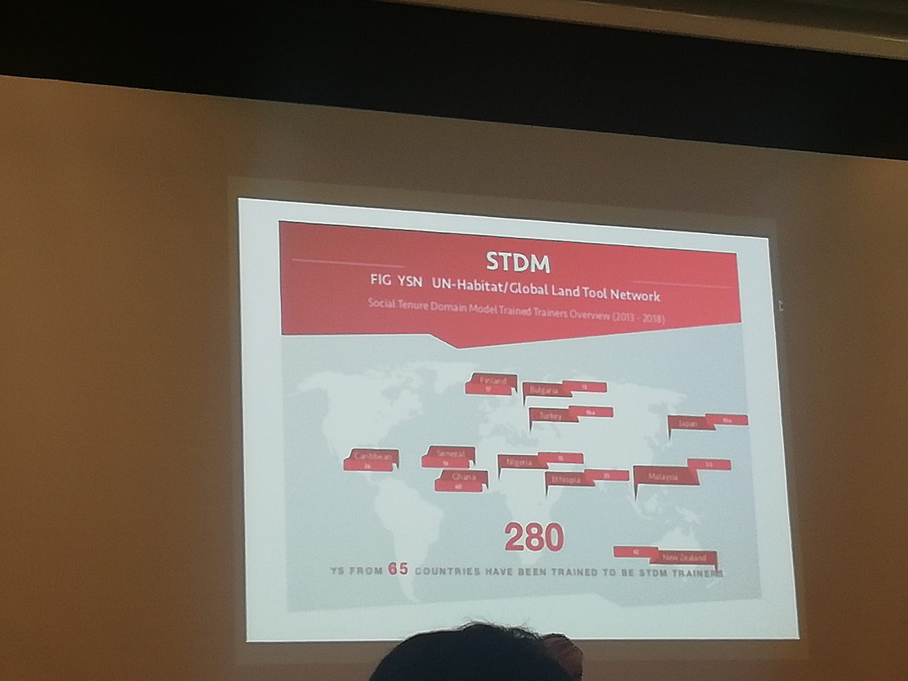
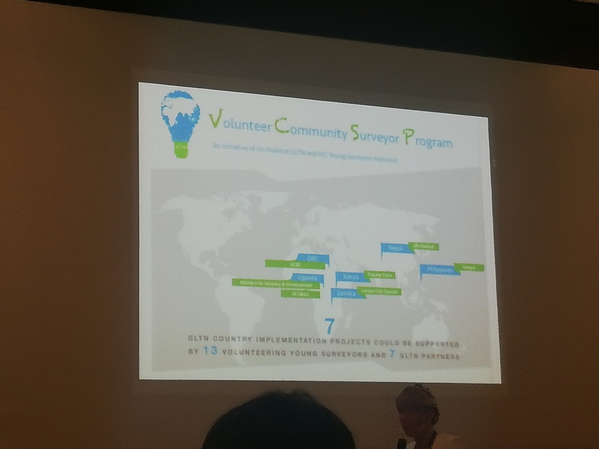
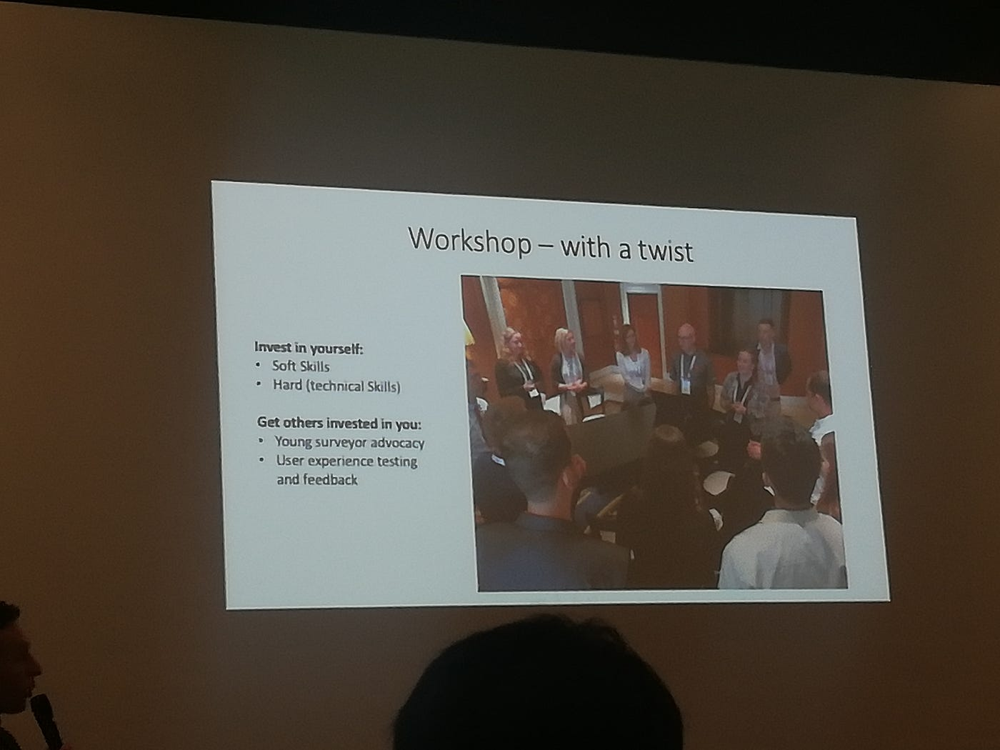
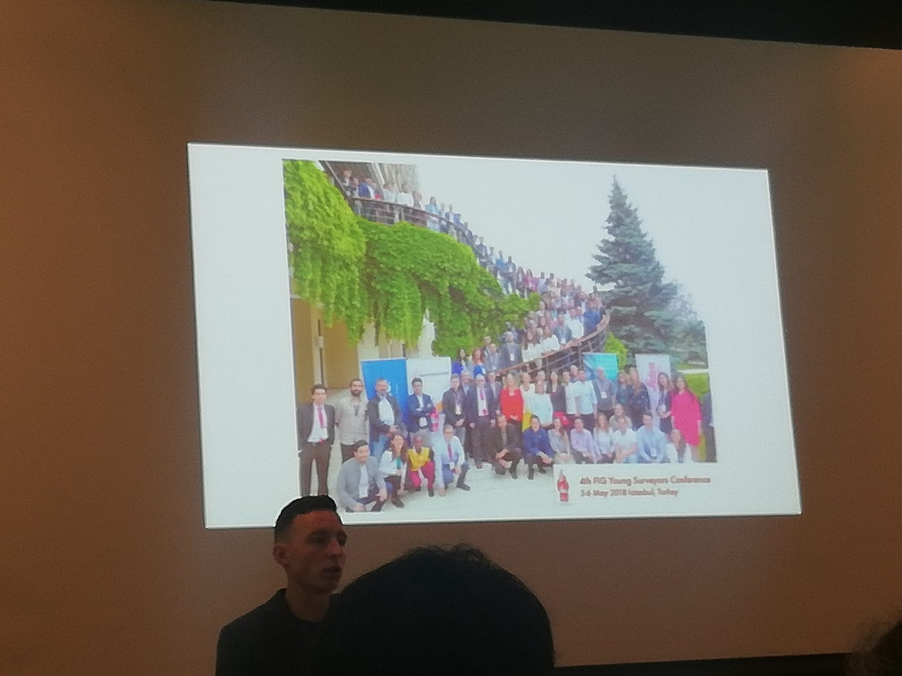

### FIG Young Surveyors Network Asian Pacific Meeting 2018 in Japan 1日目レポ

皆さんこんにちは！３年の渡邊 一晴です。今回はFIG Young Surveyors Networkによって開かれた国際カンファレンスに参加してきました。今回初の日本での開催で、日本の測量士や若手調査員の水準はとても高いそうです。開催された場所は青山学院Astudioで、古橋ゼミの我々は受付や会場の整理などを行いました。

会場には３０～４０人ほどの人が来ており、外国人は３割くらいでした。様々な国の人が参加しており、私が話した外国人は韓国とネパールの方でした。

私が今回レポートするのは、１日目の１０：３０～１１：３０に行われた**FIG Young Surveyors Network Volunteer Community Surveyor Program**です。

ここではまず、FIGの１０の責務について話されていました。スピーチは終始英語で、聴き取れない部分が多くありましたが、主に若手に対する調査の教育について話していました。

世界中で活動が行われおり、スライドでは訓練が行われている場所などがピックアップされています。

ワークショップの様子なども映された。様々な国の多くの人が参加していることが分かりました。

途中、Eva-Mariaさんという金髪の女性の方が会場の人に質疑応答を始めたので、自分が当てられないかヒヤヒヤしました。日本人が固い英語で応答しているのを見て、英語での質疑応答はとてもハードルの高いものに見えましたが、とにかく話す姿勢を見せることが大事だと感じました。
