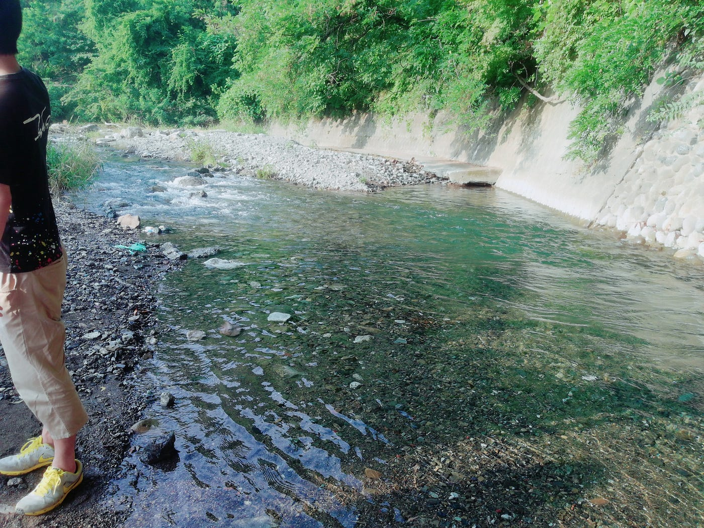
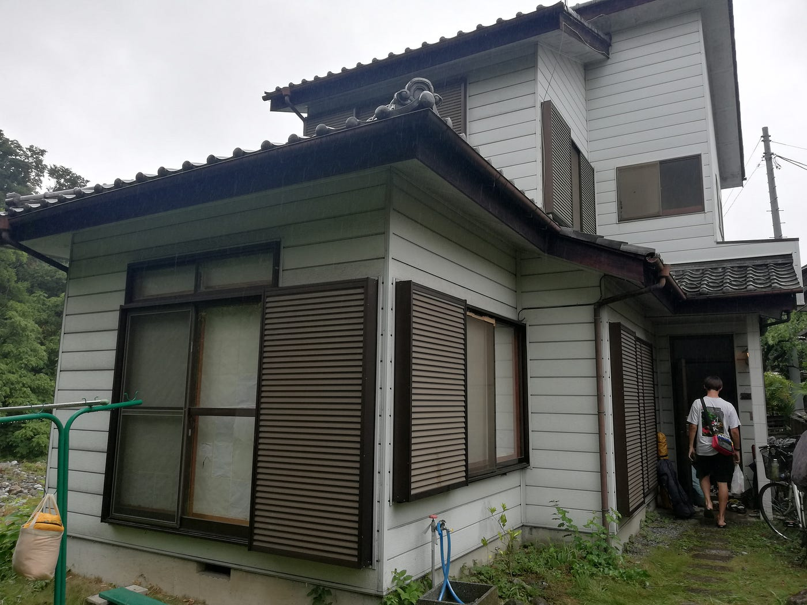
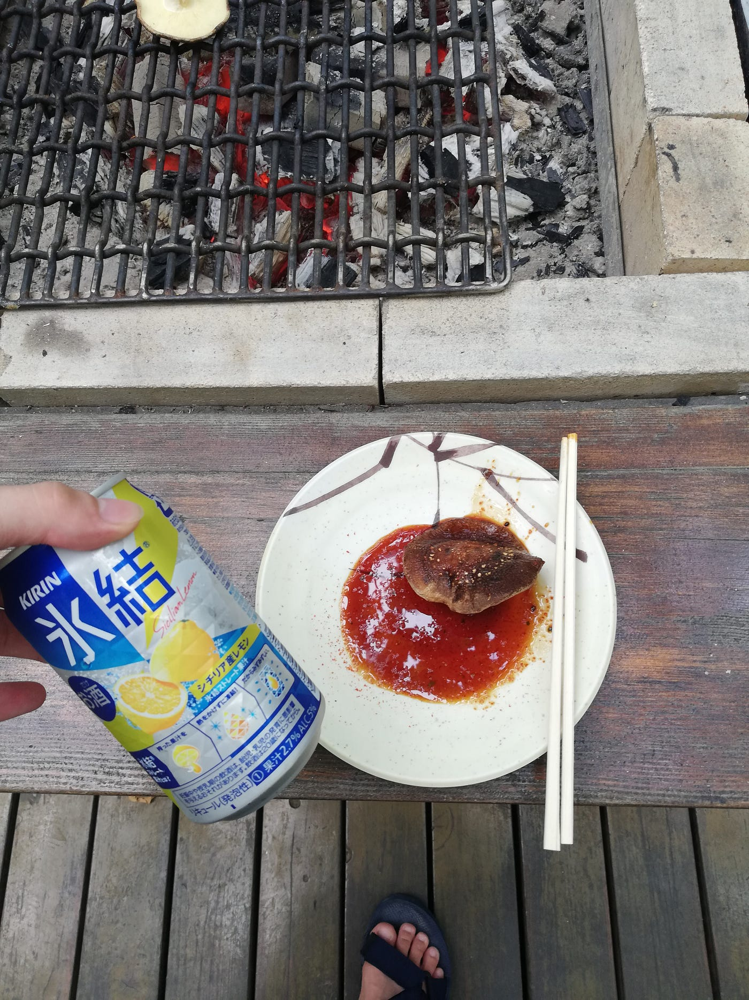
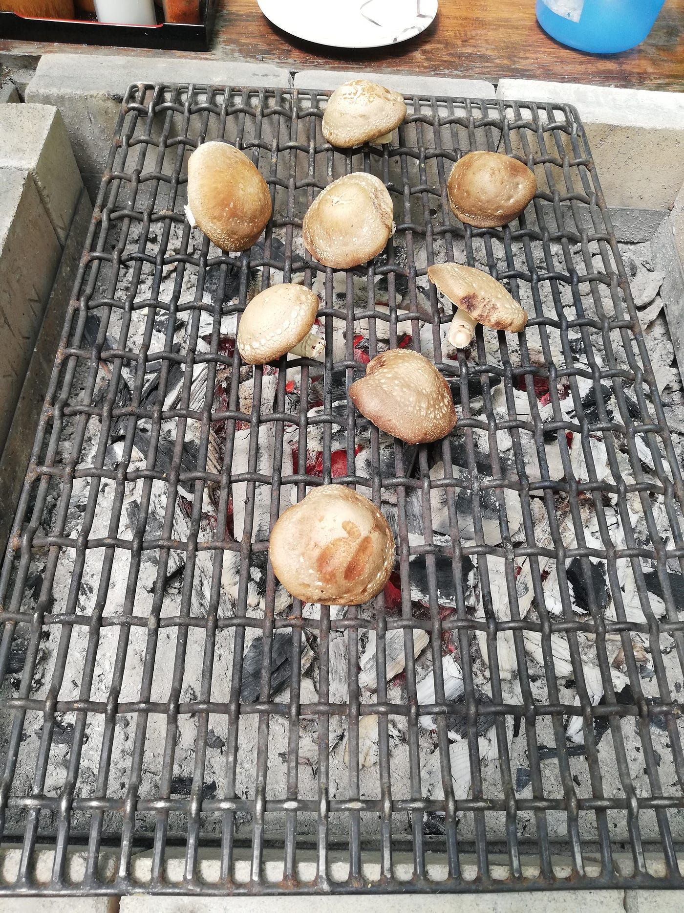
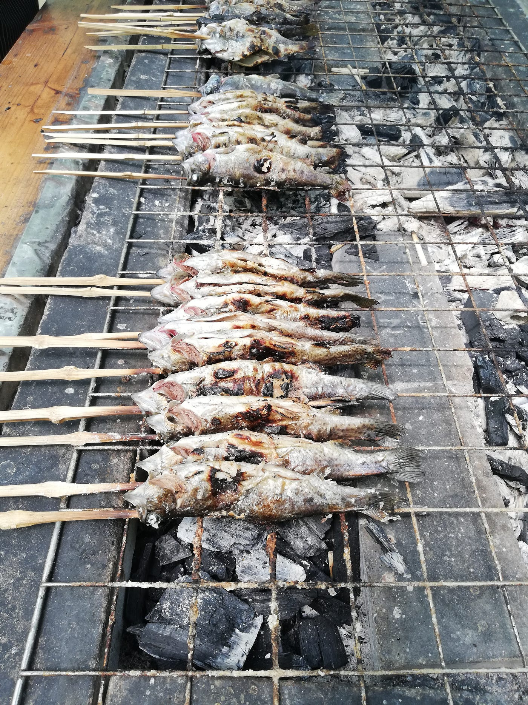
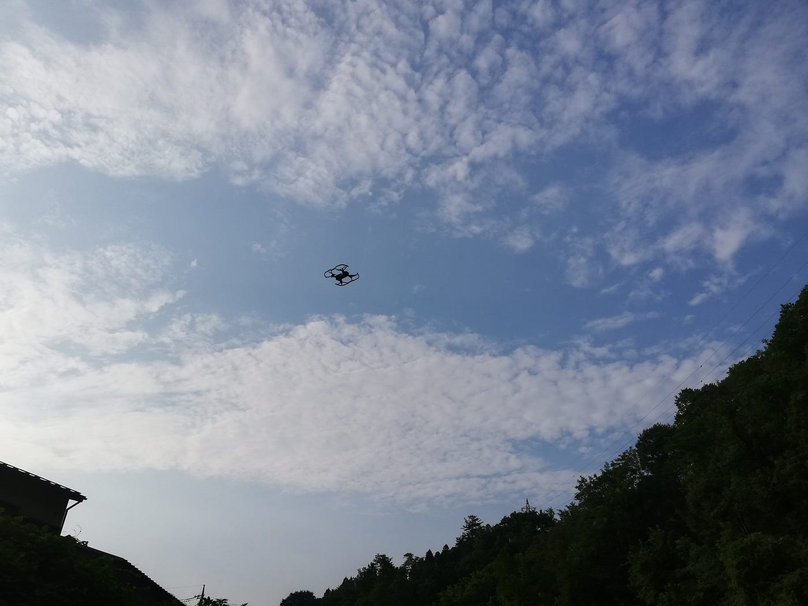
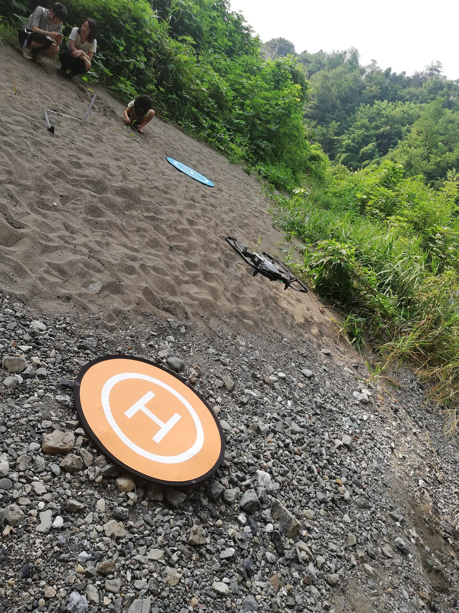
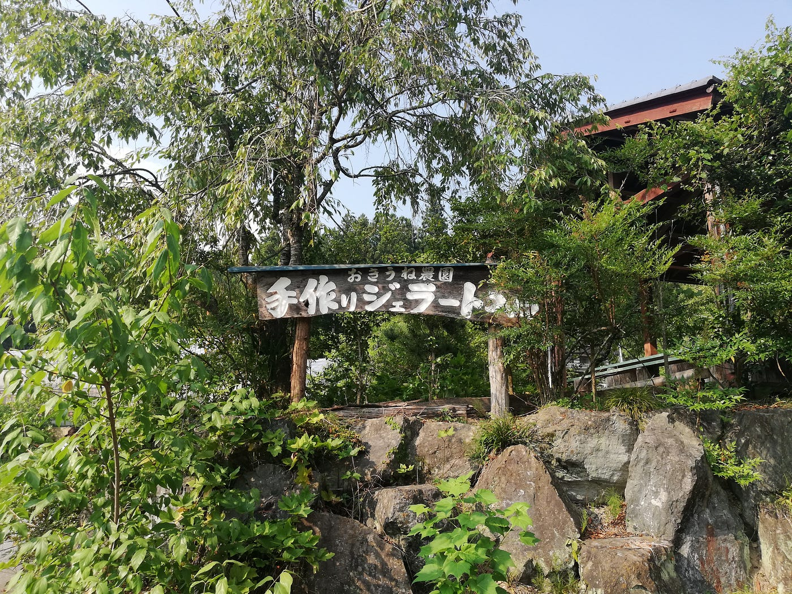
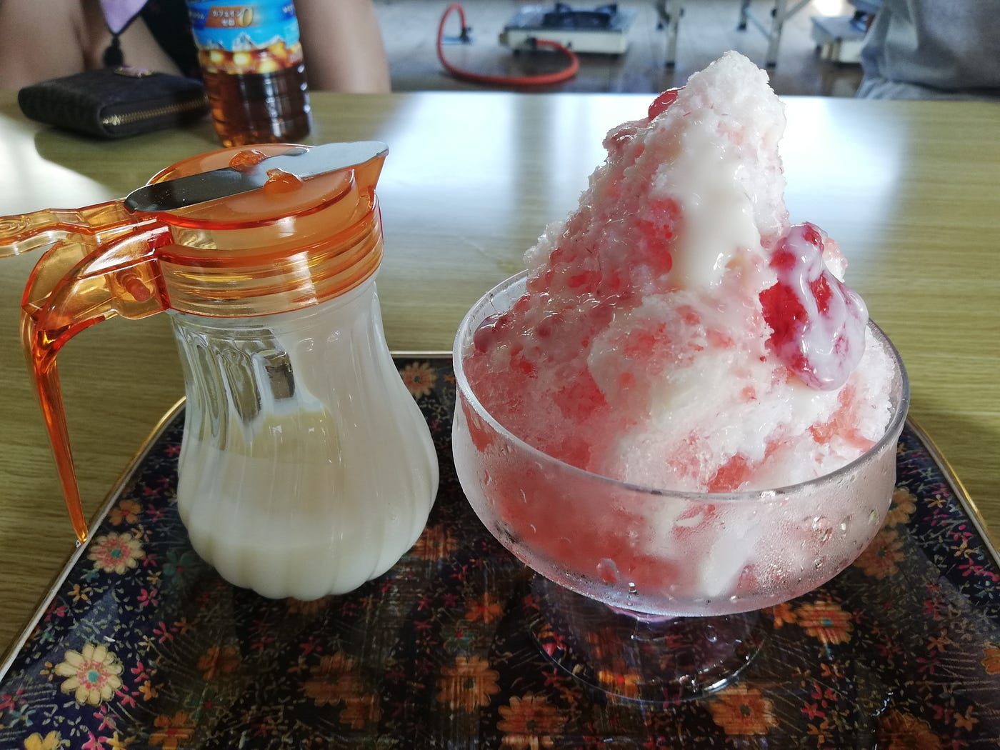
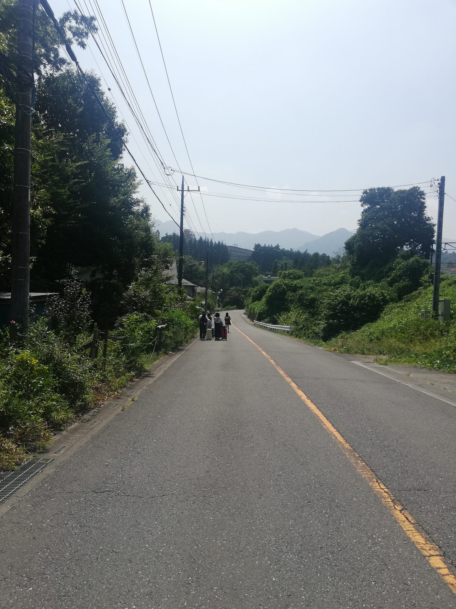

### ひたすら川で夏を感じていた合宿。

とても澄んだ川で自然を感じさせてくれます。

あ、どうもみなさんこんにちは、古橋ゼミ3年の渡邊一晴です。

この夏に秩父にある古橋邸にてキャンプゼミ合宿を行いました。

何故か肝心のキャンプの写真を取り忘れ…(T_T)

合宿では主にstravaやmappillary、ingresを使ったフィールドワークを行いました。実際に足を使って地理情報を構築していくことを学習しました。

[古橋ゼミ合宿 — BRIGHT SUNLIGHT’s 63.3 km run
Bright S. ran 63.3 km on Aug 5, 2018.www.strava.com](https://www.strava.com/activities/1761072337)

[Japan, image by isseiwatanabe
Mapillary — Street-level imagery, powered by collaboration and computer visionwww.mapillary.com](https://www.mapillary.com/map/im/7Li7fHjZSpIJJScHDi1EIQ)

フィールドワークの途中でレジャー農園に寄りました。

真夏の中、課題を終わらせシイタケつまみに飲む氷結はたまりませんでした。

後はドローンの操作学習。

高度を安定して操作出来るのは凄いですね、技術の進歩を感じさせてくれます、操作も比較的簡単でした。

とにかく夏を満喫しながら学習しました。練乳苺かき氷、夏ですね最高ですね。

アスファルトの熱と日光に挟まれながら夏バテと戦い抜いた合宿でしたが、とても楽しかったです。
