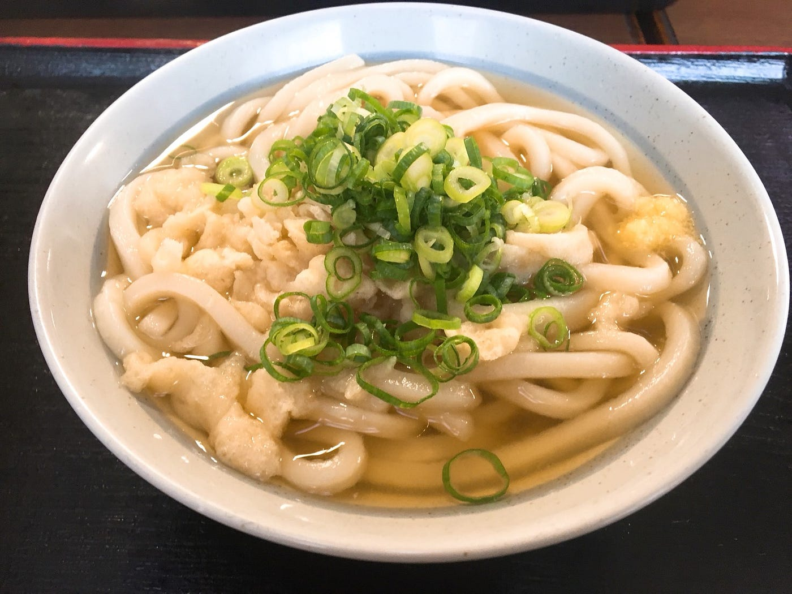

### 香川うどん旅

渡辺ゆうなです。

8/31~9/2まで 香川高松→岡山倉敷→広島大久野島（うさぎ島）に行ってきました！

私はラーメンも大好きなんですけどうどんもめちゃくちゃすきなので、夢であった『香川でうどんを嫌になるまで食べる』を叶えてきました笑

でも私の胃のキャパが追いつかず、合計７杯しか食べれなかったのでちょっと自分にがっかり・・・

香川の旅で思ったこと

いつかの古橋ゼミの合宿で、古橋さんから、

土地が低いところでは田んぼが作りやすいので稲が育つ→米が有名になりやすい

土地が高いところでは田んぼは作りづらい→小麦が育つ→麺が有名になりやすい

というお話を伺いました。１年ぐらい前の話なのでその時は「そうなんだ〜」ぐらいに聞いていたのですが

実際麺が有名な香川に行ってみて思ったのは、麺が有名なのに周りは米のたんぼばっかり！！！！だったことです。意外でした笑

じゃあ、なぜ香川ではうどんがこんなにも流行ったんだろうと思って調べて見ると・・・・

うどんの原料となる小麦は 水が少なく温暖な機構のところで育ちやすいそうです。四国山地と中国山地に囲まれた香川県民が、雨が少ない水不足と上手に付き合ってきた結果、小麦作りが盛んになったそう。

また、香川県は瀬戸内海に面しており、比較的簡単に塩を作れる環境がありました。事実、塩田開発で有名な久米栄左衛門の話も香川県のものですね。

また、小麦は醤油の原料にもなるため、「より小麦をおいしく食べるために」考えられたのがうどんだそうです。

また、醤油は江戸時代当初は都心でしか作られていませんでしたが、（醸造技術が難しかったため）香川県は塩で都心との交流を盛んにしていたため、製塩技術も早く取り込み、醤油の製造をしていたと言われています。

これらは一説にすぎないので全てが正しいわけではないと思いますが、だいたいこんなかんじらしい！こんな歴史があったんだなあ〜って思いながら食べてました笑
