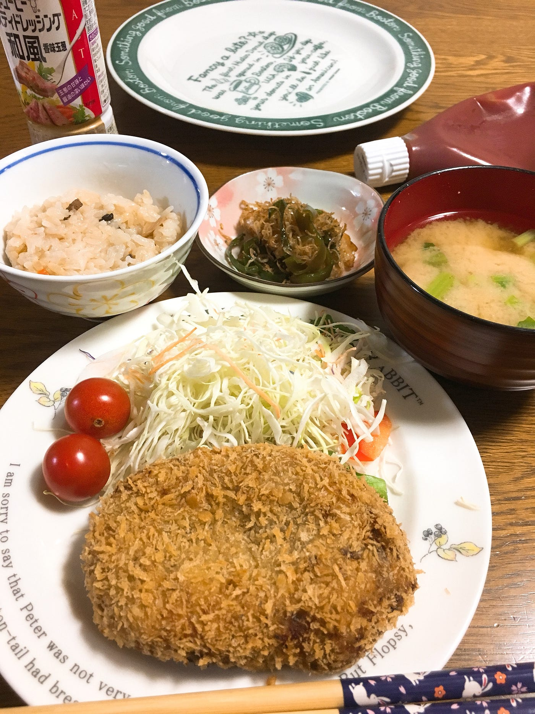

閑話

夏休みに入って更新が遅れ気味になりました。夏休みも終わって、これからは毎週更新していこうと再決心をしたところです。まだ1週分の更新残っているんですけど…

さてこの2週間なにをしていたかというと、実家で母の代わりに家事してました。

外に出ても田舎なので買い物は全て車移動、そもそもほぼ家から出なかったので、全くと言っていいほど位置ゲーしてません。

ゲームに限った話ではないのですが、何やるにも根気が要るなぁとしみじみ感じてました。

ところで、そんなど田舎滋賀県ではポケコインが貯まります。なかなかジム突破されないので、都会に比べるとかなり貯まります。

ジムまでの道のりが遠いので実際にポケモンを置いたのは2回ほどでしたが、100コイン貯まりました。2匹とも50コインずつ稼いでくるなんて都会ではないですよね〜。

ただ、レイドバトルに関してはそれがマイナスに働いていて、なかなか人が集まりません。

駅だとある程度人は集まります。が、イオンモールではあまり集まりませんでした。時間帯もあるとは思うのですが、それにしても「この人だかりは…！」みたいなことがありませんでした。

ファイヤーが3匹もいたのに残念です。

イオンモール自体、琵琶湖のほとりにあって、最寄駅から車で15分はかかるので人が集まらないわけもわからなくはないです。

知人から聞いた話ですが、ミュウツーのレイドバトルのときはそこそこ人が集まっていたそうです。ミュウツー効果ですね。

都会より人の通りは少ないし、周りは田んぼだったり畑だったり、日中歩いているのは主婦かおばあちゃんおじいちゃん、夕方になると小中高生がちらほらという環境なので、位置ゲーするには田舎の方が適しているような気がしました。

スマホ見ながら歩いてて、あぜ道で躓いてこけそうになることはあっても人にぶつかることはないです。

都会でよくいる当たり屋みたいなのもいないし、舌打ちされることもないし、車と横断歩道と自転車とその辺の石コロに気をつけていれば楽しくポケモンゲットできます。

ポケストップ格差やマップ上に自分の家がない！とかいうクレームもありましたが、私が住んでいる滋賀県草津市は格差もそこまで感じませんし、マップはバッチリでした。人がいないだけで。

京都は言わずもがなですね。さすが京都様。琵琶湖疏水もポケストップもしっかり押さえてます。

鳥取県米子市は人もジムもポケストップもあまり見当たりませんでしたが、米子駅周辺、三朝温泉周辺、あとうちのおばあちゃん家周辺のマップはしっかり入っていました。

そういえば、羽合海岸の方にいくつかポケストップ申請出せば通るのでは？というような建造物がありました。

ポケストップがたくさんあるという鳥取砂丘や、コナンロードや水木しげるロードの方はどうなっているのかが気になりましたが宿からかなり遠かったので見に行けませんでした。残念。

広島県広島市の所謂市内にはそこら中にポケストップが立っていましたし、マップもバッチリです。路面電車に乗りながらくるくる回してきました。

数年前の土砂災害の影響か、市内から外れた可部の方もマップバッチリ入ってました！

ポケストップもジムも、家から歩いてすぐの公園にあって、こんな山の上にもあるなんて……！と嬉しくなってしまいました。

そんな感じで夏休みが過ぎて行きました。

神奈川、滋賀、京都、広島、鳥取と今年も帰省という名のもとで旅してきました。しばらくはもう淵野辺でのんびり過ごしたい気分です。

さて、閑話休題としましょう。

次回はこちらの論文を見ていきます。

https://ipsj.ixsq.nii.ac.jp/ej/index.php?action=pages_view_main&active_action=repository_action_common_download&item_id=85935&item_no=1&attribute_id=1&file_no=1&page_id=13&block_id=8
