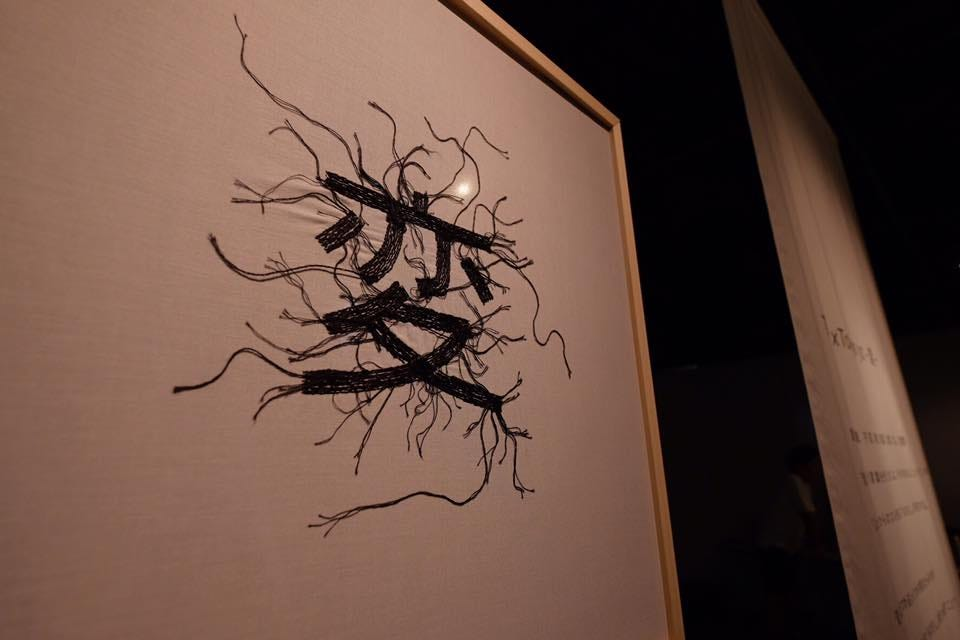
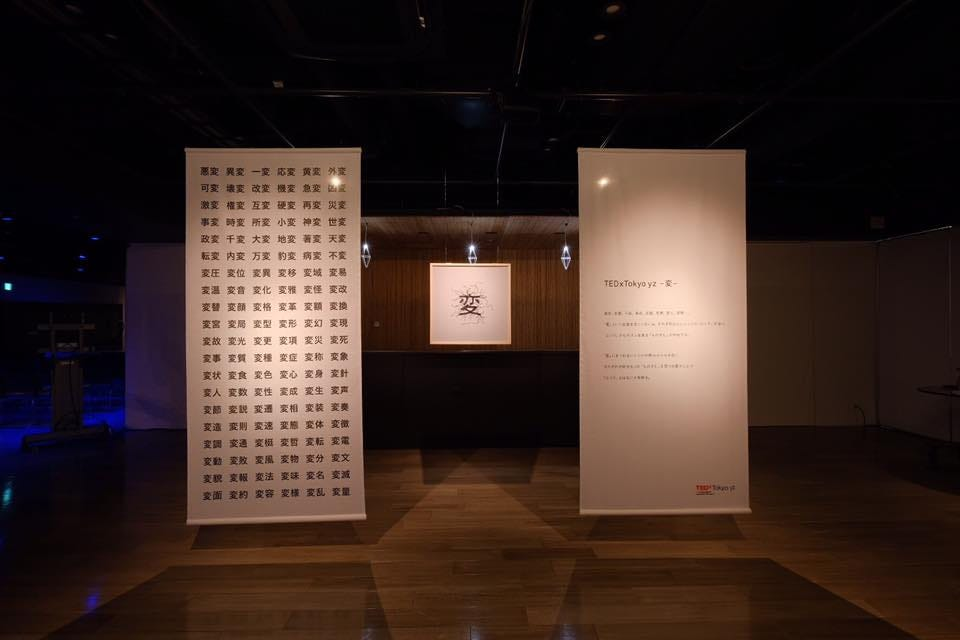

### TEDx 紹介第７弾

今回はTEDxTokyo から派生したTEDxTokyo yzを紹介したいと思います。

TEDxTokyo yzとは、TEDxTokyoにいたメンバーのみなさんがもともと立ち上げたものです。
面白いアイディアを持った若者たちを取り上げていくことを主としています。
そんなyzからは、今活躍している人々が何人も過去にこのyzで登壇したことがあったりします。

過去に登壇している人々の動画例はこちら

[https://www.youtube.com/watch?v=V87zdzSk4ls](https://www.youtube.com/watch?v=V87zdzSk4ls)

一つ目がアスタジオで開催された際にご登壇された株式会社ギークスの山崎さん

二つ目が今メディアアーティストとして有名な落合さん

このようにイベントごとに面白い若者を発掘しています。そんなメンバーのみなさんも面白い人たちばかりでした。

というのも、2017年８月５日に渋谷キャストで開催されたイベントには私もメンバーとして参加させてもらい、実際にイベント作りのノウハウをメンバーのみなさんから教わったからです。

昨年開催されたイベントのテーマは「変」。

「変」の物差しは人それぞれであり、普段は考えることのないその物差しを改めて考える機会にしてみよう、というコンセプトです。

このテーマを聞いた時ふと、
私の高校の友人は少し頭のいい変な人たちばかりだったのですが、みんな口を揃えて自分だけは普通だと言い張るな、というのを思い出し、普通や変の基準って人それぞれなんだな、とか考えていたことを思い出しました。

スピーカーのみなさんもテーマに合わせて面白い変な人ばかりでした。
しかしみなさんそれぞれに自分の生き方を持っていてかっこいいなとも同時に思いました。

スピーカーのみなさんの詳細はこちら

[TEDxTokyo yz
TEDxTokyo yz is a community of entrepreneurial and innovative young doers in the Tokyo area, dedicated to making a…www.tedxtokyoyz.com](http://www.tedxtokyoyz.com/speakers/)

実際に参加させていただいて学んだこともたくさんあります。
何より、積極性とホウレンソウの大切さです。
イベントでも部活動でもなんでも、自分が楽しいと思える瞬間を感じるのは、ある程度そのコミュニティの中で自分の役割がある時なんだなと気づかされました。

今後の予定はまだ決まっていないようですが、
もしまた機会があればぜひ参加させていただきたいです。
