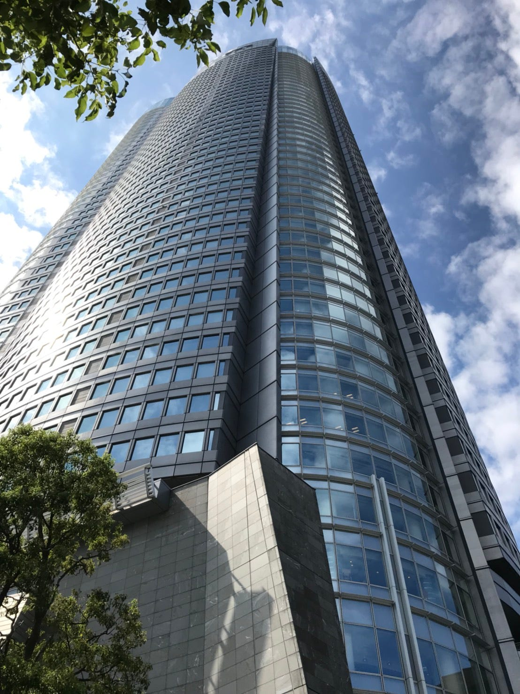
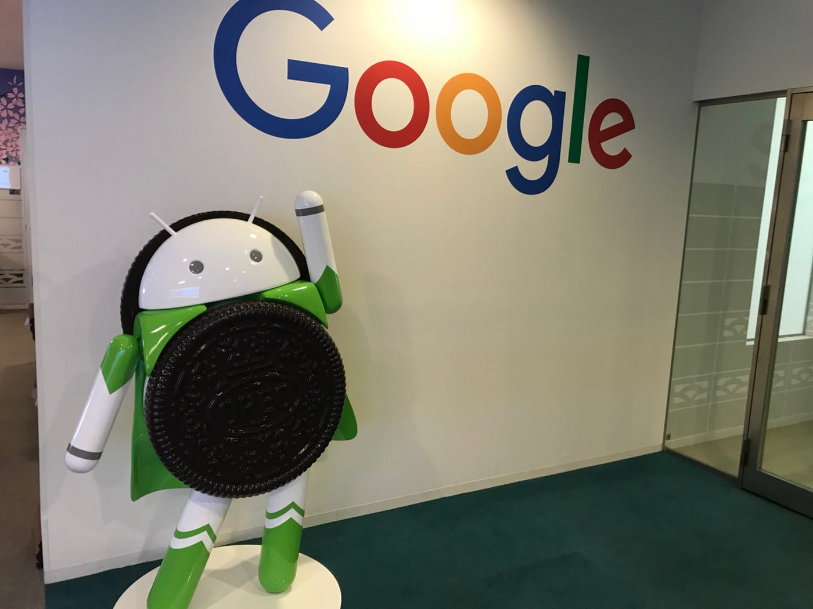
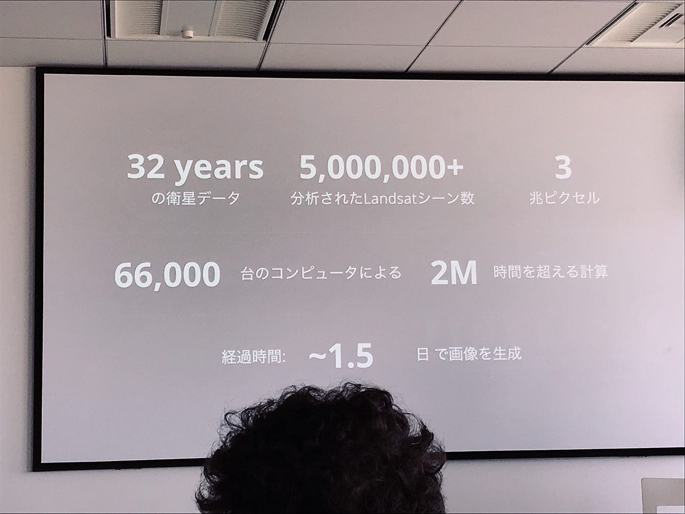
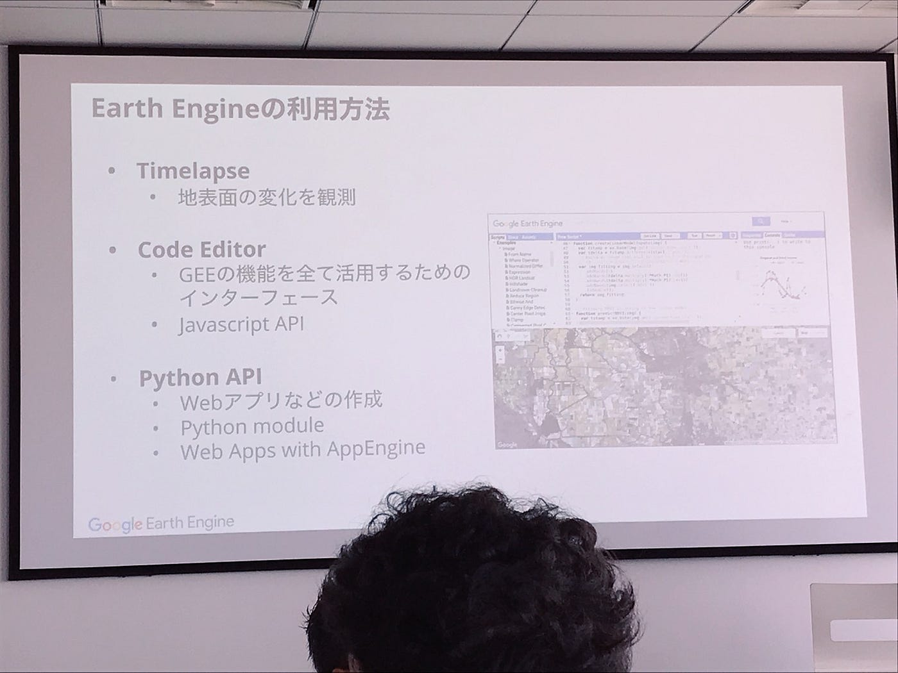
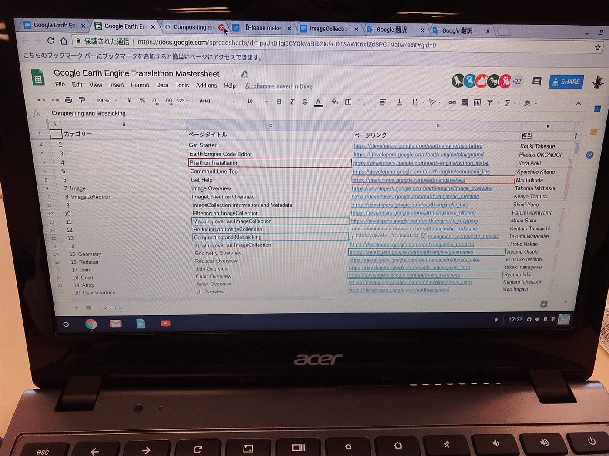
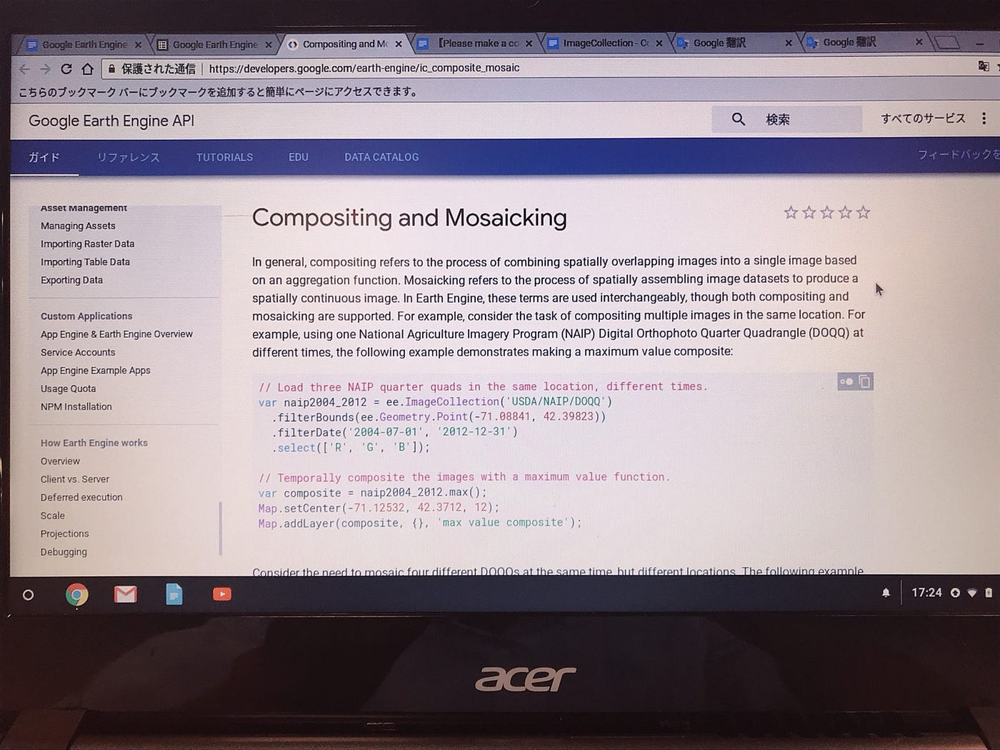
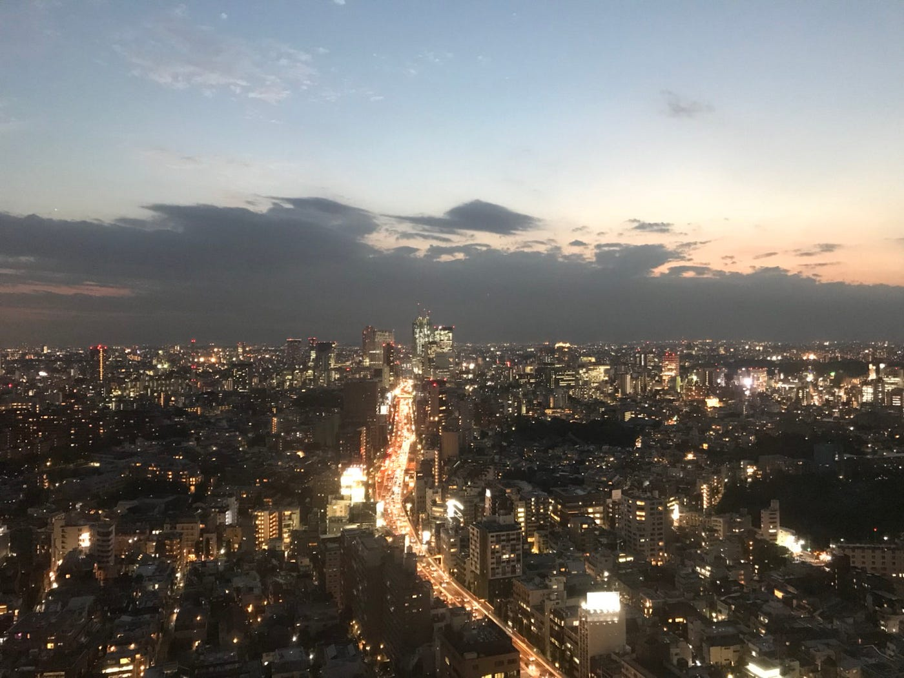
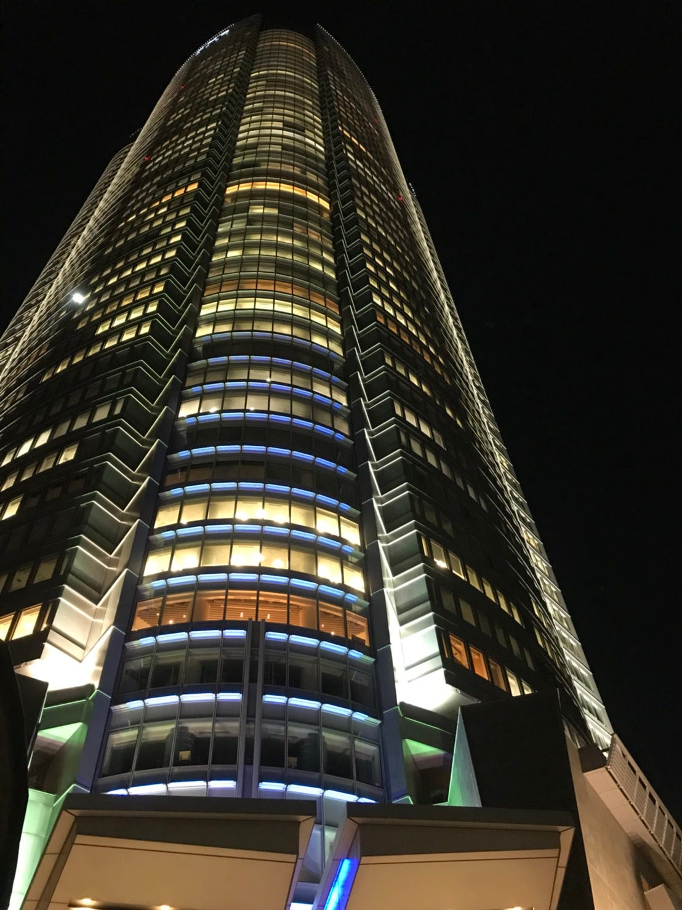
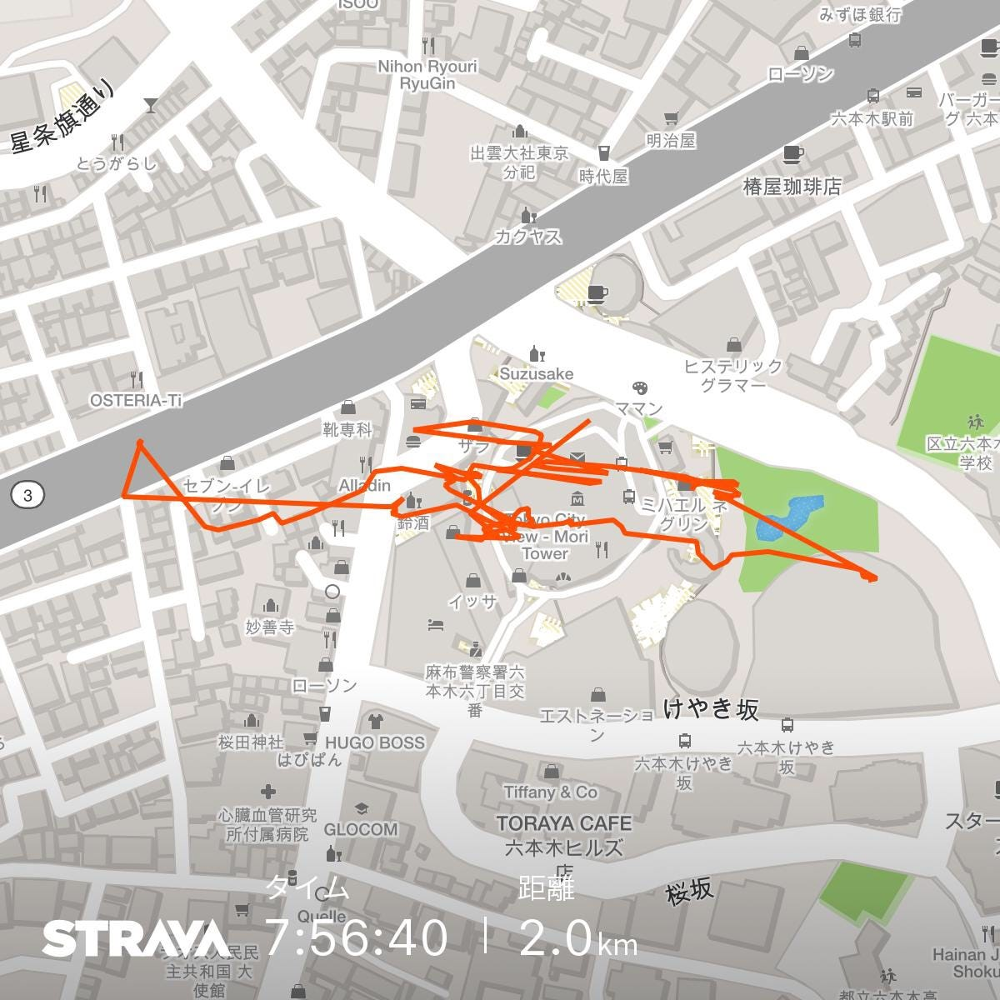

### ぐーぐるでぐーるぐる

こんにちは。寒くなってきましたね。きっと季節が秋に移行しつつあるからでしょう。

茶番もこの辺にしておきます。でないと、単位に響かないか、とひやひやです。ひやひやは季節の変わり目だけで十分です。

こんにちは。青山学院大学地球社会共生学部地球社会共生学科3年 古橋ゼミ所属の渡辺匠です。今回は9月19日に六本木にある「Google」にお邪魔させていただいた時のことについてまとめていきます。

Googleにて「Google Earth Engine Translathon 翻訳ソン」というイベントが開催されるということで、古橋ゼミ生、約12人が参加しました。私自身六本木を訪れることがはじめてだったので迷いました。そのため10分早く着く予定が10分遅れて集合場所に到着してしまいました。

六本木ヒルズに到着するとまずは厳重なセキュリティーチェックがお出迎えしてくれました。エレベーターホール前のセキュリティチェックでは、たとえ前後の人が入構パスを掲示していたとしても、その中間にいる人が見せないとそこを通ることができません。

次はGoogleのエントランスのセキュリティチェック。IDカードを入室する度にかざさないと入ることができないという仕様でした。また、そのIDカードは社員とゲストのごく一部の方々しか持っていない。なんという徹底したセキュリティーなんだ、と驚嘆でした。

イベントホールに到着すると、奈良大学の研究室の学生の方々やSDF（Space Development Forum）の方々、招待を受け取った社会人の方々が既にイベント会場に到着していました。

イベントが始まると、まずはGoogle Earth Engineの概要の説明が始まりました。

そもそも”Google Earth Engine”とは？

> [Google Earth Engine](http://earthengine.google.org/) は、環境データを分析するための、地球規模のプラットフォームです。40 年以上の過去および現在の地球の衛星画像をまとめ、広大なデータの倉庫を分析し掘り起こすために必要なツールと計算能力を提供します。現時点の利用状況: 森林破壊の検出、土地被覆および土地被覆変化の分類、森林バイオマスおよび炭素、世界の人跡未踏の地の地図作成。Google Earth EngineはGoogleが運営するサーバー上ですべて計算が行われている。

（出典: Google Earth Engineの概要 [https://www.google.co.jp/intl/ja/earth/outreach/tutorials/eartheng_gettingstarted.html](https://www.google.co.jp/intl/ja/earth/outreach/tutorials/eartheng_gettingstarted.html).）

Google社内ではGoogle Earth EngineはGEEと頭文字をとって略されることがしばしばあるそうです。

GEEは長い時間と広い範囲の衛星写真をすべて取り扱っています。そのため、それをすべて処理するには非常に性能のいいパソコンを使っても計り知れないほどの時間がかかってしまいます。それでは使う人がかなり限定されてしまうのです。そのため、その計算をGoogleのサーバーで請け負うことによって、コンピュータの性能の良し悪しに関係なくこのサービスを利用することができるようになっています。

企業サイドとしてはこのアプリケーションをより多くの人に利用してほしいという考えから、このアプリケーションを無料で提供し、このようなイベントなどを通して、GEEの使い方をレクチャーしているのです。実際に、今回は翻訳のお手伝いという形で参加しましたが、私たちも大まかな使い方のレクチャーを受けました。

奈良大学の学生たちは研究室などでこのアプリケーションを既に利用している方もいたようで、とても使いこなしているような姿が見受けられました。 私はGoogle Earth Engineを今まで利用したことがなかったので、使い方のレクチャーはとてもためになったと思っています。これから使う目処はまだ見つかっていませんが、何かしらの機会で使えたらなと思いました。

今回は翻訳ソンということで翻訳の割り当てをし、各自自分のタスクを18:00までに終わらせるというスケジュールでした。

「約5時間あるわけだし、まあ終わるでしょ」そんな甘いことを考えていた自分がいました。この時の自分に平手打ちしてやりたいとつくづく思います。自分で選んだタスクだとは言え、なかなかに難しい内容かつ、専門的な内容が絡んでくるため、また、Githubに掲載する翻訳テキストとして利用するため、抜かりのない翻訳をする必要がありました。何をアルファベットで表すのか、何をカタカナで表すのか、はたまた、日本語で表すのか。非常に四苦八苦な5時間でした。わかりやすい表現やあいまいな表現を避けたりととても多くの事に気を配る必要がありました。

私は結局、5時間でタスクであった1ページをちょうど完成させることができました。とても苦しい時間ではありましたが、新しい人との交流や新しい経験をしたということもあり、とても充実した5時間であったことは間違いなかったです。とても良い機会を得たなと感じました。タスクが終わった時には既に外はきれいな夜景が窓ガラスいっぱいに広がっていました。

とてもがんばった１日のご褒美にディナータイムが用意されていました。お寿司からベジタリアン料理、見たこともない料理などが並んでいました。さすが多国籍企業だなと実感しました。

帰り際の１枚。はじめての六本木ヒルズだったからこその１枚。六本木ヒルズに通ってる人は恐らく当たり前の景色だからこんなに見上げることはないのではないかと思います。そのような人生になれたらいいな、なんて呟いてみる。

### 最後に

Stravaを１日ONにしていたらすごいことになっていました。

人工衛星は建物に入ると正確な位置を取得、計算することができなくなってしまうと「空間情報の取得技術」という授業で学ばせていただきました。しかし、まさかここまで不正確になるとは思いませんでした。いつか建物内でも正確なGPS情報を採取できるようになるシステムや人工衛星がGoogle Earth Engineを基に生まれるかもしれません。

終わり
