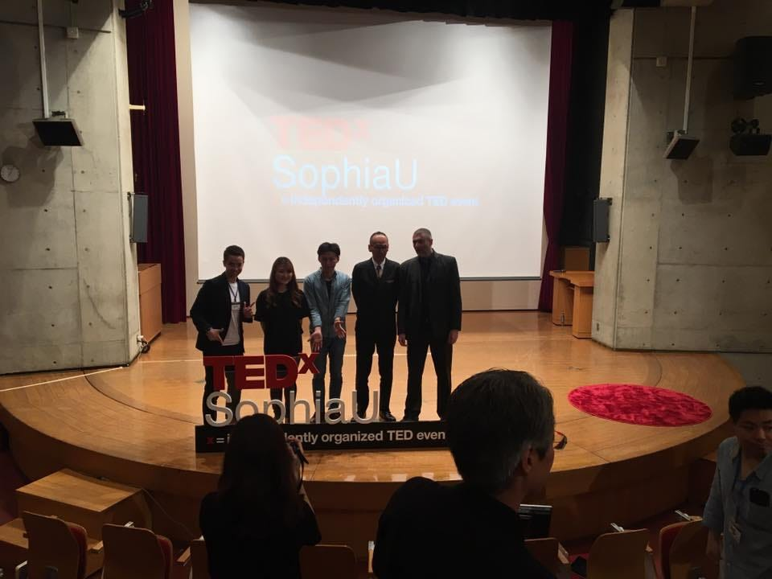

### 他団体TEDx紹介第８弾

今回はTEDxSophiaUをご紹介させていただきます。

上智大学のみなさんを中心に活動している団体です。

上の写真は2017年5月28日に開催されたイベントに参加した際の写真です。
スピーカーのみなさんが壇上に最後並んだところですね。
私はお客さんとして参加させていただいただけでしたが、とても楽しかったのを覚えています。
特に年の近い学生さんが話している内容を聞いたりしているととても自分のやる気に繋がりました。

2017年のテーマは「A Sprinkle of Salt」
塩とは食材を引き立ててくれる調味料であり、そのままではしょっぱいものです。私たちが日常で培ってきた道徳観などは、私たちにとってそんな塩のような存在なんではないか、それぞれにとっての自分を引き立たせてくれる塩とはなんなのか、それぞれの塩のような存在を語ってもらおう、という想いがこもっているそうです。

かっこいい！！
私も英語でかっこよくこんなことを思いついてみたい。（ただの願望です）

2017年の動画が見当たらなかったのですが、過去の動画はこちら

中でも印象的だったのが、レセプションの時にでたお料理もテーマの塩を使ったオシャレだったことです。

TEDxはトーク内容の全てにテーマを合わせていくもの、という印象が崩れ、こういったちょっとした遊び心も入れるとまた一味違ったイベントになるのだなと学びました。

[TEDxSophiaUniversity
TEDxSophiaUniversity. 1.4K likes. Nonprofit Organizationwww.facebook.com](https://www.facebook.com/TEDxSophiaU/)

Facebookページはこちらです。

今年のイベントはもう終わってしまったみたいなので、また来年みに行きたいなあ。

[TEDxSophiaUniversity
TEDxSophiaUniversity. 1.4K likes. Nonprofit Organizationwww.facebook.com](https://www.facebook.com/TEDxSophiaU/)
