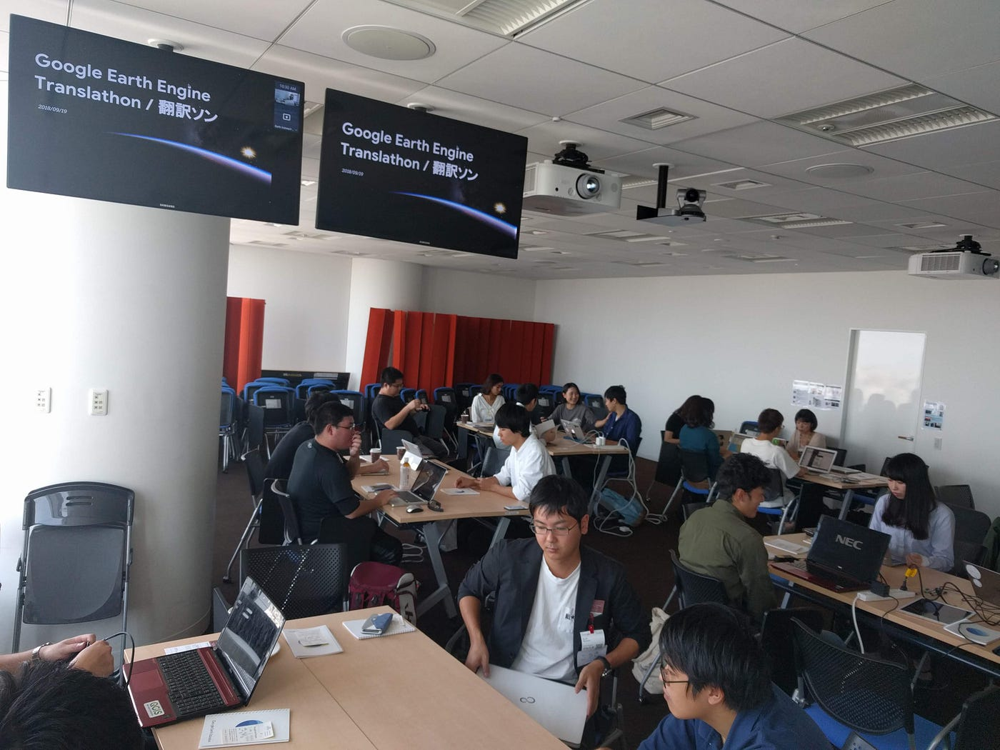
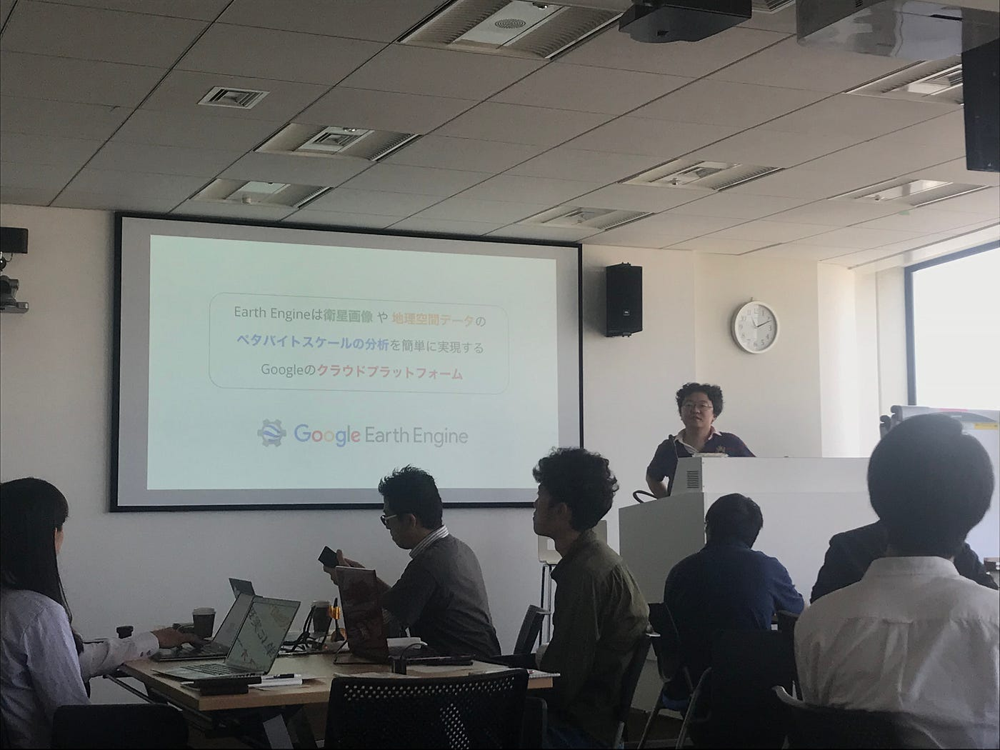
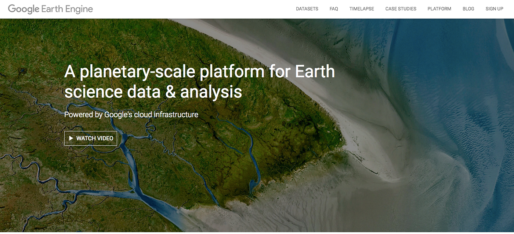
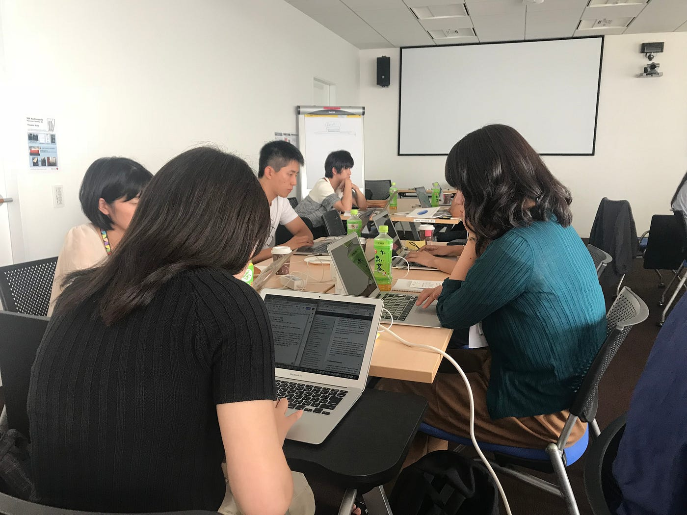
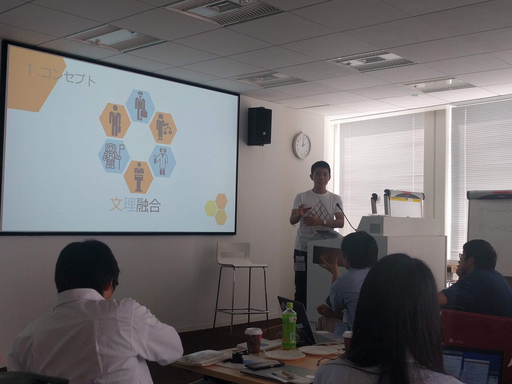
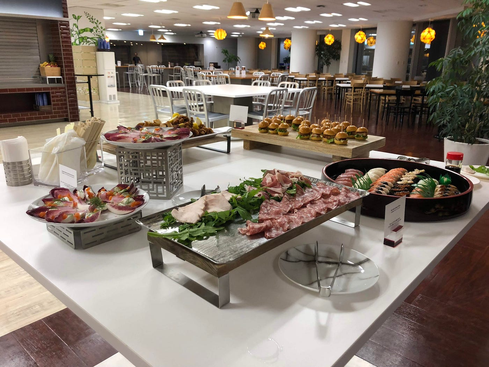

### 翻訳ソンって聞いたことある？

Translathon、翻訳ソンという造語を聞いたことある？Translathonは”Translate”と”Marathon”を組み合わせたもの。日本語にすると翻訳ソン。ハッカソンみたいなノリで作られた造語。

でもたぶん全然メジャーな言葉じゃない。てか先生が作ったのかな？笑

というわけで、翻訳ソンをね、Google Japanオフィスで行った。翻訳した内容はずばり、Google Earth Engineについて！今回は古橋研究室のGoogle Earth サマースクールの一環として、Google Earth Engine 翻訳ソンに参加させてもらったお話。

参加メンバーは奈良大学藤本研究室の学生と卒業生、Google Earth Engine(以下GEE)に興味を持つSpace Development Forum(以下SDF)に所属している学生。JICAのゲストの方と、一般社団法人リモート・センシング技術センターの方！

9月19日、1日翻訳ソンがあったわけだが、まずはGoogle Earth Engineを知らなければチュートリアルなど翻訳も難しい。というより、やっぱり知っていた方が興味が持てるよね！ってことで午前中はGoogle社員の方からGoogle Earth Engineについてのレクチャーをしていただいた。

GEE衛星画像や地理空間データのペタバイトスケールの分析を簡単に実現するGoogleの**クラウドプラットフォーム**。研究者や分析者の時間を自分のやりたい研究にあてられるように、バックエンド側の心配をしなくて良いようにと作られたサービスで、素晴らしいサービスだと思った。これが無料で使えるんだから、やっぱり恐るべしGoogle。

中でも私一押しの機能は”Timelapse”。地図上で2Dや3Dで空間的に可視化するのも新たな発見にもなるし、素晴らしいのだがそこに時系列を入れて分析できるTimelapseの機能は必要不可欠な機能で、最高な機能。

地図上に色で分類せれた解析データが、Timelapseを使えば、まるで生き物のように動き出す。分析に便利なだけじゃなくて、単純に見ていてかっこいいんだコレが！

午後はお昼にライトニングトークを挟みつつ、みんなで翻訳作業。固有名詞やもはやカタカナで使われている言葉や、より深いGEEの機能についての説明だったりと、理解しつつ何をどう翻訳するのかを随時確かめ合いながらの作業だった。vectorデータをね、翻訳する時にベクタデータかベクトルデータかで迷い、最終的に英語のまま表現しよう、とかもろもろと。ちなみに私はベクタデータって言うな〜。

> 奈良大学の藤本研究室のゼミ合宿の話は、まさにサバイバルでゲットワイルドだった。一人で生きぬく術を鍛えるため、ご飯のおかずを自力で獲得する。ワニの肉は鳥より美味しいという話には驚いた。SDFは文理融合をコンセプトにした学生団体で、宇宙開発フォーラムなどのイベントを開催している。宇宙開発フォーラムは支援団体も多く、かなり規模の大きいイベントなんだなと思った。

翻訳ソン後は懇親会で、森ビル30階から見える夜景と美味しいご飯と、愉快なメンバーと楽しい懇親会に参加させてもらった！貴重な機会をありがとうございました！これを機会にGEE使ってみようと思った、良い経験だった！

以上、Google Earth Engine 翻訳ソン体験記。

[Google Japan - Ayame Otsuki's 3.2 km run
Ayame O. ran 3.2 km on Sep 19, 2018.www.strava.com](https://www.strava.com/activities/1851609045/shareable_images/photo_based/21925968/1/006CDAB0-A10D-4427-9EFB-F1D4AE530AC2?hl=ja-JP&v=1537458269)
