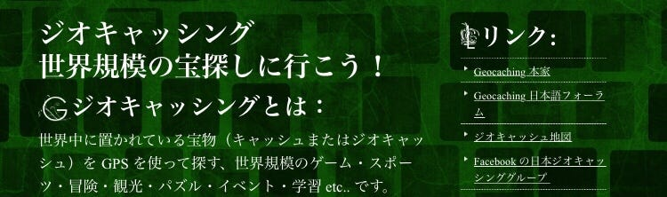

ジオキャッシング×観光

今回はこの論文に焦点を当てて書いていこうと思います。

以下、ざっくり内容をまとめます。

○ジオキャッシングとは○

→宝探しゲーム

💡POINT

・GPSを利用する

・世界規模

・参加者自身がコンテンツを成長させる

○ジオキャッシング×観光○

参加者は宝箱を有名無名の地に設置したがる→宝探しが名所めぐり(観光)になる

参加者自身がコンテンツを生み出す→低コスト→継続的なゲーム運営

○フィールドゲームを観光地が実施する意義○

・観光資源を認知してもらう機会の増加

・観光資源へ付加価値を与える

・観光客の再訪

・観光客の滞在時間増加

・旅行者と地元民の交流のきっかけ作り

💡POINT

ゲームを通じて参加者が地域の魅力に気づくよう仕向けること

ゲームなしでもその土地を訪れたくなるような動機付けをさせること

位置情報ゲームが観光に一役買うことができるということは、以前投稿したこちらの記事を読んで頂ければご理解頂けると思います。

[PokémonGO×鳥取県×観光
私は今鳥取に来ています。medium.com](https://medium.com/furuhashilab/pok%C3%A9mongo-%E9%B3%A5%E5%8F%96%E7%9C%8C-%E8%A6%B3%E5%85%89-7958e2992c57)

さて、ではジオキャッシングではどうでしょう。

この論文を読んで、確かに観光に役立ちそうだと思いました。

しかし、如何せん知名度が低すぎるのではないでしょうか。

ジオキャッシングを調べると、なるほどハマる人の気持ちはわかります。

オンライン上に仲間がいる現実世界での宝探しゲーム、わくわくしますね。

脱出ゲームが好きな人なんかに教えるとハマってしまうのではないかと思いました。

ポケモンGOが異質なのは理解しています。

ピカチュウは今や世界中で知られてるキャラクターです。アニメも何ヶ国語にも翻訳されて放送されています。もともとのファンの層が厚いので話題になるのは当然です。

だからこその、ポケモンGOのイベントの集客率だと思います。

しかし、ポッと出のゲームではそうはいきません。自治体との連携等で知名度をあげないことには観光への応用は難しいと感じました。

ジオキャッシングのイベントをするから集まれ〜！と呼びかけて、果たしてどれだけの人が集まるのでしょうか。

まだまだジオキャッシングについて知らないことが多いので、過去にはポケモンを上回るほどの数の観光客を呼び込むことができた！という事例があれば私の調べ不足です。

ポケモンとは違って、実際に「宝」を見つけることができる。

それを売りにして、例えば寺社仏閣で何か所縁のあるものを「宝」として登録し、その「宝」に次の「宝」がある場所を示し、そうやって観光客を誘導することで集客率アップや滞在時間の増加を図ることも可能なのではないかと思いました。

観光に限らず、防災にも使えそうです。

宝探しと称して、防火水槽や防災備蓄倉庫周辺に宝を置き探させることで、平時にどこになにがあるのかを認知させるきっかけ作りに一役買えそうですよね。

現実世界に触れる「宝」を置くことができるのはジオキャッシングの最大のメリットだと思います。

活用次第では、観光・防災・学習など色々な方面に役立ちそうだと感じました。

次回は、RPGとして楽しめそうだったのにサービス終了してしまったゲームについて取り上げます。
