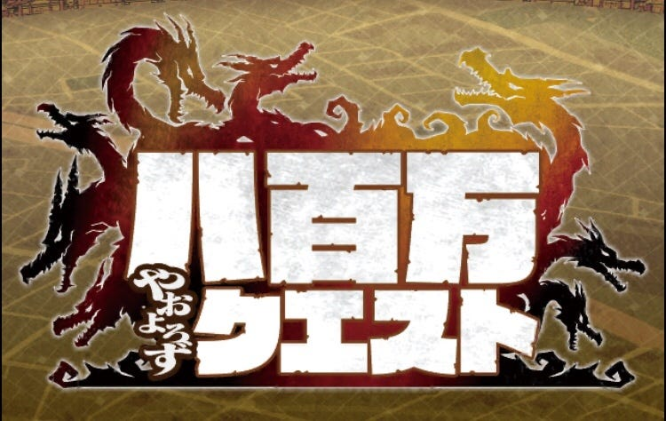
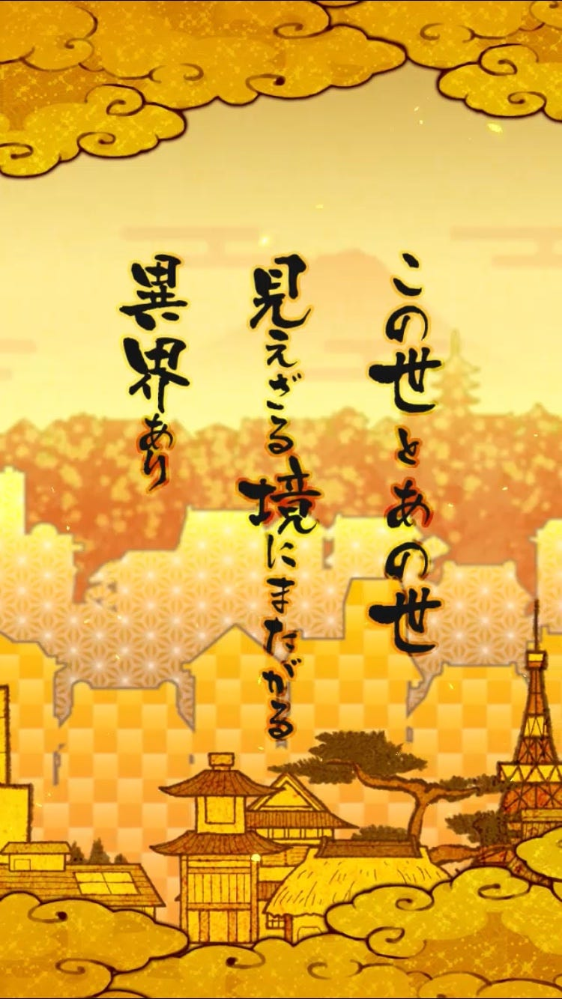
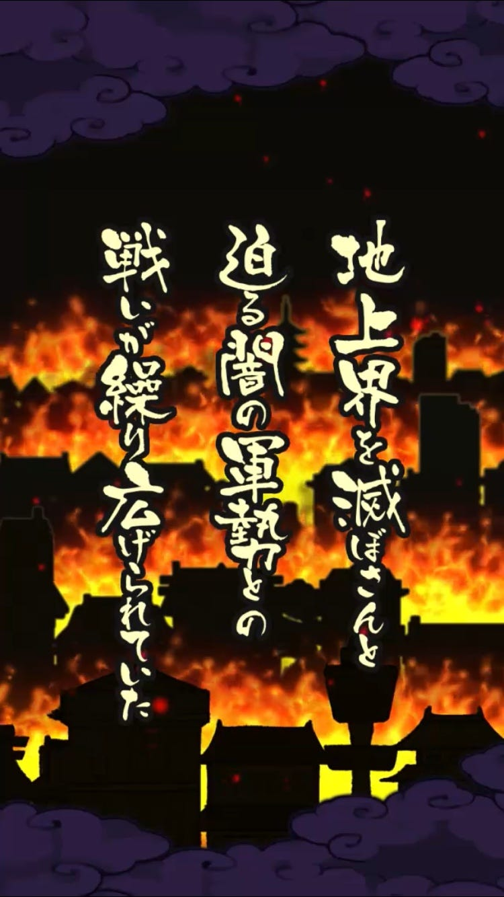
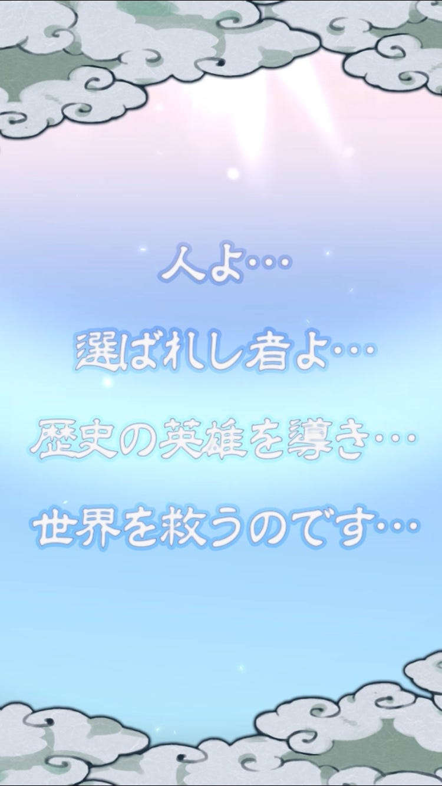
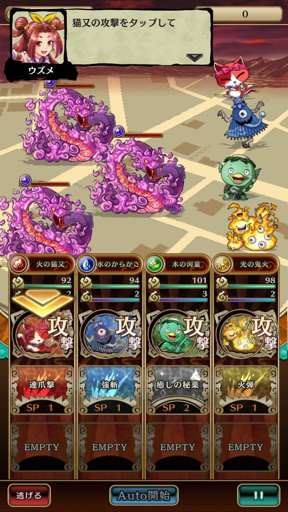
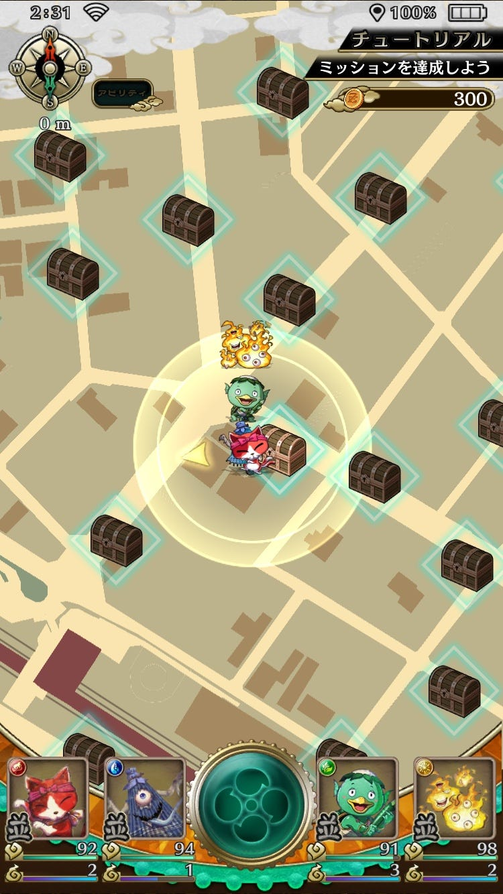
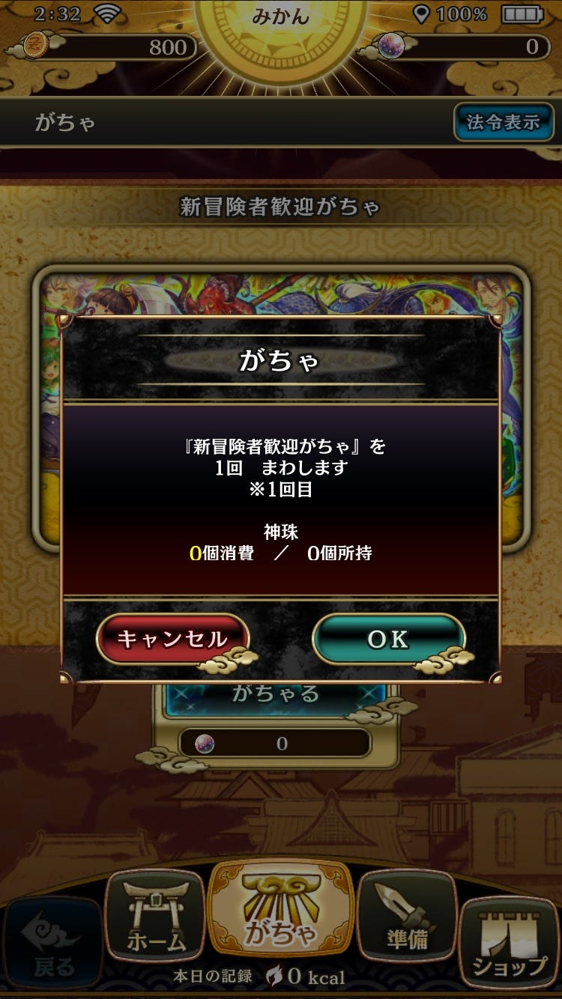
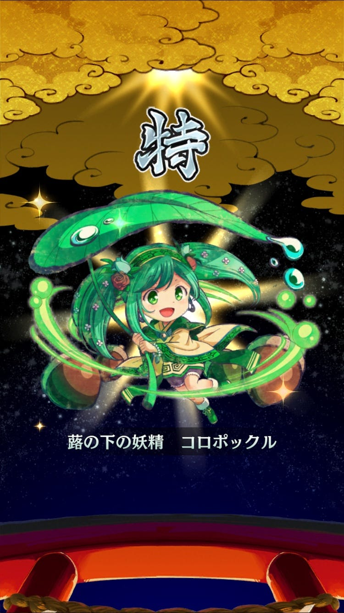
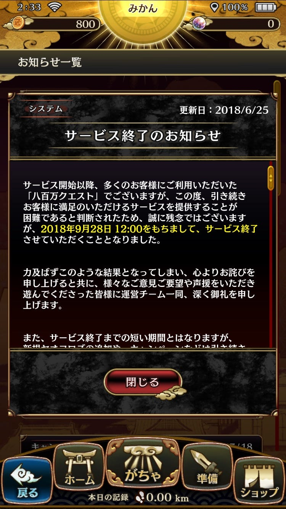

八百万クエスト

久しぶりのレビューです！

八百万クエスト、今までプレイした中で1番RPGとして成り立っていると感じたゲームです。

入りはこんな感じです。

妖怪たちを従えて、パーティ編成をします。

戦闘はターン制。

相性もあるので、強い相手には多少頭を使わなければいけません。

もちろん位置情報要素あり！

この円の範囲内がプレイヤーの行動できる範囲。

宝箱をゲットするためにはその場所へ向かわなければなりません。

ソシャゲあるあるですが、このゲームも例に漏れずガチャでキャラクターをゲットします。

キャラデザインも可愛いところがいいですね！

このゲームは、位置情報ゲーム要素・RPG要素・育成・戦闘形式・キャラデザ全て私好みだったのですが、残念ながら今月末でサービス終了してしまいます。

ゲームを運営するのもなかなか難しいんですね。

逆に、今リリースされているゲームはサービス終了に追い込まれていないということですよね。

サービス終了してしまうこのゲームと、今もサービスを続けられるゲームの差は何なんでしょう。

そういうところも考えながらプレイしていきたいと思います。
