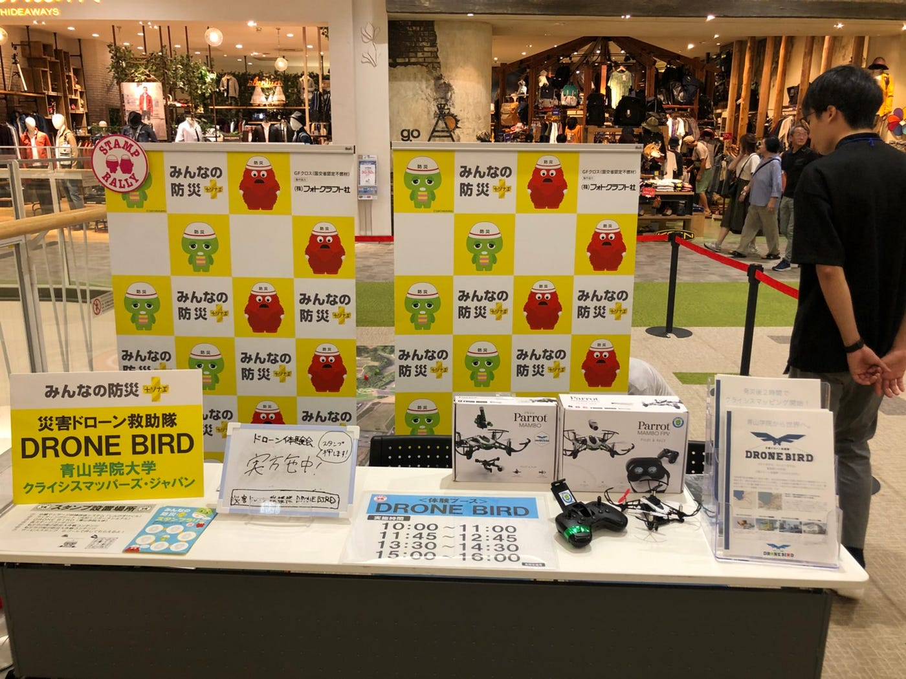

### イオンモール巡業ドローンワークショップ 〜撤収編〜

ご無沙汰しております。古橋ゼミ3年生の関 街です。

今回は、9/17に開催されたドローンワークショップ@イオンモール高崎での **イベント終了後のバラシ作業/撤収から退館まで の段取り** をまとめてご紹介したいと思います！

まずはこちらの動画をご覧ください。

**＊ドローンワークショップ撤収マニュアル**

注意すべき点は

### 1.朝の設営時に何がどこに入っていたかを把握しておく

・朝は設営の時間に追われてせかせかしてしまいますが、どこに何があったかだけ覚えておくと撤収時に「あれ？これどこにどうやって入ってたっけ？」といったことににくいです！

### 2.会場備品への認識を共有しておく

・設営時に延長コードなどを借りることや、高崎ではスタンプラリーのためのスタンプなどを会場備品としてお借りしていました。それらをゼミの備品と混ぜて片付けてしまうと後々大変なことになります。なので、何を借りて後で返すのかをメンバーで共有しておくと間違えてゼミとして持って帰ってしまったなんてことがなくなりにくいです！

### 3.撤収中にイベント終了をお客様側に表記しておく

・お客様がまだやってるのかな？など困惑しないよう、ホワイトボードなどにイベント終了と感謝の言葉を記載してディスプレイしておくといいかもしれません。

撤収中はイベント終了の安堵や疲れとお客様対応が少ない点から振る舞いやブース内の備品の乱雑さが目立ちがちです。イベント終了後もイオンモールは営業中で、お客様もすぐそばを通られます。**お客様に見られているという意識 **を退館まで持って撤収作業に取り組んでもらえればと思います。

また、次の会場でまた使われるゼミ備品がほとんどです。次の会場の人が設営しやすい、トラブルを未然に防げるようにフライヤー／シールの残部確認やドローンやフィギュアなどの破損や欠品をして、Messangerのチャットの方で共有してあげてください。**全国一続きのイベントだと思ってみんなで気持ちよく運営できるようにご協力お願い致します！**

### 個人の感想

私はよく派遣で◯らぽーとやビッ◯サイトでイベント運営業務をしています。それらの業務は、当たり前ですが給金が発生するのとれっきとした仕事のため、**必要最低限の働きをその時だけ来た勤務者が即時に行えるように必要最低限何をどうすればいいか** のフォーマット／マニュアルがあります。これが当ゼミのイベントごとに整備されれば、イベント運営においてより本番に強く、参加される方が過ごしやすいイベントをつくることができうる集団になるのかなとペーペーが思ってみたり…。

ドローンワークショップを経験した方々で、次の会場のゼミ生がより不安がなく、働きやすいように情報共有/マニュアル・フォーマットの作成が必要だと感じます。その作業はこの巡業以外のイベントでも応用が効くと思います。みなさん遠方での業務などで大変だと存じますが、一つ一つのイベントを線で繋いで盤石の体制を整られるようお気遣いいただければと思いました。

柄にもなくお堅い記事になってしまった…何目線だよって感じで長くもなってにも関わらずここまで読んでくださった方は真面目すぎるのでゆっくり休んでください。

それではありがとうございました。関でした。

＊追記

Stravaデータ未所持なのでGoogle Mapsで作成した高崎駅からイオンモール高崎のルートを添付します。
