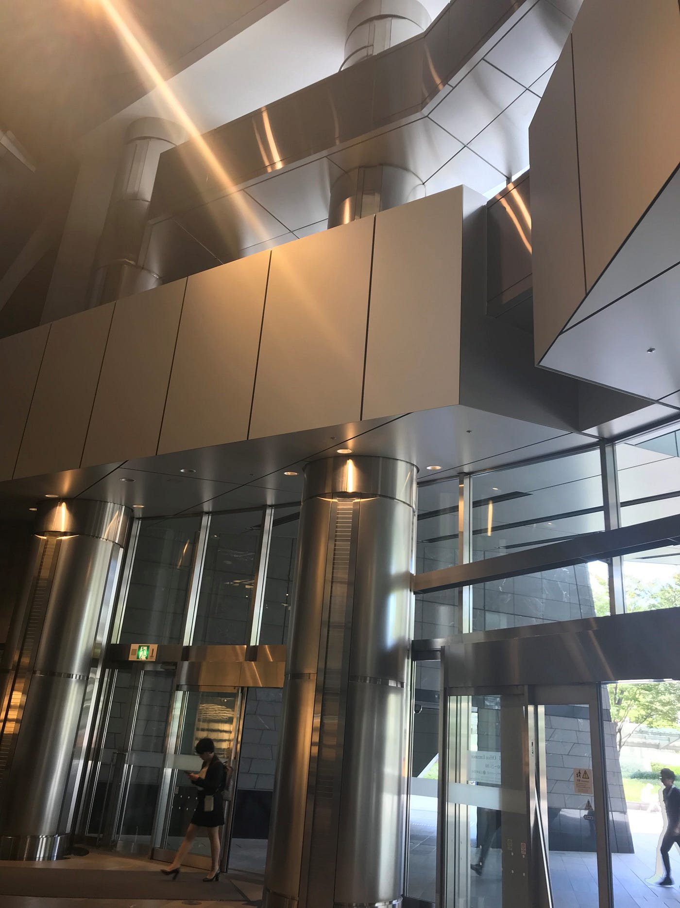
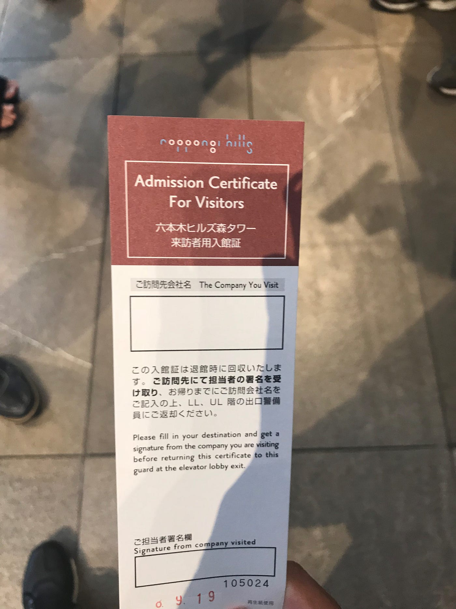
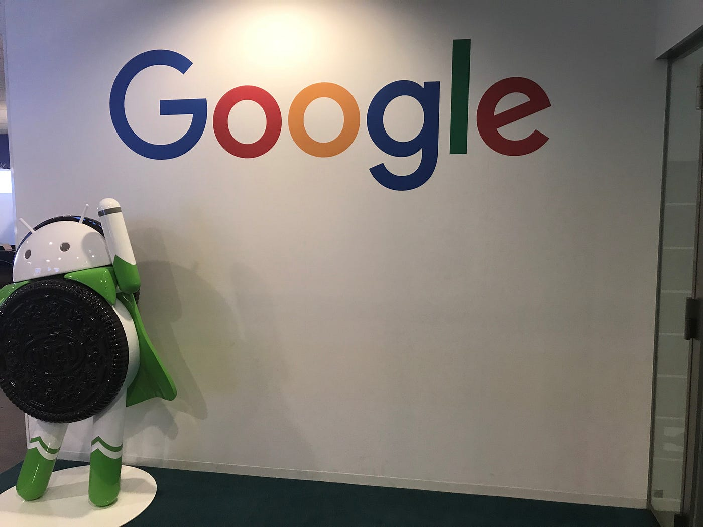
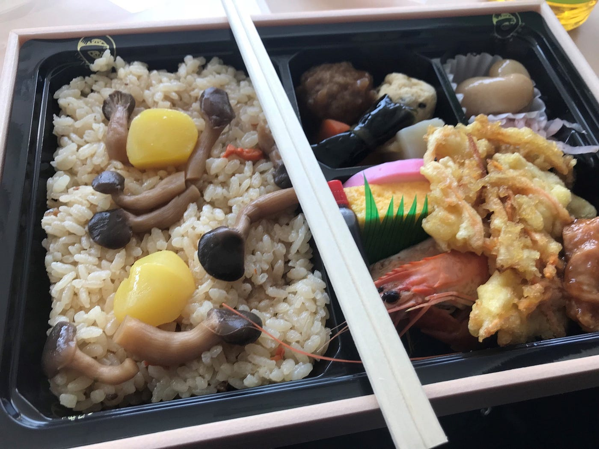

### 翻訳コン in Google ９月１９日

この日はGoogleが主催の翻訳イベントに参加してきました。場所は六本木にある森ビルです。写真はそのエントランスです。

入場に関してはこの入館証が必要となりない場合は警備員のかたとゲートによって止められてしまいます。流石に高級な場所だけありそういった警備の質も高そうです

こちらはGoogleの会議場のスペースでこの奥で作業をしていきました。

まずは自己紹介からはじまりGoogle earth engineの説明などといったものが行われました。参加メンバーの中には私たち青学の古橋ゼミのメンバー以外にも奈良大学の教授のゼミメンバーやSDFといったチームに属している学生や卒業生の方など２０人近くの参加者がいらっしゃいました。

Google earth engineとは地球環境のデータを分析するためのプラットフォームのことです。Google earth ってどういうものなのか？といったような説明でした。

その後翻訳についての説明があり各々で翻訳作業を開始することとなりました。私はITの方面には全く明るくないので翻訳には苦労しました。

その後昼食とライトニングトークという各５分間のトークをはさみました。奈良大学教授の話が特に印象に残りました。とても肉体的にハードな内容でまるで体育会系のようで驚きました。

その後は午後六時まで翻訳作業を行ないました。普通の単語かと思えばIT用語のようで訳すか迷う、日本語の訳がこれで正しいのか迷うなどのことはありましたがなんとか時間内に終わらせることができました。

最後に懇親会がありビュッフェ形式での夕食をいただき解散となりました。

こういったイベントの参加体験は貴重であり他のイベントにも参加したく思いました。
