### Google Earth Engine使ってみませんか

### #1 はじめに

いつもお世話になっております。古橋ゼミ三年の武末です。このようなブログ投稿も四回目となり、すこしずつこなれてきたのではと思います。

さて、今回の記事についてですが、今回は六本木ヒルズ30階にあります、Google Japan様の翻訳ハッカソンに参加させて頂きました。

招待制だった（のかな？）なので公式の情報があまりなく、紹介リンクを貼れないのが申し訳ないのですが・・・もし見つけましたら追加しておきますね。

で、そのイベントでなにをしたのか、というとGoogle Earth Engine公式ヘルプの翻訳ですね。

[Google Earth Engine](https://earthengine.google.com/)とはなんぞや？という方のために説明を。

[Google Earth Engine
Google Earth Engine combines a multi-petabyte catalog of satellite imagery and geospatial datasets with planetary-scale…earthengine.google.com](https://earthengine.google.com/)

> [Google Earth Engine](http://earthengine.google.org/) は、環境データを分析するための、地球規模のプラットフォームです。40 年以上の過去および現在の地球の衛星画像をまとめ、広大なデータの倉庫を分析し掘り起こすために必要なツールと計算能力を提供します。現時点の利用状況: 森林破壊の検出、土地被覆および土地被覆変化の分類、森林バイオマスおよび炭素、世界の人跡未踏の地の地図作成。 [https://www.google.co.jp/intl/ja/earth/outreach/tutorials/eartheng_gettingstarted.html](https://www.google.co.jp/intl/ja/earth/outreach/tutorials/eartheng_gettingstarted.html)

Googleが保有する衛星データを様々な形で利用することが出来るWebプラットフォーム、それがGoogle Earth Engineです。今回の翻訳ハッカソンではその中でも、JavaScriptで操作することが出来るコンソールのヘルプを担当させていただきました。

[Get Started with Earth Engine](https://developers.google.com/earth-engine/getstarted#mapping-what-to-do-instead-of-a-for-loop)をせっかく翻訳したので、今回はEarth Engineの簡単な使い方とサンプルスクリプトを用いてどんなことができるのか？というのを今回はご紹介したいと思います。

### #2 とりあえずStravaデータ報告

これは古橋研究室のイベント参加/フィールドワーク時の掟なので本筋とはまったく関係ないのですが、Google Japanオフィスまでの移動の軌跡(GPS Log)を貼っておきます。気にせず #3 にすすんでください。

[Google翻訳ハッカソン - Kouki Takesue's 1.2 mi walk
Kouki T. completed 1.2 mi on Sep 19, 2018.www.strava.com](https://www.strava.com/activities/1853166290)

### #3 Google Earth Engineに登録しよう

[Google Earth Engine
Google Earth Engine combines a multi-petabyte catalog of satellite imagery and geospatial datasets with planetary-scale…earthengine.google.com](https://earthengine.google.com/)

まずは[上記のサイト](https://earthengine.google.com/)にアクセスしてください。すると右上に**SIGN UP**と書かれた部分があると思います。ここをクリックしてください。

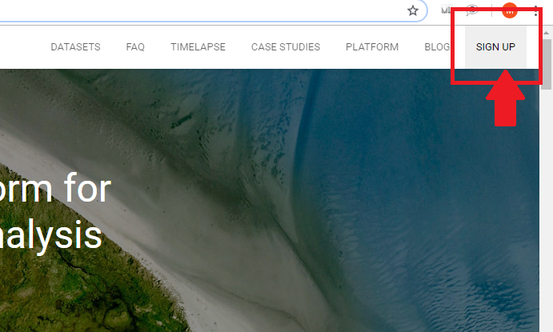

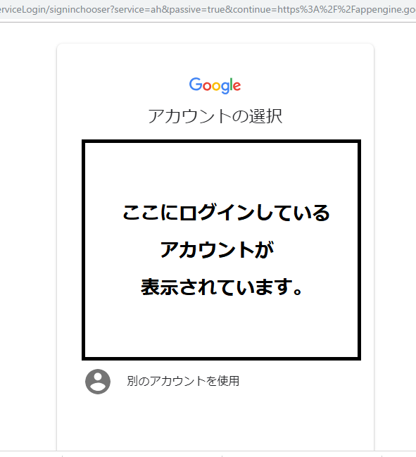

クリックしたらログインしたいアカウントを選んでログインしてください。（Chromeの場合は既にログインしたアカウントが表示されていますが、共用PC等で変えたい場合は一番下を選んでください）

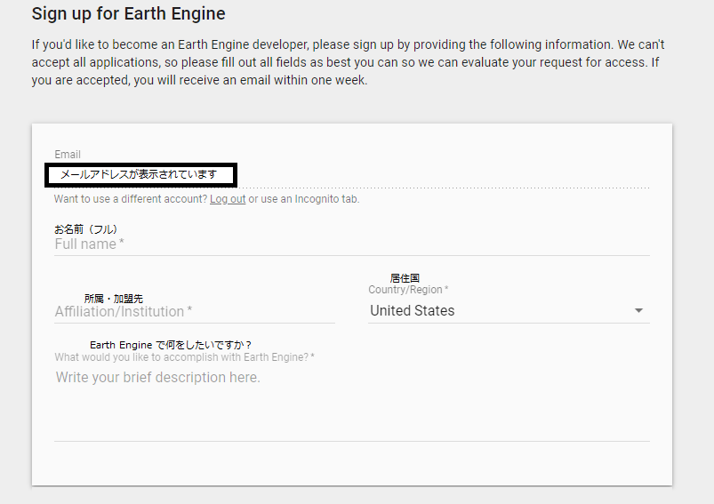

上記の入力フォームを埋めます。半角英数字で入力しましょう。

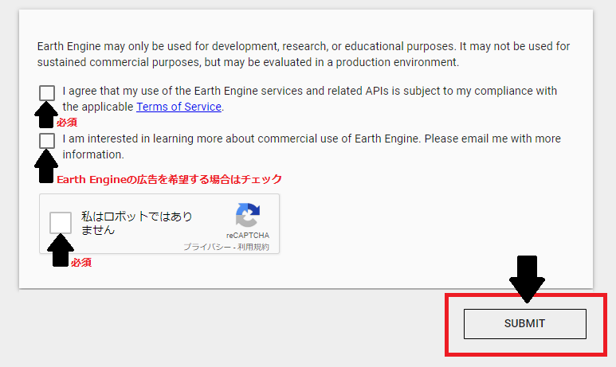

その後、下三つのチェックボックスにチェックを入れて、**SUBMITを**押します。一つ目は規約合意なので必須。二つ目は広告を希望する場合のみでOK。三つ目は自動登録を防ぐためのreCAPCHAなので必須です。

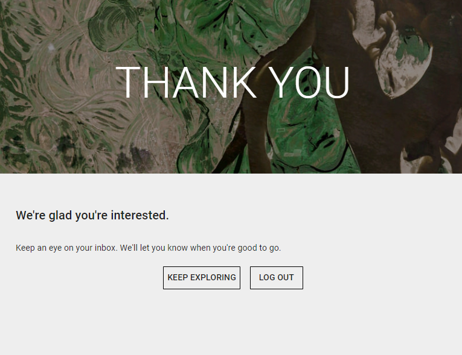

そうするとこのような画面になります。しばらくすると登録したメールアドレスに承認のメールが来ているはずです。

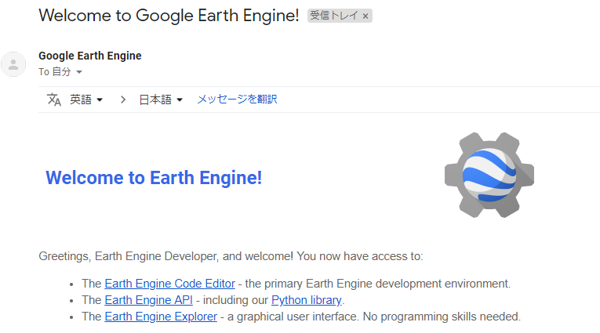

これが来ていたら晴れて貴方もEarth Engine デベロッパーです！Google Earth Engineでなにが出来るのか？を簡単に見ていきましょう！

### #4 できることを簡単に紹介

> **・32年の変遷を数秒、一目で。TIMELAPSE**

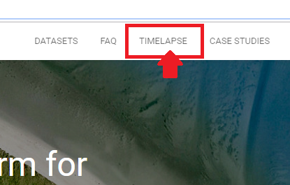

[Google Earth Engine
Google Earth Engine combines a multi-petabyte catalog of satellite imagery and geospatial datasets with planetary-scale…earthengine.google.com](https://earthengine.google.com/)

公式サイトの右上部に「[TIMELAPSE](https://earthengine.google.com/timelapse/)」をクリックします。するとマイアミの航空写真が表示されると思います。

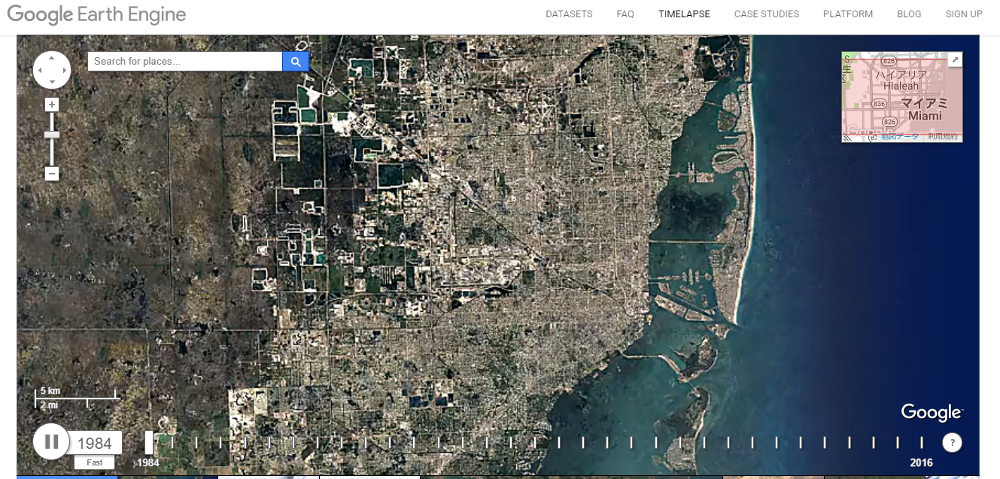

自動的に1984年から2016年までのTime Lapseが表示されます。年ごとでは小さな違いでもこのように並べていくと大きな変化であることがわかりやすくなっています。

> ・巨大な環境分析を貴方の手元で。CODE EDITOR

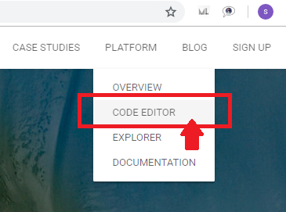

[Google Earth Engine
Google Earth Engine combines a multi-petabyte catalog of satellite imagery and geospatial datasets with planetary-scale…earthengine.google.com](https://earthengine.google.com/)

トップページの右上、**PLATFORM**というタブの**[CODE EDITOR**](https://code.earthengine.google.com/)をクリックします。すると以下のような画面になります。

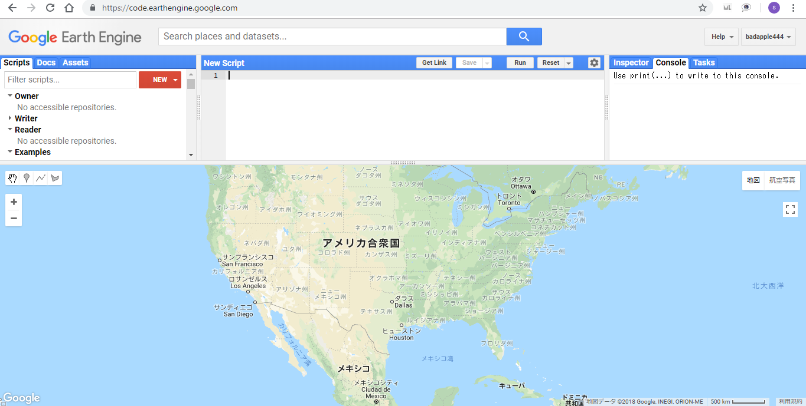

CODE EDITORはJavaScriptによって操作できるコンソールで、Googleが保有している衛星データ（Landsat）を利用して様々なデータを計算、表示することが出来ます。

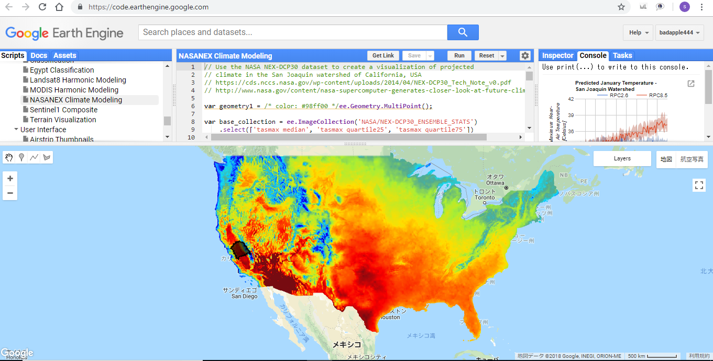

### #5 おわりに

今回のようなハッカソンイベントに参加することは初めてだったので、自身の力で貢献することなどできるのだろうか、と凄く心配だったのですがスタッフの方の親身な支援や使いやすい環境の提供を頂き、無事自身の納得のいく仕事ができました。

ただ翻訳するだけでなく、翻訳をする上でEarth Engineのサービスを実際に動かす機会ができ、こんな機能があるのか！やこういう使い方があるのか！と新しい発見と経験を得ることができました。

また別のイベントがある場合は自身の成長として、参加したいと考えております。この度は本当にありがとうございました。

(本投稿は [OSMアドベントカレンダー2018](https://qiita.com/advent-calendar/2018/osmjp) に向けて一部修正)
