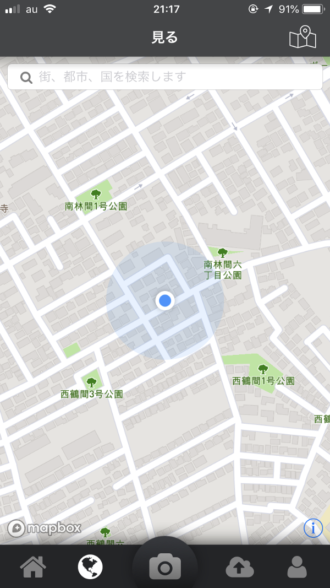
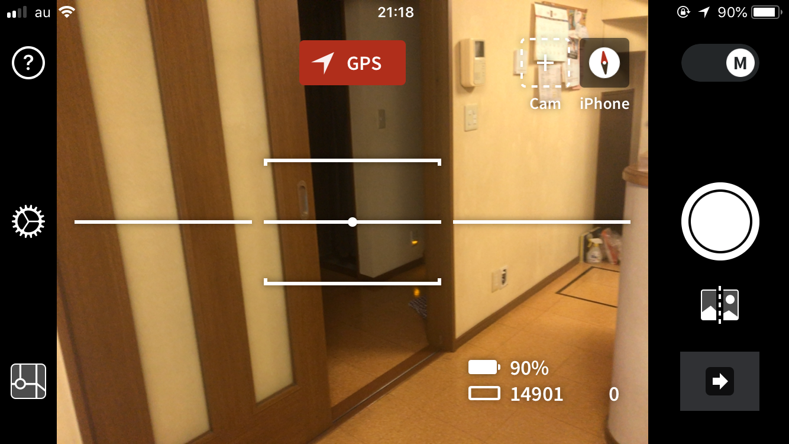
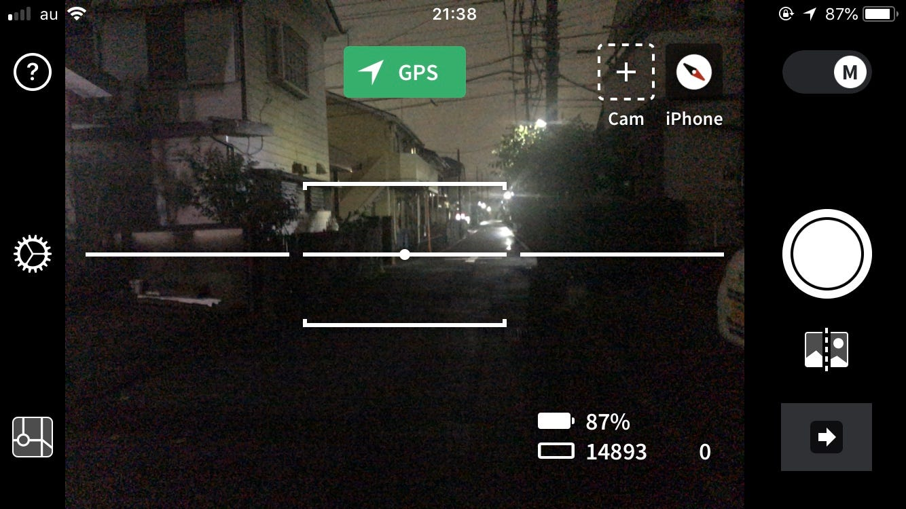
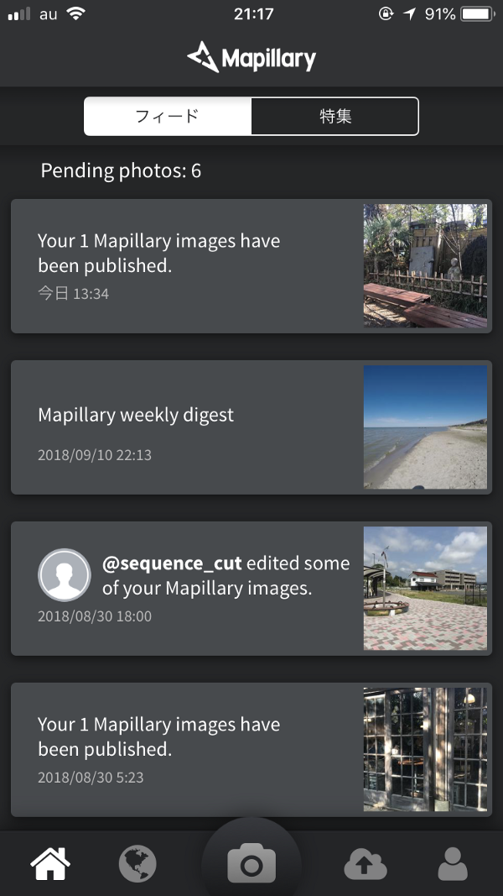
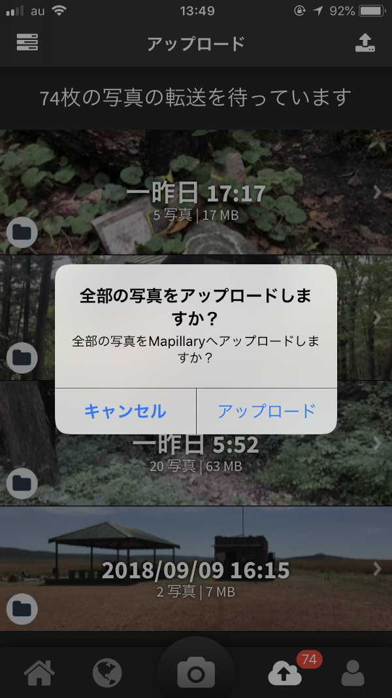
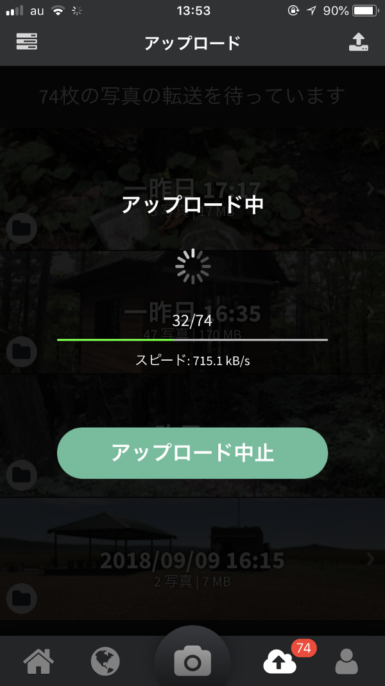
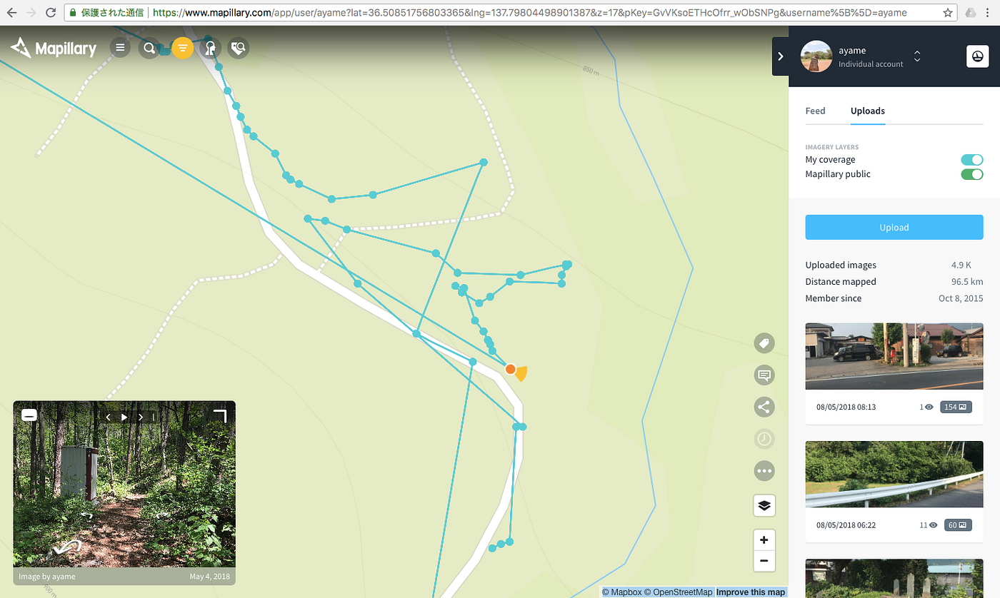

### Mapillaryというツール

「Mapillary」とはスマートフォン用の**ストリートビュー作成用アプリ**。もちろん観覧も可能。Google mapsにストリートビューがあるように、OpenStreetMap(以下OSM])のストリートビューはMapillaryと言っても過言ではない。

MapillaryとOSMは非常に密接な関係がある。というのも、OSM をOSMエディタで編集する時、 Mapillary の写真を直接簡単に利用することができるからである。例えば、[iD](https://medium.com/furuhashilab/id-editor%E3%81%A8%E3%81%84%E3%81%86%E3%83%84%E3%83%BC%E3%83%AB-3ceb80c62367) には「地図データ」設定内に「写真の重ね合わせ(Mapillary)」機能がある。また[JOSM](https://medium.com/furuhashilab/josm%E3%81%A8%E3%81%84%E3%81%86%E3%83%84%E3%83%BC%E3%83%AB-4e07cac389af)には[JOSM plugin for Mapillary](https://wiki.openstreetmap.org/wiki/JOSM/Plugins/Mapillary) という機能がある。

ライセンスにおいても、2014年4月29日に[CC-BY-NC](https://creativecommons.org/licenses/by-nc/4.0/deed.ja) から[CC-BY-SA](https://creativecommons.org/licenses/by-sa/4.0/deed.ja) へ変更され、Mapillary上の画像はCC BY SA(Creative Commons Attribution-ShareAlike 4.0 International License)で利用することができる。

それではMapillaryの使い方を紹介する。

このようにMapillaryにアップロードした画像に、通りすがりの人が写ってしまった場合はMapillaryが顔にモザイクをかけてくれる。しかし極力自分で、あまり人が映らないように撮影するのも良いだろう。

写真をアップロードした後に、Mapillary側でデータクレンジングがはじまり、それが完了すると上記の画像のようにストリートビューを確認することができる。

以上、今回はMapillaryの紹介。

[OSMの編集ツール、もくじ
OpenStreetMapのエディタ、つまり編集ツールについて語る。
PC用のツールとスマホ用のツールの大きく分けて２パターンある。
みんなは何を使ったことがある？medium.com](https://medium.com/furuhashilab/osm%E3%81%AE%E7%B7%A8%E9%9B%86%E3%83%84%E3%83%BC%E3%83%AB-%E3%82%82%E3%81%8F%E3%81%98-b47d3410fe4f)

次回はこのもくじにのっとり、Go Map!!を紹介する。

それではまた来週〜。
