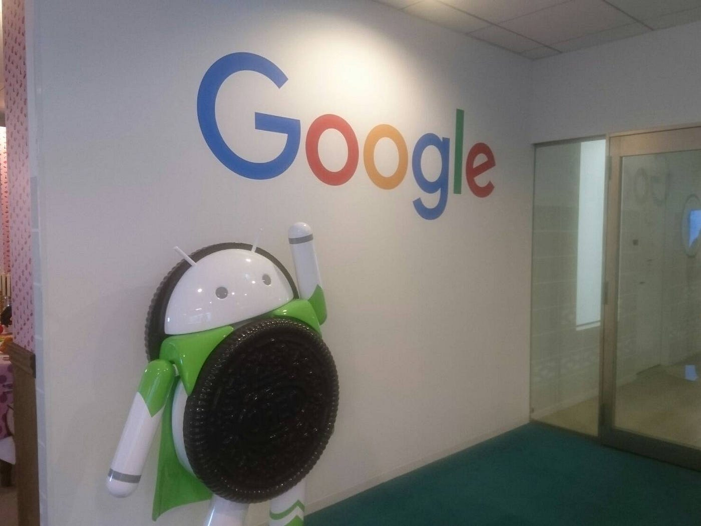
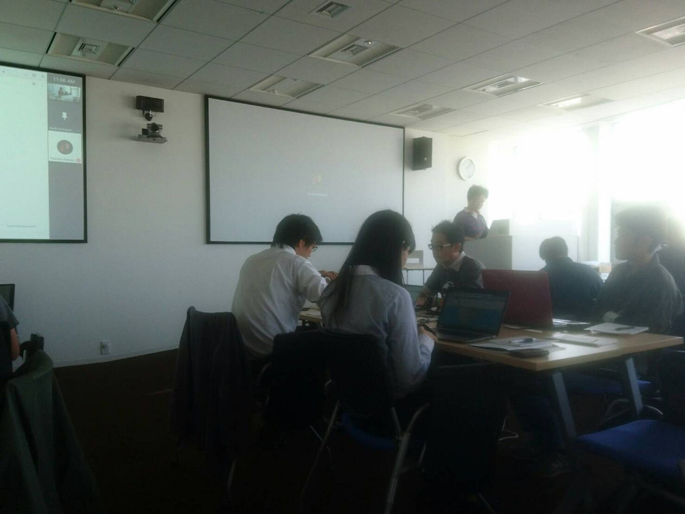

### やららなきゃソンソン、翻訳ソン

### どおおおおもっ！

時間が経つ早さにビビりまくってる、古橋ゼミ３年の板垣です！
9月19日に、_**Google Earth Engine 翻訳ソン_**に参加してきました！
新しいものに触れられたり、新たな友人と出会えた濃い１日でしたので、
パッと分かりやすく、楽しくどのような１日だったのか書いていこうと思います！最後まで、どうぞ読んでくださいませ！

すごいどうでも良いんですけど、あっという間に、お爺ちゃんになるんでしょうね。なるなら、ダンディーなヒゲとハットが似合うお爺ちゃんになりたいです。

### _**翻訳ソンってなんぞ？_**

まず、これですよね。

**翻訳ソン…**

皆さんはこれを聞いて何を思い浮かべますか？

翻訳は分かるけどソンって何よ？？
村？損？孫正義？

僕は初めて聞いた時、阿波踊りの掛け声がずっと頭で繰り返されていました笑

そんなことはさておき、ソンの意味ですが、
**“集中して同じことを行うという” **意味らしいです。

身近なところで言うと、
マラソンにも使われていますよね！（マラの意味がよく分からないけど笑）

翻訳ソン、つまり、翻訳をとにかくし続けると言うことです！！
もう、本当に一日翻訳をし続けました！

### 何の翻訳をしたの？

今回は、**Google Earth Engine**の使い方を英語から日本語へ翻訳をしました！

Googleの方から翻訳の前に、
Google Earth Engineについてのレクチャーをしていただいたのですが、
それでも固有名詞やこれまで英語をそのままカタカナにして使っていた言葉をどうやって日本語に翻訳するのか、かなり翻訳は困難を極めました！

おそらく一人では無理だったでしょう、、！
しかし、僕には心強い仲間がいたんです！！
それは、

**Google Translate**

そして、

**奈良大学藤本研究室
Space Development Forum
JICA
一般社団法人リモート・センシング技術センター**
から来られた方々！！！

最後には懇親会もあり、人の輪も広げることができました！！

いつか、何とかソン開催できたら良いな、、！

[Google 翻訳ソン - 勇渡 板垣's 45.3 km walk
勇渡 板. completed 45.3 km on Sep 19, 2018.www.strava.com](https://www.strava.com/activities/1852081506)
