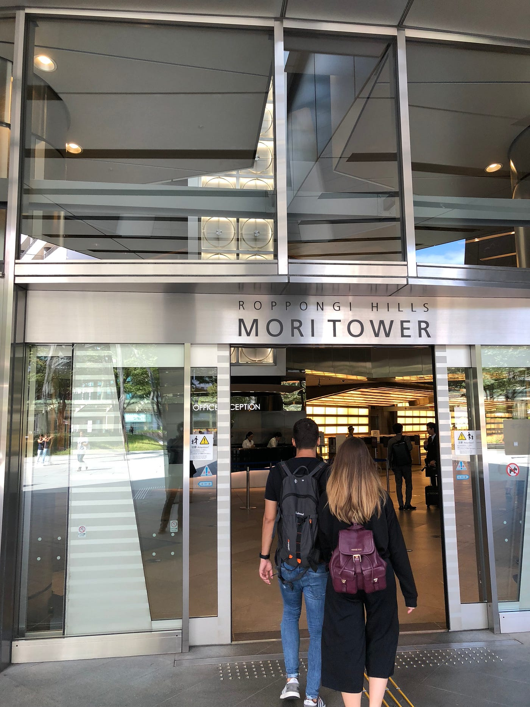
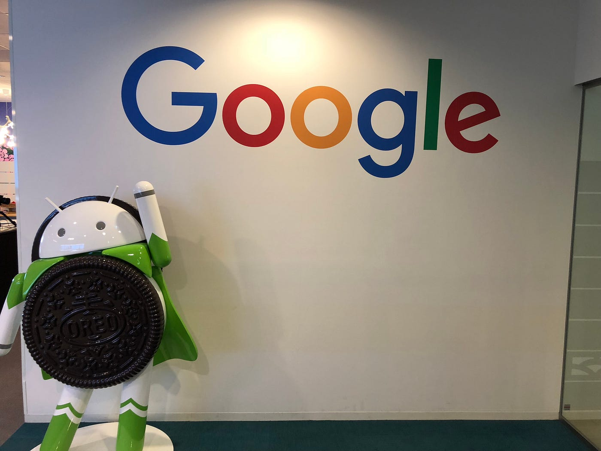
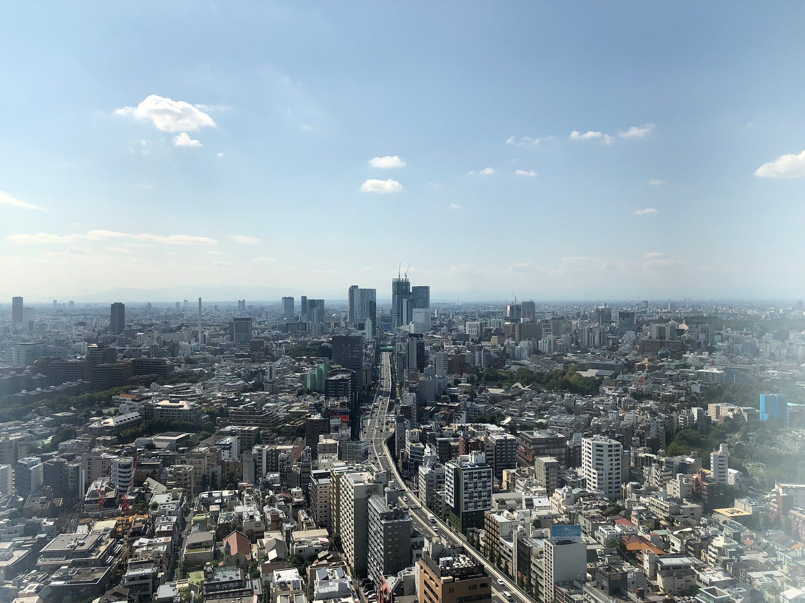
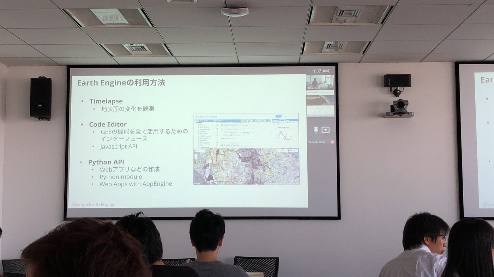
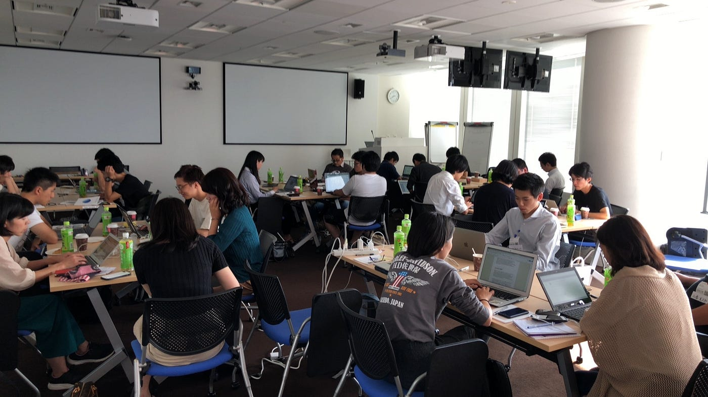
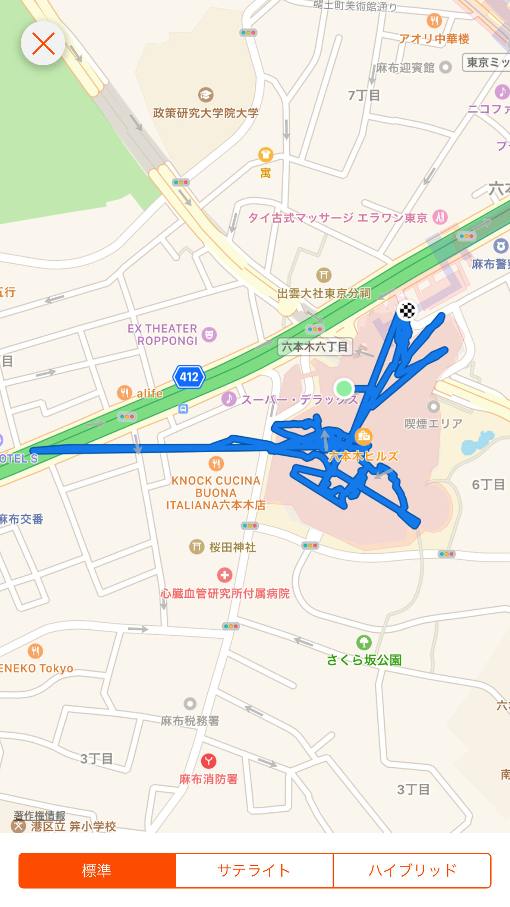

### 翻訳ソン？なんじゃそれ？

こんにちは！古橋ゼミ３年の増田将馬です

9月１９日にGoogle Officeがある六本木ヒルズ森タワーにお邪魔しました！
タイトルにもある通り「Google Earth Engine 翻訳ソン」の翻訳ソンの意味ですがマラ「ソン」のソンと同じ意味で集中して同じことを行うという意味で、今回は集中して翻訳作業を行うということでこのようなイベント名になったそうです。

僕は田舎者なので森タワーと森ビルを同じ建物と勘違いして迷子になりましたがGoogleマップを駆使してなんとか到着することができました…

厳重なセキュリティをくぐり抜けてエレベーターに乗りGoogle Office受付に到着＼(^o^)／
右側のアンドロイドのお腹がOREOなのはなんでなんでしょうかね？Googleとナビスコは提携しているのかな？
少し調べて見ましたがそう言った情報はなかったので謎が深まるばかりです

そんなことを思いながら作業スペースに入って行きました

機会に恵まれてGoogle officeさんに来たことは何回かありますが何回でも思います

### いやすげーなこの景色

と

いずれこんなOfficeで働けるぐらいビックな男になりたいですね

そんなこんながありまして今回のイベントが開催されました。

まず最初にEarth Engineとはなに？どうやって利用するの？今まで活用されて来た事例は？といった内容をプレゼンしていただきました

町田市を衛星から取った写真を年度ごとに並べることによってどのような発展、変化が起きたかをみることができるサービスは色々なことに活用できますね！
例えば新宿がどのように発展して来たかを参考にして店の位置などを参考にして店を出そうとしている人が一番ベストな場所を選ぶ一つの参考意見にすることができます。

そんなこんながあって今回のメインイベント？でもある英文を日本語訳にする作業が始まりました

今回僕は翻訳をする際、Google翻訳を使用しました。正直Google翻訳の精度はあまりよくないと思っていましたが今日でその考えは一転しました。
精度良すぎてびっくりしたレベルですごいですね。
Google翻訳がうまく翻訳できない時はもともとの文章が悪いんじゃないかと疑うぐらいで問題点がなくなりました
まぁ翻訳した後の文章が難しすぎて合っているのか間違っているのかどうかもわからないっていうのもありましたけど…汗
新たな問題ですね

午前と午後の間に「俺の話させろ！」という人がステージにて話をされました。学生団体の方が話された文理融合の宇宙開発、藤本さんのゼミでの活動報告を聞いたり他の方々の活動の話を聞くのはためになったのはもちろん自分が活動をしていく上でのモチベーションにもつながりました。

午前、午後合わせて５時間ほど翻訳作業を行った後夕食をいただきました。奈良大学の方、JICAの方、宇宙開発の学生の方々と交流を深めることができました。

上はSTRAVAのスクリーンショットです
なぜかパソコンからSTRAVAを開こうとするとログが残っていなかったので携帯の画面からスクショをしました
同じ場所に滞在しているにも関わらず位置情報が暴れまくっていますね
やはり高い建物にいると安定しないですね…
