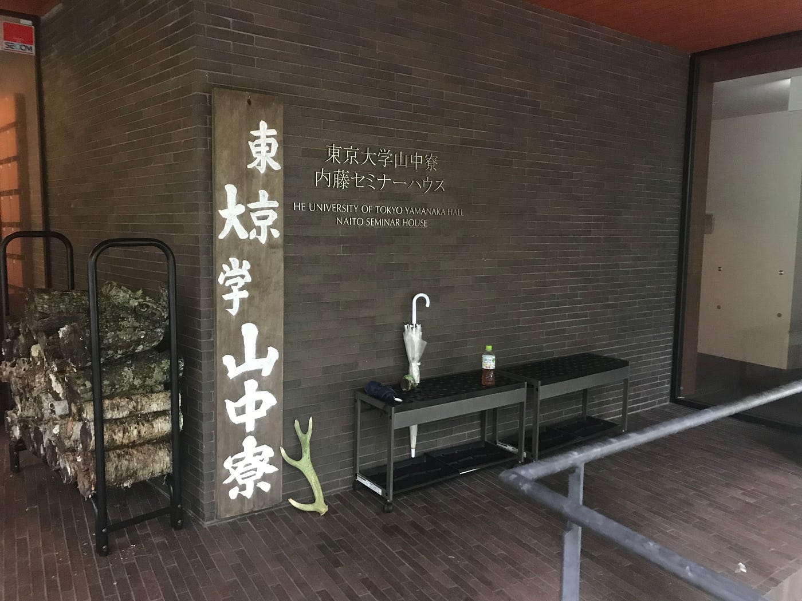
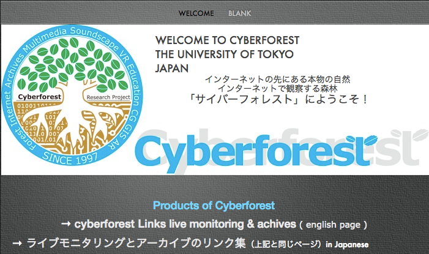
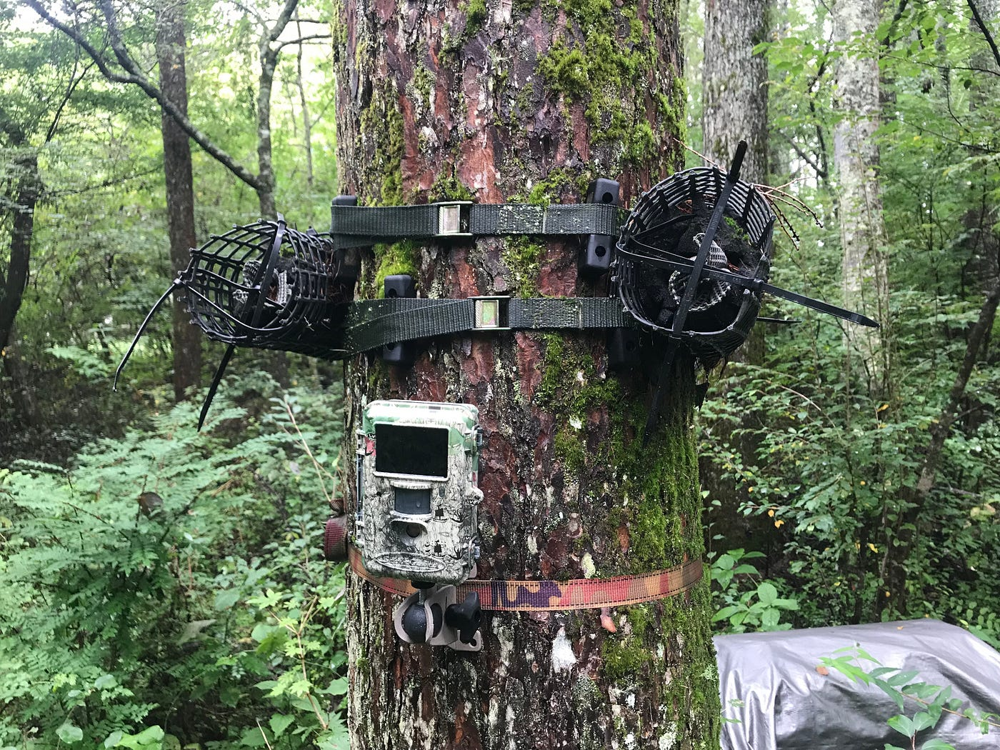
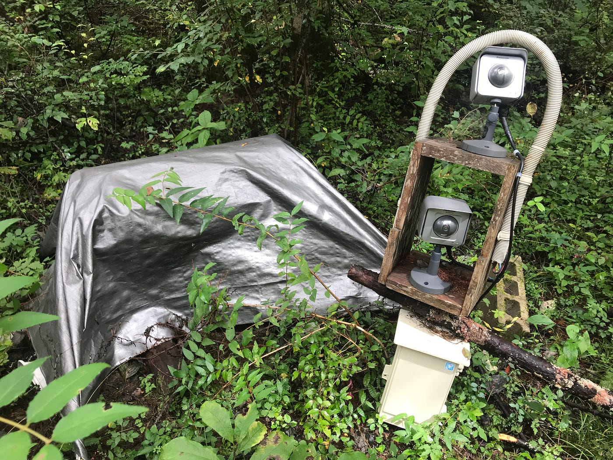
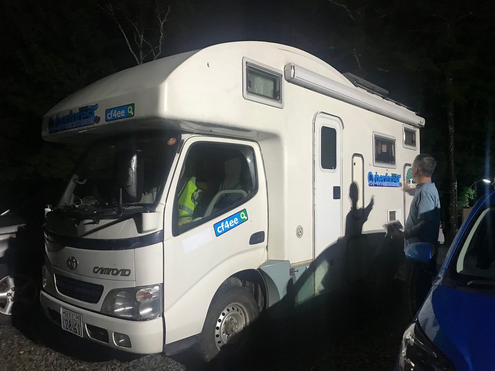
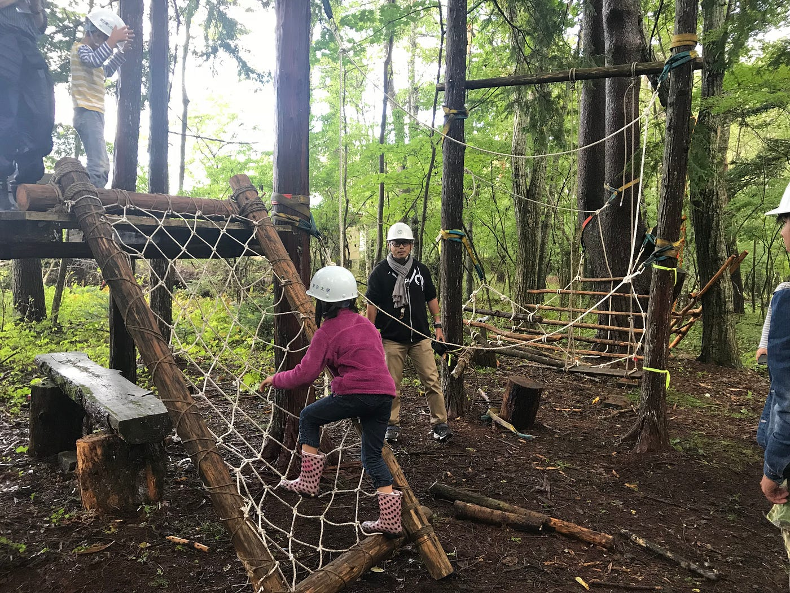
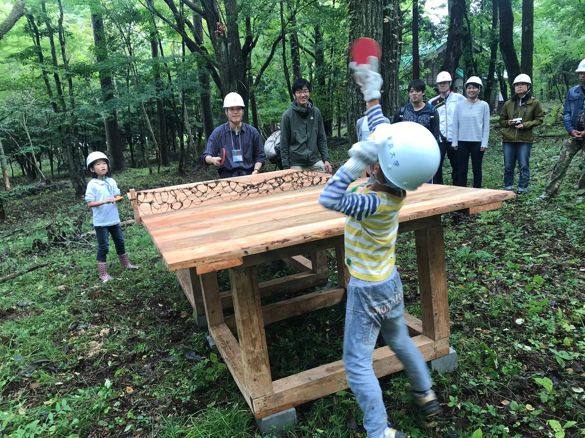
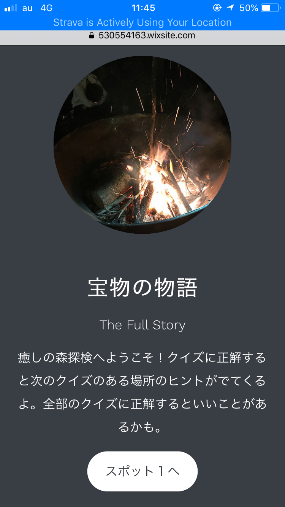

### ゼミ合宿＠山中湖

山梨県南都留郡山中湖村にある、東京大学山中寮へ9月21日から1泊、古橋先生とお邪魔させてもらった。今回の目的はずばり、**自然環境デザインスタジオ**の見学！

東京大学の斎藤先生と藤原先生の指導のもと、東京大学院の学生が５つの班に別れて「人と森をつなぐ」をテーマに制作を行なう4泊5日の合宿の最終日に見学させてもらった。

合宿4日目の夜に現地に到着した私たちは、斎藤先生と藤原先生からお話を聞く機会があった。そこで斎藤先生から「cyberforest」について教えてもらった。古橋先生からも以前、少しだけお話を聞いていたcyberforest。

1995年から森林景観記録ロボットカメラによる映像アーカイブを東京大学秩父演習林で開始し、1997年より研究プロジェクト名を cyberforest と総称している。 2010年 衛星ネットワークを導入して**ライブ音配信**を開始。
テーマは「**インターネットの先にある本物の自然**」。かっこいい。

「音は時には映像より体感的に身近に感じる」。この斎藤先生が言った一言に、確かに！と感心した。テレビで海の映像を見ている時より、目を閉じて海の波の音を聞いている時の方が個人的には、海の近くにいる気がすると思ったからだ。「音」にはそんな心を近づける不思議な力があるわけだが、このcyberforestではそれだけではない、色々な活用法があった。

例えば、森での生物調査。音を聞くことにより、どんな鳥がいて誰が鳴いているのか、この鳥は朝に鳴くから世界のここでは日が昇った頃かな、数年前より聞こえる生物の声が減ったかな、など様々な情報が読み取れるし、アーカイブになっているため証拠にもなる。他にも、リアルタイムの音を聞くことで雨が降っていたり、川の流れが速いなど、その場の状況の判断材料にもなりうる。

私はそれ以外にも純粋に世界各国の森の音がリアルタイムに聞けるって、マニアックだけどとってもかっこいいと思った。こだわりがあってかっこいい。

かっこいいと言えば、私の憧れのキャンピングカーを斎藤先生が持っていて、中を見せてもらった。初めてキャンピングカーの中に入ってみたが、やっぱり夢の世界だった！キャンピングカーはロマンだ！いつかキャンピングカーでアメリカを東西に横断したい！！

と、話を自然環境デザインスタジオの学生の制作発表の話に戻すと、時間の関係上、5班のうち2.5班の発表しか見ることができなかったが、私が見た作品を紹介する。

上の写真はB班の作品。テーマの「人と森をつなぐ」と、「ロープでつなぐ」をかけた作品。時には心拍数の上がるような少し激しい運動をすることはリラックス効果があるらしく、また純粋にもっと森で楽しんでほしいということで作成した。古橋先生の子供達が楽しそうに遊んでる様子を見て、この作品を作成した学生達は非常に嬉しそうだった。

こちらは卓球台でD班の作品。足場の石とネットがオシャレでかわいい作品。森の中で卓球ができるなんて想像の斜め上をいっている！これを見て、私も何か森で遊べる作品を作ってみたいと思った。卓球台はとても斬新で、新しい！そして映える！

こちらの作品は時間の関係上、スタートラインで少し説明を聞いてバイバイになってしまったが、これは「富士癒しの森探検」という名の森に設置されたQRコードを読み取ってクイズに答えていくゲーム！森の探検がさらに楽しくなる作品！1時間ほどでクリアできる内容らしい。ぜひやりたい！！

そして山中湖ゼミ合宿から古橋研究室は直で長野県大町市にある、森と暮らしの郷へと向かうのであった、、

9/21、GPSログ

[八王子〜山中湖 9/21 - Ayame Otsuki's 86.9 km run
Ayame O. ran 86.9 km on Sep 21, 2018.www.strava.com](https://www.strava.com/activities/1856284712)

9/22、GPSログ

[山中湖〜千年の森 9/22 - Ayame Otsuki's 230.4 km bike ride
Ayame O. rode 230.4 km on Sep 21, 2018.www.strava.com](https://www.strava.com/activities/1857687359)

次回のブログは「ゼミ合宿＠森くら(今期２回目)」とつづく。
