### ゼミ合宿＠森くら(今期２回目)

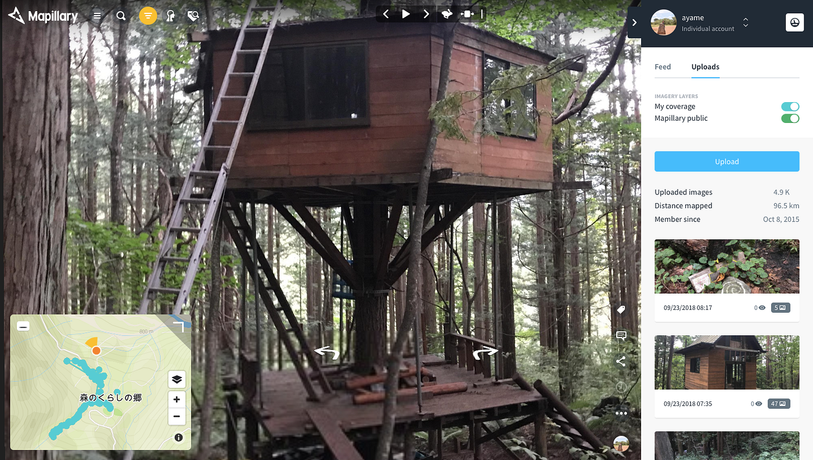

今回は長野県大町市にある、森と暮らしの郷、通称「**森くら**」というツリーハウスがたくさんあるところに、9月22日から２泊3日で行ったゼミ合宿のお話。実は今年の5月にもお邪魔したので今期２回目！

１回目は春だったので山菜が採れたり、はじめて森のがちな獣道を歩いたりとワイルドな体験をさせてもらったな〜。今回は秋なのでキノコ狩りしたよ！春のレポートも貼っとく！山菜についてまとめたりしていたみたい。あと人生で初めてブログ書いたから箇条書きがったり、なんか４ヶ月半前なのに通算26回ブログ書いてるからなんか懐かしい。笑

[GWゼミ合宿@森の中
大槻一発目の投稿、今回はゼミ合宿ネタ(森でのキャンプネタ)を公開します。現代的な暮らしから一気にサバイバルな環境で、獣道を野生の五感で散策してきました。medium.com](https://medium.com/furuhashilab/gw%E3%82%BC%E3%83%9F%E5%90%88%E5%AE%BF-%E5%A4%A7%E7%94%BA-%E6%A3%AE%E3%81%8F%E3%82%89-92703323d298)

この森くらという場所、私大好き！今期2回も来ちゃうぐらい大好き！来年大学卒業しても来たいな〜って密かに思ってる。古橋研究室の学生に混ざってしれっといたら暖かい目で見守ってぜひ話しかけてください！！

さてさて、今回もご飯作りを手伝ったり、ツリーハウスの階段作りを手伝ったり、キノコの勉強したり、ドローンの空撮テクを後輩に伝授したり、色々と活動した。夜のみんなで焚き火を囲んで飲む時間も大好き。少しづつ紹介していく。

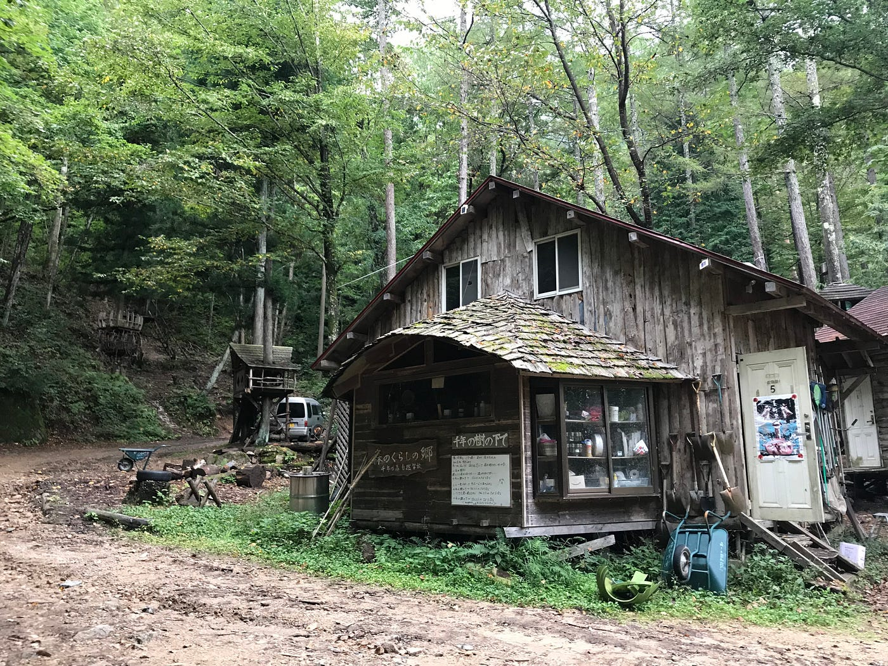

森くらはこんなところ！ここはまさに中心となるところでこの周りに様々なツリーハウスがある。この中はキッチンになっているよ。

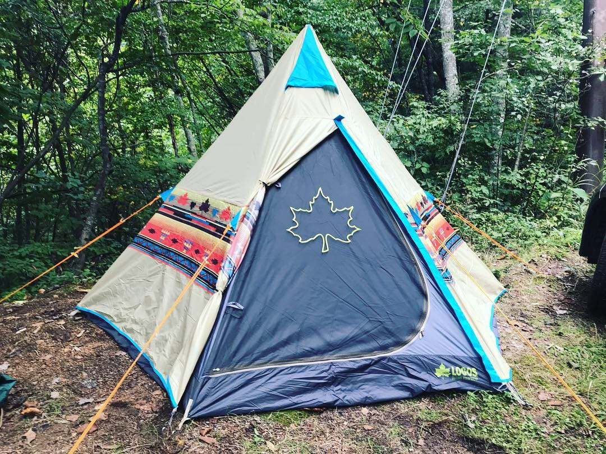

初日は山中湖をお昼前に出て、15時頃に森くらに到着！そして私が人生で初めて買ったマイテントを立てた。先生がオススメしていたやつを可愛さに惹かれて先週買った。とってもかわいい！

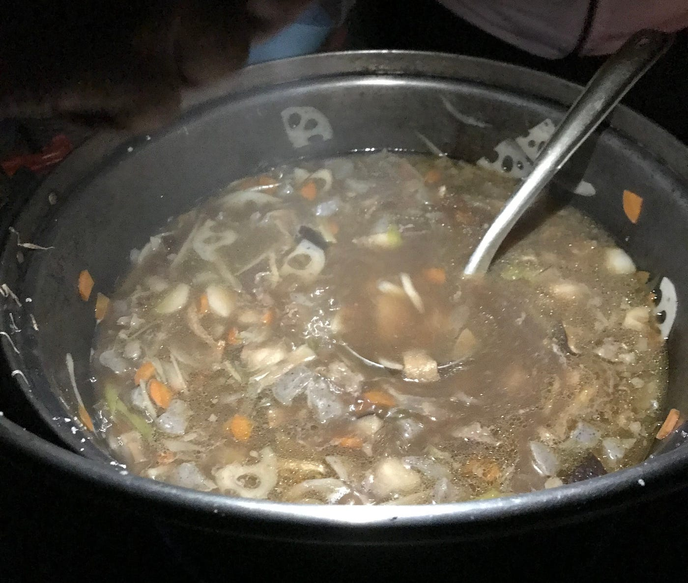

初日の夕飯作りを手伝い、半年ぶりに包丁を握った。包丁にあまり慣れていない私は、包丁での野菜の剥き方などを教えてもらいながらの作業。森くらでは牛乳パックを洗って広げたものをまな板として使う。使った後は焚き火で燃やす。衛生的で賢い！

2日目は午前中は薪運びのお手伝い！山で数ヶ月前に切り倒した木(雨にさらして樹液を落とすためにしばらく放置した木)を小屋の近くに運ぶ作業！木を転がして車道まで落とし、そこから車で運ぶ。薪を切る作業はチェーンソーを使うので、森の先輩方が担当。必死に作業をしていたので、写真んを取り損ねた、、。トラックの荷台に乗って山道を走るのは留学ぶりで、やっぱり最高に楽しい！

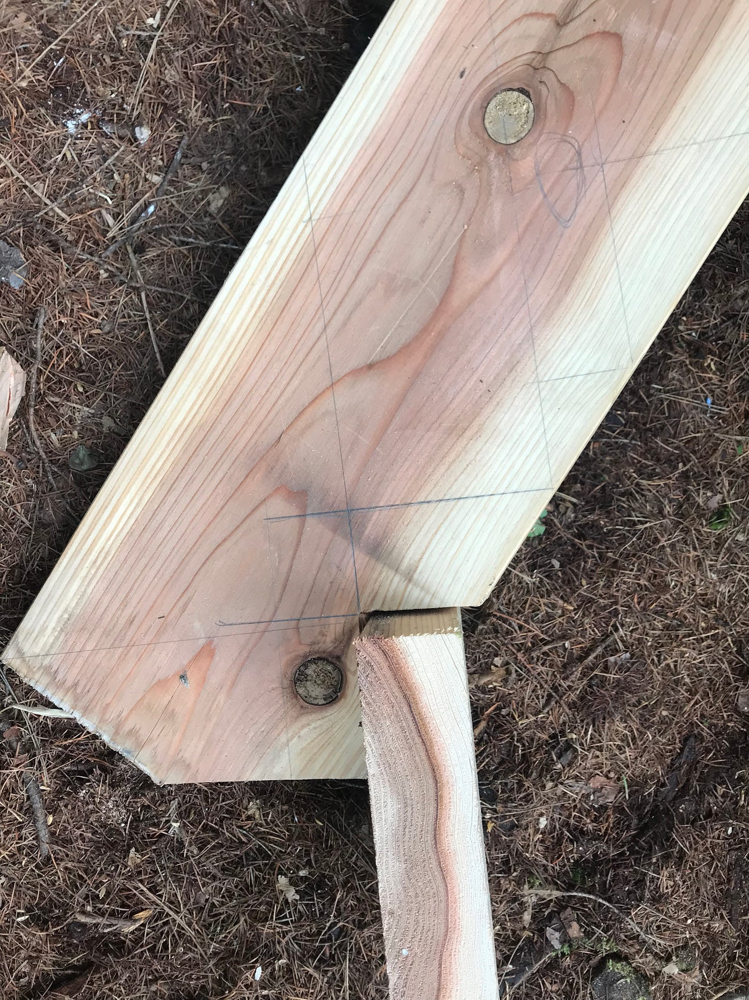

午後はツリーハウスの階段作りのお手伝い。木を切る作業や採寸作業をした。めちゃめちゃ楽しくて、森の先輩方は大工の先輩方でもあり色々教えてくれた。そして同じ学生のゆうなと、「木ってすごい！」という結論に至った。笑

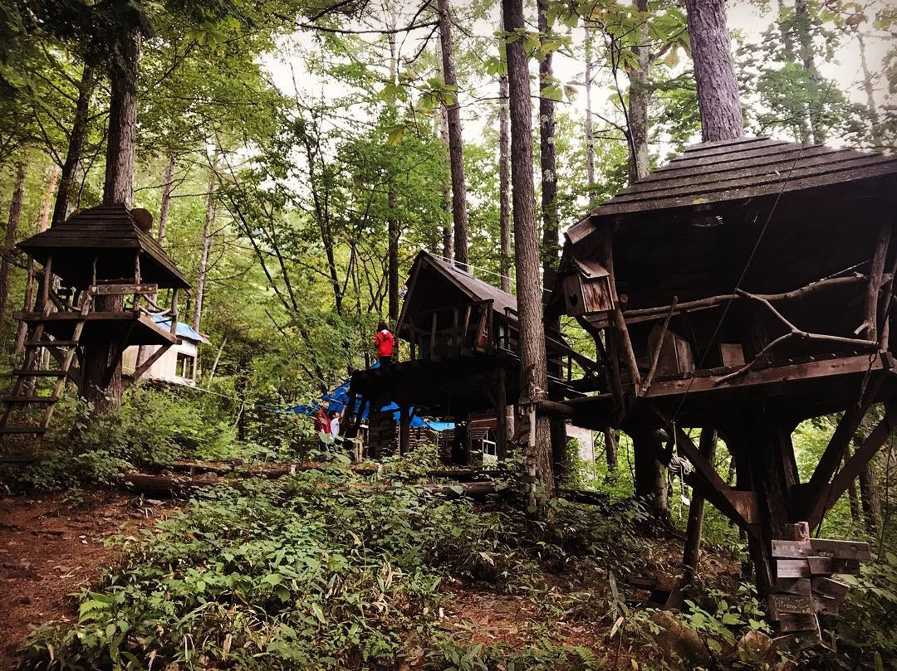

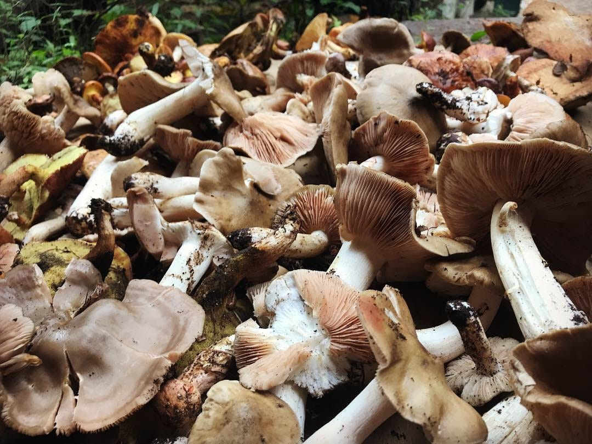

今年は豊作らしくて、子供達を含めたキノコ狩り組が大量に収穫してくれた！夕飯はこのキノコ達をふんだんに使ったキノコスープ！森くらで主に収穫できる食べれるキノコはハナイグチ、チチタケ、ウラベニホテイシメジ。ゼミ合宿を通して学んだ自然の知識をGithubでリポジトリにするので、リンク貼っとく！

[AyameO/nature_study
ゼミ合宿等で学んだ自然の知識. Contribute to AyameO/nature_study development by creating an account on GitHub.github.com](https://github.com/AyameO/nature_study)

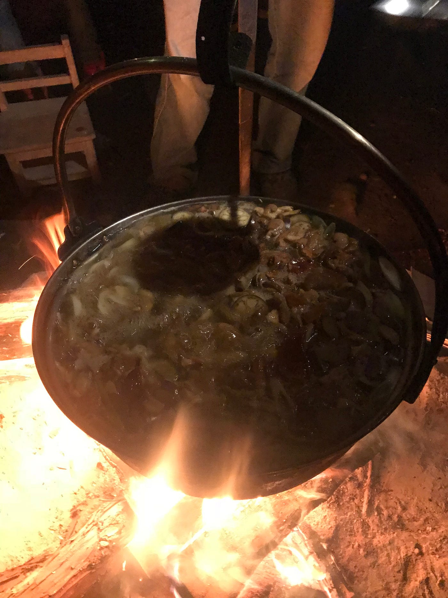

あと山の中を散策していたら！なんと！ずっと拝んで見たいと思っていたカモシカに出会った！！天然記念物のカモシカさん！あやが間近で発見！道を間違えてしまい散策中、目的地にたどり着けなかったけどカモシカに会えたから結果オーライ！

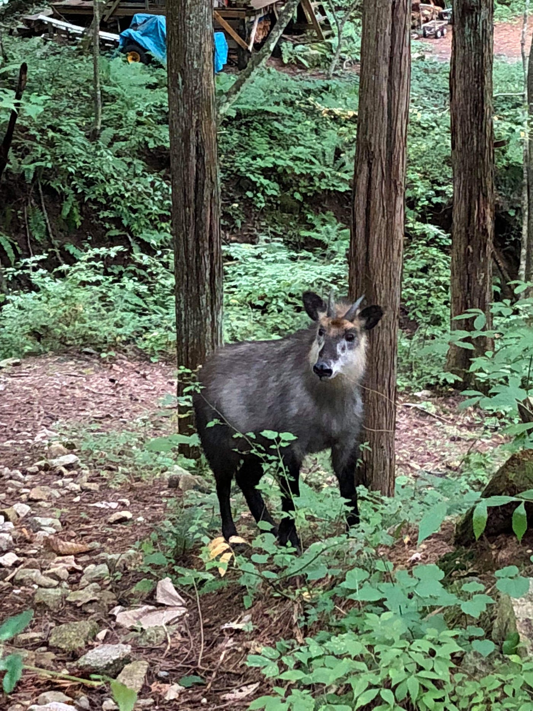

3日目はドローンでの空撮方法を後輩のしょうまに伝授！しょうまが今回のゼミ合宿の動画を作るらしいので期待！！途中で前日に手伝ったツリーハウスの階段作りの作業進歩を見に行ったら、、なんと、、私たちは片方の採寸が間違っていたみたいで、仕事を増やしてしまい大変に申し訳ない。。

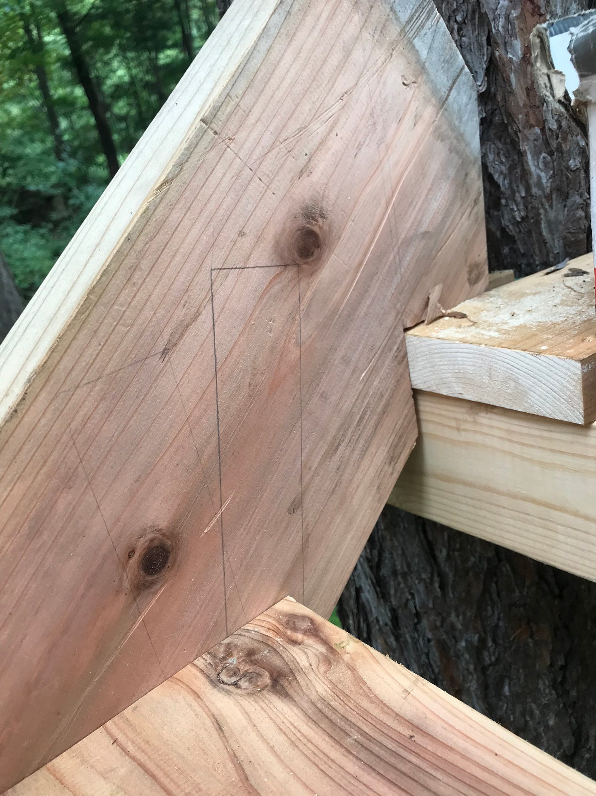

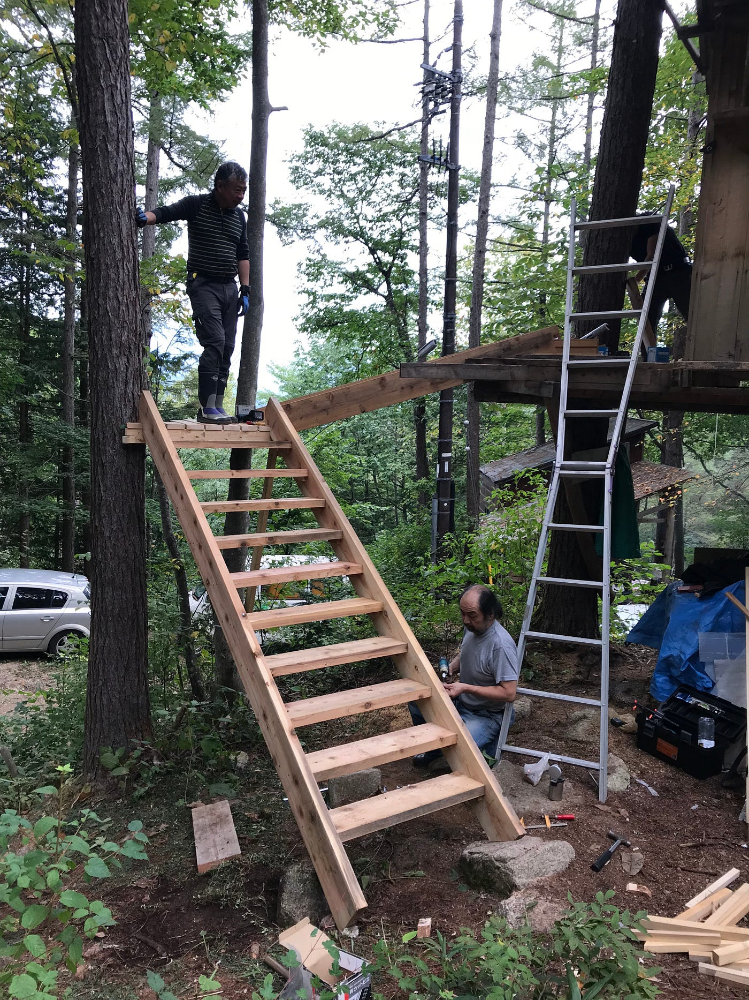

でも前日に切った木材が組み立てられていて、階段になっていた！これから色を塗って手すりを作るらしい。自分が少しでも携われるって素敵っす。「今度来た時、私がコレ作った」って言っていいよと優しい一言をいただいた。

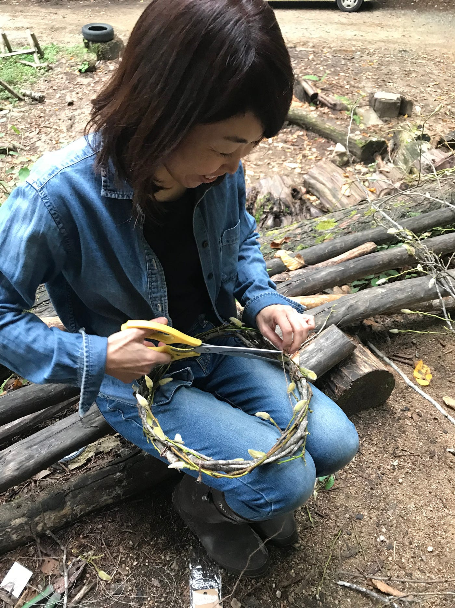

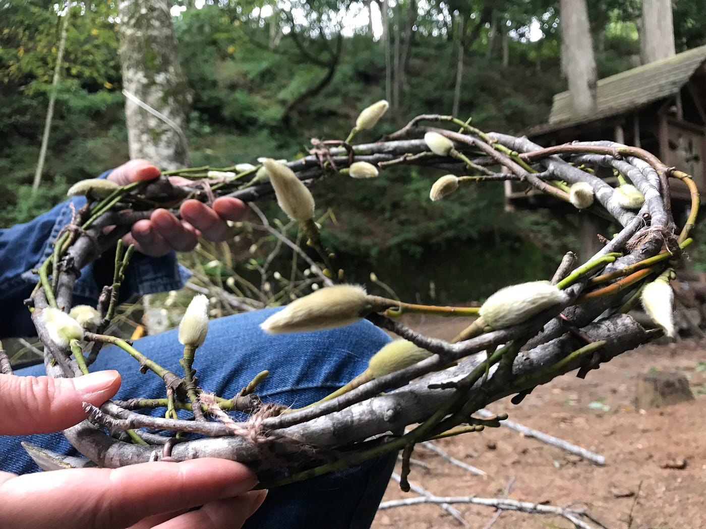

りゅうや君ママ(小林さん)がリースを作ってた！木の種類はモクレン科でタムシバ(別名 ニオイコブシ)。 この毛でモコモコしている部分は春になったら花が咲くところ、つまり蕾！太陽の光に反射してキラキラになるらしい。かわいい！

9/22、ゼミ合宿＠森くら1日目のGPSログ。

[山中湖〜千年の森 9/22 - Ayame Otsuki's 230.4 km bike ride
Ayame O. rode 230.4 km on Sep 21, 2018.www.strava.com](https://www.strava.com/activities/1857687359)

9/23、ゼミ合宿＠森くら2日目のGPSログ。

[千年の森 9/23 - Ayame Otsuki's 19.7 km run
Ayame O. ran 19.7 km on Sep 22, 2018.www.strava.com](https://www.strava.com/activities/1859853166)

9/24、ゼミ合宿＠森くら3日目のGPSログ。

[千年の森〜八王子 9/24 - Ayame Otsuki's 226.2 km run
Ayame O. ran 226.2 km on Sep 24, 2018.www.strava.com](https://www.strava.com/activities/1862279585)

古橋先生、運転ありがとうございました！森くらの森の先輩方もお世話になりました！またお願いします！！

以上、今回はゼミ合宿＠森くら(今期2回目)の活動について。
次回は卒論のテーマに戻る！
