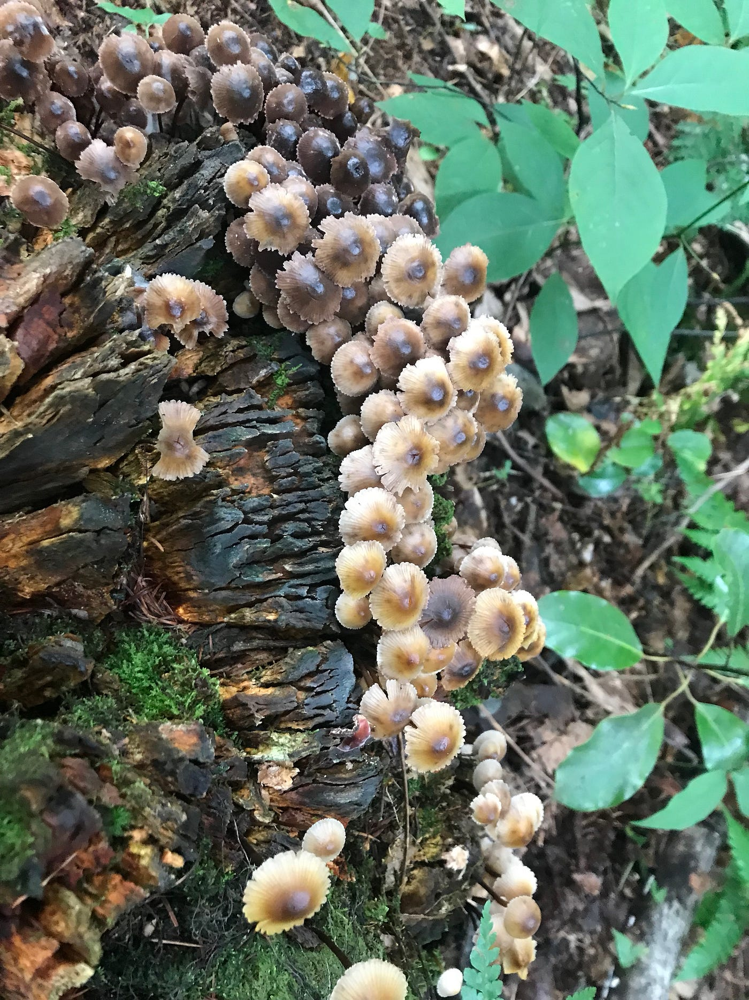
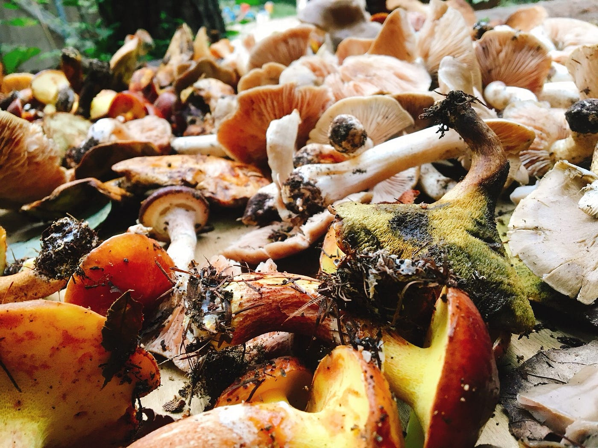
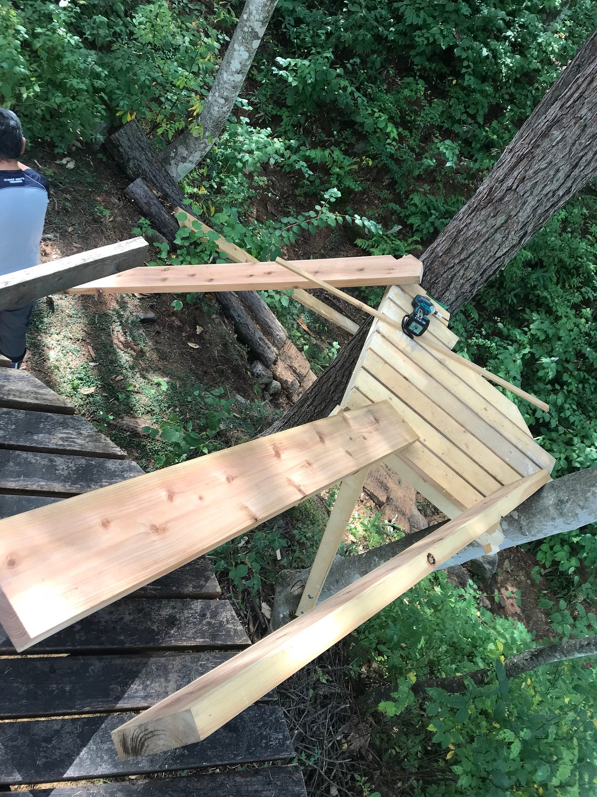
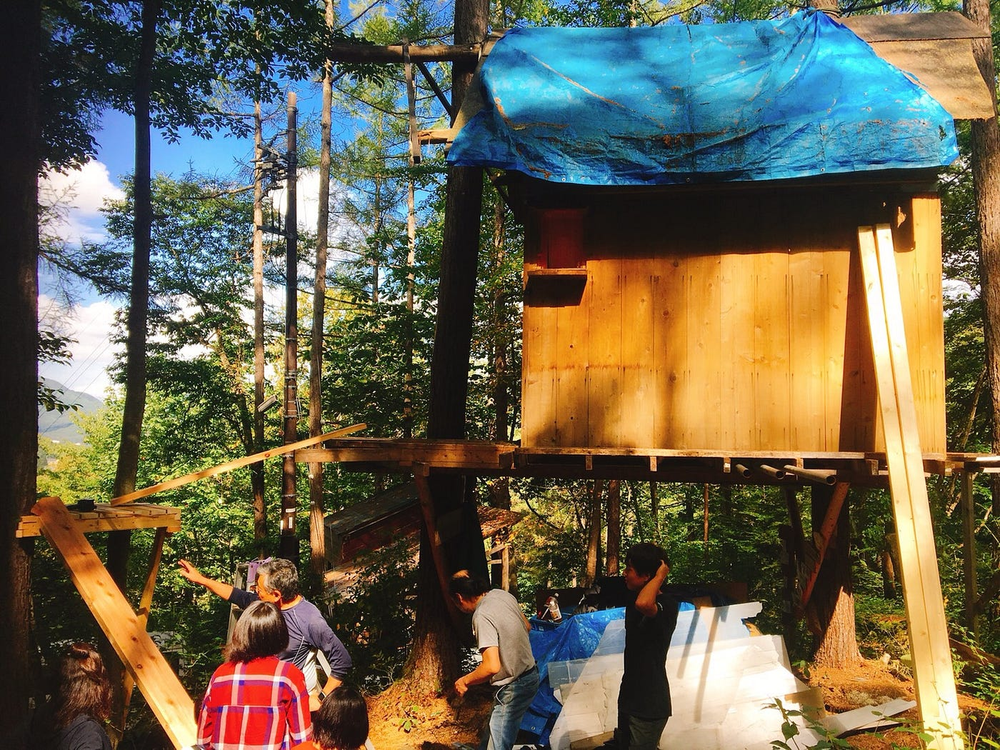

### 森くらのおまめ

三連休を使って、長野県大町市にある森と暮らしの郷にゼミ合宿行ってきました！わたしはこうみえても自然もキャンプも大好きです！！現代の大学生って（特に青学生）毎日スマホみてインスタして居酒屋写真盛れた投稿〜て感じの毎日ですけど（偏見でごめんなさい）、自然の中で時間とか写真とか忘れて過ごす時間ってやっぱり必要だなってわたしは思います。報告のために必要な写真を多く撮り忘れたりスマホをほったらかしにしてしまったことはごめんなさい。今回も色んな体験をさせていただいて、たくさんの人にお世話になって。疲れて途中思考停止してしまうくらい（笑）ここの人達はすごいなと。本当に感謝です。

皆さんより遅れて着いた日はすでに作ってくださっていた夕ご飯を食べました！初日は何もお手伝いできなかったけれど、森くらの皆さんが快く迎え入れてくれて、大好きな火を囲んで皆さんとお話しできるだけで楽しかったです！真っ暗の中テントを立てたりキャンプ場を案内してもらったり、キャンプに来たというかんじ！

朝を迎えて早速朝ご飯作りのお手伝い。わたしは火の起こし方を教えてもらい、任せてもらいました。空気を入れるとか、風の向きを読むとか、意外と難しい！もっと時間がかかるものだと思っていたけれど、森くらの方にかかればすぐについて、感動していました。

午前中は薪を運ぶお手伝いをしました。火を起こすのに使う薪。けど元の木はもちろん大きい！わたしの力ではとても運べず、山の上から下に向かって転がしていくのすらできない木がたくさんありました。そしてとても重労働、、これを毎回2、3人で1時間もかけずにやっていると聞いて、恐ろしくなりました。自分のできることでさえやるのに必死、、でも荷台に乗るのは最高に楽しかった！あやめと何回乗せてもらったかわからないね！笑

午後はツリーハウスの建設お手伝い！の予定が急遽キノコ狩りに行くことになりました。キノコ狩りは初めてだし、知識もないしどういうところに行くのかも知らなくて不安だったけど、行ってみたら想像以上に過酷な山道だった！笑もはや道はない！けどさすが皆さん慣れていてどんどん進んで行くんですね、わたしはついていくのに精一杯。正直キノコどころではありませんでした（笑）何度も転んで泥だらけになったけれど、想像以上にたくさんのキノコがあり、大量収穫！！あんなに過酷な道を行くことも中々ないのでとてもいい経験でした。

そのあとは先生について山を散歩。ドローンを飛ばす予定が、道を間違えお散歩で帰りましたが（笑）行けてなかった場所に行けて楽しかった！途中野生のカモシカに遭遇！わたしが1番前にいて、道を曲がったらすぐそこにいてこっちをみつめててびっくりしました。わたしがギャーギャー騒いでもカモシカちゃんはびっくりしていなくて、ジーッとこっちをみていました。わたしより大人なんですね。うるさいってあやめに怒られました。ごめんねカモシカちゃん、、

戻って夜ご飯は採ってきたキノコ汁を含めたご馳走！食材を買ってきてくださったり作ってくださったり、たくさん振舞ってくださいました。美味しかったな〜

3日目はできなかったツリーハウスのところへ。半日しか経っていないのに、もう階段のほとんどが完成していました。「最初に登っていいよ」って言っていただいて、登った時の景色が忘れられません、、仕上げの釘打ちを任せていただいて、初の工事体験！みている分には簡単そうだけど、やってみると難しい。最後にやっと綺麗に打てるようになりました。いつか完成したツリーハウスをみたいなあ〜

皆さん本当にたくさんお世話になりました。出会ったばっかりなのに、皆さんの温かさがとても嬉しかったです。また行きたい！
