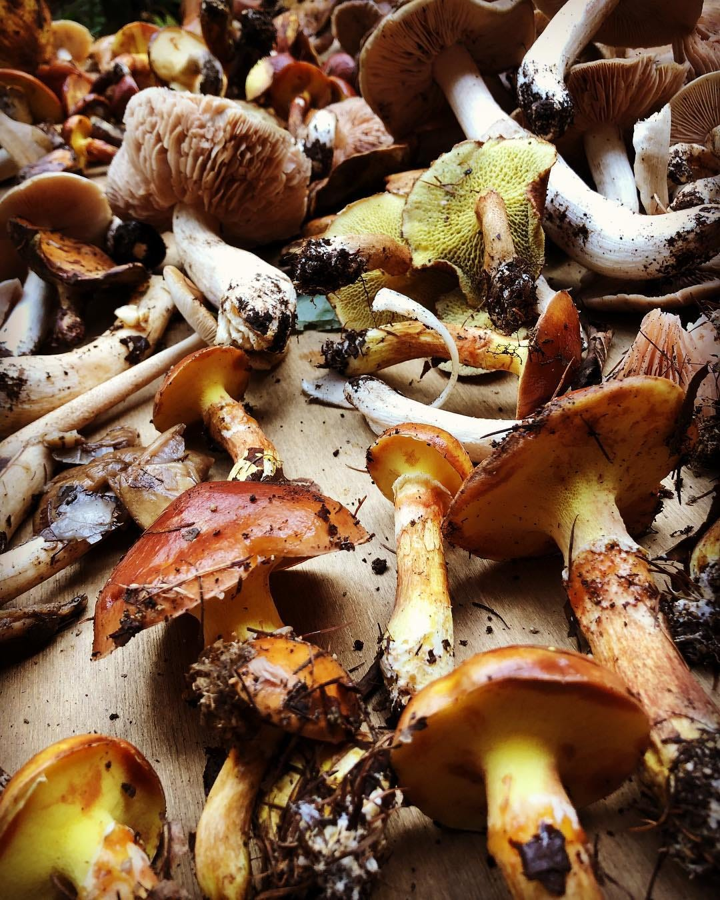

### アウトドアゼミ合宿！＠信濃大町

9/22~9/24 長野県信濃大町にある「千年の森自然学校」というところにキャンプしにいってきました！

[午後のランニング - YUNA WATANABE's 218.3 mi run
Yuna W. ran 218.3 mi on Sep 22, 2018.www.strava.com](https://www.strava.com/activities/1857871265?utm_content=22923852&utm_medium=referral&utm_source=twitter)

1日目

私のミスでだいぶ無駄なドライブをさせてしまいました・・・

森くらについてからは軽い説明を受け、火を囲みながら作ってくれていた美味しいご飯をたべ、暗闇のなかのテント張り！明るいうちに来るべきですね本当に。

２日目

[朝のランニング - YUNA WATANABE's 1.6 mi run
Yuna W. ran 1.6 mi on Sep 23, 2018.www.strava.com](https://www.strava.com/activities/1859975424?utm_content=22923852&utm_medium=referral&utm_source=twitter)

朝５：３０に起きて朝食の準備！寝袋で寝たので寝付けないかなーって思ってたら案外スッキリ起きれました！ 私は鉄板で食べ物を焼いていたのですが、卵をたくさん割りました！卵アレルギーなので卵料理をする機会がなく、人生で４回？ぐらいしか割ったことなかったので・・・１０個以上割ることができて私の卵割りスキルが格段にアップしました！ あとは、大勢の食事を作るってことは「効率」を考えなければいけないということ、ある程度の妥協は必要ということを学びました。 鉄板が１枚しかないなかで、全ての料理を熱々で提供するのは無理！うまく保温とかを使って美味しくたべました〜

そのあとは薪を運ぶ仕事！薪を転がすと聞いていたので、パジャマのまま参戦したらえらい目にあいました・・・笑 完全に知識＆質問不足！私の力じゃ持ち上がらない木もたくさんあって、力不足を実感。林業の大変さを身を以て体感しました。森くらの人は私たちより全然年が上なのにハキハキと動いてたのは、力だけではなく、知識を使って運んでいたそうです。こういう持ち方をしたら腰を痛めない！とか！ なんでもかんでも力技じゃないんですね、これもしっかり最初から質問しとけばよかったと後から後悔しました。

午後はツリーハウスの階段作りのお手伝い！

初めて木材を機械で切りました・・・！そしてはじめての家具作り（？）あやめと一緒にやってたのですが、簡単そうに見えて結構頭使いました笑 （しかも私たちが２時間ぐらいかけてやった作業は全部間違えていたそうで、あとでやり直してくれたそうです・・・申し訳ない・・・）私たちにはまだ難しかったみたいです笑 あと、木ってとても丈夫なんだなと思いました！早く完成版がみたいな！

2日目の夜ご飯は超豪華！

・キノコ狩り班がとってきてくれたきのこ鍋

・さんまの塩焼き

・ラム肉を主としたBBQ料理

・里芋などのホイル焼き

・焼きリンゴ！！！！！！

たべきれないぐらいのご馳走で全部ほんとに美味しかった・・・！焼きリンゴに関しては大好物だったのでまじで幸せでした！

タグと別日のストラバに関しては帰宅してから載せます、ごめんなさい…！
