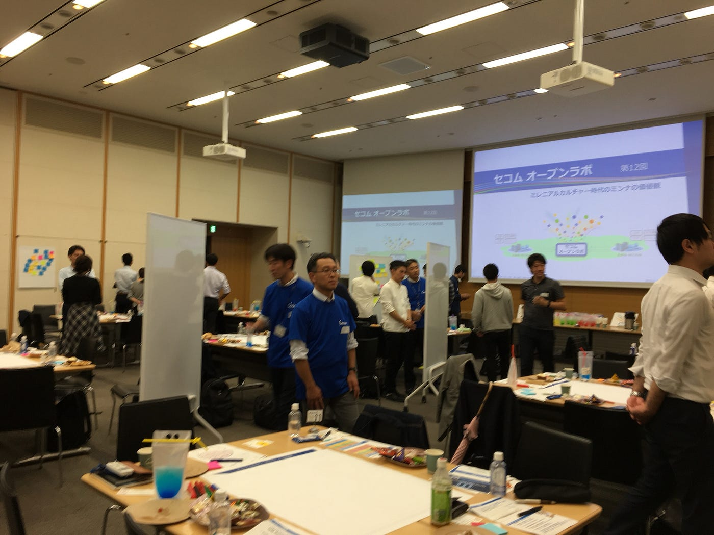
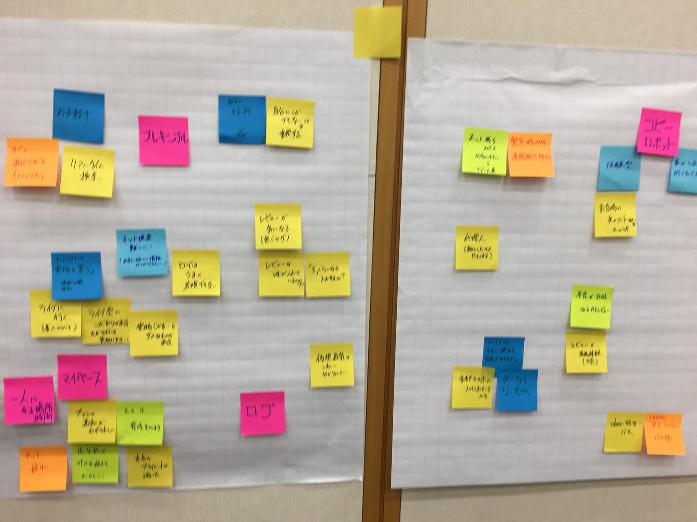
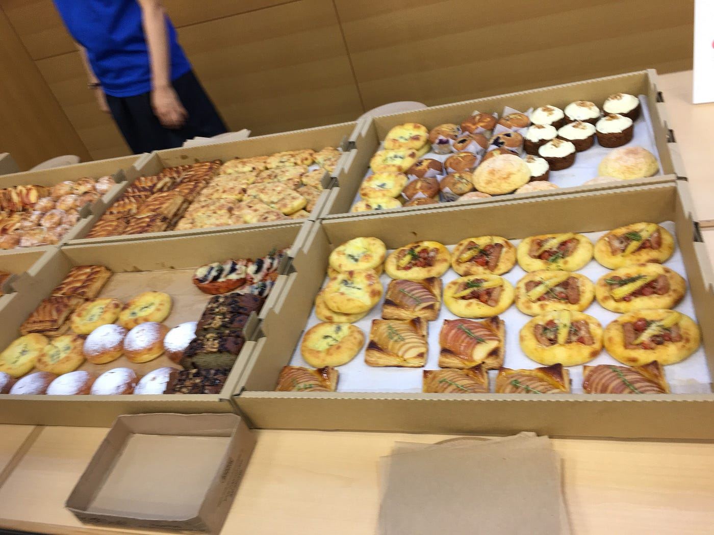

### セコムオープンラボ/アイディアソン

9月27日、セコムオープンラボに行ってきました！

テーマは

### 「ミレニアムカルチャー時代の皆の価値観」

です。

ミレニアムカルチャーと社会人の方で議論をしながら、「これからの社会に必要なものとは．」を考え抜きました。

1. 私の脳内マップ

まずは12のチームに分かれ、アイスブレイクとして1人1人が

「学生時代なにを考えていたか」

という脳内マップを作り発表しました。

私は初対面の人と議論…などが苦手な方なので最初のアイスブレイクや雰囲気がとても大事だと思っているのですが、

この脳内マップはすごく良いと思いました！

自分が好きなことや大事にしていること、考え方などが出てくるので人となりが理解しやすい！なにより楽しかったです。

２.新しい時代のカルチャーの中で不安になること、不満

自分が思う今の社会(食、ネット、服など全部)の不安などを付箋に出し合いました。

学生と社会人の方では、「ネットがどのくらいから生活に関わっていたのか」という違いがあり、その点で価値観が違う面があり楽しい議論になりました。

たとえば音楽が買うものではなくなっていたり、SNSへの関わり方や考え方が全く違っていたり。

お互いの世代もネット時代への不安があることが分かりました。

3.前を踏まえた、新しい安心感を考える。

こんなものがあれば不満がなくなるのに…ということをチームで出し合い発表しました。

まずは言葉で「こうなったらいい」ということを出し合い、製品を考えました。

作れるかどうかなどはあまり考えず、思いつく安心になるものを考えるのは刺激的な会話ができて楽しいものでした。

12のチームそれぞれが全く違った案がでていて、しかし共感を得られる製品案ばかりだったので、

ミレニアム世代もそれ以外の世代も不安は大きく違うわけではないと分かりました！

社会人の方と議論できたことはとても貴重なものでした。就活とは違い話しやすい雰囲気で、真面目な話を楽しく議論した機会はあまりなかったのでとても良かったです。

おしゃれなパンもあったよ！
