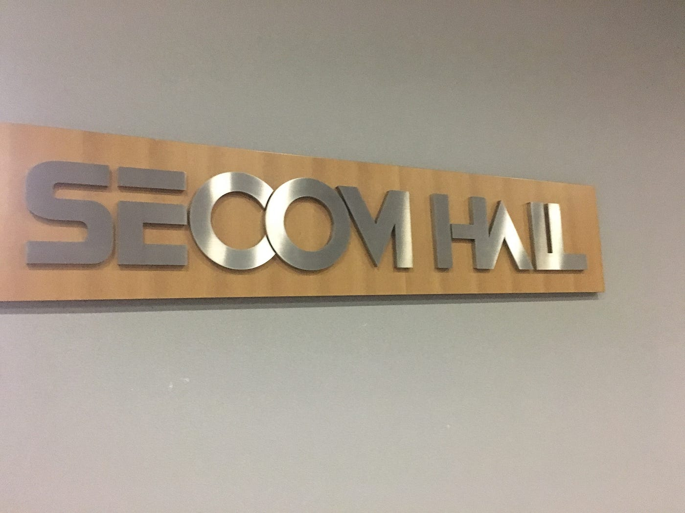
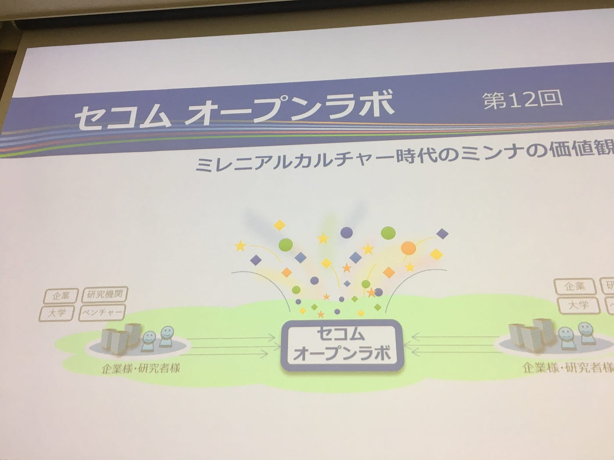
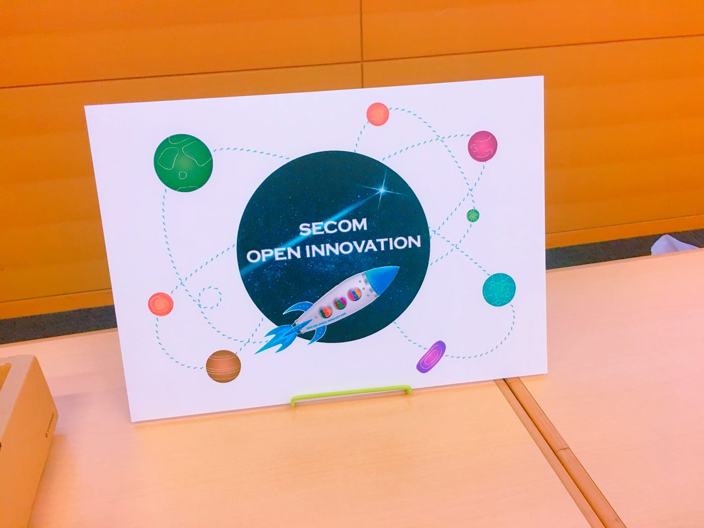
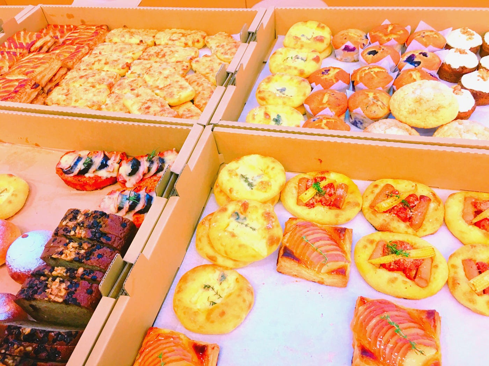
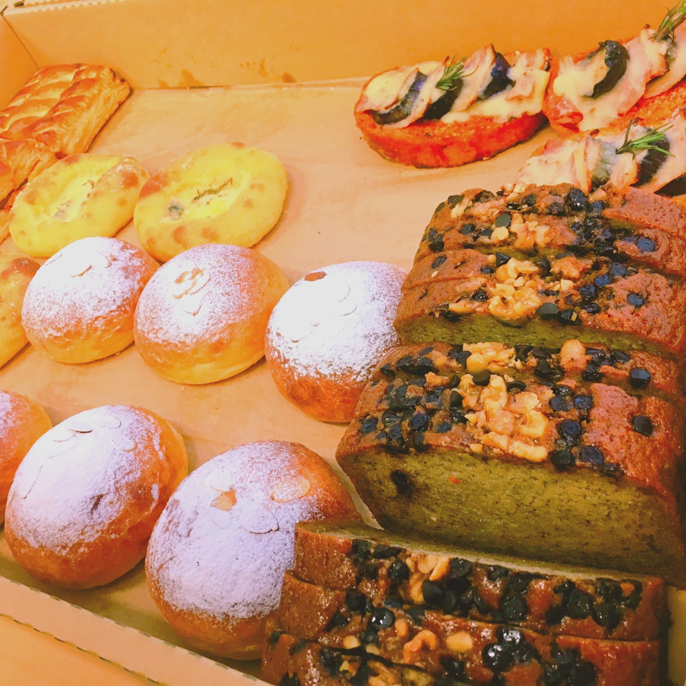
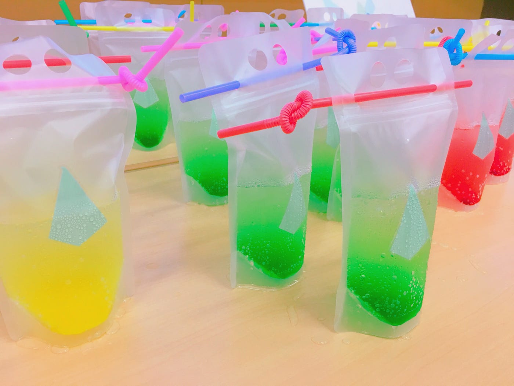
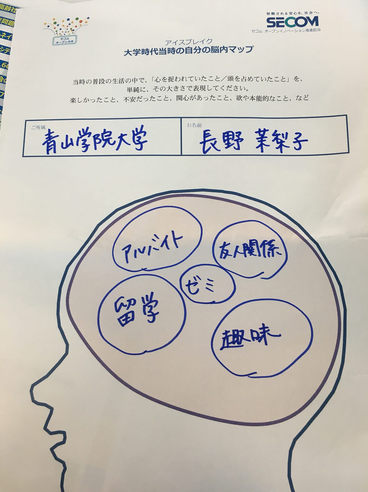

### 世代による価値観の違い。〜セコムオープンラボ 〜

ーーーーーーー

2018.9.27

セコム本社にて

「セコムオープンラボ〜ミレニアルカルチャー時代のミンナの価値観〜」

が行われ、参加してきました！

毎回、テーマに沿った軽食やドリンクが提供されているようで、今回は様々な種類のパン、かき氷ドリンク、コーヒー、お菓子等々。目もお腹も満たされました…！とぅんく！

さて、イベント内容です。

今回は大人と学生が混ざったグループ(6〜7人)で、話し合いをして、ひとつの提案を出す、という流れです。

世代や、環境の違う人々が日々感じる課題や、疑問、願望を共有することで、新しい時代に本当に必要なアイデアが出せるんだと思いました。

同年代同士の話し合いでは出ないような、意見が出て、とても興味深かったです。

ーーーーー

わたしのグループで、

バブル期を20代で経験していた方の意見としては、

今は逆に物がない生活を好むようになったと仰っていました。 (若い頃は欲しいものが沢山あったそうですが。)

本当に良い生活は、物が沢山あること？質の良いものが少数あること？

この話題について盛り上がってお話をしました。

私含めて、若い世代は選択肢の多い生活。

少し上の世代は選択肢の少ない生活を好んでいるように感じました。

どっちがしあわせなんだろう……（´-`）.｡oO

ーーーーーーーー

さてさて、イベントの大筋に戻ります。

まず、アイスブレイクとして、学生時代のじぶんの脳内マップを描き、グループ内で共有しました。

脳内マップを使った自己紹介の後、いよいよディスカッションです。

テーマは

### 「新しい時代のカルチャーの変化、その背後で不安になるものは？」

つまり、今モノを消費したり、使用したり、購入したりする際に不安に思うことや、重視することを挙げていきましょう、ということ。

◎安全性

◎信憑性

◎この先も有用か

◎新規性

などが上がりました。

後半のディスカッション、ワークショップでは、不安に思うことを参考しながら、生活を豊かにしてくれるサービスやアイテムを未来に向けて考案しました。

_**実現可能かどうかは、考えずに！_**

がポイントです。未来の不思議道具やシステムがグループごとにどんどん上がりました。

続きは次回！更新します(*^ω^*)
