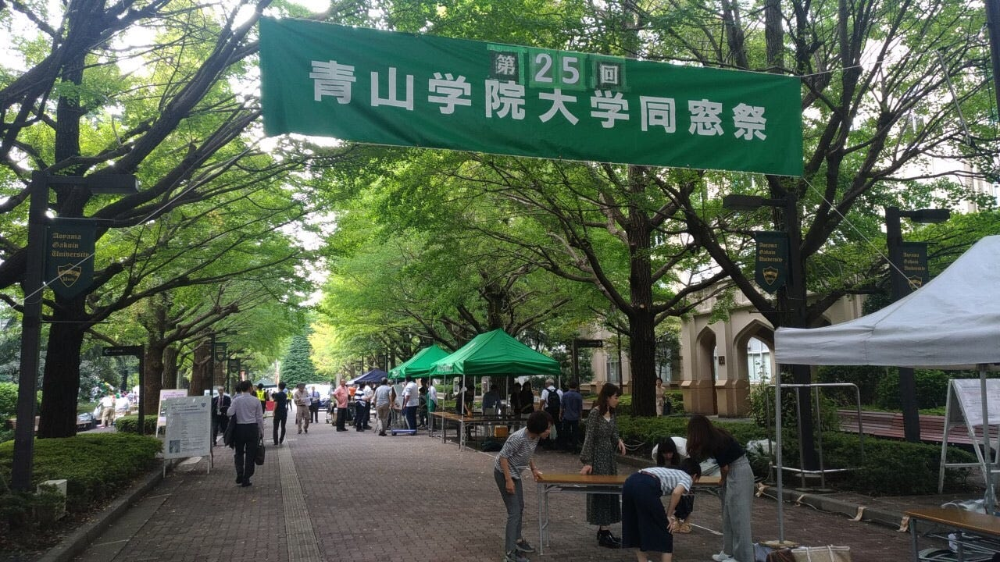
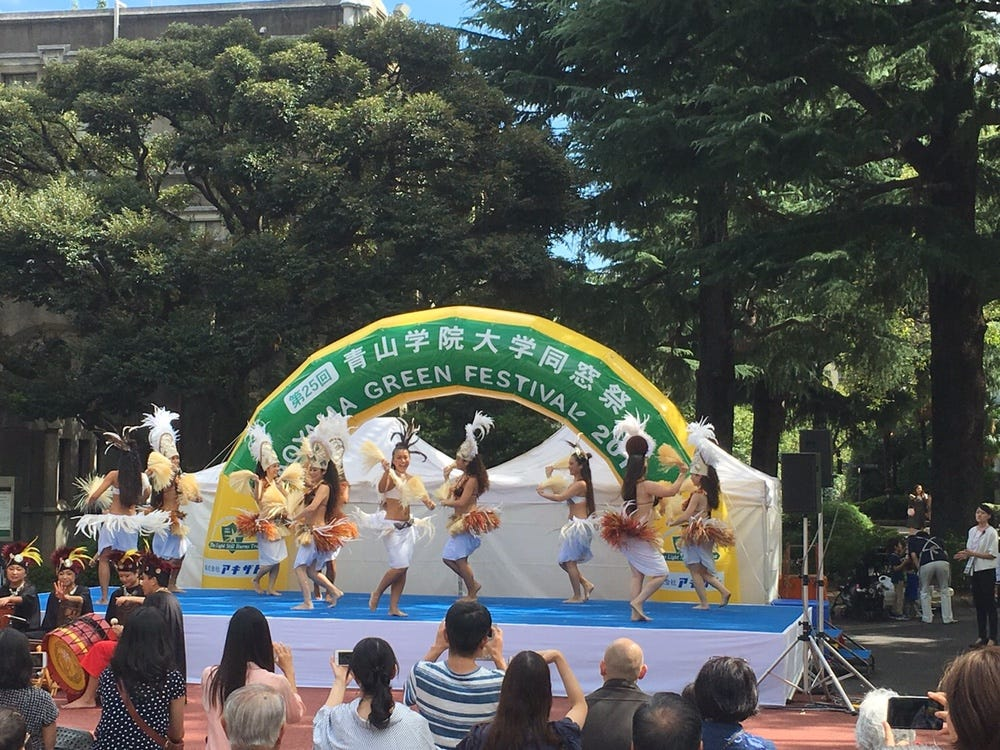
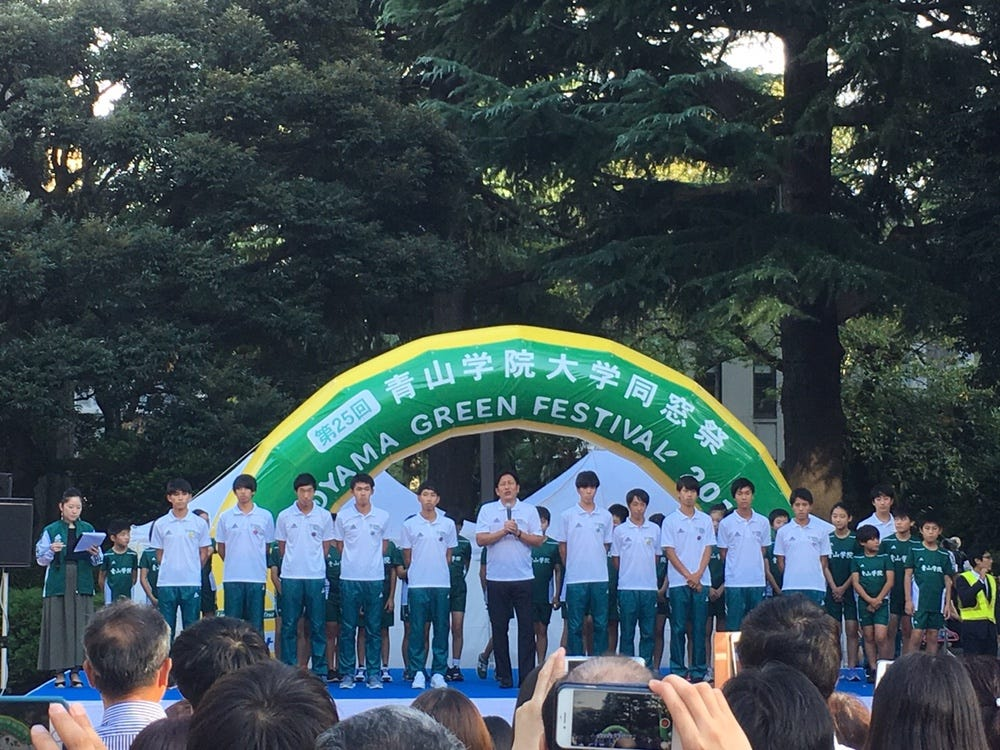
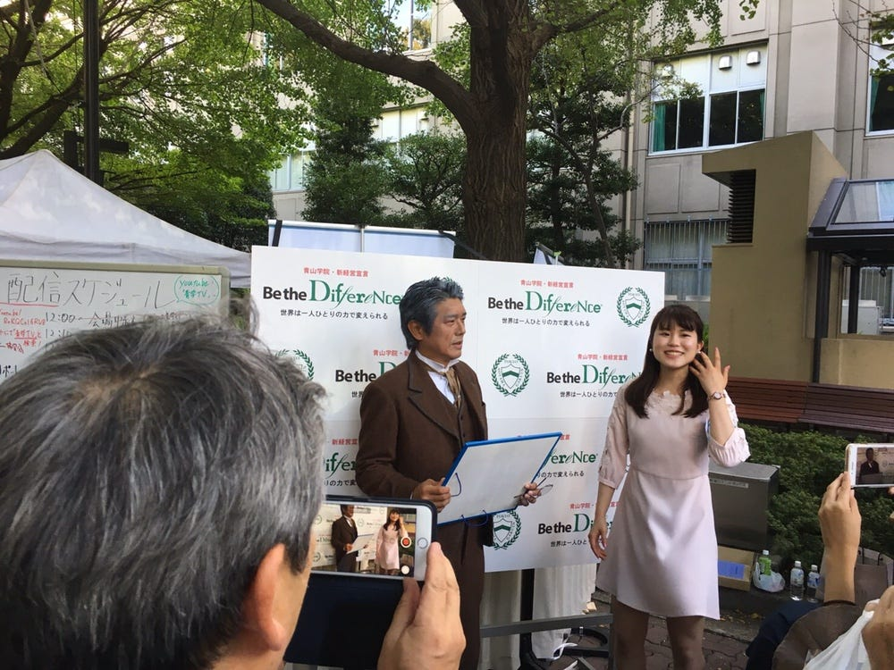

### 同窓祭に参加してきた！！

今週は他のTEDx紹介はおやすみして、自分たちの大学の旬なイベントについて書きます。

先週の日曜日、９月２３日に青山学院大学青山キャンパスで行われた同窓祭、「AOYAMA GREEN FESTIVAL」に参加してきました！

この同窓祭は青山学院校友会大学部会を中心に開催するOB／OGの学園祭であり、参加者は約4000人、参加団体400を数える大きなイベントだそうです。以下、公式ホームページ。

[AOYAMA GREEN FESTIVAL（青山学院大学同窓祭）のサイトへようこそ！
Edit descriptionaogaku-doso.jp](http://aogaku-doso.jp/)

今年初めて参加させていただいたのですが、何よりその規模の大きさに驚きました！！
早めに青山祭やってるのかと思った、、、。

受付や出し物をされているOBOG方々の熱気も現役生に全く劣らず、活気あるステージがたくさんあり、現役生が参加しても楽しいイベントでした。

また今力が入れられている青学TVなどのフル活用による広告、PRも大規模。
大人の力と、青山学院大学のコネクションの強さを実感しました。

ちなみにこの青学TVですが、
前に一度こちらのブログでも紹介させていただいたはみ出すカフェのみなさんの取材に突然乱入して一緒に映ってまいりました笑
TEDxAoyamaGakuinUとしても、１２月に取材していただく予定なので、
みなさんぜひご覧ください！

[https://aogakutv.jp/](https://aogakutv.jp/)

また私は訳あってガウチャーホールで行われたメインチャリティーイベントの運営のお手伝いをさせていただいていたのですが、列の整列をしている時にある奥様方と会話していると、
「私は全く青山学院大学のOGとかではなく関係ないけれど、市村正親さんのファンとしてはこうやってみじかなところでイベントをやってくれたり、こうやってお祭りとして盛り上げてくれるのはいいわよねー」
という声をいただきました。

参加するまではOBOGによる同窓祭と言われても全く想像がつかず、まだ卒業していないのに楽しめるのかどうかと疑問に思っておりましたが、
十分身になるものでした。

来年からはぜひOGとして当日だけでなく、開催側として最初からお手伝いしたいですね。
