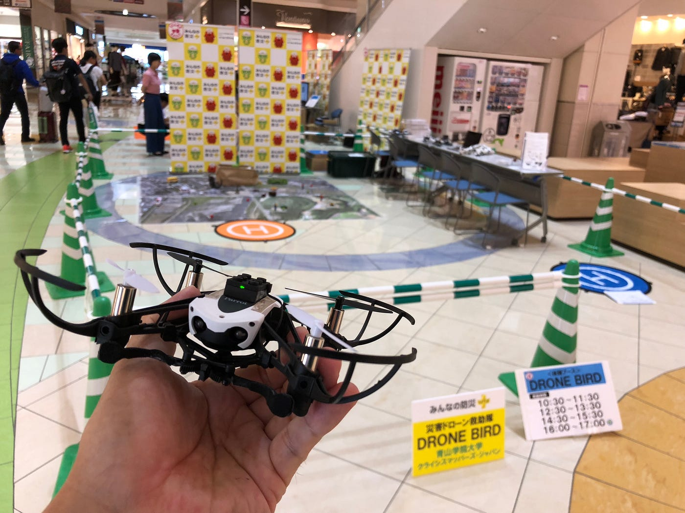

### イオンモール巡業ドローンワークショップマニュアル～設営編～

こんにちは。古橋ゼミ3年の中西敦子です。9/17日ドローンワークショップイベントで群馬県のイオンモール高崎に行ってまいりました。駅から遠くてたどり着くまでに苦労しました…汗

バスの本数も少ないので要注意です⚠️

さて、私は設営編についてレポートします。

動画はざっと作業の流れを載せたものです。本当にざっとなのでここからは文章で説明します。

⑴前述の通り、駅からバスでイオンモール高崎まで行きます。その後モールの裏にある従業員出入口で受付を済ませます。

⑵会場に到着したらイベントで使用するドローン、充電器、フライトパット、おもちゃなどのセッティングに取り掛かります。(私たちは最終日だったので主な設営は済ませてありました。)

⑶ドローンのセッティングについて。私たちはここでかなり手こずりました。古橋教授からのマニュアルでも教わりますがここでもポイントを簡単に共有しておきます。

☆iPadのfreeflightminiアプリを使用します。

☆その後Bluetoothでドローンとのペアリングを行います。⚠️この時点でもうドローンが充電切れになったのでバッテリーは常に充電し確認しておくようにしましょう。

☆ペアリングが出来ていない際はコントロールアイコンが緑色です。

☆荷物の中にあるペットボトルに水を入れ、ドローンと紐で繋げます。紐が大変絡まりやすいため注意！常にハサミを持っておくようにしましょう。

(4)ドローンのセッティング→テスト飛行修了後、ホワイトボードに開始時刻を書いたりお客さんに呼びかけたりという作業を行います。

以上が準備の流れとなります。私たちはイベントの最終日で、 設営がほとんど済ませてある状態だったので準備はドローンのセッティングが主でした。イベントに参加した3人がドローンの初心者だったためペアリングにかなり手こずってしまったのですが、それがなければスムーズに行えたかなと思います。

ただ、イベント開始直後はお客さんもイベントということに気づかず素通りされる場面も多かったので

余裕があれば準備と並行して呼びかけも行えたらベストかなと感じました！実際に｢この後〇時からドローンの体験イベント開始します！｣というふうに呼びかけを始めると興味を示してくださった方も見られました。

また、イベント中に、｢このドローン何円なの？｣｢何メートルくらい飛ばせるの？｣｢欲しいんだけどどこで買えばいいの？｣など質問されることも多いので、使用するドローンのことを先輩に訊いたり調べておくことも大切です。

以上が準備編となります。

季節の変わり目、みなさんご自愛ください。
