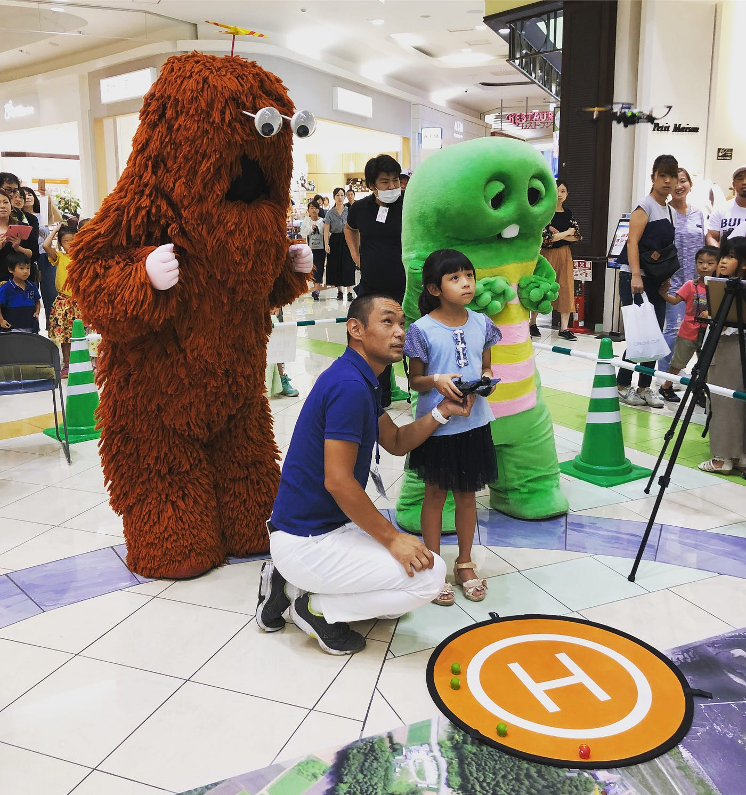

### イオンモール巡業ドローンワークショップ〜開催中編〜

お初にお目にかかります。

青山学院大学地球社会共生学部、古橋ゼミ3年の保利です。以後お見知り置きを。

今回は9月17日、敬老の日に群馬県にあるイオンモール高崎にてドローンのワークショップを行いました。

まさか始発の東海道線で終点の高崎まで3時間半かけて行くことになるとは…乗換検索をして驚きました…

とても大きなショッピングモールなので1日遊びたい方は是非足を運んでみてください。

さて、同行した2人が準備撤収をそれぞれ解説してくれていますので、私はメインのワークショップ開催中の様子をお届けしたいと思います。

まずはこちらの映像をご覧ください。

一般の方向けのワークショップで個人が特定されるような映像を撮影できなかったため短めではありますが、ドローンを体験して頂いた時の様子です。

_**ドローンを初めて触った、_**ドローンを見ることすら初めて、という方がほとんどでした。

(かくいう私たち3人もこの日初めてドローンを触り、準備の段階で大分四苦八苦しましたが…)

訪れる方の8割が小学生くらいまでのお子さんで、残りは付き添いで来られたお父様お母様に体験していただきました。

「小さい子でも難しくありませんか？」という質問をよく頂きましたが、

さすがゲームやスマートフォンで電子機器に慣れている現代っ子たち、大人の心配をよそに楽々操縦していました。

ただ、お子さんの顔や身体にドローン本体が当たらないよう配慮したり、

テグスが見えにくいので足元で引っかかったりしないように注意することは必要です⚠︎

また、お父様お母様世代はラジコンで子供の頃遊んでいたという方が多く、幼少期を懐かしまれながら体験して頂きました。

意外にもお父様お母様の方が子供よりも熱中され、

受付に見本として置いていた箱入りのドローンを、売り物ではないんですか？とまで尋ねられました（笑）

ドローンを飛ばしているといつのまにか老若男女問わず人だかりができ、体験こそはされなかったものの若いご夫婦なども見学されていました。

たった4時間という短い時間でしたが、たくさんの方にご来場頂きまして、好評のまま終了となりました。

### 個人の感想

まず、初めてドローンを触ってその性能の高さに驚きました。

正直見た目はおもちゃのようでしたが、無線でiPhoneやコントーラーと同期が出来、高度もきちんと上がるんだ…などと素人な感想を抱いてしまいました。

また、今回はたまたまでしたが、参加した学生3人ともドローンを初めて触ったため、大分準備に手こずり、初回の時間などは自分たちが操縦することで精一杯で十分な体勢ではありませんでした。

このような事態を引き起こさないためにも、ドローンについて事前に学んでおき、さらに初心者にも分かりやすいような手引き、マニュアルを学生間で作っておけば良いのではないかと思いました。

最近ではおもちゃ屋さんにも簡易的なドローンが売っているようで、そういったものと、このドローンは何が違うんですか？と尋ねられたりもしましたが、何分こちらもその日初めてドローンを触ったものですから予備知識も少なく、正確にお答えすることが出来ず歯がゆい思いをしました…。もっとドローンについて詳しくなりたいなと思いました。

総括として、今回は事前準備が足りなかったなというのが個人として一番の感想です。この反省を次回に活かし、よりスムーズな運営ができればと思います。

ここまで読んで頂きありがとうございました。

それではまた。保利でした。
