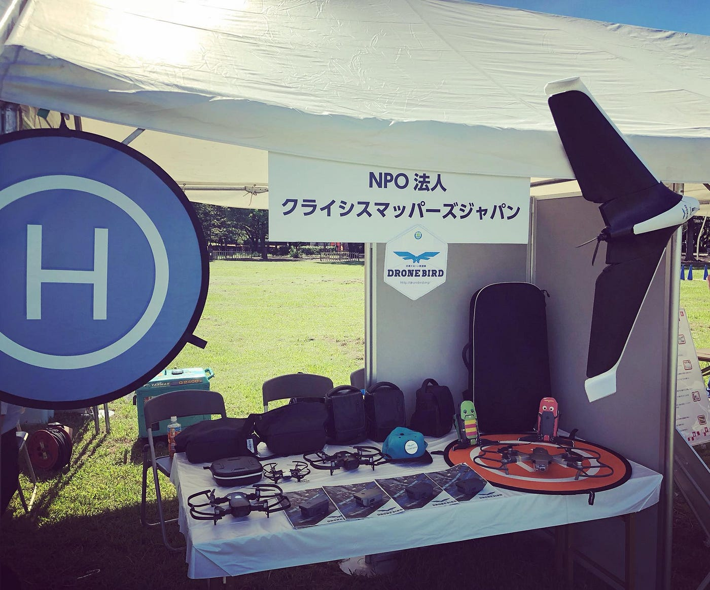
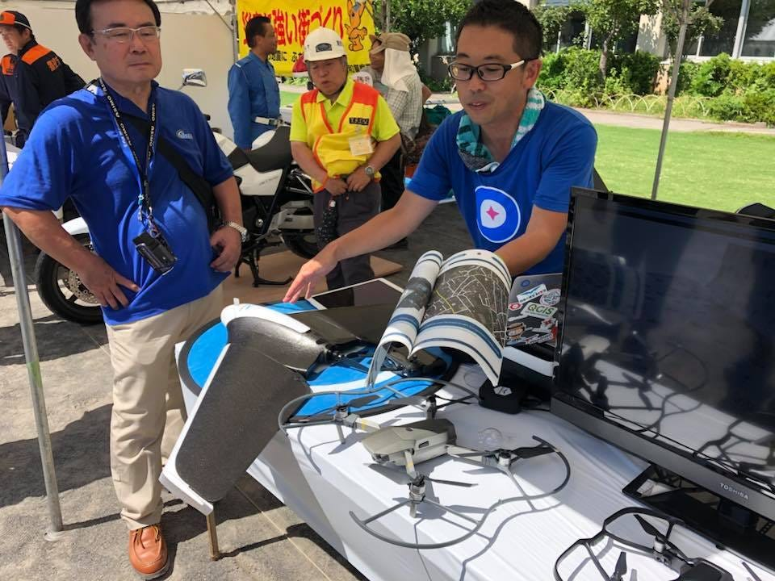
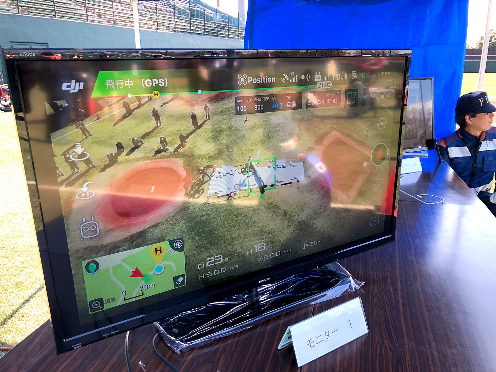
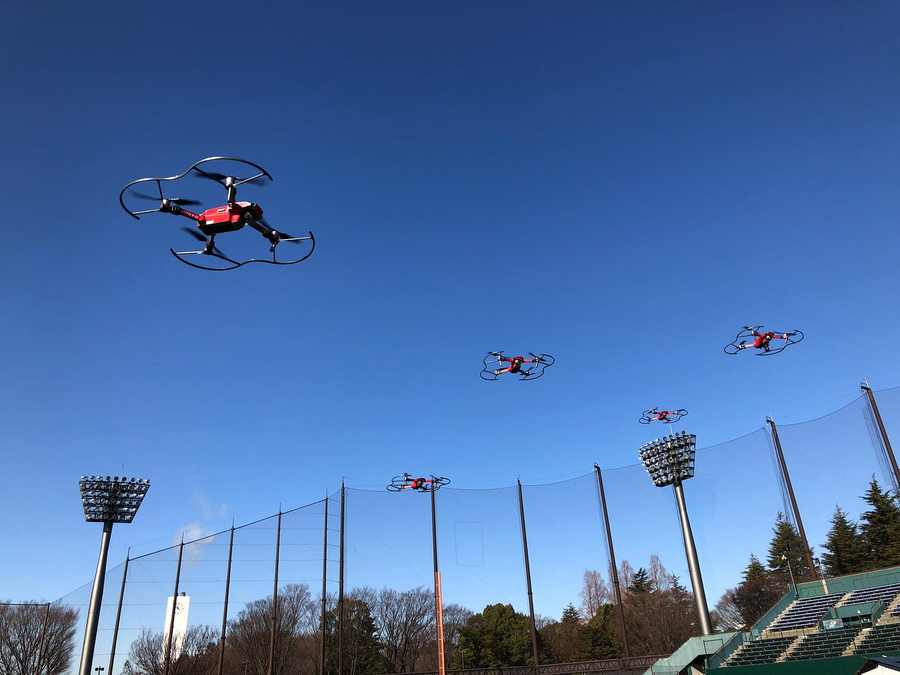
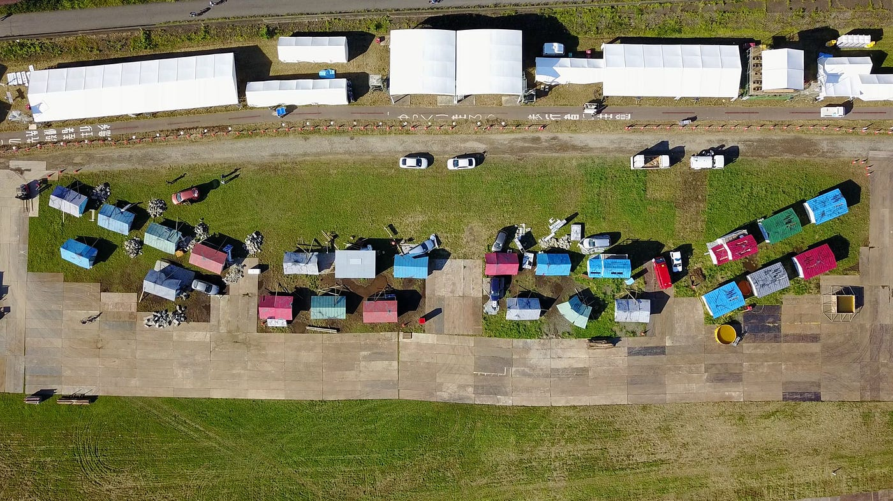
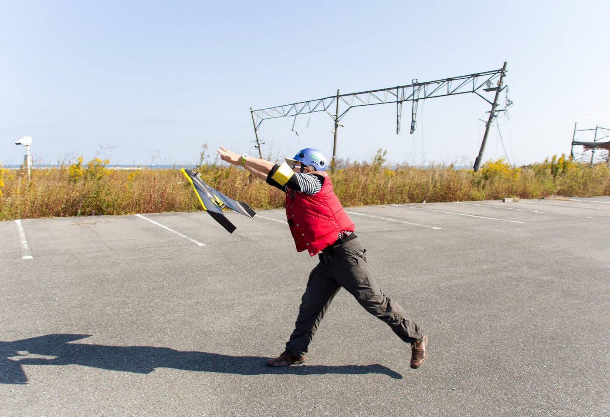
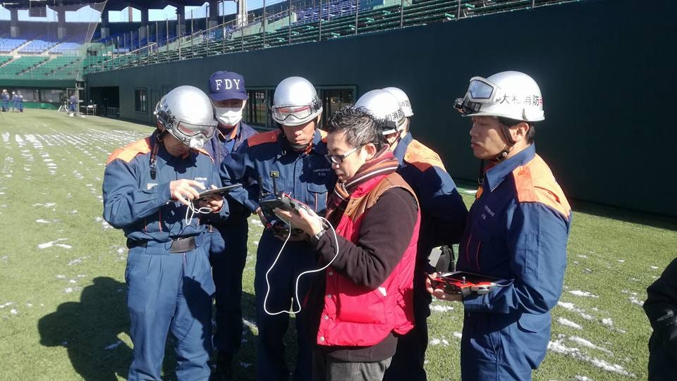

### 多くの防災訓練に参加して見えてきたこと

９月はとにかく全国各地で防災訓練が多い。

２４の自治体と防災協定を結んでいる我々としても可能な限りそれぞれの自治体が主催する防災訓練に参加し、ドローンが持つ可能性と、現時点での飛行性能、そしてどのような情報が取得できるのかを理解してもらえ、災害時には迅速に行政と我々が情報連携できるノウハウと経験値を共有する大事な場として、日程が重なったとしても複数のメンバーに担当してもらい、新しい防災訓練のあり方を作り始めている。

ここでは、今まで参加した防災訓練などを振り返り、我々[災害ドローン救援隊DRONEBIRD](https://www.facebook.com/dronebirdproject/)が関わることのできる防災訓練のいくつかのパターンを整理した。今後もブラッシュアップしていくが、現時点で我々のできることできないことを共有し、引き続き多くの自治体と共に今までより更に安心安全なまちづくりとはどうあるべきかを考えていきたい。

### **# 我々が得意なことは空撮**

ドローンには様々な利用方法がある。その中で我々が得意とすることは上空から空撮し、その航空写真から迅速に地図を作成することである。空撮手法も地図作りを前提とすると映像よりも静止画のほうが得意だ。逆に重い物資を運ぶことや、消火剤を撒くことはスコープ外である。そのような理由から我々が防災訓練に参加する最大の理由は、**「市民によるドローン空撮はここまで運用が可能になっていて、このように地図が作成できる」**現状を行政そして市民の方々に知っていただくことである。

### **# 使用する機材について**

市民参加型のドローンによる空撮ボランティア活動であるため、一般的に入手可能な安価で使いやすい機材での運用を前提としている。本体重量が1.5kgを超えるような大型のドローンや、赤外線・LiDAR・マルチスペクトルカメラ、レーダーなど高価なセンサー機材、防水/防塵性を備えたプロが用いる機材は消防・警察・自衛隊などは一般市民ではなくその道のプロが配備すべき機材であり、我々がこれらを用いることは現時点では考えていない。

### **# 最近の防災訓練の傾向**

一言で防災訓練といっても色々なタイプがあることが素人なりにわかってきた。図上訓練、水防訓練、避難訓練、総合防災訓練。後者の総合防災訓練も、自治体によって市民参加型と関係者のみの開催、防災フェスと名称を変更した家族連れが楽しめるイベント形式の防災訓練や、地元の消防団や消防組織が文字通り放水訓練や救助訓練を実施するタイプまで本当に多種多様だ。全体的にはそれぞれの地域と開催時期に合わせて、本格的な訓練を目的としたものと、地域住民への啓蒙活動を主軸とした楽しめる防災フェス形式のイベントを年間を通して両方開催する自治体は増えてきた気がする。いずれにしてもこれらの訓練に関わる我々として、参加可能なパターンを整理してみた。

### **# 防災訓練参加パターン１「ブース展示と活動紹介」**

これは主に防災フェス系訓練での参加方法である。ドローン実機の展示とブースでの資料配布、そして口頭での説明を主とした情報発信・共有型のパターンである。2018年度は武蔵野市総合防災訓練（８月）、昭島市総合防災訓練（８月）などがこのタイプ。

**## 我々が用意できるもの**

- 展示用ドローン実機数台（回転翼・固定翼）

- 活動紹介パンフレット

- ノートPCによるサンプルデータ紹介 ※要電源

- 解説員数名

**### 自治体側にお願いすること**

- 展示ブース

- 長机 x２程度

- 椅子 x３程度

- モニター(HDMI入力端子付き) ※可能な範囲で

- 電源 ※可能な範囲で

### **# 防災訓練参加パターン２「回転翼機のデモ飛行と上空からのリアルタイム映像中継」**

最近増えてきたのがこの回転翼機を主軸としたデモ飛行タイプ。小中学校の校庭を使った狭い敷地内での訓練で数分〜15分程度デモ飛行を行う。周辺に飛行場などが近接している場合は高度は上限45mまでに設定することも多い。いずれにしても地図作成のためのデモ飛行を行うことは難しいため、自治体側でHDMI入力端子付きのモニタを用意いただける会場では、市販の機材(現在はAppleTVを活用)を用いて上空からの撮影映像をモニタへリアルタイム中継するデモンストレーションを行うことも可能である。また、ドローンの飛行に関しては航空局への各種飛行申請は我々が担当し、飛行エリアの所有者への飛行許諾と近隣の飛行場や航空管制への事前調整は自治体側で担当いただいている。過去の事例で、厚木飛行場のすぐ横や調布飛行場の制限エリア内での飛行も実施したが、厳しい条件でも飛行高度45m以内であれば自治体経由で調整いただくと問題なく許可が下りている。おそらく、我々が単独で各関係組織に確認を取ったとしてもスムーズに許可が下りることは難しいであろう。防災協定を事前に結び、我々がどのようなドローン飛行プロセスを実施しているのか、日々行政サイドと情報交換し、万が一の災害に備えておくことは双方にとって非常に大きなメリットとなる。

**## 我々が用意できるもの**

- ドローン実機数台（回転翼・固定翼）

- ドローン操縦オペレータ（航空局の許可申請取得も含む）

- リアルタイム映像中継用機材（Apple TV, タブレット端末/スマホ端末）※ モニターは除く。

- 活動紹介パンフレット

- ノートPCによるサンプルデータ紹介 ※要電源

- 解説員数名

**## 自治体側にお願いすること**

- 展示ブース

- 長机 x２程度

- 椅子 x３程度

- モニター(HDMI入力端子付き) ※リアルタイム映像中継の場合は必須

- 電源 ※リアルタイム映像中継の場合は必須

- 防災訓練会場での飛行許可（敷地所有者）

- 近隣の飛行場/航空管制との事前調整

### **# 防災訓練参加パターン３「固定翼機のデモ飛行と空撮及び地図作成デモ」**

訓練会場が河川敷など面積の広大なエリアの場合は、我々の主力機でもある固定翼ドローンの飛行デモを実施することができる。2017年度の東京都・調布市総合防災訓練では東京消防庁に配備された大型回転翼ドローンと我々の固定翼ドローンがそれぞれ高度30mと90mで高度を分けながら同時に飛行し、情報収集を行うデモンストレーションを実施した。また、実際の地図づくりを目的としたサンプルデータ取得の場合は事前の訓練会場（多くは設営作業中）をお借りして、約30分程度のテスト飛行を行い、空撮及び地図データ作成までのプロセスについて自治体側にデモンストレーション及びデータ提供することが可能である。実際に撮影したデータはこのように公開している。

[OpenAerialMap - 東京都・調布市合同総合防災訓練2017撮影エリア
Browse the open collection of aerial imagery.map.openaerialmap.org](https://map.openaerialmap.org/#/139.53769147396088,35.64083614854714,17/square/1330021122131232202?_k=97yqn6)

[ひなたGIS -東京都・調布市合同総合防災訓練2017撮影表示
カスタムレイヤとして空撮画像を追加済hgis.pref.miyazaki.lg.jp](https://hgis.pref.miyazaki.lg.jp/hinata/hinata.html#DUCXyOJbsb7q)

[東京都・調布市合同総合防災訓練2017 - G空間情報センター
XYZタイル画像 in 多摩川河川敷（調布市） 2017/09/02 z14-22 uploaded…www.geospatial.jp](https://www.geospatial.jp/ckan/dataset/tokyo20170902chofu)

[dronebird/oam_tokyo20170902chofu01
東京都・調布市合同総合防災訓練 9/2 試験飛行. Contribute to dronebird/oam_tokyo20170902chofu01 development by creating an account on…github.com](https://github.com/dronebird/oam_tokyo20170902chofu01)

**## 我々が用意できるもの**

- ドローン実機数台（回転翼・固定翼）

- ドローン操縦オペレータ（航空局の許可申請取得も含む）

- 活動紹介パンフレット

- ノートPCによるサンプルデータ紹介 ※要電源

- 解説員数名

**## 自治体側にお願いすること**

- 展示ブース

- 長机 x２程度

- 椅子 x３程度

- モニター(HDMI入力端子付き) ※可能な範囲で

- 電源 ※可能な範囲で

- 防災訓練会場での飛行許可（敷地所有者）

- 近隣の飛行場/航空管制との事前調整

### **# 防災訓練参加パターン４「特化型訓練へのアドバイザー参加」**

図上訓練や水防訓練などで、すでに消防組織にドローン部隊が編成されていたり、ドローン技術、地図利活用の専門的な技術サポートを行う特化型訓練はこのパターンである。いずれもより質の高い訓練を実施していくために我々の経験と知識がお役に立てるのであれば積極的に支援させていただく。

**## 我々が用意できるもの**

- 専門家（地図利活用及びドローン利活用）

- 必要に応じて用意可能な機材

**## 自治体側にお願いすること**

- 参加レポートの公開許可 ※秘匿すべき要件は事前に確認

- 具体的なシナリオ等

以上、９月の防災月間を終えて、まだまだ各地での防災訓練を控えている中で、我々が感じ実施可能な内容を整理してみた。引き続き防災減災力を高め、しなやかな（レジリエント）な社会を実現するために我々のできることを実施し、改善していきたい。
