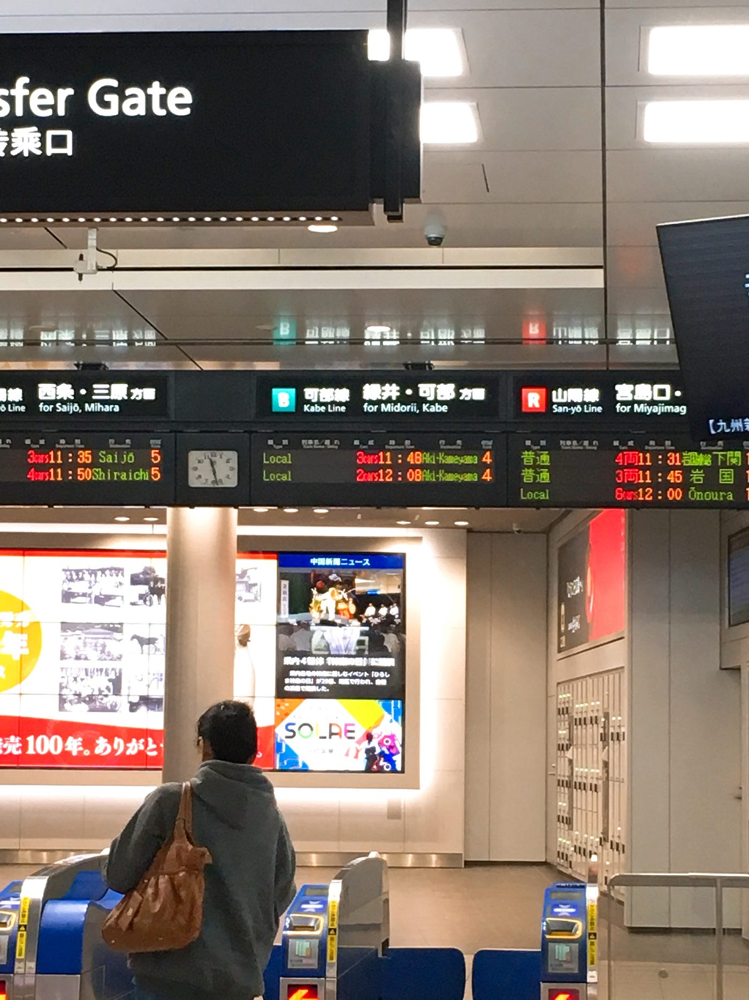

内定式

10月1日(月)は内定式でした。

広島の企業に内定を頂いているので、広島まで行ってきましたよー！

内定式の流れはこんな感じでした。

第1部 内定式(16.30–17.15)

1.内定通知書授与

2.社長のお言葉

3.幹部紹介

4.内定者紹介

第2部 懇親会(18.00–20.00)

内定者挨拶(自己紹介、大学時代の活動について)

第1部から第2部まで、始終穏やかに進行しました。

第1部は本社で、第2部はシェラトングランドホテルです。

詳しいことを書いていいのかわからないのでやめておきます。

実は8月31日に内定者懇親会がありまして、内定者同士の顔合わせはこれで2回目でした。

やはり一度交流した人たちがいるというのは心強いですね。

ちなみに第2部終了後は内定者全員で三次会をしました。

12人で1人3杯くらい飲んでおつまみも何品かたのんで約8800円！安い！

そういえば、私が来年から使うことになるであろう可部線は2–3両編成で20分おきにしか来ないみたいです。

来年からの生活に一抹の不安を覚えた瞬間でした。

余談ですが、広島のタクシーの運ちゃんはよくお話してくれます。

会社からシェラトングランドホテルまで、会社が手配してくれたタクシーに乗って向かったのですが、この人もなかなか癖のある運ちゃんでした。

「こいつら(ヤブ蚊)はやれんのじゃ。ズボンの上からでも刺してきよる」の一言からビッグバンの話までいきました。

話はめちゃくちゃでしたが、独特のイントネーションとリズムに役員の方の絶妙な相槌が相まって漫才のようでした。

広島に行ったらタクシーを使ってみてください。

自分からきっかけをつくれば、大抵の運ちゃんはめちゃくちゃ話してくれます。

今後のスケジュールも出ているので追記します！

12月1日 入社前研修

2019年2月下旬 採用前健康診断/入社手続き

4月1日 入社式

こんな感じです。

以上、内定式レポートでした！
