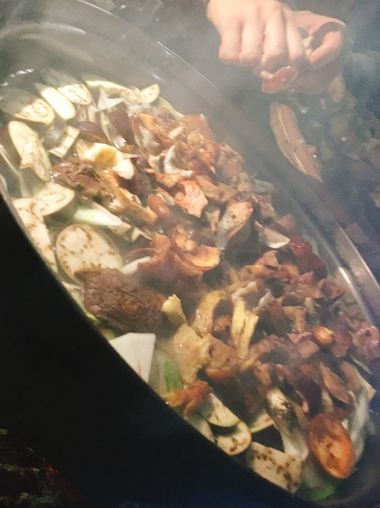
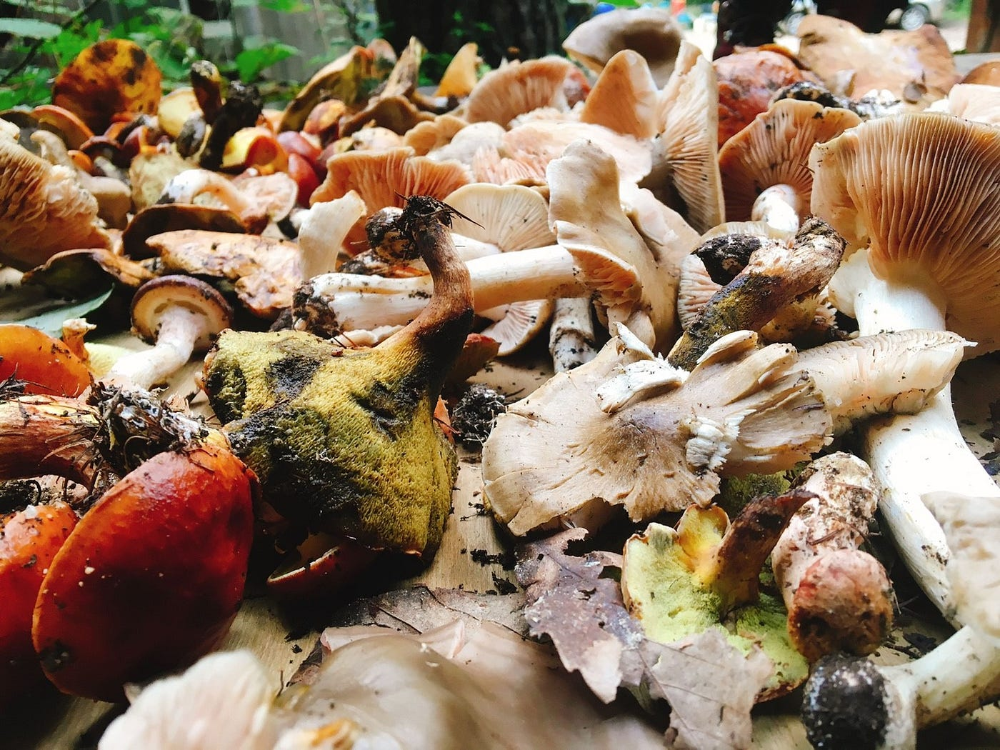
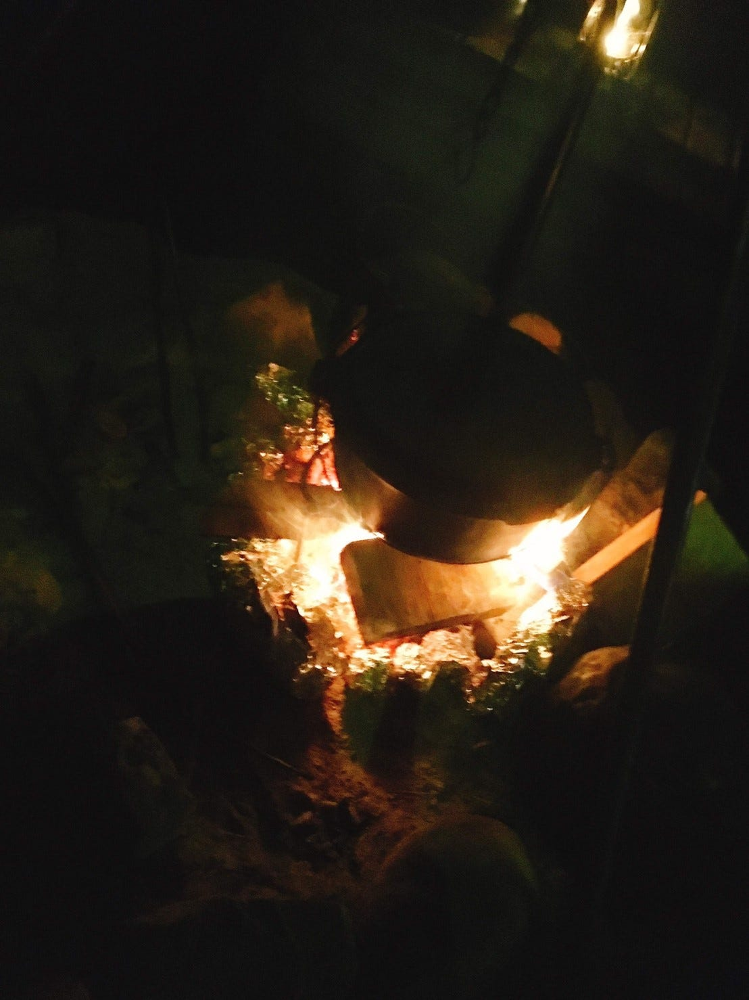

### ゼミ合宿＠信濃大町

ゼミ合宿＠信濃大町

９月２２日から二泊三日で古橋ゼミの合宿にお邪魔して、長野県大町市にある森と暮らしの郷にキャンプに行ってきました！ゼミ生の方も森くらの方もアットホームでリラックスしながら楽しめました！私自身キャンプに最近ハマっていたので純粋にキャンプというイベントが楽しみな事もあってテンション高めでした！現代社会において、自然に囲まれて寝るみたいな「非日常」を体感できるのがすごくいいですねキャンプ！！

１日目は到着が遅れてしまい、森くらについての説明を受けて、みなさんが作ってくださった豚汁をいただきました！何もしていないのにすみません。。と思いながらも明日から頑張ろう！て気持ちを切り替えて美味しくいただきました！夕食の後はテント張り！なんですけど、あたりは真っ暗でこれがまぁ大変でした。。やっぱり明るいうちにこなきゃですね。。

二日目は朝食を作ることからの始まり！バイトでキッチンをやっているので張り切っちゃいました！今まで使ったことないサイズの鉄板に終始テンション高めでした。森くらの方と相談して、朝食のメニューはチャーハン、スクランブルエッグ、ベーコンになりました！家でもこんなに食べない！料理自体は難しくなかったけれど鉄板が一枚の状況で全てを暖かい状態で提供するということが一番難しかった。。。でもやっぱり美味しいて言ってもらえるのは嬉しいし、また頑張ろう！って思えますね。もっとうまくなりたい！調理中は森くらの方々からキャンプならではの調理方も教えてもらえたので、次回以降も使っていきたい！

朝食を終えると、冬に向けて薪作りのお手伝いをしました。山から薪を下す。頭ではわかっていたけど実際にやるとなると想像を超える重労働。にもかかわらず森くらの方々の動きが早い。長年の知恵ですね。経験値が違いすぎました。とはいえ！いまをときめく２０歳の若者が負けるわけにもいかないので頑張りました！！しっかり職人の技も盗ませてもらったんで、林業やっちゃおうかなぁ！なんて気持ちになりました！いい汗かいた！

午後は古橋先生の指導のもとドローンを飛ばしました！ドローンを飛ばす前には簡単なレクチャーとラジコンとドローンの差は何かという問題のだせれました！その差とは「自律性」にあるとのことで、言われてみれば！当てられなくて悔しかった！

ドローンの後は夕食！僕はお米を炊いたんですけど、規模が一般家庭とは大違い！２０合もお米炊きました！！お米を研ぐだけでもてんやわんや！その上、ご飯と水の割合も計算しなくては。。って感じで大変でしたけど美味しく炊けてよかったです！！夕飯のメインディッシュはキノコ狩りグループガットってきてくれたキノコ鍋！！旨味の宝箱でした！！！後はラム肉！！秋刀魚の塩焼き！焼きリンゴなど盛りだくさんでした！！僕もダッチオーブン欲しい！！

学びあり！笑いあり！の楽しいゼミ合宿でした！

３日分のストラバです！

[朝のランニング - 中西 敦子's 20.7 mi run
中西 敦. ran 20.7 mi on Sep 22, 2018.www.strava.com](https://www.strava.com/activities/1860199114/shareable_images/map_based?hl=ja-JP&v=1537699235)

[朝のランニング - 中西 敦子's 147.8 mi run
中西 敦. ran 147.8 mi on Sep 24, 2018.www.strava.](https://www.strava.com/activities/1862293483/shareable_images/map_based?hl=ja-JP&v=1537778085)

[午後のランニング - 中西 敦子's 0.1 mi run
中西 敦. ran 0.1 mi on Sep 22, 2018.www.strava.com](https://www.strava.com/activities/1857870867/shareable_images/map_based?hl=ja-JP&v=1537613763)
