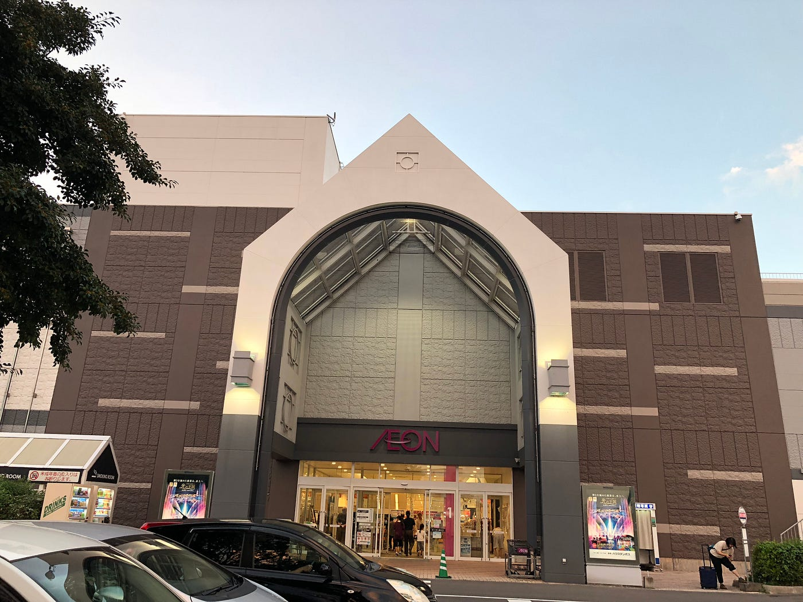
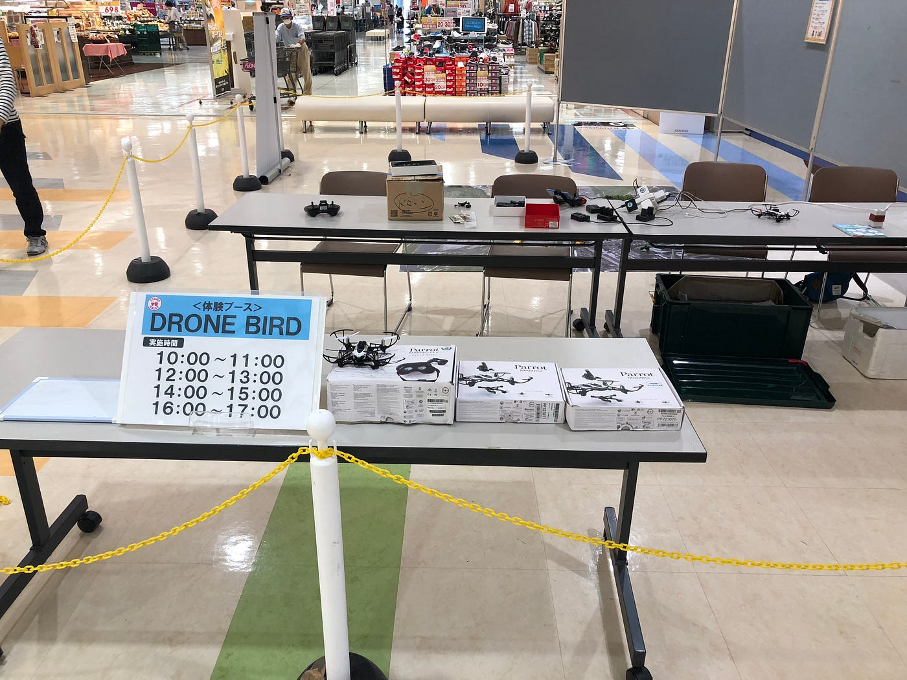
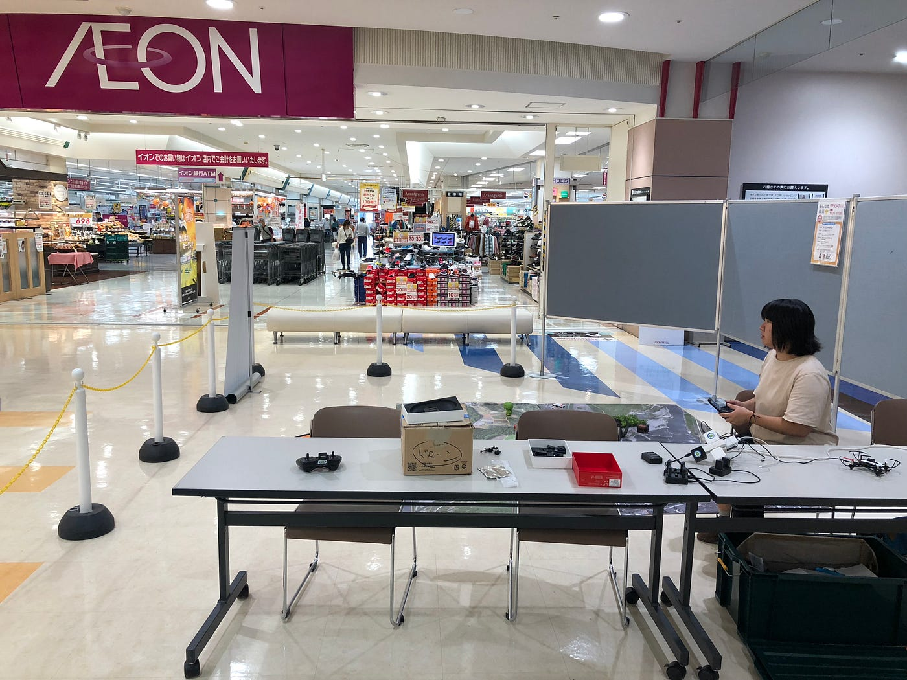
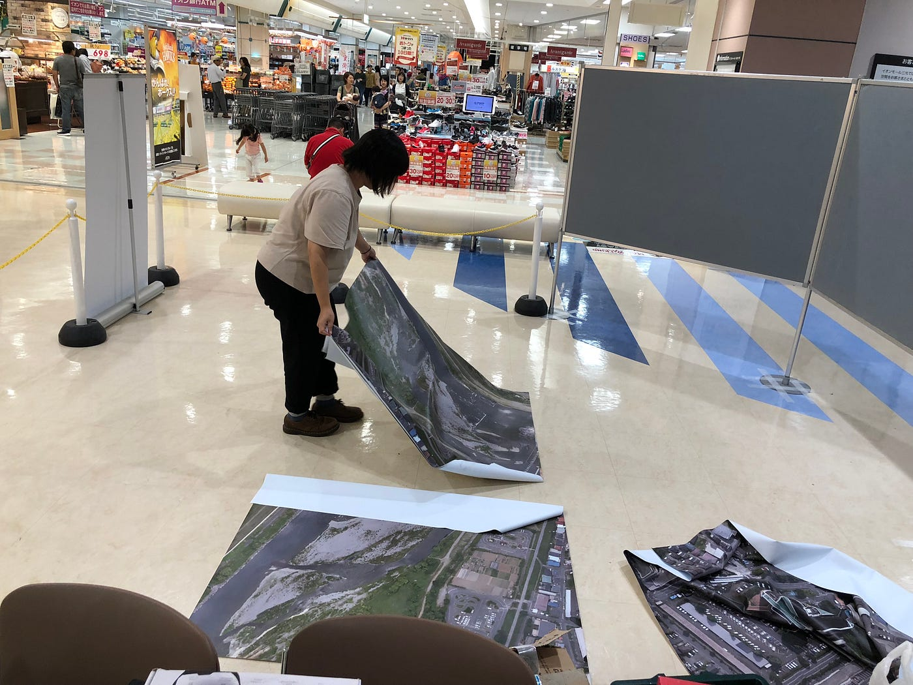

### No more ドローン事故

こんにちは！
青山学院大学地球社会共生学部３年古橋ゼミの増田将馬です！

今回は10月7日に行われた防災訓練in イオンモール三光（大分県）での活動を報告したいと思います！

10月6日

僕は現在町田駅周辺に在住しています。7日の集合時間は朝９時なので前日入りしないと間に合いません。
なので6日に飛行機で大分まで行きました⊂二二二( ^ω^)二⊃ﾌﾞｰﾝ

[https://www.strava.com/activities/1886701306?share_sig=9BE6D3291539313002&utm_medium=social&utm_source=ios_share](https://www.strava.com/activities/1886701306?share_sig=9BE6D3291539313002&utm_medium=social&utm_source=ios_share)

[羽田ー宿泊ホテル - Shoma Masuda's 551.8 mi run
Shoma M. ran 551.8 mi on Oct 6, 2018.www.strava.com](https://www.strava.com/activities/1887116190?share_sig=E29A2D821539312720&utm_medium=social&utm_source=ios_share)

１日目は特に大きな出来事もなくホテルに到着して防災訓練に向けて早めに寝ました( ˘ω˘ ) ｽﾔｧ…

10月7日
なんとか早起きすることができ、イオンモール三光行きのバス乗り場へ行きました
Suicaが使えなかったり、１時間に一本しかバスが来なかったり色々町田に住んでいたら体験しないことに直面しながらもイオンモール三光に到着！
従業員用入り口集合となっていたので探しましたがバス停から反対側にあり見つけることに苦労しました^^;
ブースに案内され、事前準備をせっせとしていました。

ここでタイトル回収です！
絶対にドローン事故を起こさないようにするために事前準備ですることは２つあります！

まず１つ目はドローンに巻きつけるタコ糸を忘れない、そして短めに切ることです。体験してくれた子供はいうことを基本的に聞いてくれないのでどれだけ飛ばそうとしても物理的に飛ばないようにすれば安心です！
２つ目にFreeFlight Miniでのコントロール設定を最低にすることです。ドローンの動くスピード、上昇スピード、旋回スピードを最低限にしておかないと急に外から飛び出して来た子供に対応できません。ドローンと子供がぶつかる前に対応できるようにドローンの動きをゆっくりにしましょう。

次に防災訓練中に事故防止するために気をつけることは三つあります
まず一つ目は、子供がいうことを聞かなかったらコントローラーを取り上げることです。左スティックを上に倒してと言ったのにぐるぐるさせたり、子供はいうことを聞かないことを前提に考えましょう！コントローラーさえ取り上げてしまえばドローンは止まるので事故が起こることはありません。注意点としてたまに取り上げると殴ってくる子供がいます、ブチ切れないようにしましょう！笑
二つ目は体験をしてもらってる時、一人は操縦士の近く、もう一人は反対側にいることです。反対側にいると、子供が無茶な操縦をした時、片方がコントローラーを取り上げることができなくても、もう片方が周りの安全を確保することができます！
三つ目は、危ないと思ったらドローンをはたき落とすことです！
最終手段ですが周りの人が怪我をしてしまうと判断したら迷わずはたき落としてしまうことが大切です。ドローンに装着されているものはほとんどが取り外し可能で、壊れても再度組み立てることができるものばかりです。危ないと思ったら叩き落とすことも頭の中に入れておくことで事故を未然に防ぐことができます。

防災訓練が終わったらすぐに片付けをしましょう！
我々は手際が良く２０分で片付けることができました

初めて訪れる大分では関東に住んでいてはわからない文化、習慣を知ることができました。大分は方言がなかったり（九州の人は全員博多弁話すと思ってました…orz）、温泉が気持ち良かったり、もつ鍋が美味しかったり…
僕は大分に来てたくさんの良い思い出ができました。他のゼミ生も上記したことを留意したことで事故なく防災訓練を終わらせてくれると幸いです。
以上でイオンモール三光での活動報告とさせてもらいます
最後まで読んでいただきありがとうございましたm(＿ ＿)m
