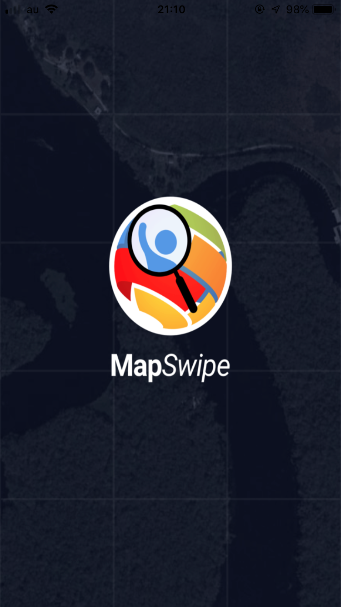
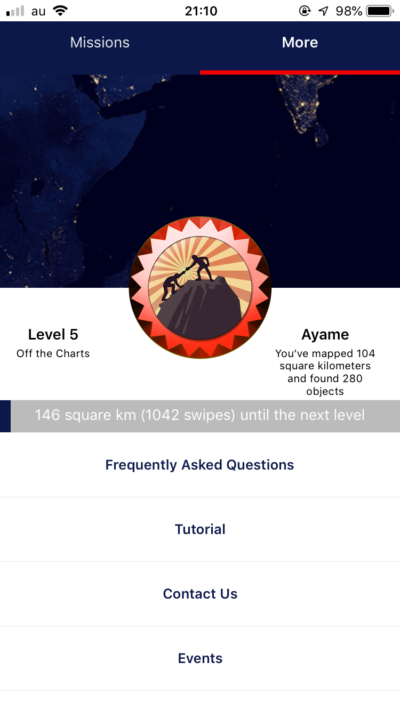
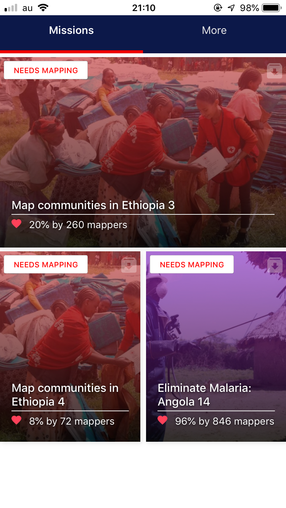
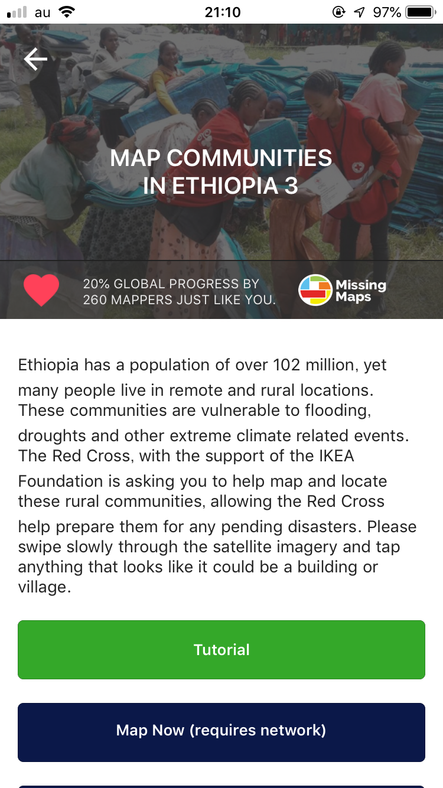
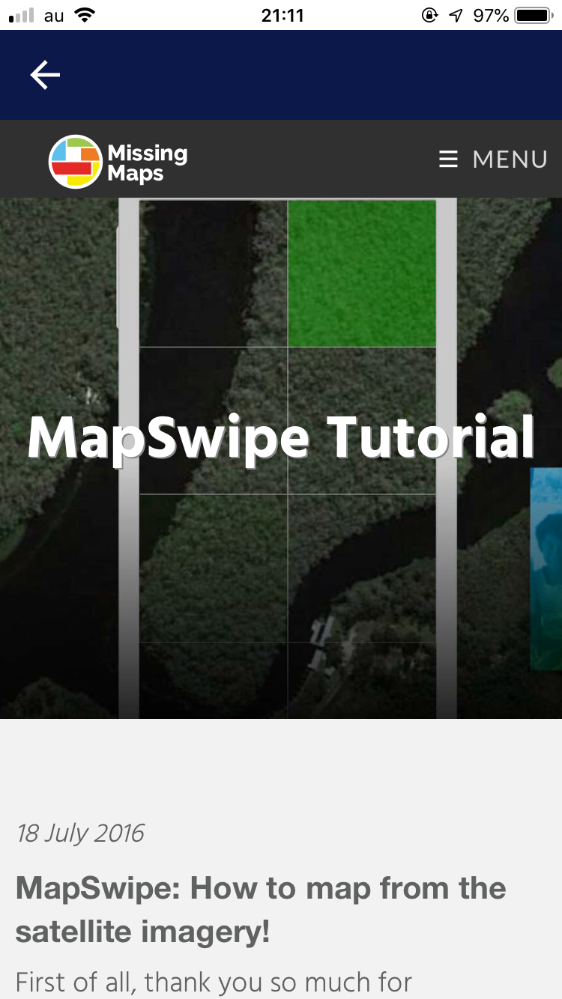
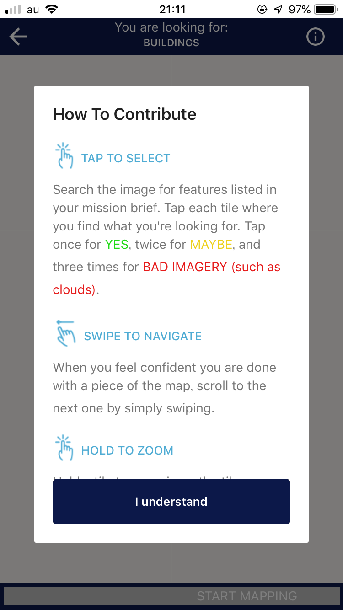
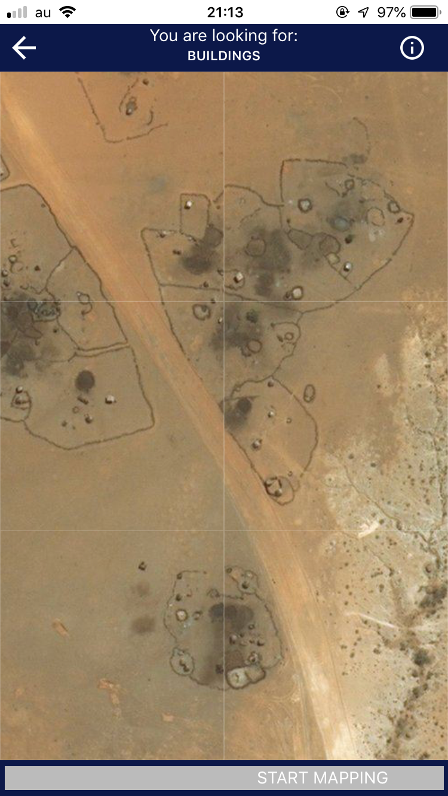
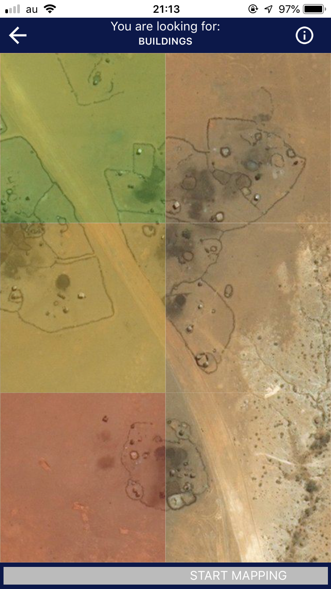
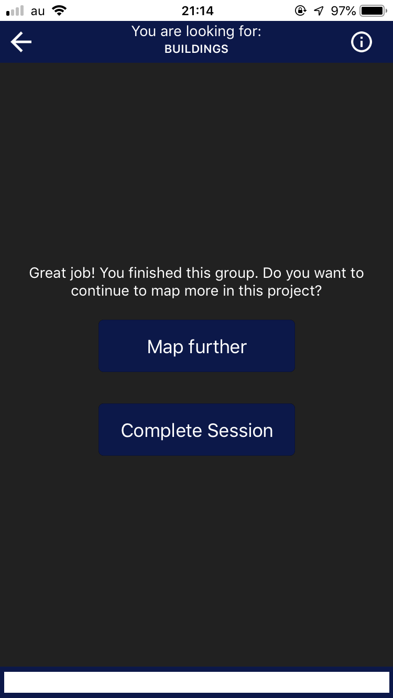

### Mapswipeというツール

「Mapswipe」とは衛星画像を元に、地図上にいる人々を支援するためのアプリ。iOSとAndroidの両方のアプリがあり、スワイプして衛星画像をめくり、建物等が見えたらタップして地物がある印をつけ、そしてまたスワイプするゲーム感覚で操作できるアプリ。

アカウントのレベルアップ機能もあるので非常にゲーム感がある。また１タスク終わるごとに「Good job!」と出てくるので、達成感と人道支援に貢献したという満足感が得られる。

しかし今まで紹介してきたようなエディタ(編集ツール)とは異なり、OpenStreetMap(以下OSM)を編集したりストリートビューを追加できるわけではないので、直接的というよりは間接的にOSMに貢献しているという形になる。

Mapswipeでの衛星画像チュックの対象エリアは、国境なき医師団等の派遣先のタスクが多い。またMapswipeで付られたデータは[Humanitarian OSM Team](https://wiki.openstreetmap.org/wiki/Humanitarian_OSM_Team)という団体が作ったHOT Tasking Managerというマッピングツールの対象エリアの絞り込みに活用されている。下記に活用事例を載っける。

[HOT Tasking Manager
HOT Tasking Manager is a mapping tool designed and built for the Humanitarian OSM Team collaborative mapping.tasks.hotosm.org](https://tasks.hotosm.org/project/5178)

それではMapswipeの使い方を紹介する。

#### ・スタート画面

#### ・タスクを選択

説明書きが**基本的に英語しかない**のが難点である。。

#### ・チュートリアル(説明書き)

#### ・タスクにとりかかる

#### ・タスクスタート

以上、今回はMapswipeの紹介。

[OSMの編集ツール、もくじ
OpenStreetMapのエディタ、つまり編集ツールについて語る。
PC用のツールとスマホ用のツールの大きく分けて２パターンある。
みんなは何を使ったことがある？medium.com](https://medium.com/furuhashilab/osm%E3%81%AE%E7%B7%A8%E9%9B%86%E3%83%84%E3%83%BC%E3%83%AB-%E3%82%82%E3%81%8F%E3%81%98-b47d3410fe4f)

次回はこのもくじにのっとり、OpenStreetCamを紹介する。

それではまた来週〜。
