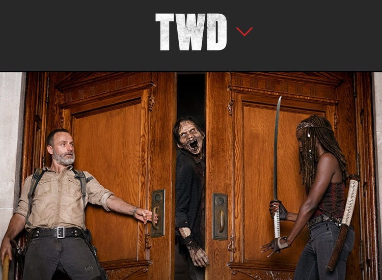
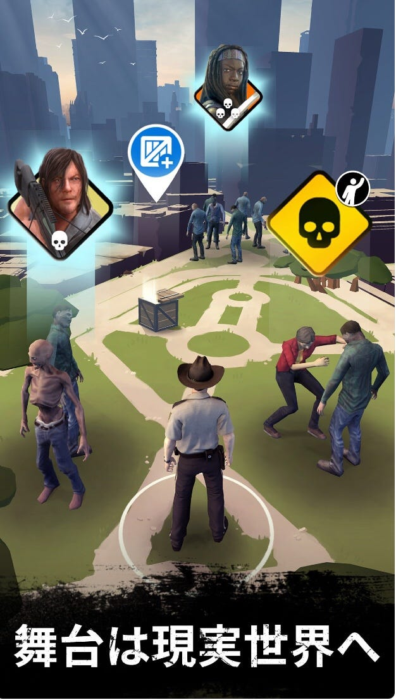
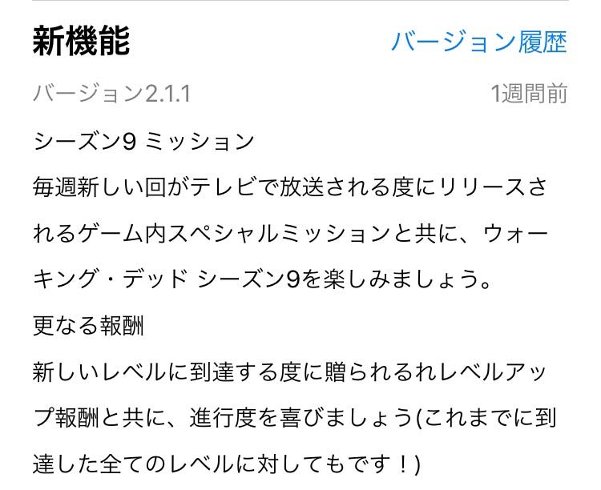
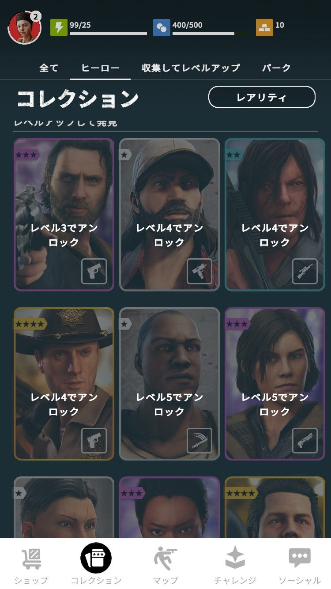

### The Walking Dead

先日、アメリカの連続ドラマ「The Walking Dead」を見始めました。

もともとゾンビ映画が好きなので、ハマってしまって1シーズン一気に見てしまいました！

ところで、あなたはこの記事を覚えていますか？

[シューティングゲーム×位置情報
THE WALKING DEADmedium.com](https://medium.com/furuhashilab/%E3%82%B7%E3%83%A5%E3%83%BC%E3%83%86%E3%82%A3%E3%83%B3%E3%82%B0%E3%82%B2%E3%83%BC%E3%83%A0-%E4%BD%8D%E7%BD%AE%E6%83%85%E5%A0%B1-7e06d5348987)

ドラマを見る前にゲームをプレイしていたことに気づきました！

そして、シーズン9の放送に際してこんなイベントが始まっています！

ゲームの中ではストーリーについてあまり語られていませんでしたが、ドラマを見てからゲームを起動すると少し見方が変わりました。

ただのシューティングゲームだと思っていたときより楽しい。

特に、どのキャラクターにどんなエピソードがあるかがわかると、ああドラマでこうだったな、ああだったなと思い出してまたドラマが見たくなったりゲームを起動してみたり……

惹きつけられるストーリーや個性的なキャラクターが、単なる位置情報ゲーム・シューティングゲームという枠から「The Walking Dead Our World」をはみ出させているように感じられます。

ポケGOがいい例ですが、もともとの作品のブランド力はゲームにかなり影響します。

今後はそういったところにも目を向けたいと思います。
