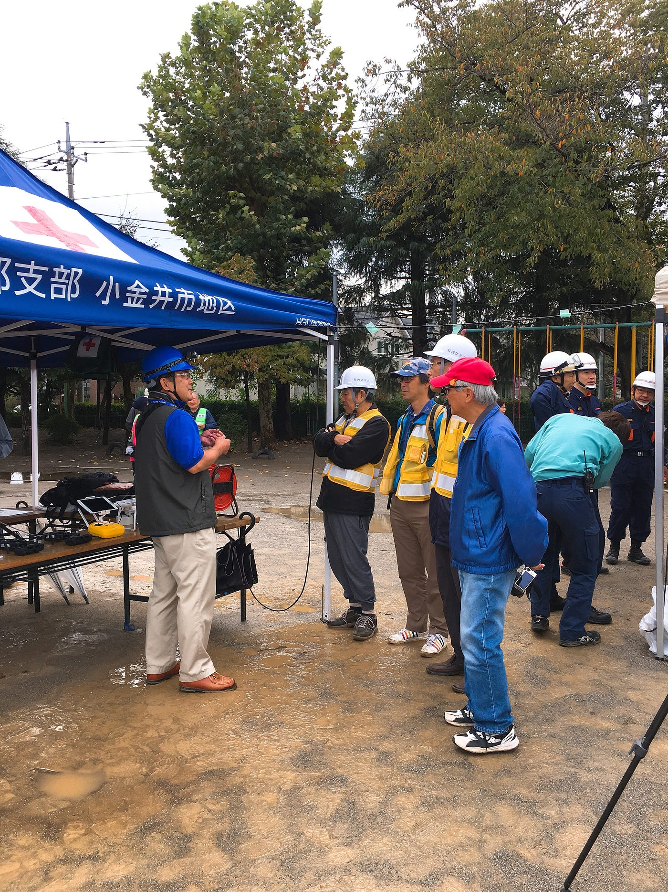
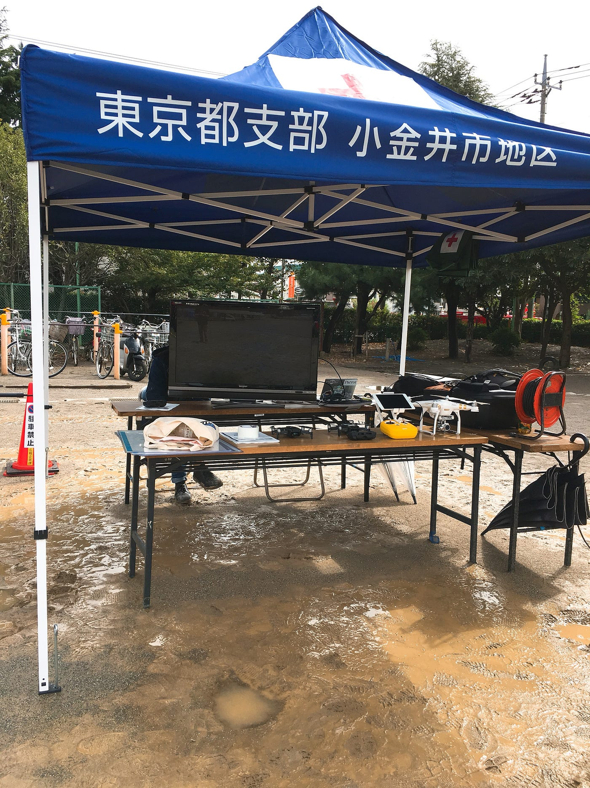
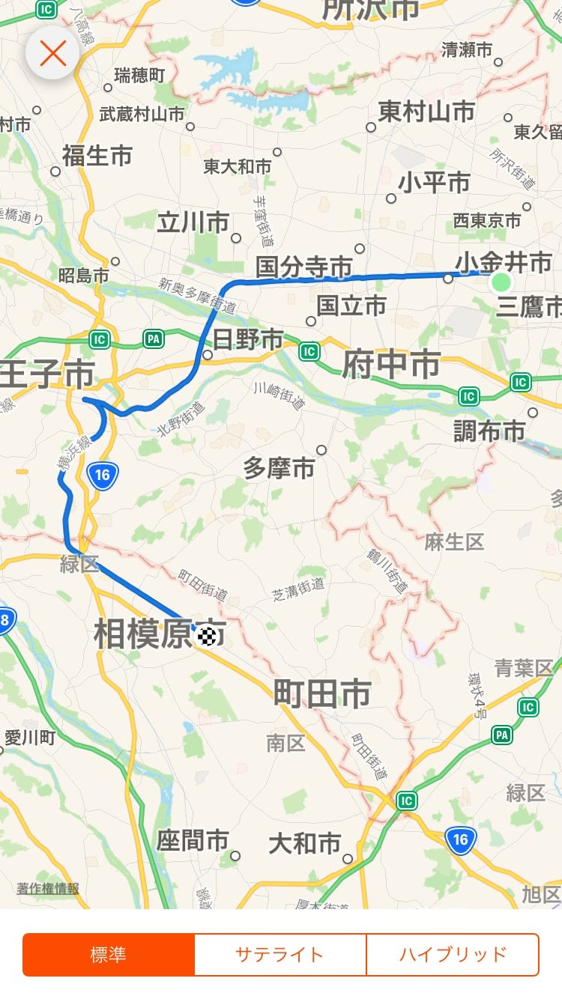

小金井市防災訓練

10/14、小金井市東小学校で小金井市の防災訓練がありました。

以下、大まかなタイムスケジュールです。

9.30–9.35 開会式

9.35–11.25 体験訓練・炊き出し

11.25- 地震を想定した火災対応訓練

11.40–11.45 閉会式

小学校のグラウンドが小さかったので、今回はドローンは飛ばさず展示のみしてきました。

Mavic Airと古賀さんのPhantomを展示しました。

奥のモニターでは、実際に空撮している動画を流したり、当日朝に古賀さんが撮った空撮動画を流しました。

Crisis Mappingについてや、ドローンについて、聞かれたことに答えるのが私の主な仕事でした。

ひまがあれば体験訓練に行きたかったのですが、ブースには常に人が来ていたので行けませんでした……残念！

ドローンについて詳しく聞かれることもありました。

一般の方で多かった質問は、

「どれくらいの時間飛ぶのか」

「一般人にも買えるのか」

「この機体はいくらで買えるのか」

でした。

消防の方からで多かった質問は、

「どれくらいの時間飛んでいられるか」

「どれくらいの範囲を映せるのか」

「どこまで高く飛ばせるか」

「どこまで遠くまで飛ばせるか」

でした。

最後にストラバの記録を貼って、レポートを終わりにしようと思います。

[小金井市防災訓練 - Misa Nakai's 22.9 mi walk
Misa N. completed 22.9 mi on Oct 13, 2018.www.strava.com](https://www.strava.com/activities/1903279926)

おつかれさまでした！
